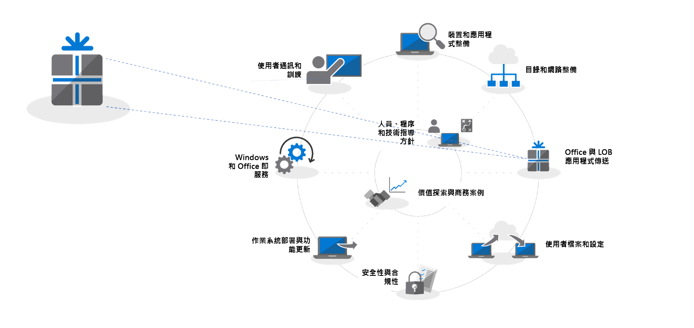
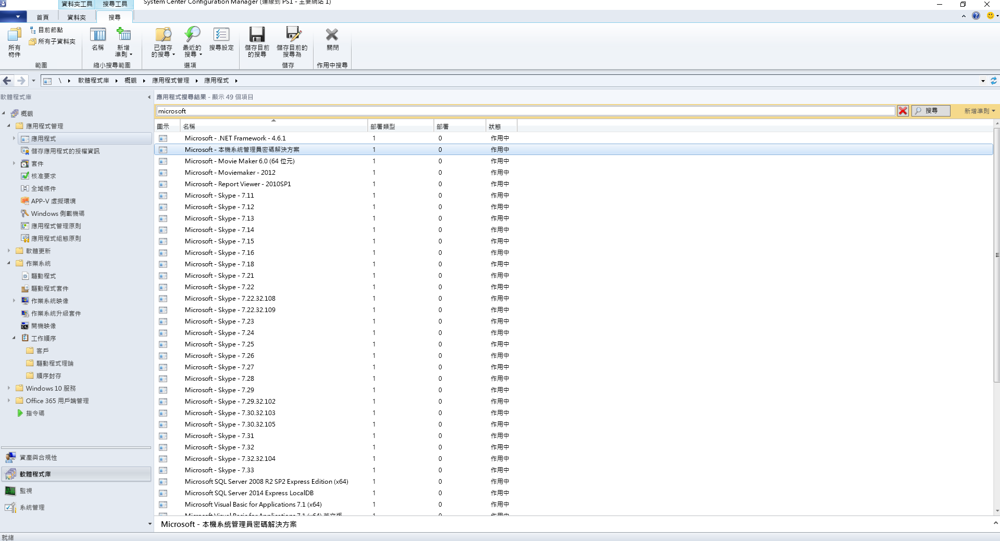
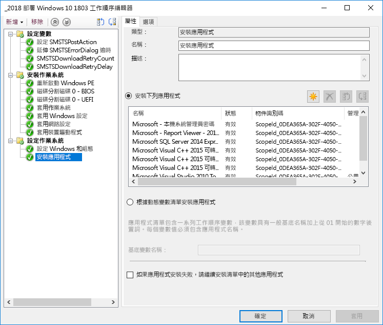
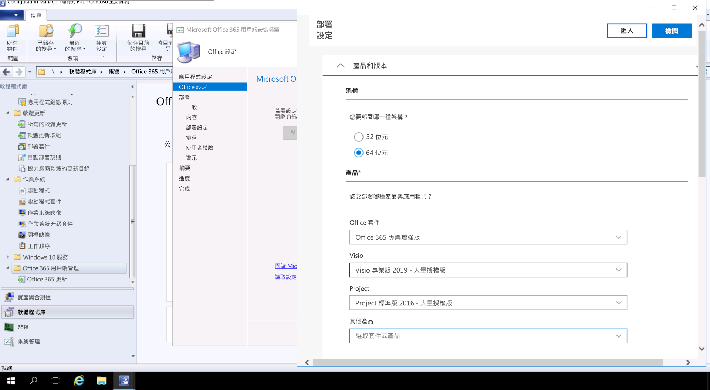

# 步驟 3：Office 和 LOB 應用程式傳遞Step 3: Office and LOB App Delivery

<table>
<thead>
<td></td>
<td>
<strong>步驟 3：Office 和 LOB 應用程式傳遞</strong><strong>Step 3: Office and LOB App Delivery</strong>

請確定您的應用程式已封裝並且準備好進行自動化安裝。了解隨選即用封裝與 Office 365 專業增強版如何給予您設定、傳遞及將 Office 應用程式保持在最新狀態的新選項。Ensure your apps are packaged and ready for automated installation. Learn how Click-to-Run packaging with Office 365 ProPlus gives you new options to configure, deliver and keep your Office apps up-to-date.
</td>
<td></td>
</thead>
</table>

>[!NOTE]
>Office 和 LOB 應用程式傳遞是我們所建議部署程序轉輪中的第三個步驟，涵蓋安裝及管理 Office 及 LOB 的多個選項。Office and LOB App Delivery is the third step in our recommended deployment process wheel covering the options to install and manage Office and LOB. For successful deployment do not skip the first two steps.  To see the full desktop deployment process, visit the Modern Desktop Deployment Center. 若要成功進行部署，請勿略過前兩個步驟。For successful deployment do not skip the first two steps.  若要查看完整的桌面部署程序，請瀏覽[桌面部署中心](https://aka.ms/HowToShift)。To see the full desktop deployment process, visit the [Desktop Deployment Center](https://aka.ms/HowToShift).
>

現在您已準備好提供 Office 和企業營運應用程式。有許多方法可以使用，包括一些有趣的新選項。You are now ready to deliver Office and your Line of Business Apps. There are a number of ways to do this, including some exciting new options. Take some time to review and chose the best methods for your current needs. 雖然有些應用程式僅提供 32 位元或 64 位元的編譯版本，但其他應用程式 (例如 Office 365 專業增強版) 同時提供 32 位元和 64 位元的原生編譯程式碼，而您將進行的最大決策就是要部署哪個版本。While some applications are only available as either a 32-bit or 64-bit compiled version, others such as Office 365 ProPlus, offer both as 32-bit and 64-bit native compiled code, and one of biggest decisions you will make is which version to deploy. 若要利用新裝置上的其他計算能力和 RAM，Microsoft 建議使用沒有 32 位元相依性的 64 位元版本。To take advantage of additional compute power and RAM on new devices Microsoft recommends using the 64-bit version when there are no 32-bit dependencies. 若要判定您可能遭遇的任何增益集或檔案相關相容性挑戰，建議先重新瀏覽「步驟 1 裝置和應用程式整備」，再繼續執行。To determine any add-in or file-related compatibility challenges you may have it is recommended to revisit Step 1 Device and App Readiness before you continue.

如果沒有任何問題，建議您將所有應用程式部署為 64 位元版本，包括 Microsoft Office。64 位元原生編譯應用程式可提供最佳效能，是承受未來考驗的最佳選擇。If nothing is blocking you, we recommend you deploy 64-bit versions of all apps, including Microsoft Office. 64-bit native compiled apps offer the best performance and is the most future-proof choice.

在 Windows 上安裝應用程式有許多方法與模型，讓我們來看看您的傳遞選項。There are many methods and models for installing apps on Windows, so let’s look at your delivery options.

[Windows 10 應用程式管理Windows 10 application management](https://docs.microsoft.com/zh-TW/windows/application-management/)

## MSI 型部署MSI-based Deployments

針對企業營運應用程式，您可能使用 MSI 型套件或可執行檔，並將應用程式安裝為 OS 部署工作順序的一部分。For your line of business apps, you’ll probably use MSI-based packages or executables, and install apps as part of an OS deployment task sequence. Windows 10 continues to work with these packages Windows 10 仍會繼續使用這些套件。Windows 10 continues to work with these packages.

System Center Configuration Manager 和 Microsoft Intune 等軟體部署工具也經過最佳化以提供 MSI 封裝的應用程式。在 Windows 10 上驗證應用程式之後，即可將 System Center Configuration Manager (最新分支) 用於應用程式傳遞。如果使用 Microsoft Intune 的公司入口網站，您可以延伸選擇，將獲得 IT 批准組織可用的應用程式包含最新的應用程式，且使用者可自行選取所需項目。Software deployment tools like System Center Configuration Manager and Microsoft Intune are also optimized to deliver MSI-packaged apps. Once you have validated your apps on Windows 10, you can use System Center Configuration Manager (current branch) for app delivery. If you use the Company Portal in Microsoft Intune you can extend the choice of IT sanctioned apps available to your organization to include the latest applications, and users to self-select what they need.

## 電腦影像PC Imaging

另一個常見的應用程式傳遞方法是電腦映像處理。Another popular method of app delivery is PC imaging. 在此情況下，應用程式會透過工作序列或手動方式安裝於樣本電腦，然後會擷取已預先安裝必要應用程式的系統映像。In this case, applications are either installed via task sequence or manually on a sample PC, then a system image is captured with the required applications pre-installed. 在佈建新電腦時，建立及擷取映像的方式可節省時間，但請記得映像內的作業系統和應用程式很快就會過時。The imaging approach to build and capture can save time when provisioning new PCs but remember operating systems and apps within the image can become stale quickly. Windows 10 和 Office 365 專業增強版的累積更新模型可協助解決這個問題，但不會完全排除。The Cumulative Update model in Windows 10 and Office 365 ProPlus help with this problem, but doesn’t eliminate it completely. 這也是我們為何建議精簡映像方式的原因，您的應用程式會在部署階段從映像外部進行安裝。This is why we recommend a thin image approach, where your applications are installed from outside the image at deploy time.

如果您想在映像中包含 Office 365 專業增強版，請記住，這會使用使用者型啟用，而無法由系統管理員預先啟用。使用 Office 部署工具在您進行映像處理的裝置上預先安裝 Office，並跳過使用者登入。If you do want to include Office 365 ProPlus in your image, remember that this uses a user-based activation; it cannot be pre-activated by the system admin. Use the Office Deployment Tool to pre-install Office on the device you are imaging and skip the user sign-in. Users can sign-in, be assigned the activation and take advantage of other capabilities that leverage sign-in on first use. 部署映像後，使用者可以使用其 Office 365 認證登入並啟動 Office 365 專業增強版。Once the image is deployed end users can sign-in using their Office 365 credentials and activate Office 365 ProPlus.

[建立安裝作業系統的工作順序Create a Task Sequence to Install an Operating System](https://docs.microsoft.com/zh-TW/sccm/osd/deploy-use/create-a-task-sequence-to-install-an-operating-system)

[以作業系統映像的方式部署 Office 365 專業增強版Deploy Office 365 ProPlus as part of an operating system image](https://docs.microsoft.com/zh-TW/deployoffice/deploy-office-365-proplus-as-part-of-an-operating-system-image)

## Office 隨選即用Office Click-to-Run 

Office 365 專業增強版使用隨選即用來安裝，隨選即用取代了 Windows 即將推出的 Office 2019 每個版本中的 MSI 型封裝。Office 365 ProPlus is installed using Click-to-Run, and Click-to-Run replaces MSI-based packaging in every version of the upcoming Office 2019 release for Windows. It brings with it a number of advantages, including faster installations, faster and more efficient updating, and cleaner uninstallation 它會帶來許多好處，包括更快速的安裝、更快且更有效率的更新以及更簡潔的解除安裝。Office 365 ProPlus is installed using Click-to-Run, and Click-to-Run replaces MSI-based packaging in every version of the upcoming Office 2019 release for Windows. It brings with it a number of advantages, including faster installations, faster and more efficient updating, and cleaner uninstallation 

透過「隨選即用」提供的程式會在您電腦上的虛擬應用程式環境中執行，因此會與其他應用程式共存而沒有衝突。如同 MSI 型套件，這些程式也會佔用大約一半的磁碟空間。Programs delivered via Click-to-Run execute in a virtual application environment on your computer and so co-exist with other applications without conflict; they also take about half the disk space they would as an MSI-based package. Office 應用程式是透過 [Office 部署工具](https://www.microsoft.com/en-us/download/details.aspx?id=49117)提供和管理，該工具是下載、設定及自訂 Office 應用程式所需的 Office 安裝程式引擎。Office applications are delivered and managed via the [Office Deployment Tool](https://www.microsoft.com/en-us/download/details.aspx?id=49117) which is the Office setup engine needed to download, configure, and customize your Office apps. Office 部署工具會讀取 XML 組態檔，該檔案會提供有關如何設定及自訂 Office 安裝的中繼資料指示。The Office Deployment Tool reads a configuration XML file which provides the metadata instructions on how to configure and customization your Office installation.

Microsoft 建議使用 [Office 自訂工具](https://config.office.com/)來自訂您的部署設定，以及建立您的 XML 組態檔。Microsoft recommends using the [Office Customization Tool](https://config.office.com/) to customize your deployment settings and create your configuration XML file. 您可以透過 Office 自訂工具，設定所要安裝的應用程式和語言、應用程式的更新方式、應用程式喜好設定，以及安裝體驗設定。Through the Office Customization Tool you can set which applications and languages will be installed, how the applications will be updated, application preferences, and installation expereince settings.

如果您使用 System Center Configuration Manager，您仍然可以使用它來廣泛部署 Office 365 專業增強版。System Center Configuration Manager (最新分支) 擁有更新的 Office 自訂工具的原生支援，隨選即用在安裝時間的套件自訂，以及安裝後軟體更新管理的原生支援。If you use System Center Configuration Manager, you can still use it for broad deployment of Office 365 ProPlus. System Center Configuration Manager (current branch) has native support for the updated Office Customization Tool, package customization for Click-to-Run at install time, and native support for software update management post installation.

[Office 365 專業增強版部署指南Deployment Guide for Office 365 ProPlus](https://docs.microsoft.com/zh-TW/deployoffice/deployment-guide-for-office-365-proplus)

[升級至 Office 365 專業增強版時，移除 Office 現有的 MSI 版本Remove existing MSI versions of Office when upgrading to Office 365 ProPlus](https://docs.microsoft.com/zh-TW/deployoffice/upgrade-from-msi-version)

[使用 Configuration Manager 管理 Office 365 ProPlusManage Office 365 ProPlus with Configuration Manager](https://docs.microsoft.com/zh-TW/sccm/sum/deploy-use/manage-office-365-proplus-updates)

[使用 Microsoft Intune 將 Office 365 應用程式指派給 Windows 10 裝置Assign Office 365 apps to Windows 10 devices with Microsoft Intune](https://docs.microsoft.com/zh-TW/intune/apps-add-office365)

## 瀏覽器型應用程式Browser-based Apps

有幾個項目需考慮，以確認您的瀏覽器型應用程式可以繼續正常運作。如果您有特定的網站和應用程式與 Microsoft Edge 有相容性問題，您可以使用企業模式網站清單，以便使用 Internet Explorer 11 時網站會自動開啟。There are a few things to consider in order to make sure that your browser-based applications continue to work as expected. If you have specific web sites and apps that you know have compatibility problems with Microsoft Edge, you can use the Enterprise Mode site list so that the web sites will automatically open using Internet Explorer 11.

此外，如果您知道您的內部網路網站使用 Microsoft Edge 無法正常運作，則可以設定所有內部網路網站自動使用 Internet Explorer 11 開啟。此程序會使用 XML 檔案來控制 IE11 是否用於每個網站，並使用群組原則來強制執行設定。Additionally, if you know that your intranet sites aren't going to work properly with Microsoft Edge, you can set all intranet sites to open using Internet Explorer 11 automatically. This process uses an XML file to govern whether IE11 is used for each site, using Group Policy to enforce settings.

[什麼是企業模式What is Enterprise Mode](https://docs.microsoft.com/zh-TW/internet-explorer/ie11-deploy-guide/what-is-enterprise-mode#what-is-enterprise-mode)

到目前為止，我們探討了數種知名的部署方法。So far, we have covered well known deployment methods. 但還有兩種應用程式部署的新方法您可能可以考慮。So far, we have covered well known deployment methods. But there are two new approaches to app deployment you may wish to consider.

## 商務用 Microsoft StoreMicrosoft Store for Business 

商務用 Microsoft Store 提供了彈性的方法，可大規模探索、取得、管理免費與付費應用程式，以及將其散發到 Windows 10 裝置。Microsoft Store for Business provides a flexible way discover, acquire, manage, and distribute free and paid apps to Windows 10 devices at scale. 身為 IT 系統管理員，您可以將所選的 Microsoft Store 應用程式，連同您的自訂應用程式發佈到自己的私人存放區，同時指派並視需要重複使用授權。As an IT admin, you can publish selected Microsoft Store apps, along with your custom own apps, to your own private store while assigning and re-using licenses as needed. 您的使用者只會被引導至這個存放區，所以只能尋找和安裝已核准的應用程式。Your users are directed to this store only, and so can only find and install approved apps.

Microsoft Store 應用程式可原生內建為 UWP 應用程式，或者您可以使用 Desktop Bridge 為 Store 重新封裝現有的應用程式，並新增適用於 Windows 10 的新式體驗。除了您用來推出 Windows 10 體驗的程式碼，應用程式會維持不變，並繼續以完全信任使用者模式執行。Store apps can be natively built as UWP apps or you can use the Desktop Bridge to repackage your existing apps for the Store and add modern experiences for Windows 10. Aside from the code that you use to light up Windows 10 experiences, your app remains unchanged and continues to run in full-trust user mode.

## MSIX 容器化MSIX Containerization

新的應用程式封裝選項為 MSIX。A new option for application packaging is MSIX. MSIX 使用 Windows 提供的容器化技術，一起呈現隨選即用、UWP 和 MSI 封裝的最佳外觀。MSIX uses the containerization technology available in Windows, bringing together the best aspects of Click-to-Run, UWP and MSI packaging. 使用工具，將現有安裝程式 (例如 EXE、MSI、APPV 和 APPX) 直接遷移至 MSIX，我們發現 MSIX 容器化為現今使用的許多安裝技術提供了統一路徑。With tools to migrate existing installers like EXE, MSI, APPV and APPX directly to MSIX we see MSIX Containerization provides a unifed path for the many installation technologies in use today. MSIX 支援已包含在目前的 Windows 版本中：任何執行 Windows 10 RS5 或更新版本的裝置均包含安裝及執行 MSIX 封裝應用程式所需的一切。MSIX support is included in current versions of Windows: any device running Windows 10 RS5 or newer includes everything you need to install and run MSIX packaged apps. Windows 10 會動態整合它所收到的 MSIX 容器，同時將應用程式與作業系統分開。Windows 10 dynamically integrates MSIX containers it receives, while keeping the applications separate from the operating system.

容器化表示可以完全解除安裝和移除套件，與現在許多可能會在系統上留下項目的 MSI 和 EXE 型套件不同。這也表示您只需要標準使用者認證即可安裝應用程式，而不需要擁有系統管理員認證才能安裝 MSIX 容器。MSIX 容器的更新也更有效率。更新發行時，使用區塊層級差異表示只會套用新的二進位檔，減少更新承載，可耗用較少的網路頻寬更快速地進行部署。Containerization means clean uninstall and removal of packages, unlike a lot of MSI and EXE-based packages today that may leave items on the system. It also means only needing Standard User credentials to install applications – you do not have to have Administrator credentials to install MSIX containers. MSIX containers are more efficient to update too. When an update is published, use of block level differentials means only net new binaries are applied, reducing the update payload, for faster deployments consuming less network bandwidth.

您可以透過 [MSIX 技術社群網站](https://techcommunity.microsoft.com/t5/MSIX/ct-p/MSIX)找到更多 MSIX 相關資訊You can find more information on MSIX via the [MSIX Tech Community site](https://techcommunity.microsoft.com/t5/MSIX/ct-p/MSIX)

## 下一步Next Step

## [步驟 4：使用者檔案和設定](https://aka.ms/mdd4) (英文)[Step 4: User Files and Settings](https://aka.ms/mdd4)

## 上一步Previous Step

## [步驟 2：目錄和網路整備Step 2: Directory and Network Readiness](https://aka.ms/mdd2) 