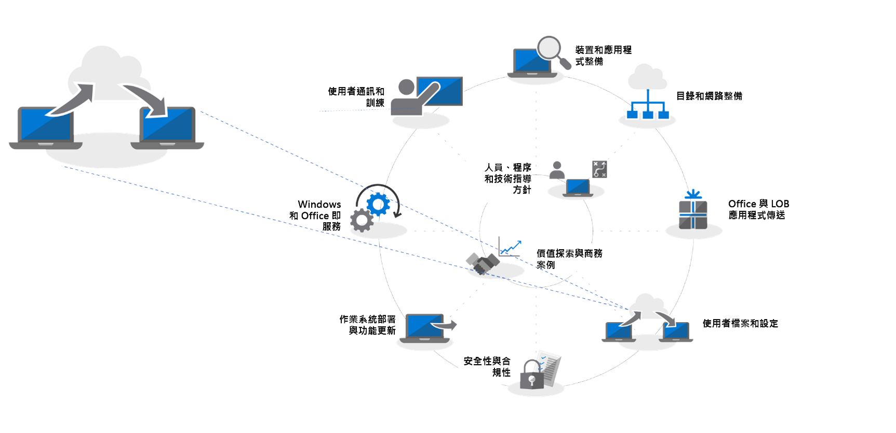

# 步驟 4：使用者檔案和設定移轉Step 4: User Files and Settings Migration

將使用者的檔案和設定移至其新的或重新整理的電腦是很重要的程序，因此絕對不能失敗。Moving users’ files and settings to their new or refreshed PCs is a critical process, failure is not an option. 您可以手動遷移每一部電腦，也可以選擇下列其中一個方法來將此程序自動化。You can migrate each PC manually or you choose one of several ways to automate the process. 無論選擇何種移轉方法，都必須解決三個主要的考量，分別是傳輸使用者的檔案、其設定，以及管理 Windows 10 的「開始」和工作列版面配置。Whichever migration method you choose there are three main considerations to be addressed – the transfer of users’ files, their settings, and managing Windows 10 Start and taskbar layouts.

<table>
<thead>
<td></td>
<td>
<strong>步驟 4：使用者檔案和設定</strong> (英文)<strong>Step 4: User Files and Settings</strong>

重新整理或取代電腦時，將使用者狀態備份與還原自動化以節省時間。雲端檔案同步的新選項可讓您強制執行，將每個使用者的桌面、文件和圖片資料夾同步處理至 OneDrive，以從新的 Windows 安裝順利存取檔案。When refreshing or replacing PCs, save time by automating user state backup and restore. New options for cloud file sync allow you to enforce per user sync of Desktop, Documents and Pictures folders to OneDrive for seamless file access from new Windows installs.
</td>
<td></td>
</thead>
</table>

>[!NOTE]
>儘管您可以繼續使用過去使用過的移轉程序，但在移轉至 Office 365 專業增強版時，建議您使用 OneDrive「已知資料夾移動」(如下所示)。While you can continue to use migration processes you have used in the past, with your shift to Office 365 ProPlus we recommend you use OneDrive ‘Known Folder Move’ (see below). 若要查看完整的桌面部署程序，請瀏覽[桌面部署中心](https://aka.ms/HowToShift)。To see the full desktop deployment process, visit the [Desktop Deployment Center](https://aka.ms/HowToShift).
>

大型部署中最棘手且通常最需手動執行的其中一項工作就是移轉使用者的檔案和設定。本文將討論您可以使用的選項，以便將使用者移轉至新的、重新整理及影像重新處理的電腦。One of the trickiest and often most manual tasks of a large-scale deployment is the transferring of your users' files and settings. In this article we will cover the options available to you to migrate users to new, refreshed and re-imaged PCs.

## 手動移轉Manual Migration

若談到移至新電腦或新版本 Windows 時決定要保留哪些項目，部分使用者可能會想要保留所有內容，其他人則可能想利用這個機會清理磁碟機。因此，某些 IT 部門選擇手動處理使用者的檔案移轉，有時會讓支援小組造訪使用者，有時則會設立支援中心讓使用者將電腦帶給支援小組。兩種方法使用者都可以決定要傳輸及要捨棄的內容。When it comes to deciding on what to keep when moving to a new PC or a new version of Windows some users may want to keep everything, others may want to take the opportunity to clean up their drives. Because of this, some IT departments choose to handle user file migration manually, sometimes by having support teams visit users; sometimes by setting up support centers for users to bring their PCs to the support team. Either way users can be involved in deciding what to transfer and what to discard.

這對您的組織是否可行取決於您規劃的移轉規模。很明顯地，對於直接與使用者合作、了解使用者需求、將檔案複製到其新的或剛更新的電腦，這會受限於時間和實際情況。Whether this is an option in your organization will depend on the scale of the migration you are planning. Clearly it is limited to the time and physics involved in working directly with users, understanding their needs, copying files across to their new, or freshly updated PC.

如果您選擇手動移轉，可能需要評估是否能在 2020 年 1 月前完成工作，屆時 Windows 7 的支援將會終止。如果不確定，請使用下列其中一個自動化選項，或是尋求其他人的協助。If you are opting for a manual migration, you may need to assess whether you will be able to complete the task by January 2020, when support for Windows 7 ends. If this looks doubtful, look into using one of the automated options below, or request more people to help.

## 使用 USMT 自動化移轉Automated Migration using USMT 

對於大規模部署，您可以使用工作序列式部署自動化工具來自動化大部分程序，例如 System Center Configuration Manager 或 Microsoft Deployment Toolkit (MDT)。這兩種解決方案都運用使用者狀態移轉工具 (USMT) 作為端對端部署程序一部分。USMT 屬於 [Windows 評定及部署套件 (Windows ADK)](https://docs.microsoft.com/zh-TW/windows-hardware/get-started/adk-install)For large-scale deployments you can automate much of the process using task sequence-based deployment automation tools such as System Center Configuration Manager or the Microsoft Deployment Toolkit (MDT). Both these solutions make use User State Migration Tool (USMT) as part of their end-to-end deployment process. USMT is part of the [Windows Assessment and Deployment Kit (Windows ADK)](https://docs.microsoft.com/zh-TW/windows-hardware/get-started/adk-install)

USMT 會擷取使用者帳戶、使用者檔案、作業系統設定和應用程式設定，然後將這些移轉至新的 Windows 安裝中。同時也能讓 IT 系統管理員準確控制移轉內容，另外也可以選擇排除不想要的檔案類型，如音訊及視訊檔案，或可執行檔。USMT captures user accounts, user files, operating system settings, and application settings, and them migrates them to a new Windows installation. It also gives you, the IT Admin, control of exactly what gets migrated and, optionally, can exclude unwanted file types – for example audio and video files, or executables.

在移轉程序期間，您必須擁有足夠的伺服器可用儲存體容量，以做為暫時的移轉存放區。此處 USMT 提供兩個重要的功能。第一，它可以估計您在每個電腦上所需的儲存空間。其次，它可讓移轉存放區進行加密，降低資料儲存在檔案伺服器上時受到威脅的風險。During the migration process you will need to have sufficient server storage capacity available to act as your temporary migration store. Here USMT offers two important features. First, it can estimate, per PC, the amount of storage you will need. Second, it allows for migration stores to be encrypted, reducing the risk of data being compromised while being stored on file servers.

您在其中執行電腦重新整理且未格式化的主要 Windows 磁碟分割，您也可以使用 USMT 來使用硬式連結移轉存放區。此程序會在電腦上保留使用者狀態，而舊的作業系統和應用程式會移除並重新整理。還原程序來自相同的本機磁碟分割，這個選項大幅改善效能，並減少網路流量。Where you are performing a PC refresh and not reformatting the primary Windows partition, you also have the option of using a hard-link migration store with USMT. This process preserves user state on the PC while the old operating system and apps are removed and refreshed. With the restore process coming from the same local partition, this option offers significant improvements on performance, and reduces network traffic.

[使用者狀態移轉工具 (USMT) 概觀User State Migration Tool (USMT) Overview](https://docs.microsoft.com/zh-TW/windows/deployment/usmt/usmt-overview)

## OneDrive 已知資料夾移動OneDrive Known Folder Move

如果使用者正在使用 OneDrive 或您將 OneDrive 新增為此部署的一部分，則您有新的可用選項。使用雲端同步處理使用者檔案，OneDrive 的「已知資料夾移動」功能提供的彈性層級，是本機網路式檔案移轉選項所無法提供的。如果在移轉之前啟用，可在新的或重新整理的電腦上提供安全存取，且不需要在您自己的伺服器上建立暫時的移轉存放區。它也可能會對使用者呈現完全透明。If your users are on OneDrive or you are adding OneDrive in as part of this deployment, there is new option available to you. Using the cloud to synchronize user files, OneDrive “Known Folder Move” feature provides a level of flexibility not possible with local network-based file migration options. If enabled prior to migration, it provides secure access on new or refreshed PCs and, it eliminates the need to create temporary migration stores on your own servers. It is also has the potential to be completely transparent to the user.

[將 Windows 已知資料夾重新導向並移動至 OneDrive](https://docs.microsoft.com/zh-TW/onedrive/redirect-known-folders) (英文)[Redirect and move Windows known folders to OneDrive](https://docs.microsoft.com/zh-TW/onedrive/redirect-known-folders)

如果您已使用 OneDrive，您就會知道，使用者可以選取想要同步處理 OneDrive 或 SharePoint 至裝置的資料夾或位置，但實際上會造成使用者設定負擔。使用「已知資料夾移動」，可針對使用者設定檔中的文件、電腦和圖片資料夾，並在 OneDrive 上進行保護。使用者可以在這種情況下自行執行，或者您可以[使用群組原則設定強制執行](https://docs.microsoft.com/en-us/onedrive/use-group-policy?redirectSourcePath=%252fen-us%252farticle%252fUse-Group-Policy-to-control-OneDrive-sync-client-settings-0ecb2cf5-8882-42b3-a6e9-be6bda30899c)。If you’re already using OneDrive, you will know that users can select the folders and locations they would like to sync from OneDrive or SharePoint to their device, but that effectively puts the burden on the end user to set it up. With Known Folder Move, you can target the Documents, Desktop and Pictures folders within a user profile and protect it all on OneDrive. A user can do this themselves or, importantly for this scenario, you can [enforce this using Group Policy settings](https://docs.microsoft.com/en-us/onedrive/use-group-policy?redirectSourcePath=%252fen-us%252farticle%252fUse-Group-Policy-to-control-OneDrive-sync-client-settings-0ecb2cf5-8882-42b3-a6e9-be6bda30899c).

使用「已知資料夾移動」，使用者不變更工作流程，所有項目看起來在之前、期間及之後都相同，使用 OneDrive 的同步處理已完成。透過群組原則，您甚至可以選擇是否要通知使用者其文件、圖片和電腦在 OneDrive 中受保護。如果您選擇不要，會在背景中以無訊息方式進行。使用者只會在傳遞新電腦或電腦重新整理時發現。當使用者登入 OneDrive 帳戶時，這些檔案將可再次使用，且會還原到其新的電腦。當然，使用 OneDrive 表示可以隨時從手機和其他裝置安全存取檔案。With Known Folder Move, users don’t change their workflow – everything looks the same before, during and after synchronization with OneDrive is complete. Through Group Policy you can even choose whether or not to notify users that their documents, pictures and desktop are protected in OneDrive. If you choose not to, it all happens silently in the background. The users will only be aware when they take delivery of a new PC or their PC is refreshed. As soon as they sign in to their OneDrive account, these files will be available again, and will be restored to their new PC. And of course, OneDrive means they will also their files securely at any time from their phones and other devices.

OneDrive 的驗證由 Azure Active Directory 提供，因此對於增加安全性，您可以輕鬆啟用多重要素驗證，並設定原則以控制 OneDrive 用來限制網路活動的上傳和下載頻寬。Authentication for OneDrive powered by Azure Active Directory, so for extra security, you can easily enable multi-factor authentication, and you can set policies to control the upload and download bandwidth OneDrive uses to limit network activity.

您不需要同時移轉所有使用。您可能會想要階段推行群組原則設定，或[限制檔案同步處理至已加入網域的電腦](https://docs.microsoft.com/en-us/powershell/module/sharepoint-online/Set-SPOTenantSyncClientRestriction?view=sharepoint-ps)。You don’t have to migrate every use at the same time. You may want phase the roll-out of the Group Policy settings, or [limit file sync to domain-joined PCs](https://docs.microsoft.com/en-us/powershell/module/sharepoint-online/Set-SPOTenantSyncClientRestriction?view=sharepoint-ps).

## 自訂開始功能表和工作列Start Menu and Task Bar Customization

OneDrive 設計用來同步處理及保護檔案和資料夾；它不會同步處理應用程式或 Windows 設定。過去若要這麼做您可能會使用複製設定檔的方法來設定使用者的開始功能表和工具列設定的標準版面配置。在 Windows 10 專業版、企業版和教育版中，您可以使用群組原則、MDM、PowerShell 或佈建套件部署[自訂開始和工作列版面配置](https://docs.microsoft.com/zh-TW/windows/configuration/windows-10-start-layout-options-and-policies)。不需重新進行影像處理，只要覆寫包含版面配置的 .xml 檔案即可更新版面配置。OneDrive is designed to sync and protect files and folders; it does not sync application or Windows settings. To do this in the past you may have used the copy profile method to configure standard layouts for users’ Start menus and taskbar settings. In Windows 10 Pro, Enterprise, and Education, you can use Group Policy, MDM, PowerShell, or provisioning packages, to deploy [customized Start and taskbar layouts](https://docs.microsoft.com/zh-TW/windows/configuration/windows-10-start-layout-options-and-policies). No reimaging is required, and the layout can be updated simply by overwriting the .xml file that contains the layout.

若要建立新的版面配置只需設定範例系統，並使用 PowerShell [Export-StartLayout](https://docs.microsoft.com/en-us/powershell/module/startlayout/export-startlayout?view=win10-ps) Cmdlet 來產生 XML 檔案，然後將此檔案放在網路共用，或在本機上快取為您部署順序的一部分；這只要在使用者登入時為可用的唯讀檔案。然後您可以使用原則或 [Import-StartLayout](https://docs.microsoft.com/en-us/powershell/module/startlayout/import-startlayout?view=win10-ps) Cmdlet 來參考此檔案。To create a new layout simply configure a sample system, and use the PowerShell [Export-StartLayout](https://docs.microsoft.com/en-us/powershell/module/startlayout/export-startlayout?view=win10-ps) cmdlet to generate an XML file, then place this file on a network share, or cache it locally as part of your deployment sequence; it just needs to be reachable as Read-only file once the user signs in. You can then use policy or the [Import-StartLayout](https://docs.microsoft.com/en-us/powershell/module/startlayout/import-startlayout?view=win10-ps) cmdlet to reference this file.

## 移除不想要的內建應用程式Removing unwanted in-box apps

Windows 10 包含許多實用的內建應用程式作為標準安裝，但您可能會想要從受管理的電腦移除部分，甚至設定安裝以防止傳回應用程式，例如 XBOX 或 Zune Music。您可以使用 [PowerShell Get-AppxPackage](https://technet.microsoft.com/zh-TW/library/hh856044.aspx) 命令來擷取這些應用程式的清單，並使用 [Remove-AppxPackage](https://technet.microsoft.com/zh-TW/library/hh856038.aspx) 命令移除不想要的部分。或者，您可以在部署之前離線裝載 Windows Image (.img) 檔案，並使用[部署映像服務與管理 (DISM)](https://docs.microsoft.com/zh-TW/windows-hardware/manufacture/desktop/what-is-dism) 命令列工具與 [Remove-AppxProvisionedPackage](https://docs.microsoft.com/en-us/powershell/module/dism/remove-appxprovisionedpackage?view=win10-ps) 命令擷取不想要的套件。Windows 10 includes many useful built-in apps as part of the standard installation, but you may want to remove some of these from your managed PCs, and even configure your installation to prevent those apps from returning, for example, XBOX or Zune Music. You can retrieve a list of these apps using the [PowerShell Get-AppxPackage](https://technet.microsoft.com/zh-TW/library/hh856044.aspx) commands, and remove those you do not want using the [Remove-AppxPackage](https://technet.microsoft.com/zh-TW/library/hh856038.aspx) command. Alternatively, you can mount the Windows Image (.img) file offline before deployment, and extract packages you do not want using the [Deployment Image Servicing and Management (DISM)](https://docs.microsoft.com/zh-TW/windows-hardware/manufacture/desktop/what-is-dism) command line tool and the [Remove-AppxProvisionedPackage](https://docs.microsoft.com/en-us/powershell/module/dism/remove-appxprovisionedpackage?view=win10-ps) command.

## 下一步Next Step

## [步驟 5：安全性與相容性考量事項Step 5: Security and Compliance Considerations](https://aka.ms/mdd5)

## 上一步Previous Step

## [步驟 3：Office 和 LOB 應用程式傳遞Step 3: Office and LOB App Delivery](https://aka.ms/mdd3)