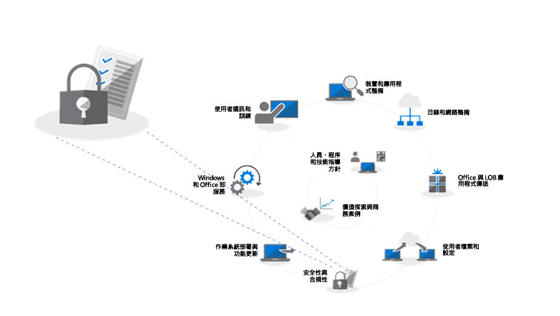
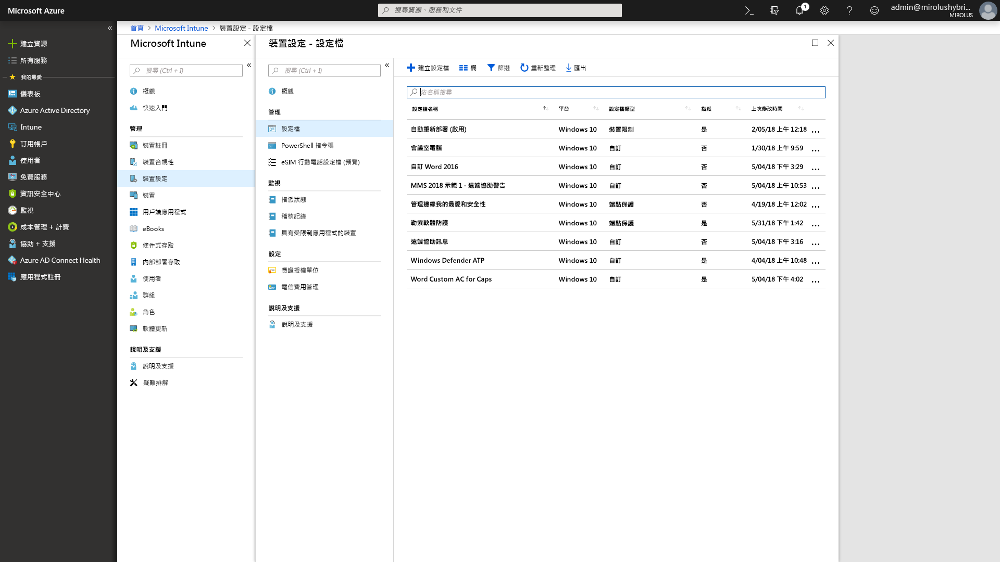

# 步驟 5：安全性與相容性考量事項

<table>
<thead>
<td></td>
<td>
<strong>步驟 5：安全性與相容性考量事項</strong>

Windows 10 和 Office 365 專業增強版提供全新的方式來保護您的資料、裝置和使用者，並快速偵測及回應威脅。此外，了解如何在轉移到 Windows 10 時處理與磁碟加密、反惡意程式碼應用程式和原則相關的常見問題。
</td>
<td></td>
</thead>
</table>

>[!NOTE]
>安全性與相容性是我們建議的部署程序轉輪中第五個步驟，說明 Windows 10 和 Office 365 專業增強安全性與相容性考量。 若要查看完整的桌面部署程序，請瀏覽[桌面部署中心](https://aka.ms/HowToShift)。
>

現在是時候檢閱可在部署 Windows 10 和 Office 365 專業增強版時以新的安全性及合規性功能作為目標的選項，以及檢閱在從先前版本的 Windows 和 Office 移轉時的考量及常見阻礙。 Windows 10 中許多安全性相關功能都在驅動轉換至較新的平台。 此外，使用 Azure Active Directory 與 Office 365 中的雲端服務和身分識別選項整合能為您的資料、裝置和使用者帶來新的核持續更新保護的存取。

## 克服潛在的安全性相關部署封鎖

在說明當您移至 Windows 10 和 Office 365 專業增強版及將這些體驗與雲端連線時可新增的功能之前，讓我們從幾個我們所看到通常可能會中斷部署進度的趨勢開始。

### 磁碟加密

您可能會遇到的第一次初始挑戰是硬碟加密。許多硬碟加密解決方案無法輕鬆從舊版的 Windows 升級到較新版本的 Windows。

在特定版本的平台上使用 ‘/reflectdrivers’ 選項搭配 Windows 安裝程式時，某些磁碟加密解決方案可讓您執行升級，但其他版本可能會要求您在部署之前解密磁碟機，然後在安裝 Windows 10 之後再重新加密。某些解決方案也不允許您使用舊版的 BIOS 從主開機記錄 (MBR) 移動至 UEFI 所需的 GUID 分割表格 (GPT)。這是很重要的，因為 Windows 10 中新的虛擬化為基礎安全性功能需要包含 UEFI 的 64 位元版 Windows 10，這些會說明如下。

解決這些問題的其中一個選項是使用 Windows 10 中的 BitLocker，其包含在 Windows 10 專業版以及更高版本。BitLocker 可讓您暫停作業系統升級保護和功能更新作為程序的一部分。

[Bitlocker 基本部署](https://docs.microsoft.com/zh-TW/windows/security/information-protection/bitlocker/bitlocker-basic-deployment) (英文)

### 防毒和反惡意程式碼應用程式相容性

第二，儘管我們已看過 Windows 7 與 Windows 10 之間超過 [99% 的 Windows 應用程式的相容](https://www.microsoft.com/zh-TW/microsoft-365/blog/2018/09/06/helping-customers-shift-to-a-modern-desktop/) (英文)，例外狀況通常就是防毒軟體 (AV) 應用程式或虛擬私人網路 (VPN) 用戶端。這些應用程式通常會實作非標準的開發方式和 API，通常使用未記載的方法來保護您的系統或是將您連線到網路資源。

如此一來，這些應用程式的本質會在轉換到新版的 Windows 時變得易於變更。如果 AV 或 VPN 軟體無法在 Windows 10 中或在升級之後使用，修正方式通常是將您在使用的應用程式取代為在 Windows 10 上支援及測試的項目。

### 安全性原則

您用於較舊版 Windows 和 Office 的 Active Directory 群組原則設定可能不會直接翻譯為 Windows 10 及 Office 365 專業增強版，且較新的安全性與相容性功能會有不同的考量。最好使用 Microsoft 安全性相容性工具組取得最新版 Windows 及 Office 的安全性原則基準。此外，值得一探究竟行動裝置管理原則作為 Microsoft Intune 的一部分。

## 

## Microsoft 365 中新的安全性和相容性功能

現在，將您目前保護向前移動有一些考量，以及在您轉變前有些要注意的事項。現在讓我們來看一下從 EMS 和更新版本移至 Windows 10、Office 365 專業增強版和雲端選項時，您可以善加利用的新功能。

### 身分識別和存取管理

開始進行身分識別與存取管理。Azure Active Directory 是適用於應用程式、裝置和雲端服務的身分識別控制平面，且是連線到 Office 365 及其他雲端服務的現代化方法。條件式存取可讓您根據您的登入位置、您使用的裝置，以及異常行為等來定義不同的驗證需求。

在裝置層級，生物識別技術能提供唯一識別項以更輕鬆、更安全地存取您的裝置和應用程式 - 在您移動至排除密碼的目標時。Windows Hello 提供裝置型多重要素驗證。必須仰賴裝置本身、PIN 或唯一的生物識別識別碼，例如您可以透過原則強制執行的臉孔或指紋。

[Azure 身分識別管理的基本概念](https://docs.microsoft.com/zh-TW/azure/active-directory/fundamentals/identity-fundamentals) (英文)

[了解 Azure 識別解決方案](https://docs.microsoft.com/zh-TW/azure/active-directory/fundamentals/understand-azure-identity-solutions) (英文)

[Azure Active Directory 條件式存取](https://docs.microsoft.com/zh-TW/azure/active-directory/conditional-access/overview) (英文)

[Windows Hello 企業版](https://docs.microsoft.com/zh-TW/windows/security/identity-protection/hello-for-business/hello-identity-verification) (英文)

### 虛擬化為基礎的安全性

現在除了身分識別，您也可以啟用持續保護已知或未知的威脅，為了這麼做，Windows 10 會在核心使用虛擬化為基礎的安全性以確保使用安全開機時的開機完整性以及程式碼完整性。我們也可以協助利用認證保護阻止認證失竊，方法是從 Windows 獨立維護使用者機密資訊。此外，應用程式保護可以找出並降低瀏覽器型威脅，方法是在獨立容器中執行瀏覽器。這所有的技術都是使用 Windows 10 中虛擬化為基礎的安全性，且為無法在 Windows 7 系統上複製的基礎變更 – 請注意，這些也需要 UEFI、64 位元 Windows，及透過 SLAT 的虛擬化延伸支援 – 位於硬體層級。

[更多虛擬化為基礎的安全性相關資訊](https://docs.microsoft.com/zh-TW/windows-hardware/design/device-experiences/oem-vbs) (英文)

### 雲端服務中的安全性加強功能

雲端服務提供另一層的選用防護，以提升 Windows 及 Office 安全性。這些可為您提供新層級的經常即時控制項，可立即偵測、抗拒及回應新的攻擊和攻擊類型 – 特別是相較於傳統軟體更新和 AV 簽章檔案 – 其中的回應與更新部署時間原本就比較慢。

透過 Microsoft Intelligent Security Graph，您可以更快速地存取新興威脅的資訊和保護。以下是您可以善加利用的幾個功能，從 Office 開始。

**[資料外洩防護](https://docs.microsoft.com/zh-TW/office365/securitycompliance/data-loss-prevention-policies)** (英文) 內建於 Office 365 專業增強版，可協助在偵測到高風險內容 (例如信用卡或識別碼) 時告知使用者安全性原則。通知使用者後，原則可以通知或封鎖傳送及共用。

**[Azure 資訊保護](https://docs.microsoft.com/zh-TW/azure/information-protection/rms-client/client-admin-guide)** (英文) 是一種互補服務，可與 Office 搭配使用，讓使用者可輕鬆地分類及將 Office 檔案標籤。它會在標籤的檔案上觸發自動動作，例如加密或鎖定共用。

我們也已推出跨 Office 應用程式的**[安全連結](https://docs.microsoft.com/zh-TW/office365/securitycompliance/atp-safe-links)** (英文) 保護來保護您免於已知惡意網站的動態清單攻擊。

此外，Outlook 中及 Exchange Online 所屬的**[安全附件](https://docs.microsoft.com/zh-TW/office365/securitycompliance/atp-safe-attachments)**，會超越電子郵件篩選以檢查附件。如果識別到高風險的附件，安全附件將會通知使用者已知的惡意附件，並從電子郵件中將其移除。

**[Office 365 郵件加密](https://docs.microsoft.com/zh-TW/office365/securitycompliance/encryption)** (OME) (英文) 也可用來保護所傳送的電子郵件和附件，確保只有預定的收件者可以檢視電子郵件內容。OME 與 Google、Yahoo 和 Microsoft 消費者帳戶驗證緊密運作，一次性密碼可讓其他電子郵件服務的使用者也安全地接收電子郵件。

#### 其他 Windows 10 保護

Windows 10 中的 **[Windows Defender 應用程式控制](https://docs.microsoft.com/zh-TW/windows/security/threat-protection/windows-defender-application-control/windows-defender-application-control)** (英文) 會運作 Microsoft 已檢查安全性的核准應用程式允許與拒絕清單，全部都是使用 Microsoft Intune 受端點保護原則管理。

**[Windows Defender 進階威脅防護](https://docs.microsoft.com/zh-TW/windows/security/threat-protection/windows-defender-atp/overview)** (英文) 是一個整合式預防保護、入侵後偵測、自動調查及回應平台。它會保護端點免於網路威脅；偵測進階攻擊與資料入侵、自動化安全性事件，並提高安全性狀態。

**[利用保護](https://docs.microsoft.com/zh-TW/windows/security/threat-protection/windows-defender-exploit-guard/windows-defender-exploit-guard)** (英文) 可協助減少執行應用程式的受攻擊面，方法為防止惡意程式碼進入 Windows 及封鎖不受信任的程序存取受保護資料夾。

#### Microsoft Intune

[Microsoft Intune](https://docs.microsoft.com/zh-TW/intune/introduction-intune) (英文) 作為行動裝置情況下的雲端式管理服務，包括 IOS、Android 和 Windows 裝置，且現在可以設定為共同管理以加強及擴充 System Center Configuration Manager 所管理特定工作負載的控制項。此處的其中一個優點是，可能需要註冊到裝置管理，裝置才能存取受保護的資源 – 即使未受管理、非網域聯結或非 Azure AD 聯結裝置。您也可以利用作業系統和應用程式層級的細微設定與合規性原則強制執行。應用程式原則與設定可以使用 Microsoft Intune 在 Windows 10 中集中設定和強制執行 Office 365 專業增強版和 Microsoft Store 應用程式。

## 下一步

## [步驟 6：作業系統部署與功能更新](https://aka.ms/mdd6) (英文)

## 上一步 

## [步驟 4：使用者檔案和設定](https://aka.ms/mdd4) (英文)
