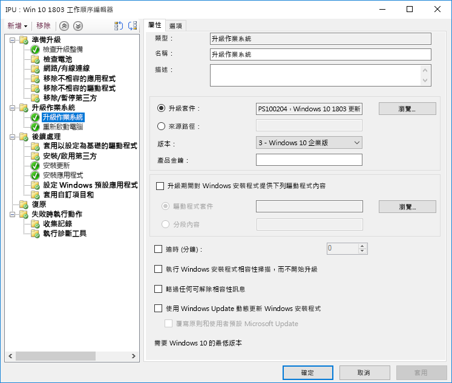
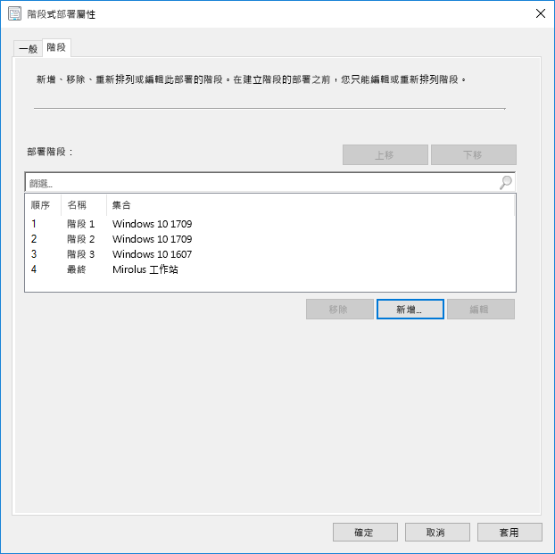
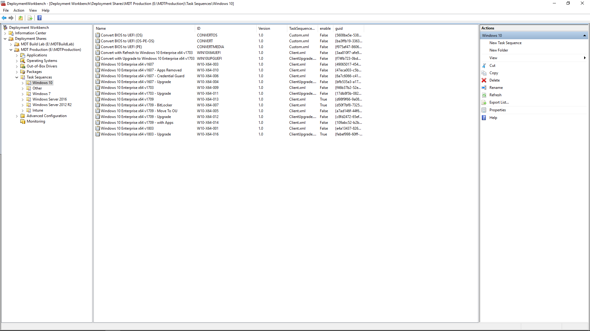

# 步驟 6：作業系統部署與功能更新Step 6: OS Deployment and Feature Updates

<table>
<thead>
<td></td>
<td>
<strong>步驟 6：作業系統部署與功能更新</strong><strong>Step 6: OS Deployment and Feature Updates</strong>

工作序列型部署是用於自動化大型、階段部署，以進行裸機安裝、電腦重新整理和電腦取代。升級工作序列也會協助您保持在最新的主要半年更新。Windows Autopilot 是最近的新增功能，讓新電腦收購程序現代化。Task sequence-based deployment is used to automate large scale, phased deployment for bare metal installs, PC refresh and PC replacement. Upgrade task sequences will also help you stay current with major semi-annual updates. And Windows Autopilot is a recent addition that modernizes the new PC acquisition process.
</td>
<td></td>
</thead>
</table>

>[!NOTE]
>作業系統部署和功能更新是我們建議的部署程序中的第六個步驟，其說明了 Windows 10 作業系統部署、升級與功能更新。OS Deployment and Feature Updates is the sixth step in our recommended deployment process wheel covering Windows 10 OS deployment, upgrades and Feature Updates. 若要查看完整的桌面部署程序，請瀏覽[桌面部署中心](https://aka.ms/HowToShift)。To see the full desktop deployment process, visit the [Desktop Deployment Center](https://aka.ms/HowToShift).
>

如果您到目前為止已遵循部署程序轉輪，您應至少已部分完成裝置和應用程式整備的步驟、準備好基礎結構、設定並收集應用程式套件、計劃就位可移轉使用者檔案及設定預設設定，以及計劃好保留您現有的安全性控制項，並可能部署新的控制項。If you’ve been following the deployment process wheel till now, you’ve at least partially completed the steps for device and app readiness, prepared your infrastructure, configured and collected app packages, have a plan in place for migrating user files and configuring default settings as well as have plans for retaining your existing security controls and perhaps deploying new ones.

現在我們已達到一個階段，您結合這些片段以盡可能自動化來安裝 Windows 10 和 Microsoft 365 Apps 企業版，以及所需的驅動程式、應用程式和其他任何所需項目。Now we’ve arrived at the stage where you’re putting all these pieces together to automate as much as you can to install Windows 10 and Microsoft 365 Apps for enterprise, along with the necessary drivers, apps and whatever else is needed.

最後，作業系統部署成功的最佳評量是符合使用者預期並避免中斷工作。在此步驟中，您會開始測試和部署以在分階段部署中試用使用者。這裡有一個提示，在您擴大部署之前，您必須直接跳到部署程序轉輪的步驟 8 – [使用者通訊和訓練](https://aka.ms/mdd8) (英文) 以確保使用者收到通知，並準備好以他們的方式進行變更，且您可以使用分階段部署透過連續驗證來測量您呈現的速度。Ultimately, the best measure of success with an OS deployment is meeting user expectations and avoiding disruptions in their work. And in this step, you’ll start testing and deploying to pilot users as part of a phased deployment. And one tip here, before you broaden deployment, you’ll need to skip ahead to step 8 on our deployment process wheel – [User Communications and Training](https://aka.ms/mdd8) to make sure users are informed and prepared for changes coming their way and that you can measure your roll-out pace with continuous validation using Phased Deployment.

## Windows 映像程序Windows Imaging Process

大部分的組織使用電腦映像程序來設定和擷取 Windows 的複製，包括幾個已安裝的標準應用程式基本組，或是僅包含應用程式執行階段和更新的較細映像事件。若要這麼做，最好是使用此程序的虛擬機器，以避免任何非預期的驅動程式相關相容性問題並進行自動化目的。Most organizations use the process of PC imaging to configure and capture a clone of Windows, including a base set of a few standard apps installed, or an even a thinner image with only application runtimes and updates. The best way to do this is using a virtual machine for this process to avoid any unexpected driver-related compatibility issues and for automation purposes.

如果進行映像擷取路由，最好盡量自動化以確保最佳品質的映像和重複的程序。對於大部分的部署，也建議擷取之前盡可能不要在 Windows 映像中進行自訂和預先安裝的應用程式。這稱為「細映像」的方法，可節省網路上的整體頻寬，方法是減少映像內的應用程式的數目。從細的基底映像開始，您可以在所需的應用程式、語言和設定上堆疊以動態為使用者量身訂做。If going the image capture route, it’s best to automate as much as possible to ensure the best quality image and a repeatable process. For most deployments, it is also recommended to put as little customization and pre-installed apps as possible in the Windows image prior to capturing. This is what is called a ‘thin image’ approach, which can save overall bandwidth on the network by eliminating the number of apps within the image. By starting with a thin base image, you can layer on required apps, languages and configurations dynamically tailored to users.

在建置及擷取程序期間，Microsoft Endpoint Configuration Manager (最新分支) 和 Microsoft 部署工具組等工具會使用系統準備工具 – 或 Sysprep – 以及「一般化」命令以在他們擷取 Windows 10 安裝作為映像之前封裝映像。During the build and capture process, tools like Microsoft Endpoint Configuration Manager (Current Branch) and the Microsoft Deployment Toolkit use the System Preparation Tool – or Sysprep – along with the “Generalize” command to reseal your image before they capture the Windows 10 installation as an image.

擷取的映像將會有 Windows 映像 – 或 WIM – 格式如標準 Windows 安裝媒體。一旦您自訂 WIM 檔案之後，可以使用另一個工作順序作為在 Configuration Manager 或 Microsoft 部署工具組中作業系統部署的一部分來執行部署相關的工作，以在您套用 Windows 映像之前和之後套用映像並執行工作。The captured image will have the Windows image – or WIM – format like standard Windows installation media. Once you have your custom WIM file, you can use another task sequence as part of your OS deployment in Configuration Manager or Microsoft Deployment Toolkit to perform deployment-related tasks, to apply the image and run tasks before and after your Windows image is applied.

[建立 Windows 10 參照映像Create a Windows 10 Reference Image](https://docs.microsoft.com/windows/deployment/deploy-windows-mdt/create-a-windows-10-reference-image)

[建立安裝作業系統的工作順序Create a task sequence to install an Operating System](https://docs.microsoft.com/configmgr/osd/deploy-use/create-a-task-sequence-to-install-an-operating-system)

### 部署類型Deployment Types

您準備好自訂映像後，安裝或移轉類型將可分為下列類別：With your custom image ready, the installation or migration type will fall into the following categories:

  - 首先，**裸機部署**。這個狀況是用來將映像部署到全新的磁碟機，或是在您不想保留任何資料磁碟的電腦上重新安裝映像First, **bare metal deployment**. This is the scenario used to deploy an image to a clean disk, or to reimage a computer where you don’t intend to keep any of the data on the disk

  - 第二，類似於裸機，是**電腦重新整理，** 具有使用者狀態保留在磁碟上\*或在安裝完成後會加以還原的主要差異And second, similar to bare metal, is **Computer Refresh,** with the key difference that user state remains on the disk\* or will be restored after the install is complete

  - 最後一個則是**電腦取代**。這正如其名，您會將電腦取代為另一部電腦。在此情況下，通常會從第一部電腦將使用者檔案備份至中央位置，然後將這些檔案還原至第二部電腦。And last is **Computer Replacement**. Here as the name implies, you are replacing a PC with another PC. In this case, there is often a backup of user files from the first PC to a central location, then a restore of those files to the second PC.

這三種案例有共通點，它們會使用工作順序來執行，且每次都可套用自訂映像。All three of these scenarios have something in common, they use a task sequence to run, and a custom image can be applied each time.

[深入了解 Windows 10 部署案例More About Windows 10 Deployment Scenarios](https://docs.microsoft.com/windows/deployment/windows-10-deployment-scenarios)

### 使用工作順序自動化就地升級In-place Upgrade using Task Sequence Automation

除了這些部署類型之外，現在還提供新的選項作為 Windows 10 的 Microsoft Endpoint Configuration Manager (最新分支) 工作序列，以及使用工作序列的就地升級。In addition to these deployment types, there is a new option available now as a Microsoft Endpoint Configuration Manager (Current Branch) Task Sequence with Windows 10 – and in-place upgrade using the Upgrade Task Sequence.

從舊版 Windows 的就地升級不需要工作順序，但在企業規模中部署時則是建議的方法。就地升級無法讓您使用應用程式套用自訂映像，但您可以使用離線服務更新預設 install.wim。例如，您可以確認它在執行升級之前已套用最新的 Windows 更新。In-place upgrades from a previous version of Windows do not require a task sequence, but it is a recommended approach when deploying at enterprise scale. An in-place upgrade does not allow you to apply a custom image with applications, but you can update the default install.wim using offline servicing. For example, you can to make sure it has the latest Windows updates applied prior to performing upgrades.

就地升級會使用 Windows 安裝程式。安裝程式引擎會執行多個小型的預先安裝檢查以尋找已知的相容性問題。它也會保留使用者狀態和應用程式，並只會移除與所安裝 Windows 10 版本不相容的項目。透過此選項，會保留先前安裝的應用程式與使用者狀態。就地升級也可讓您復原到先前安裝的作業系統 (若疑難排解需要)。In-place upgrade uses windows setup. The setup engine runs several small pre-installation checks looking for known compatibility issues. It also preserves the user state and applications and only removes what isn’t compatible with the version of Windows 10 being installed. With this option, previously installed applications and user state are preserved. In-place upgrade also allows you to roll-back to the previous OS installed if needed for troubleshooting purposes.

[使用 setup.exe 的 Windows 10 升級前驗證Windows 10 Pre-Upgrade Validation Using setup.exe](https://blogs.technet.microsoft.com/mniehaus/2015/08/23/windows-10-pre-upgrade-validation-using-setup-exe/)

就地升級案例可用來從舊版 Windows 移轉到 Windows 10，以及從舊版 Windows 10 進行升級。在 Windows 安裝程式完成升級之後，您的工作順序可以繼續執行及升級應用程式 (如 Office)、取代驅動程式以及套用個人化設定。同樣地，您可以使用升級工作順序在執行升級之前執行預先安裝工作或檢查。The in-place upgrade scenario can be used to migrate to Windows 10 from legacy versions of Windows, as well as upgrade from previous versions of Windows 10. After Windows Setup completes the upgrade, your task sequence can continue to run and upgrade applications like Office, replace drivers, and apply personalization settings. Likewise, you can use the Upgrade Task Sequence to perform pre-installation tasks or checks prior to carrying out the upgrade.

[使用 Configuration Manager 執行就地升級至 Windows 10Perform an in-place upgrade to Windows 10 using Configuration Manager](https://docs.microsoft.com/windows/deployment/upgrade/upgrade-to-windows-10-with-system-center-configuraton-manager)

[建立工作順序以在 Configuration Manager 中升級作業系統Create a task sequence to upgrade an OS in Configuration Manager](https://docs.microsoft.com/configmgr/osd/deploy-use/create-a-task-sequence-to-upgrade-an-operating-system)

### 階段式部署Phased Deployment

當您計劃部署時，您將電腦目標設為裸機、重新整理、取代和升級路徑。在此情況下，建議的方法是使用類似電腦上集合的分階段部署。如此一來，您可以在增加部署規模之前驗證相容性、傳遞和自動化、使用者接受、網路頻寬耗用以及其他因素。As you're planning your deployment, you'll be targeting computers for bare metal, refresh, replace and upgrade paths. The recommended approach in this case is to use phased deployment to collections of similar machines. This way, you can validate compatibility, delivery and automation, user acceptance, network bandwidth consumption, and other factors before increasing the scale of your deployment.

### 建議的工具：Microsoft Endpoint Configuration Manager (最新分支) 和 Microsoft 部署工具組Recommended Tools: Microsoft Endpoint Configuration Manager (Current Branch) and the Microsoft Deployment Toolkit

無論您選擇的部署類型，您需要確認可預測性和重複性盡可能為自動化。Microsoft 提供兩個解決方案可使用自動化的工作順序自動化作業系統部署：Regardless of the deployment type you choose, you’ll want to make sure it’s as automated as possible for predictability and repeatability. Microsoft offers two solutions to automate OS deployment using automated task sequences:

  - **[Microsoft Endpoint Configuration Manager](https://docs.microsoft.com/configmgr/core/understand/introduction)** (ConfigMgr) (英文) 提供內建作業系統部署功能，可加強軟體發佈與軟體更新管理的功能。ConfigMgr 已廣泛用於各種規模的組織，並支援所有四個 Windows 部署類型。或者，您也可以將 ConfigMgr 與 Microsoft Intune 整合以新增其他功能來部署和裝置管理。**[Microsoft Endpoint Configuration Manager](https://docs.microsoft.com/configmgr/core/understand/introduction)** (ConfigMgr) provides built-in operating system deployment capabilities to complement its capabilities for software distribution and software update management. ConfigMgr is widely used by organizations of all sizes and supports all four Windows deployment types. Optionally, you can integrate ConfigMgr with Microsoft Intune to add additional capabilities for deployment and device management.

  - 其他常用的部署選項是免費的 **[Microsoft 部署工具組](https://docs.microsoft.com/windows/deployment/deploy-windows-mdt/get-started-with-the-microsoft-deployment-toolkit)** (MDT) (英文) 通常是由小型及中型規模的組織用來進行作業系統部署。這幾乎不需要基礎結構。MDT 與 Windows 部署服務 (WDS) 整合以進行網路開機。它支援所有四種部署類型以及應用程式安裝、驅動程式和設定。當然，MDT 甚至可與 Configuration Manager 整合。And one other popular deployment option is the free **[Microsoft Deployment Toolkit](https://docs.microsoft.com/windows/deployment/deploy-windows-mdt/get-started-with-the-microsoft-deployment-toolkit)** (MDT) which is typically used by small and medium sized organizations for OS deployment. This requires very little infrastructure. MDT integrates with Windows Deployment Services (WDS) for network boot. It supports all four deployment types as well as installation of applications, drivers, and settings. And of course, MDT can even be integrated with Configuration Manager.

### Windows AutopilotWindows Autopilot

Windows 10 的新選項使用Windows Autopilot 將新電腦設定配置為硬體更新周期的一部分。A new option with Windows 10 is to configure new PCs as part of your hardware refresh cycle using Windows Autopilot. 您可以在這裡可以與支援的硬體供應商合作，自訂預設的 Windows 安裝體驗 - 例如，透過減少提供給使用者的選項，如授權合約或診斷資料設定。Here you can work with supporting hardware vendors to customize the default Windows setup experience – for example by eliminating options presented to users, like Licensing Agreements or diagnostic data settings.

接著，當使用者在安裝程式期間使用其 Azure AD 認證登入電腦時，裝置會註冊為 Microsoft Intune，也可以接管部署程序及套用應用程式、軟體更新設定與合規性原則。Windows Autopilot 也可以選擇性地防止使用者在佈建完成之前存取第一個工作階段。Then, when a user signs in to the PC during setup using their Azure AD credentials, the device enrolls into Microsoft Intune, which can then take over the deployment process and apply applications, software updates configurations and compliance policies. Windows Autopilot can also optionally prevent the user from accessing the first session until provisioning is complete.

[Windows Autopilot 概觀Overview of Windows Autopilot](https://docs.microsoft.com/windows/deployment/windows-autopilot/windows-10-autopilot)

[Windows Autopilot 必要條件Windows Autopilot Prerequisites](https://docs.microsoft.com/windows/deployment/windows-autopilot/windows-10-autopilot#prerequisites)

## 商務用 Windows 更新功能更新Windows Update for Business for Feature Updates

商務用 Windows Update是一項免費服務，透過將裝置直接連線到 Windows Update 服務，IT 專業人員可以使 Windows 10 裝置始終保持最新狀態。Windows Update for Business is a free service that enables IT Pros to keep Windows 10 devices always up to date by directly connecting the devices to the Windows Update service. 可以透過群組原則或 MDM 解決方案 (如 Microsoft Intune) 來設定商務用 Windows Update，並可讓 IT 專業人員建立[部署通道](https://docs.microsoft.com/windows/deployment/update/waas-deployment-rings-windows-10-updates)以驗證新組建。Windows Update for Business can be configured via Group Policy or through MDM solutions such as Microsoft Intune and allows IT Pros to create [deployment rings](https://docs.microsoft.com/windows/deployment/update/waas-deployment-rings-windows-10-updates) to validate new builds. 這項工具已整合至現有管理工具中，如 Windows Server Update Services (WSUS)、Microsoft Endpoint Configuration Manager (最新分支) 和 Microsoft Intune。It is integrated into existing management tools such as Windows Server Update Services (WSUS), Microsoft Endpoint Configuration Manager (Current Branch), and Microsoft Intune. 此外，商務用 Windows Update支援點對點傳送，以協助優化頻寬效率並減少網路擁塞。Additionally, Windows Update for Business supports peer-to-peer delivery to help optimize bandwidth efficiency and reduce network congestion.

如需商務用 Windows Update 的詳細資訊，請參閱以下文件：For more detailed information on Windows Update for Business please review the following documentation:

- [使用商務用 Windows Update 部署更新Deploy Updates Using Windows Update for Business](https://docs.microsoft.com/windows/deployment/update/waas-manage-updates-wufb)
- [設定商務用 Windows UpdateConfigure Windows Update for Business](https://docs.microsoft.com/windows/deployment/update/waas-configure-wufb)
- [整合商務用 Windows Update 與現有的管理工具Integrate Windows Update for Business with Existing Management Tools](https://docs.microsoft.com/windows/deployment/update/waas-integrate-wufb)
- [使用群組原則來設定商務用 Windows UpdateUse Group Policy to configure Windows Update for Business](https://docs.microsoft.com/windows/deployment/update/waas-wufb-group-policy)
- [使用 Microsoft Intune 來設定商務用 Windows UpdateUse Microsoft Intune to configure Windows Update for Business](https://docs.microsoft.com/intune/windows-update-for-business-configure)

## 下一步Next Step 

## [步驟 7：Windows 和 Office 服務Step 7: Windows and Office Servicing](https://aka.ms/mdd7)

## 上一步Previous Step

## [步驟 5：安全性與相容性考量事項Step 5: Security and Compliance Considerations](https://aka.ms/mdd5)
