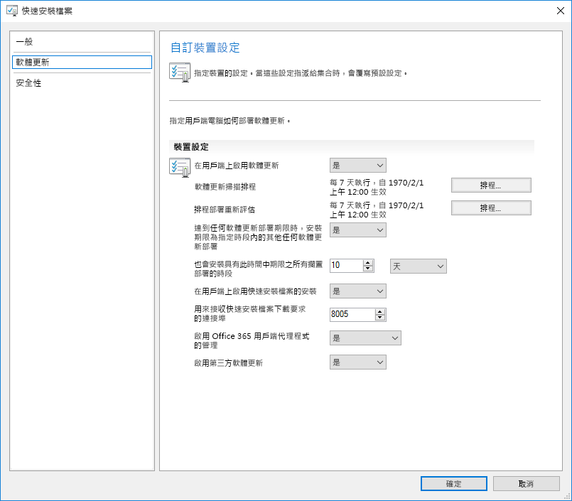
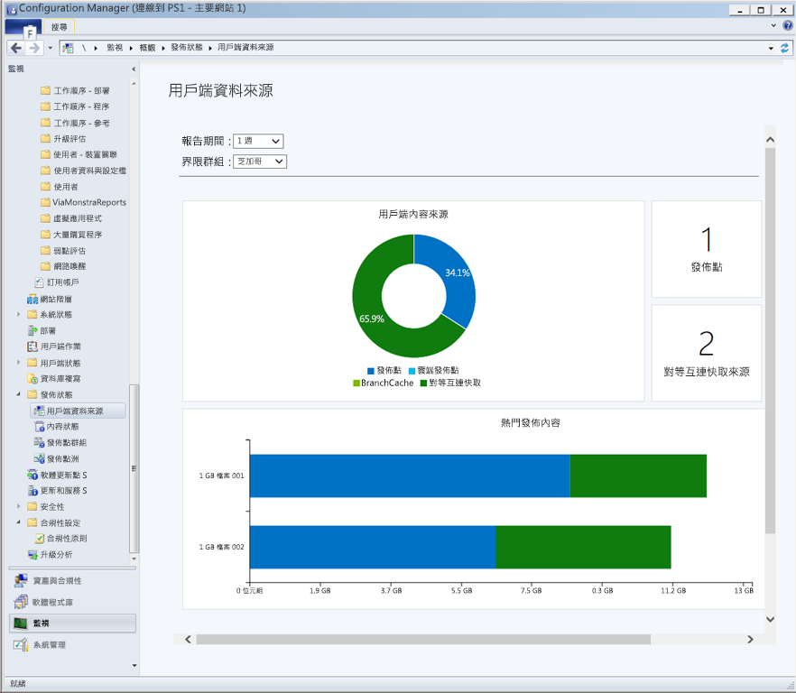
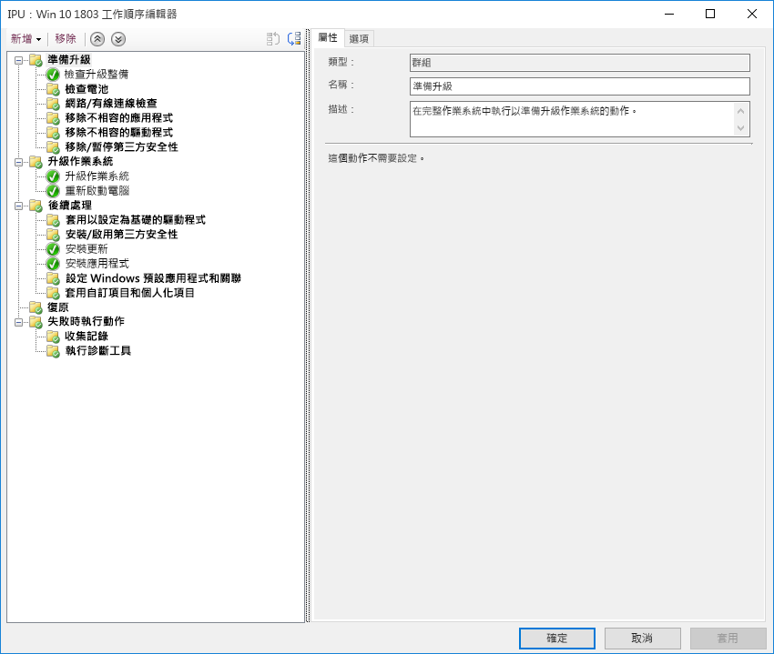

# 步驟 7：Windows 和 Office 服務Step 7: Windows and Office Servicing

<table>
<thead>
<td></td>
<td>
<strong>步驟 7：Windows 和 Office 服務</strong><strong>Step 7: Windows and Office Servicing</strong>

Windows 10 和 Microsoft 365 Apps 企業版都會持續新增功能，以最新的發明帶領使用者體驗和安全性前進。了解如何保持在最新的半年和每月更新、新服務模型如何運作，以及您所擁有的工具和選項。Both Windows 10 and Microsoft 365 Apps for enterprise continually add new capabilities to keep bringing user experiences and security forward with the latest innovations. Learn how to stay current with semi-annual and monthly updates, how the new servicing model works and the tools and options you have.
</td>
<td></td>
</thead>
</table>

>[!NOTE]
>Windows 和 Office 服務是我們建議的部署程序轉輪中第七個步驟，說明對功能的半年更新進行準備的規劃層面。Windows and Office Servicing is the seventh step in our recommended deployment process wheel covering the planning aspects of preparing for semi-annual updates to features. 若要查看完整的桌面部署程序，請瀏覽[桌面部署中心](https://aka.ms/HowToShift)。To see the full desktop deployment process, visit the [Desktop Deployment Center](https://aka.ms/HowToShift).
>

Windows 10 與 Microsoft 365 Apps 企業版都推出了新的服務選項、支援模型和更新時間表。Both Windows 10 and Microsoft 365 Apps for enterprise introduce new servicing options, support models, and update timelines. 這些變更可簡化隨時保有最新功能的程序。These changes simplify the process for staying current on the latest features. 連同這些更新一起推出的是新的設定選項，其可實現符合您需求的服務方案。Along with these updates are new configuration options to enable servicing plans that meet your needs. 讓我們了解如何準備迎接可在 Windows 10 和 Microsoft 365 Apps 企業版中提供新功能的半年通道更新，同時利用 Microsoft Endpoint Center Configuration Manager (最新分支) 內的新功能。Let's learn how to prepare for semi-annual channel updates offering new features and capabilities in Windows 10 and Microsoft 365 Apps for enterprise while leveraging new features within Microsoft Endpoint Configuration Manager (Current Branch).

[協助客戶改用 Windows 10 和 Microsoft 365 Apps 企業版Helping customers shift to Windows 10 and Microsoft 365 Apps for enterprise](https://www.microsoft.com/microsoft-365/blog/2018/09/06/helping-customers-shift-to-a-modern-desktop/)

## 更新類型Update Types

更新主要可分為兩種類別，分別是功能更新以及品質和安全性更新 (包含累積安全性、可靠性和錯誤修正)。Updates fall into two main categories, feature updates and then quality and security updates which contain cumulative security, reliability and bug fixes. 就頻率來說，Windows 和 Office 皆提供半年通道，會在每年的 3 月和 9 月分別提供新的功能，並且每個月會推出品質和安全性更新。In terms of cadence both Windows and Office deliver a semi-annual channel which delivers new features twice per year around March and September while quality and security Updates occur Monthly. 此外，針對 Office 365 應用程式，我們還會專門提供完整支援的每月通道選項，其中的更新會同時包含新功能和品質更新。Additionally, unique to Office 365 applications, we offer a fully-supported Monthly Channel option where updates contain both new features and quality updates.

如果您已經習慣電腦作業系統與應用程式更新之間較長的週期，您可能會想了解：If you’re used to a longer cycle between desktop OS and app updates, you might be wondering;

  - 更新是否相容？Will the updates be compatible?

  - 我需要重新訓練使用者嗎？Will I need to keep retraining my users?

  - 有哪些風險？And what are the risks?

若要回答這些問題以及為何更頻繁地提供新功能，我們提供這種方法的一些優點To answer those questions and the rationale for delivering new capabilities more frequently, we’ll some of the advantages of this approach

### 功能更新的優點Feature Update Benefits

首先，我們已經捨棄過去的模型，過去約每隔三年會引入大型變更，現在則是增量的小型變更，以及每年兩次的功能更新。為什麼？由於技術趨勢變動快速，加上快速發展的安全性威脅，這麼做可讓體驗和保護維持在最新狀態。舉例來說，部分安全性相關的更新，無法只藉由每月的安全性更新或防毒簽章檔案來提供；它們可能是低階變更平台，如虛擬化型安全性。First, we’ve moved away from the model of the past that would introduce huge waves of change around every three years to now incremental smaller changes with feature updates twice per year. Why? With technology trends moving so fast in addition to rapidly evolving security threats, this keeps experiences and protections current. Some of the security related updates for example can’t just be delivered by monthly security updates or antivirus signature files; they may be low-level changes platform, like virtualization-based security.

[Windows 即服務快速指南Quick guide to Windows as a service](https://docs.microsoft.com/windows/deployment/update/waas-quick-start)

[使用 Windows 10 安全性功能來降低威脅Mitigate threats by using Windows 10 security features](https://docs.microsoft.com/windows/security/threat-protection/overview-of-threat-mitigations-in-windows-10%20%20)

### 累計更新模型的優點Cumulative Update Model Benefits

第二，以累計更新套件的方式提供品質和安全性更新可修正許多過去的問題。過去，有時您可能每個月要為 Windows 和 Office 從十幾個或更多的更新中進行挑選。可以想像，這會是一組幾乎無法支援的測試矩陣。此外，如果您安裝的 Windows 或 Office 版本已經過一年或者更舊，可能需要數小時或甚至數日來套用自該版本發行後提供的所有更新。Second delivering quality and security updates as a cumulative update package corrects many of the issues of the past. It used to be that you might pick and choose sometimes from a dozen updates or more each month for both Windows and Office. As you can imagine, this creates a nearly impossible set of test matrices for support. Also, if you install a version of Windows or Office that is a year or more old, it might take hours or sometimes days to apply all updates delivered since that version was released.

使用累計模型，您只需要一次更新就能保持在目前最新狀態，如此可減少您需要部署的每月更新數。每個更新都建立在前幾個月的更新之上，且包含保持在最新狀態所需的所有修正程式。當電腦已關閉數個月，在儲存狀態中等待重新指派給其他使用者時，累計更新特別有幫助。With the cumulative model, you’re always one update away from being current and in doing so the number of monthly updates that you need to deploy is reduced. Each update builds upon updates from previous months and contains all of the fixes that you need to get current. Cumulative updates are especially helpful when PCs has been turned off for several months because they are in storage waiting to be reassigned to a different user.

### 擴充更新驗證Expanded Validation of Updates

另一個優點是，在針對廣泛部署推出更新之前，我們會先透過 [Office](https://products.office.com/office-insider?tab=Windows-Desktop) 和 [Windows](https://insider.windows.com/) 的測試人員計畫發行組建，這可讓我們收集診斷資料和意見反應之後，再廣泛發行更新。Another advantage is that, before we roll out updates for broad deployment, we first release builds via the Insider programs for [Office](https://products.office.com/office-insider?tab=Windows-Desktop) and [Windows](https://insider.windows.com/), and this allows us to gather diagnostic data and feedback ahead of us releasing updates broadly. 測試人員計畫現已對測試人員開放，因此您可事先了解更新。Now the Insider programs are open to everyone so that you can get ahead of understanding the updates. 在更新發行時，我們會從數百萬個設定之中收到診斷資料，因此當我們實際推出更新時，品質自然會更好By the time we release updates we will have received diagnostic data from millions of configurations, so when we do roll out updates, quality is now inherently more predictable

還有一件事，由於 Microsoft 365 Apps 企業版測試人員組建會反映每月通道更新，如果您使用 Office 的半年通道來提供 Windows 每年兩次的功能更新，您也可以使用半年通道目標版本提早驗證這些組建。AND one more thing, because Microsoft 365 Apps for enterprise Insider builds reflect monthly channel updates, if you are using semi-annual channel for Office to deliver feature updates twice per year aligned to Windows, you can validate those builds early as well using the semi-annual channel targeted releases.

### 支援的管理工具Supporting Management Tools

我們也思考如何讓您的更新部署更順利。Configuration Manager (最新分支) 會經常更新，以支援推出這些 Windows 和 Office 更新以及任何新功能。We've also thought through how to make the deployment of updates seamless to you. Configuration Manager (Current Branch) is updated frequently to support the roll-out of these updates to Windows and Office and any new capabilities.

[使用 Configuration Manager 來部署 Windows 10 更新Deploy Windows 10 updates using Configuration Manager](https://docs.microsoft.com/windows/deployment/update/waas-manage-updates-configuration-manager)

[使用 Configuration Manager 管理 Microsoft 365 Apps 企業版Manage Microsoft 365 Apps for enterprise with Configuration Manager](https://docs.microsoft.com/mem/configmgr/sum/deploy-use/manage-office-365-proplus-updates)

## Windows 和 Office 通道的概觀Overview of Windows and Office Channels

Windows 10 提供三個服務通道：Windows 10 offers three servicing channels:

- [**Windows 測試人員計畫**](https://docs.microsoft.com/windows/deployment/update/waas-overview#windows-insider)，可供組織對下一次的功能更新所推出的功能進行測試並提供意見反應[**Windows Insider Program**](https://docs.microsoft.com/windows/deployment/update/waas-overview#windows-insider) for organizations to test and provide feedback on features shipped in the next feature update
- **半年通道**，每年兩次提供新的功能與功能更新版本**Semi-Annual Channel** provides new functionality with Feature Update releases twice per year
- **長期服務通道**，其設計僅供需要較長期服務選項的專門裝置使用**Long Term Servicing Channel** is designed only for specialized devices needing a longer servicing option

Microsoft 365 提供四個服務通道：Microsoft 365 offers four servicing channels:

- [**Office 測試人員計畫**](https://products.office.com/office-insider)，可供組織對仍在開發的最新 Office 功能進行測試並提供意見反應[**Office Insider Program**](https://products.office.com/office-insider) for organizations to test and provide feedback on the newest Office features and functionalities still in development
- **每月通道**，可在最新的 Office 功能可供使用時，立即提供給使用者。**Monthly Channel** to provide users with the newest Office features as soon as they're available
- **半年通道**，每年只會提供兩次新的功能與新的特性**Semi-Annual Channel** provides new functionality with new features only twice per year
- **半年通道 (有目標地)**，這是完整支援的 Office 組建，可讓試驗使用者和應用程式相容性測試者測試及驗證下一個半年通道**Semi-Annual Channel (Targeted)** is a fully supported build of Office that enables pilot users and application compatibility testers to test and validate the next Semi-Annual Channel

如需 Windows 和 Office 服務通道的詳細資訊，請檢閱下列文件：For detailed information about Windows and Office servicing channels please review the below documentation:

- [Windows 即服務概觀Overview of Windows as a Service](https://docs.microsoft.com/windows/deployment/update/waas-overview#servicing-channels)
- [Microsoft 365 應用程式更新通道概觀Overview of update channels for Microsoft 365 Apps](https://docs.microsoft.com/DeployOffice/overview-update-channels#BKMK_SAC)

## 階段式更新部署Phased Deployment of Updates

現在讓我們來看如何推出這些更新。在任何版本中，我們建議您至少要有三個 IT 部署階段 - 驗證、試驗和廣泛生產部署。當您開始執行 Windows 10 與 Microsoft 365 Apps 企業版之後，將會使用每月服務，透過重要安全性和品質更新，維持在最新狀態，然後移至半年服務以取得新功能。Now let’s shift gears to how you will roll out these updates. For any release, we recommend at least three deployment phases for IT – validation, piloting and broad production deployment. Once you’re up and running on Windows 10 and Microsoft 365 Apps for enterprise, you'll use monthly servicing to stay current with critical security and quality updates, then you’ll move to semi-annual servicing for new features.

### 每月更新Monthly Updating

服務模型的設計讓您可以選擇將新功能的推出限制為每年兩次，且視需要您可以略過半年更新，並繼續接收品質和安全性更新。如上所述，每月更新的累計性表示每次更新在每個月大小會增加。The service model is designed so you can choose to limit the roll-out of new features to twice per year, and if needed you can even skip a semi-annual update and continue receiving quality and security updates. As mentioned, the cumulative nature of monthly updates means each will increase in size per month.

#### 快速更新Express Updates

使用 Windows 中稱為「快速更新」的技術和 Office 中的「二進位差異壓縮」，我們可以大幅縮減下載大小。在這兩種方法中，更新引擎會比較電腦上的內容，並僅尋找需要更新的差異。Using a technology called "Express Updates" in Windows and Binary Delta Compression in Office, we can reduce the download size significantly. In both approaches, the update engines compare what’s on the PC and finds only the differentials needed to update what’s there.

[說明 Windows 10 品質更新和差異結尾更新Windows 10 quality updates explained & the end of delta updates](https://techcommunity.microsoft.com/t5/Windows-IT-Pro-Blog/Windows-10-quality-updates-explained-amp-the-end-of-delta/ba-p/214426)

商務用 Windows Update 及 Windows Server Update Services 已長期支援快速更新，但我們目前已將該支援擴展至 Microsoft Endpoint Configuration Manager (最新分支)，因此它也可以使用快速更新。Windows Update for Business and Windows Server Update Services have supported express updates for a long time, but we've now extended that support to Microsoft Endpoint Configuration Manager (Current Branch) so that it can also use Express Updates.

#### 二進位差異壓縮Binary Delta Compression

只有在您從最新版本的 Microsoft 365 Apps 企業版更新時，才會使用 Office 的二進位差異壓縮，因此要使用這個方法，您需要從先前的組建更新，且無法略過更新。Binary Delta Compression in Office is only used if you're updating from the most recent version of Microsoft 365 Apps for enterprise-- so to use this approach you need to be updating from the previous build and can’t skip updates.

Windows 和 Office 更新通道可使用標準的核准和目標設定程序，透過 Configuration Manager 進行管理。此外，您可以使用 Office 和 Windows 中的原則設定，以強制使用更新通道以及相關設定。Windows and Office update channels can be managed via Configuration Manager using the standard approval and targeting process. Additionally, you can use policy settings in Office and Windows to enforce update channels used, as well as related settings.

### 半年更新Semi-Annual Updates

以上為每月更新的考量事項，現在讓我們移至較大的半年更新。So those are your considerations for monthly updates, now let’s move to the larger, semi-annual updates.

如同「裝置和應用程式整備」中所說明，您可以使用部署程序轉輪步驟 1 中所設定的相同整備工具，開始進行這些較大更新的準備。As we covered in Device and App Readiness, you’ll want to begin your preparation for these larger updates using the same readiness tools we set up in Step 1 of the deployment process wheel.

對於工具，您可以使用原則設定與商務用 Windows Update、透過 Microsoft Endpoint Configuration Manager (最新分支) 的軟體更新管理、Windows Server Update Services (WSUS)，或 Microsoft Intune 所設定的更新原則。如果您擔心網路頻寬，請參閱步驟 2：目錄和網路整備，以了解透過傳遞最佳化和其他對等快取技術降低網路流量的選項。As for tooling, you can use policy settings with Windows Update for Business, software update management via Microsoft Endpoint Configuration Manager (Current Branch), Windows Server Update Services (WSUS), or update policies set by Microsoft Intune. If you are concerned about network bandwidth, see Step 2: Directory and Network Readiness, to learn about your options to reduce network traffic via Delivery Optimization and other peer to peer caching technologies.

[Windows 半年通道Windows Semi-Annual Channel](https://docs.microsoft.com/windows/deployment/update/waas-overview#semi-annual-channel)

[Microsoft 365 應用程式的半年通道Semi-Annual Channel for Microsoft 365 Apps](https://docs.microsoft.com/DeployOffice/overview-update-channels#BKMK_SAC)

#### 升級工作順序Upgrade Task Sequences

透過標準軟體更新管理常式安裝較大的功能更新是受支援的選項，但許多組織會選擇使用「升級工作順序」搭配 Microsoft Endpoint Configuration Manager (最新分支) 或 Microsoft Deployment Toolkit。Installing the larger feature updates via standard software update management routines is a supported option, but many organizations will opt to use an Upgrade Task Sequence with Microsoft Endpoint Configuration Manager (Current Branch) or the Microsoft Deployment Toolkit.

「工作順序」可讓您在安裝功能更新之前建立自訂檢查或工作，並可讓您在更新安裝自行完成後執行自訂工作，更新後的工作可能包括在更新期間視需要暫時暫停服務、驅動程式安裝和取代、應用程式升級或工作列與 Windows 10 [開始] 個人化設定。A Task Sequence allows you to create custom checks or tasks BEFORE to the installing the Feature Update and allows you to perform custom tasks AFTER the update installation itself has completed – post-update tasks might include temporarily suspending services if needed during the update, driver installation and replacement, application upgrades or taskbar and Windows 10 Start personalization settings.

如果您已使用工作順序將 Windows 7 電腦移轉到 Windows 10，且您很熟悉這些工具，則這是很好的起點，並可提供最終的控制。雖然您可以針對整個升級使用單一工作順序，組織使用兩個工作順序是很常見的。其中一個工作順序用來確定電腦已準備好升級，可自動在目標電腦上將所有必要的安裝檔案預先區分階段，另一個則執行實際的升級。這個方法可確保使用者生產力較不會受到影響。If you’re already using task sequences to migrate your Windows 7 machines to Windows 10 and are well-versed with those tools, this is a great place to start and provides ultimate control. While you can use a single task sequence for the entire upgrade, it is quite common that organizations use two task sequences. One task sequence for making sure the machines are ready for the upgrade, that silently pre-stages all the required setup files on target computers, and one to do the actual upgrade. This approach ensures that your user productivity is less impacted.

[建立工作順序以在 Configuration Manager 中升級作業系統Create a task sequence to upgrade an OS in Configuration Manager](https://docs.microsoft.com/mem/configmgr/osd/deploy-use/create-a-task-sequence-to-upgrade-an-operating-system)

#### 功能更新的半年通道支援Semi-annual channel support for feature updates

[如 2018 年 9 月所宣布](https://www.microsoft.com/microsoft-365/blog/2018/09/06/helping-customers-shift-to-a-modern-desktop/)，半年通道更新的支援時間表將會使用下列模型。[As announced in September 2018](https://www.microsoft.com/microsoft-365/blog/2018/09/06/helping-customers-shift-to-a-modern-desktop/), support timeline for semi-annual channel updates will use the following model.

  - 所有目前支援的 Windows 10 企業版和教育版功能更新，從版本 1607 開始，將會從原始發行日期起受到 30 個月的支援。All currently supported feature updates of Windows 10 Enterprise and Education, starting with version 1607, will be supported for 30 months from their original release date.

  - 指定目標為 9 月的所有未來功能更新，從版本 1809 開始，將會從發行日期起受到 30 個月的支援。All future feature updates, starting with 1809, with a targeting September will be supported for 30 months from their release date.

  - 指定目標為 3 月的未來功能更新，從版本 1903 開始，將會從發行日期起繼續受支援 18 個月。Future feature updates targeting March and starting with 1903 will continue to be supported for 18 months from their release date.

  - Microsoft 365 Apps 企業版的半年更新會繼續受支援 18 個月Microsoft 365 Apps for enterprise semi-annual updates continue to be supported for 18 months

#### 工作順序以外的其他設定自動化選項Additional setup automation options outside of task sequences

如果您未使用「升級工作順序」，您現在可以執行自訂動作，或在套用升級之前，在預先安裝階段 (在設定執行相容性檢查之前，或在預先認可階段) 的功能更新期間套用驅動程式檔案。If you don’t use Upgrade Task Sequences, you can now run custom actions or apply driver files during feature updates in the Pre-install phase – before setup runs its compatibility checks – or in the pre-commit phase – before the upgrade is applied.

[Windows 10 設定 (版本 1803) 中的新增功能What's new in Windows 10 setup, version 1803](https://docs.microsoft.com/windows/whats-new/whats-new-windows-10-version-1803%23windows-setup)

## 下一步Next Step 

## [步驟 8：使用者的通訊和訓練Step 8: User Communications and Training](https://aka.ms/mdd8)

## 上一步Previous Step 

## [步驟 6：作業系統部署與功能更新Step 6 OS Deployment and Feature Updates](https://aka.ms/mdd6)
