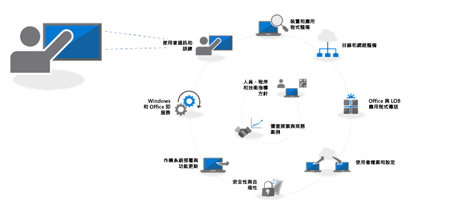
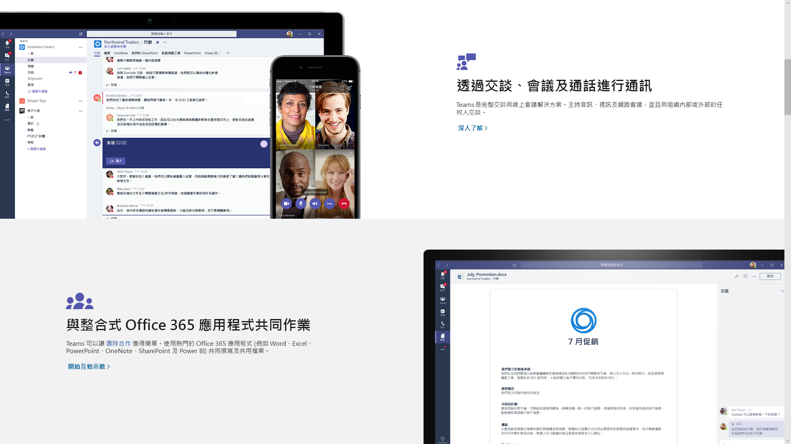
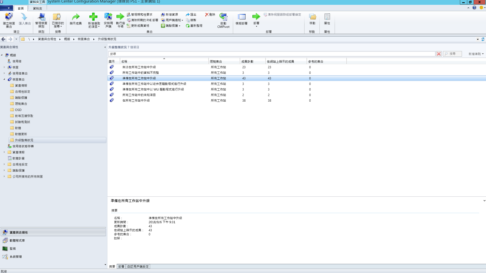

# 步驟 8：使用者的通訊和訓練

<table>
<thead>
<td></td>
<td>
<strong>步驟 8：使用者的通訊和訓練</strong>

將電腦移至 Windows 10 和 Office 365 專業增強版時，請確認使用者了解新版體驗與新的工作方式。了解如何利用 Microsoft FastTrack 的使用者採用協助、訓練教材和通訊範本，以及全新的方式來監控使用者接受及其使用方式。
</td>
<td></td>
</thead>
</table>

>[!NOTE]
>使用者的通訊和訓練是建議的部署程序中第八個步驟，包含祕訣與建議，以告知並為使用者做好準備。 若要查看完整的桌面部署程序，請瀏覽[桌面部署中心](https://aka.ms/HowToShift)。
>

使用 Azure Active Directory 通知並為使用者做好準備迎接現代化工作體驗 (橫跨 Office 365、Windows 10 和新的安全性和相容性控制) 是推動採用的關鍵部分。 此處秘訣是找出介紹更新的方法 -- 某些使用者可能會擔心中斷其生產力或變更工作流程，或必須學習新的項目。

好消息是如果您從 Windows 7 和 Office 2010 或 Office 2013 移動，會有很多人熟悉在個人裝置上執行的 Windows 10 和更新版本 Office，這有助於減少變更的影響。

## 準備好接收新體驗

從 Office 開始，如果您是第一次部署 Office 365 專業增強版，此時您可以傳達登入 Office 應用程式，並將檔案儲存至 OneDrive 或 SharePoint 位置的優點，其可讓使用者更輕鬆地共用、減少檔案分支並啟用即時共同撰寫。

詳細的通訊和訓練範本適用於這些和其他本機或瀏覽器型應用程式，例如 Teams 與 Planner。

我們也提供應用程式中的新功能指導方針，像在 Outlook 中附加 OneDrive 連結的檔案，或在 PowerPoint 中使用新的 Morph 投影片轉換和設計工具功能。

針對 Windows 10，我們協助使用者熟悉選用與預設功能，例如 Windows Hello 使用生物識別技術安全登入、[開始] 更新來個人化您的 Windows 體驗、[時間表] 輕鬆回到先前進行的工作、Cortana 等等。

另有可見的安全性與相容性控制會公開給使用者。Enterprise Mobility + Security 包含 Azure AD 和 Microsoft Intune，其整合了 Windows 10 和 Office 365 其他功能，可用以為電腦升級設定目標。

[Microsoft Enterprise Mobility + Security](https://www.microsoft.com/zh-TW/cloud-platform/enterprise-mobility-security)

比方說，如果您已啟用多重要素驗證，這會使用 Azure AD，並利用電話應用程式或 PIN 以安全地存取服務，藉以保護使用者登入資源。Azure 資訊保護可以方便使用者分類並為文件加上標籤。

[設定 Office 365 使用者的多重要素驗證](https://support.office.com/zh-TW/article/set-up-multi-factor-authentication-for-office-365-users-8f0454b2-f51a-4d9c-bcde-2c48e41621c6)

這些只是使用者會發現的幾個新功能，某些使用者可能會以正面方式或稍不正面的方式意外發現新功能。而這些意外，特別是若其變更了一般的工作流程，可能會導致您或服務台接到更多來電與問題票證。

## 主動準備及測量推出

若要協助降低與使用者體驗變更相關的風險，我們建議兩種互補的方法：

  - 主動告知使用者，讓使用者有正確預期

  - 使用部署週期來控制部署速率

### 階段式部署

使用部署週期的階段式部署，其概念是從小型群組開始，並隨時間以測量的方式擴大部署規模。通常在編寫出通訊和訓練計劃草稿前，這些週期和其成員應已形成。如此一來，您可以減少潛在的風險，並在您持續開啟部署值或視需要暫停活動時驗證您的方法，比方說，當您接到比預期中更多的服務台電話時。

部署週期最適合與業務單位及其管理員一同建立。您將會了解部署或進行變更時要避開的重要日期和時間。若沒有審慎規劃及專案關係人的同意，很難讓使用者上線並輕鬆接受任何變更。

### 階段 1：IT 小組與早期採納者測試人員 

通常最好是從 IT 小組與熱心的早期採用者 (自願進行早期存取者) 開始進行部署。有了這些「測試人員」，您可以測試您的通訊、變更的影響以及通訊和訓練的有效程度。在此階段，IT 會執行小型試驗，了解疑難排解和自動化技術，以在更廣泛部署階段進行協助。

請務必有成員參與初始試驗階段，以確保其記錄觀察並送回程序。此外，除了 IT 小組以外，最好有冠軍可協助延伸新功能的有機口傳通訊，且在稍後階段中若使用者需要協助，他們通常會是第一線的支援。

### 階段 2：試驗 

一旦您滿意第一個階段後，可以針對第二個試驗階段設定更大組的目標使用者。這應包含使用者角色、裝置類型、Windows 應用程式和 Office 增益集的典型組合。從這些群組傳回的資料會透過 Analytics 用來鎖定初始階段 3 更廣泛的部署。

請記住，此階段和未來階段的所有電腦應記錄至 Analytics 服務，您才能收集關於裝置和應用程式健康情況的診斷資料，以及從傳遞最佳化的頻寬節省和 Windows Hello 登入的使用。

此階段特別重要的是傳達變更，並協助使用者充分利用新功能。使用者通常可以取消排列優先順序或忽略電子郵件或來自 IT 的其他通訊，因此這有助於管理，以取得協助傳達變更並提升新工具和技術的採用。

您也需要避開某些時間範圍上的輸入，以將使用者干擾降到最低，例如財務小組可能會在會計季度結尾時特別敏感，或產品開發小組的產品上市階段。

除了裝置、使用者、部門和時間的規劃，您可以開始建立您的通訊和訓練計劃，以及開始編譯內容或吸引外部資源來協助訓練使用者。

#### Microsoft FastTrack 

為了協助您彙整訓練內容，您可以存取一組完整的簡短影片式訓練課程，以及 Microsoft FastTrack 生產力文件庫的逐步說明指引。

[Microsoft FastTrack 生產力文件庫](https://www.microsoft.com/en-us/microsoft-365/success/?rtc=2)

根據對貴組織最重要的項目，有數百個主題，包括：建立更具影響力的內容、共用網站和內容、轉換團隊合作，和使用新型裝置釋放生產力。

此外，如果您使用 Microsoft 365 或 Office 365，很有可能您有資格透過 Microsoft FastTrack 服務來推動使用者採用。代表人員會在您進行 Microsoft 365 (Windows、Office 和 EMS) 推行程序時，逐步引導您採用的最佳做法。

#### Microsoft IT 展示 

Microsoft IT 展示系列也是 Windows 10 部署相關內容很好的資源。其中包括時間表和排程、數位升級範本、電子郵件範本及內部網路內容。以下是根據 Microsoft 自己的 Windows 10 部署所用資料，且已經過修改以供任何組織使用。

[準備您的組織以便進行完美的 Windows 10 部署](https://www.microsoft.com/itshowcase/windows10deployment)

這些元件與服務在試驗階段期間可以進行微調。在您開始了解什麼會與使用者訓練項目共鳴、哪些是透過 Analytics 的目標裝置，以及哪些裝置或使用者群組要避開或延遲，您可以使用資料導向和體驗導向的方法，在稍後階段開始擴大部署。

當試驗展開時，請記錄並發佈常見問題集及自助服務內容，以協助主動減少支援票證及服務台活動。

### 階段 3 及其後：廣泛生產部署 

您到達廣泛部署階段時，您將已精簡程序、通訊、訓練與自助服務工具。 現在，您可以使用所收集的診斷資料將更多電腦設為目標。

以 IT 部門、服務台、使用者和網路容量可管理的速率進行部署。您可以隨時返回部署程序轉輪中的步驟 2，使用對等快取、LEDBAT 及其他技術以進一步最佳化您的網路，有助於更快速地傳輸部署的相關資料。

除了透過分析工具監視的診斷資料，您也可以透過系統管理中心工作負載的詳細使用量報告，以及透過 Power BI 使用系統管理儀表板，以更細微的方式來監視 Office 365 和 Microsoft 365 服務使用量。 這些是很好的工具，當您推行新的共同作業工具 (如 Microsoft Teams) 或共用檔案的新方式 (如 OneDrive) 時，可協助設定及追蹤目標。

新技術的接受與採用會在組織中每部電腦都安裝 Windows 10 和 Office 365 專業增強版後持續進行。若沒有花時間來通知及訓練使用者使用新功能，使用者不一定會變更運作的方式。最後，新的服務模型會在 Windows 進行中的半年排程，或 Office 的每月排程中提供新功能，通訊將會持續進行。

## 上一步 

## [步驟 7：Windows 和 Office 服務](https://aka.ms/mdd7)