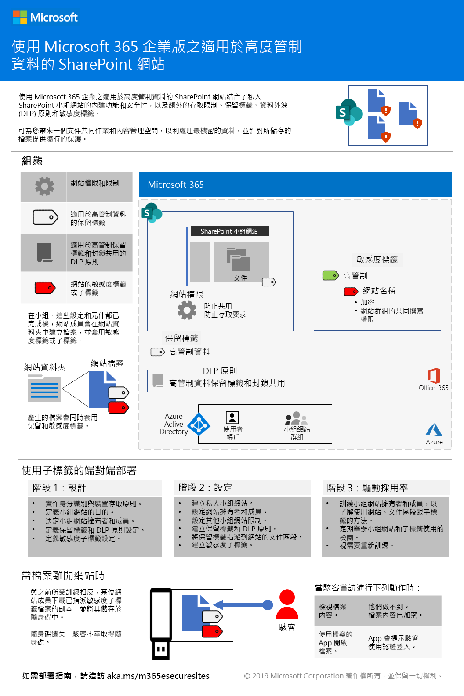
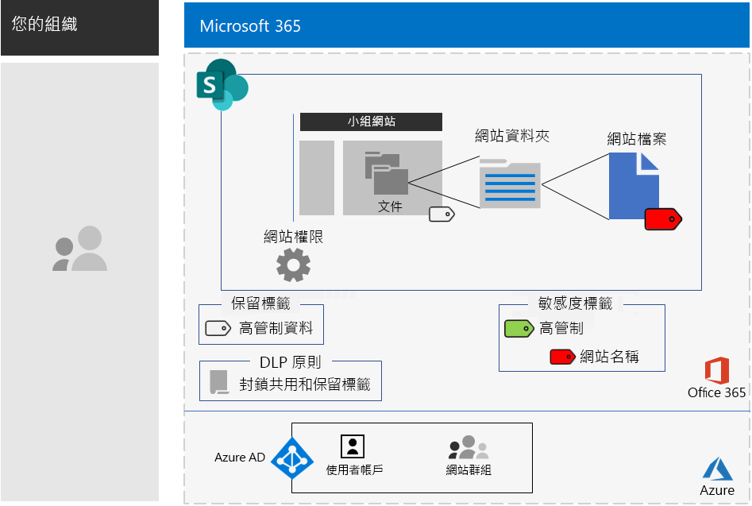

# 適用於高度管制資料的 SharePoint 網站SharePoint sites for highly regulated data

*此案例同時適用於 Microsoft 365 企業版 E3 和 E5 版本**This scenario applies to both the E3 and E5 versions of Microsoft 365 Enterprise*

Microsoft 365 企業版包含一套完整的雲端式服務，因此您可以建立、儲存、保護和管理檔案中儲存的高度管制資料。包含的資料為：Microsoft 365 Enterprise includes a full suite of cloud-based services so that you can create, store, secure, and manage your highly regulated data stored in files. This includes data that is:

- 受限於區域法規。Subject to regional regulations.
- 貴組織最有價值的資料，例如營業秘密、財務或人力資源資訊，以及組織策略。The most valuable data for your organization, such as trade secrets, financial or human resources information, and organization strategy.

>[!Note]
> 使用 Microsoft Teams 的類似案例[在此](secure-teams-highly-regulated-data-scenario.md)。A similar scenario using Microsoft Teams is [here](secure-teams-highly-regulated-data-scenario.md).
>

符合此商務需求的 Microsoft 365 企業版雲端式案例需要您：A Microsoft 365 Enterprise cloud-based scenario that meets this business need requires that you:

- 在 SharePoint 小組網站中儲存檔案 (文件、投影片檔案、試算表等)。Store files (documents, slide decks, spreadsheets, etc.) in a SharePoint team site.
- 鎖定網站，以防止：Lock down the site to prevent:
  - 非網站的 Office 365 群組成員的使用者存取。Access to users who are not members of the Office 365 group for the site.
  - 網站成員將存取權授與其他使用者。Members of the site from granting access to others.
  - 非網站成員要求網站的存取權。Non-members of the site from requesting access to the site.
- 為 SharePoint 網站設定 Office 365 保留標籤，作為防止使用者在組織外部傳送檔案的預設方法。Configure an Office 365 retention label for your SharePoint sites as a default way to block users from sending files outside the organization.
- 使用隨檔案一起移動的加密來加密網站中最敏感的檔案。Encrypt the most sensitive files of the site with encryption that travels with the file.
- 將權限新增至最敏感的檔案，以致於雖然是在網站外部共用這些檔案，開啟檔案時仍然需要具有權限之使用者帳戶的有效認證。Add permissions to the most sensitive files so that if even if they get shared outside of the site, opening the file still requires the valid credentials of a user account that has permission.

下表將此案例的需求對應至 Microsoft 365 企業版的功能。The following table maps the requirements of this scenario to a feature of Microsoft 365 Enterprise.

|||
|:-------|:-----|
| **需求****Requirement** | **Microsoft 365 企業版功能****Microsoft 365 Enterprise feature** |
| 儲存檔案Store files | SharePoint 小組網站SharePoint team sites |
| 鎖定網站Lock down the site | Office 365 群組和 SharePoint 小組網站的權限Office 365 groups and SharePoint team site permissions |
| 為網站上的檔案新增標籤Label the files of the site | Office 365 保留標籤Office 365 retention labels |
| 將檔案傳送到組織外部時封鎖使用者Block users when sending files outside the organization | Office 365 中的資料外洩防護 (DLP) 原則Data Loss Prevention (DLP) policies in Office 365 |
| 加密網站上的所有檔案Encrypt all of the files of the site | Office 365 敏感度標籤或子標籤Office 365 sensitivity labels or sublabels |
| 新增權限至網站的檔案Add permissions to the files of the site | Office 365 敏感度標籤或子標籤Office 365 sensitivity labels or sublabels |
|||

以下是安全 SharePoint 網站的設定範例。Here is an example configuration for a secure SharePoint site.

此案例需要您已部署：This scenario requires that you have already deployed:

- 基礎結構的[身分識別](identity-infrastructure.md)階段及[資訊保護](infoprotect-infrastructure.md)階段的步驟 1 和 2。The [Identity](identity-infrastructure.md) phase and steps 1 and 2 of the [Information protection](infoprotect-infrastructure.md) phase of the foundation infrastructure. 
- [SharePoint](sharepoint-online-onedrive-workload.md)。[SharePoint](sharepoint-online-onedrive-workload.md).

下列階段會逐步帶您針對適用於高度管制資料的 SharePoint 網站，進行設計、設定及推動採用。The following phases step you through designing, configuring, and driving adoption for SharePoint sites for highly regulated data.

 如需此案例的 1 頁式摘要，請參閱[適用於高度管制資料的 SharePoint 網站海報](../media/teams-sharepoint-online-sites-highly-regulated-data/SharePointSitesHighlyRegulatedData.pdf)。For a 1-page summary of this scenario, see the [SharePoint sites for highly regulated data poster](../media/teams-sharepoint-online-sites-highly-regulated-data/SharePointSitesHighlyRegulatedData.pdf).

您也可以用 [PDF](https://github.com/MicrosoftDocs/microsoft-365-docs/raw/public/microsoft-365/enterprise/media/teams-sharepoint-online-sites-highly-regulated-data/SharePointSitesHighlyRegulatedData.pdf) 或 [PowerPoint](https://github.com/MicrosoftDocs/microsoft-365-docs/raw/public/microsoft-365/enterprise/media/teams-sharepoint-online-sites-highly-regulated-data/SharePoint-Sites-Highly-Regulated-Data.pptx) 格式下載此海報，以及用 Letter、Legal 或 Tabloid (11 x 17) 大小的紙張列印此海報。You can also download this poster in [PDF](https://github.com/MicrosoftDocs/microsoft-365-docs/raw/public/microsoft-365/enterprise/media/teams-sharepoint-online-sites-highly-regulated-data/SharePointSitesHighlyRegulatedData.pdf) or [PowerPoint](https://github.com/MicrosoftDocs/microsoft-365-docs/raw/public/microsoft-365/enterprise/media/teams-sharepoint-online-sites-highly-regulated-data/SharePoint-Sites-Highly-Regulated-Data.pptx) formats and print it on letter, legal, or tabloid (11 x 17)-sized paper.

## 身分識別與裝置存取必要條件Identity and device access prerequisites

若要保護 SharePoint 網站的存取權，請確定您已設定[身分識別與裝置存取原則](identity-access-policies.md)和[建議的 SharePoint 存取原則](sharepoint-file-access-policies.md)。To protect access to the SharePoint site, ensure that you have configured [identity and device access policies](identity-access-policies.md) and the [recommended SharePoint access policies](sharepoint-file-access-policies.md).

## 階段 1：設計Phase 1: Design

若為高度管制的資料建立 SharePoint 網站，您必須先確定網站的目的。To create a SharePoint site for highly regulated data, you must first identify its purpose. 例如，製造業組織的研發部門需要 SharePoint 網站來儲存現有產品的目前設計規格，以及在新產品上共同作業。For example, the research and development department of a manufacturing organization needs a SharePoint site to store current design specifications for existing products and a place to collaborate on new products. 只有研發部門和選取的主管成員才允許存取網站。Only members of the Research & Development department and selected executives will be allowed to access the site.

該目的會驅使基本組態項目的決定，例如：That purpose will drive the determination of essential configuration items such as:

- 要指派至網站的文件部分以及標籤的 DLP 原則集合的 Office 365 保留標籤The Office 365 retention label to assign to the Documents portion of the site and DLP policies for the label
- Office 365 敏感度子標籤的設定，可讓使用者套用到儲存在網站中的高度敏感檔案The settings of an Office 365 sensitivity sublabel that users apply to highly sensitive files stored in the site

決定後，您就能使用這些設定在階段 2 中設定網站。Once determined, you use these settings to configure the site in Phase 2. 

### 步驟 1：Office 365 保留標籤和 DLP 原則Step 1 Office 365 retention labels and DLP policies

當套用至 SharePoint 小組網站的文件部分時，Office 365 保留標籤提供預設方法，來分類儲存在網站上的所有檔案。When applied to the Documents portion of a SharePoint team site, Office 365 retention labels provide a default method of classifying all files stored on the site.
 
針對適用於高度管制資料的 SharePoint 網站，您必須決定要使用哪個 Office 365 保留標籤。For SharePoint sites for highly regulated data, you need to determine which Office 365 retention label to use.

如需 Office 365 標籤的設計考量，請參閱 [Office 365 分類和標籤](https://docs.microsoft.com/office365/securitycompliance/secure-sharepoint-online-sites-and-files#office-365-retention-labels)。For the design considerations of Office 365 labels, see [Office 365 classification and labels](https://docs.microsoft.com/office365/securitycompliance/secure-sharepoint-online-sites-and-files#office-365-retention-labels).

若要保護機密資訊並防止意外或故意洩露，您可以使用 DLP 原則。如需詳細資訊，請參閱[概觀](https://docs.microsoft.com/office365/securitycompliance/data-loss-prevention-policies)。To protect sensitive information and prevent its accidental or intentional disclosure, you use DLP policies. For more information, see this [overview](https://docs.microsoft.com/office365/securitycompliance/data-loss-prevention-policies).

針對 SharePoint 網站，您必須針對指派至網站的 Office 365 保留標籤設定 DLP 原則，以在使用者嘗試與外部使用者共用檔案時，封鎖使用者。For SharePoint sites, you must configure a DLP policy for the Office 365 retention label assigned to the site to block users when they attempt to share files with external users. 

### 步驟 2：您的 Office 365 敏感度子標籤Step 2: Your Office 365 sensitivity sublabel

若要將加密和權限集提供給最敏感的檔案，使用者必須套用 Office 365 敏感度標籤和子標籤。To provide encryption and a set of permissions to your most sensitive files, users must apply an Office 365 sensitivity label or sublabel. 子標籤位於現有標籤下方。A sublabel exists under an existing label. 

當您的需求是少量標籤、可同時用於全域使用和個別的私人小組時，請使用敏感度標籤。Use a sensitivity label when you need is a small number of labels for both global use and individual private teams. 當您有大量標籤或想要將安全網站的標籤整理在您的高度管制標籤之下時，請使用敏感度子標籤。Use a sensitivity sublabel when you have a large number of labels or want to organize labels for secure sites the under your highly regulated label. 

所套用的標籤或子標籤設定會隨著檔案移動。The settings of the applied label or sublabel travel with the file. 即使檔案流出網站外部，也只有擁有權限的已驗證使用者帳戶能開啟檔案。Even if it is leaked outside the site, only authenticated user accounts that have permissions can open it.

### 設計結果Design results

您已決定下列項目：You have determined the following:

- 適當的 Office 365 保留標籤和與標籤相關聯的 DLP 原則The appropriate Office 365 retention label and the DLP policy that is associated with the label
- 包含加密和權限的 Office 365 敏感度子標籤設定The settings of the Office 365 sensitivity sublabel that include encryption and permissions

## 階段 2：設定Phase 2: Configure

在這個階段中，您會採用在階段 1 中決定的設定，然後實作這些設定來建立適用於高度管制資料的 SharePoint 網站。In this phase, you take the settings determined in Phase 1 and implement them to create a SharePoint site for highly regulated data.

### 步驟 1：使用對應 Office 365 群組的擁有者和成員來建立私人 SharePoint 小組網站Step 1: Create a private SharePoint team site with owners and members of the corresponding Office 365 group

按照[以下指示]( https://support.office.com/article/create-a-site-in-sharepoint-online-4d1e11bf-8ddc-499d-b889-2b48d10b1ce8)來建立私人 SharePoint 小組網站。Follow [these instructions]( https://support.office.com/article/create-a-site-in-sharepoint-online-4d1e11bf-8ddc-499d-b889-2b48d10b1ce8) to create a private SharePoint team site.

### 步驟 2：為 SharePoint 小組網站設定額外的權限設定Step 2: Configure additional permissions settings for the SharePoint team site

從 SharePoint 網站設定這些權限設定。From the SharePoint site, configure these permission settings.

1. 在工具列中，按一下設定圖示，然後按一下 [網站權限]\*\*\*\*。In the tool bar, click the settings icon, and then click **Site permissions**.
2. 在 [網站權限]\*\*\*\* 窗格的 [共用設定]\*\*\*\* 之下，按一下 [變更共用設定]\*\*\*\*。In the **Site permissions** pane, under **Sharing Settings**, click **Change sharing settings**.
3. 在 [共用權限]\*\*\*\* 之下，選擇 [只有網站擁有者可以共用檔案、資料夾及網站]\*\*\*\*。Under **Sharing permissions**, choose **Only site owners can share files, folders, and the site**.
4. 關閉 [允許存取要求]\*\*\*\*，然後按一下 [儲存]\*\*\*\*。Turn off **Allow access requests**, and then click **Save**.

清除這些設定後，網站群組成員與其他成員或非成員要求網站存取權以共用網站的功能將會停用。With these settings, the ability for site group members to share the site with other members or for non-members to request access to the site is disabled.

### 步驟 3：針對 Office 365 保留標籤設定網站Step 3: Configure the site for an Office 365 retention label

使用[使用 Office 365 標籤與 DLP 來保護 SharePoint 檔案](https://docs.microsoft.com/office365/enterprise/protect-sharepoint-online-files-with-office-365-labels-and-dlp)中的指示來：Use the instructions in [Protect SharePoint files with Office 365 labels and DLP](https://docs.microsoft.com/office365/enterprise/protect-sharepoint-online-files-with-office-365-labels-and-dlp) to:

1. 建立並發布適用於高度管制資料的保留標籤 (如有需要)。Create and publish a retention label for highly regulated data (if needed).
2. 針對步驟 1 中建立的保留標籤設定網站。Configure the site for the retention label created in step 1.
3. 為使用在步驟 2 中建立的保留標籤的高度管制資料建立 DLP 原則，並封鎖使用者在組織外傳送檔案Create a DLP policy for highly regulated data that uses the retention label created in step 2 and blocks users from sending files outside the organization

#### 步驟 4：為網站建立 Office 365 敏感度子標籤Step 4: Create an Office 365 sensitivity sublabel for the site

適用於高度管制資料的敏感度標籤可讓任何人套用至任何檔案，但是安全網站不同，它需要自己的子標籤，以致於指派子標籤的檔案都能：Unlike a sensitivity label for highly regulated data that anyone can apply to any file, a secure site needs its own sublabel so that files with the sublabel assigned:

- 受到加密，且加密會隨檔案移動。Are encrypted and the encryption travels with the file.
- 包含自訂權限，因此只有網站群組的成員能夠開啟檔案。Contain custom permissions so that only members of the site group can open it.

若要針對儲存在網站中的檔案完成這項額外的安全性，您必須針對高度管制檔案設定一個新的敏感度標籤或一般標籤的子標籤。To accomplish this additional level of security for files stored in the site, you must configure a new sensitivity label or a sublabel of the general label for highly regulated files. 只有網站的群組成員能在高度管制標籤的子標籤清單中看到該網站。Only group members for the site will see it in the list of sublabels for the highly regulated label.

使用[這裡](https://docs.microsoft.com/microsoft-365/compliance/encryption-sensitivity-labels)的指示來為高度管制檔案所使用的標籤設定標籤或子標籤，其設定如下：Use the instructions [here](https://docs.microsoft.com/microsoft-365/compliance/encryption-sensitivity-labels) to configure a label or a sublabel of the label you are using for highly regulated files with the following settings:

- 標籤或子標籤的名稱包含網站名稱，以便在將標籤或子標籤指派到檔案時輕鬆建立關聯。The name of the label or sublabel contains the name of the site for easy association when assigning the label or sublabel to a file.
- 啟用加密。Encryption is enabled.
- 網站群組具有共同撰寫權限。The site group has Co-Author permissions.

### 設定結果Configuration results

您已設定下列項目：You have configured the following:

- SharePoint 網站上的其他限制權限設定More restrictive permission settings on the SharePoint site
- 指派給 SharePoint 網站文件部分的 Office 365 保留標籤An Office 365 retention label assigned to the Documents portion of the SharePoint site
- Office 365 保留標籤的 DLP 原則A DLP policy for the Office 365 retention label
- 使用者可將 Office 365 敏感度標籤或子標籤套用到儲存在網站中的最敏感檔案，其會加密檔案並只允許小組網站群組的成員擁有共同撰寫存取權An Office 365 sensitivity label or sublabel that users can apply to the most sensitive files stored in the site, which encrypts the file and only allows Co-Author access for members of the team site group 

以下是使用高度管制標籤的子標籤所產生的設定。Here is the resulting configuration that uses a sublabel of the Highly regulated label.

以下是使用者將子標籤套用至儲存在網站中的檔案的範例。Here is an example of a user that has applied the sublabel to a file stored in the site.

## 階段 3：推動使用者採用Phase 3: Drive user adoption

如果一直將適用於高度管制資料的 SharePoint 網站用於儲存和存取敏感檔案，則 SharePoint 網站只能保護資料。A SharePoint site for highly regulated data can only protect that data if it is consistently used for storage and access of sensitive files. 這是最難的階段，因為這有賴於使用者變更習慣和偏好。This is the hardest phase because it relies on users changing their habits and preferences. 

例如，員工以前都習慣將敏感檔案儲存在 USB 磁碟或個人雲端式儲存解決方案，而現在必須將檔案單獨儲存在適用於高度管制資料的 SharePoint 網站。For example, employees that are used to storing sensitive files on USB drives or on personal cloud-based storage solutions will now have to store them exclusively in a SharePoint site for highly regulated data.

### 步驟 1：訓練您的使用者Step 1: Train your users

完成您的設定之後，請訓練一組使用者，這些使用者是網站成員：After completing your configuration, train the set of users who are members of the site:

- 了解使用新網站來保護有價值檔案的重要性以及高度管制資料外洩的後果，例如法律後果、法規罰款、勒索軟體或喪失競爭優勢。On the importance of using the new site to protect valuable files and the consequences of a highly regulated data leak, such as legal ramifications, regulatory fines, ransomware, or loss of competitive advantage.
- 如何存取網站及其檔案。How to access the site and its files.
- 如何在網站上建立新檔案，以及上傳儲存在本機的新檔案。How to create new files on the site and upload new files stored locally.
- DLP 原則如何封鎖他們免於在外部共用檔案。How the DLP policy blocks them from sharing files externally.
- 如何使用網站的標籤或子標籤來標記最敏感的檔案。How to label the most sensitive files with the label or sublabel for the site.
- 標籤或子標籤如何保護檔案，即使該檔案從網站外洩。How the label or sublabel protects a file even when it is leaked off the site.

此訓練應該包含實際操作練習，讓使用者可以體驗這些作業及其結果。This training should include hands-on exercises so that the users can experience these operations and their results.

### 步驟 2：進行使用量和檔案的定期檢閱Step 2: Conduct periodic reviews of usage and files

在幾週的訓練之後，SharePoint 網站的 SharePoint 系統管理員可以：In the weeks after training, the SharePoint administrator for the SharePoint site can:

- 分析網站的使用方式，並且與預期使用方式進行比較。Analyze usage for the site and compare it with usage expectations.
- 確認已使用敏感度標籤或子標籤正確地標示高度敏感檔案。Verify that highly sensitive files have been properly labeled with the sensitivity label or sublabel.

  您可以在 SharePoint 檢視資料夾，然後透過 [新增欄]\*\*\*\* 的 [顯示/隱藏欄]\*\*\*\* 選項新增 [敏感度]\*\*\*\* 欄，查看哪些檔案有被指派標籤。You can see which files have a label assigned by viewing a folder in SharePoint and adding the **Sensitivity** column through the **Show/hide columns** option of **Add column**.

視需要重新訓練您的使用者。Retrain your users as needed.

### 使用者採用結果User adoption results

高度管制的檔案會單獨儲存在適用於高度管制資料的 SharePoint 網站上，且最敏感的檔案已套用網站的敏感度標籤或子標籤。Highly regulated files are stored exclusively on SharePoint sites for highly regulated data and the most sensitive files have the sensitivity label or sublabel for the site applied.

## Contoso Corporation 如何對高度管制的資料使用 SharePoint 網站How the Contoso Corporation used a SharePoint site for highly regulated data

Contoso Corporation 是虛構但具代表性的全球製造業集團。The Contoso Corporation is a fictional but representative global manufacturing conglomerate. 查看 Contoso 如何設計、設定，然後為其在巴黎、莫斯科、紐約、北京和班加羅爾的研究小組推動採用[安全的 SharePoint 網站](contoso-sharepoint-online-site-for-highly-confidential-assets.md)。See how Contoso designed, configured, and then drove the adoption of a [secure SharePoint site](contoso-sharepoint-online-site-for-highly-confidential-assets.md) for their research teams in Paris, Moscow, New York, Beijing, and Bangalore. 

## 另請參閱See also

[適用於高度管制資料的 Microsoft TeamsTeams for highly regulated data](secure-teams-highly-regulated-data-scenario.md)

[Microsoft 365 企業版工作負載和案例Microsoft 365 Enterprise workloads and scenarios](deploy-workloads.md)

[Microsoft 365 生產力資源庫](https://aka.ms/productivitylibrary)https://aka.ms/productivitylibrary)[Microsoft 365 Productivity Library](https://aka.ms/productivitylibrary) (https://aka.ms/productivitylibrary)

[部署指南Deployment guide](deploy-microsoft-365-enterprise.md)
