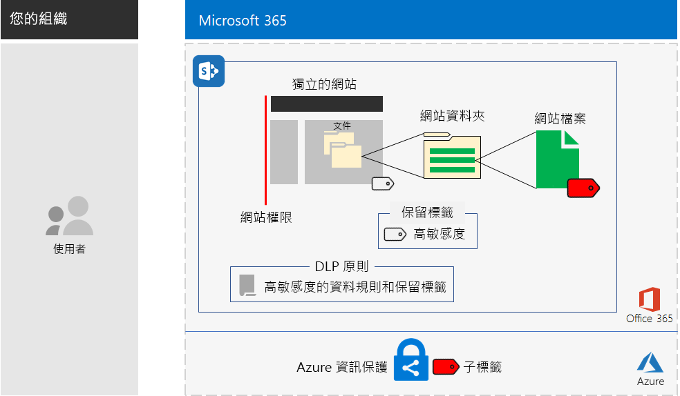
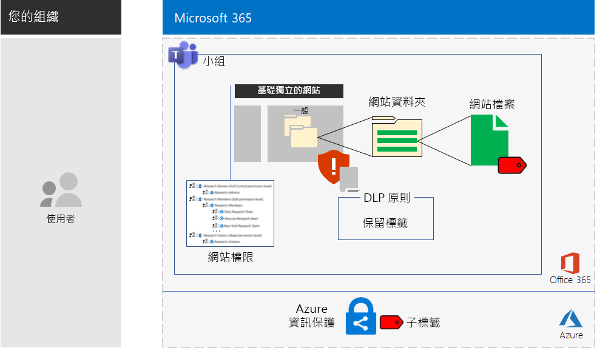

# 適用於高管制資料的 Microsoft Teams 和 SharePoint Online 網站Microsoft Teams and SharePoint Online sites for highly regulated data

*此案例同時適用於 Microsoft 365 企業版 E3 和 E5 版本**This scenario applies to both the E3 and E5 versions of Microsoft 365 Enterprise*

Microsoft 365 企業版包含一套完整的雲端式服務，因此您可以建立、儲存和保護高管制資料。包含的資料為：Microsoft 365 Enterprise includes a full suite of cloud-based services so that you can create, store, and secure your highly regulated data. This includes data that is:

- 受限於區域法規。Subject to regional regulations.
- 貴組織最有價值的資料，例如營業秘密、財務或人力資源資訊，以及組織策略。The most valuable data for your organization, such as trade secrets, financial or human resources information, and organization strategy.

符合此商務需求的 Microsoft 365 企業版雲端式案例需要您：A Microsoft 365 Enterprise cloud-based solution that meets this business need requires that you:

- 將數位資產 (文件、投影片組、試算表等等) 儲存在 SharePoint Online 小組網站或 Microsoft Teams 小組的 [檔案]\*\*\*\* 索引標籤中。Store digital assets (documents, slide decks, spreadsheets, etc.) in a SharePoint Online team site or in the **Files** tab of a Microsoft Teams team.
- 鎖定網站或小組，以防止：Lock down the site or team to prevent:
   - 透過群組成員資格僅存取一組特定的使用者帳戶，這包含可以用哪個權限等級存取 SharePoint Online 小組網站的使用者，以及可以進行管理的使用者。Access to only a specific set of user accounts through group membership, which includes those who can access the SharePoint Online team site and at what level of permission, and those who can administer it.
   - 網站成員將存取權授與其他使用者。Members of the site from granting access to others.
   - 非網站成員要求網站的存取權。Non-members of the site from requesting access to the site.
- 為您的 SharePoint Online 網站或小組設定 Office 365 保留標籤，作為在網站或小組中的文件上定義保留原則的預設方法。Configure an Office 365 retention label for your SharePoint Online sites or teams as a default way to define retention policies on the documents in the site or team.
- 防止使用者將檔案傳送到組織外部。Block users from sending files outside the organization.
- 加密網站或小組上最機密的數位資產。Encrypt the most sensitive digital assets of the site or team.
- 新增權限至最機密的數位資產，即使這些資產在網站外部共用，開啟資產時仍然需要具有權限之使用者帳戶的有效認證。Add permissions to the most sensitive digital assets so that if even if they get shared outside of the site, opening the asset still requires the valid credentials of a user account that has permission.

下表將此案例的需求對應至 Microsoft 365 企業版的功能。The following table maps the requirements of this solution to a feature of Microsoft 365 Enterprise.

|||
|:-------|:-----|
| **需求****Requirement** | **Microsoft 365 企業版功能****Microsoft 365 Enterprise feature** |
| 儲存數位資產Store digital assets | SharePoint Online 小組網站和 Office 365 中的小組SharePoint Online team sites and teams in Office 365 |
| 鎖定網站Lock down the site | Azure AD 群組和 SharePoint Online 小組網站權限Azure AD groups and SharePoint Online team site permissions |
| 標示網站的數位資產Label the digital assets of the site | Office 365 保留標籤Office 365 retention labels |
| 將檔案傳送到組織外部時封鎖使用者Block users when sending files outside the organization | Office 365 中的資料外洩防護 (DLP) 原則Data Loss Prevention (DLP) policies in Office 365 |
| 加密網站的所有數位資產Encrypt all of the digital assets of the site | Enterprise Mobility + Security (EMS) 中的 Azure 資訊保護子標籤Azure Information Protection sub-labels in Enterprise Mobility + Security (EMS) |
| 新增權限至網站的數位資產Add permissions to the digital assets of the site | EMS 中的 Azure 資訊保護子標籤Azure Information Protection sub-labels in EMS |
|||

以下是 SharePoint Online 網站的組態。Here is the configuration for a SharePoint Online site.

此案例需要您已部署：This solution requires that you have already deployed:

- 基礎結構的[身分識別](identity-infrastructure.md)階段及[資訊保護](infoprotect-infrastructure.md)階段的步驟 1 和 2。The [Identity](identity-infrastructure.md) phase and steps 1 and 2 of the [Information protection](infoprotect-infrastructure.md) phase of the foundation infrastructure. 
- 針對 SharePoint Online 小組網站中的高管制資料，部署 [SharePoint Online](sharepoint-online-onedrive-workload.md)。For highly regulated data in SharePoint Online team sites, [SharePoint Online](sharepoint-online-onedrive-workload.md).
- 針對 Microsoft Teams 小組中的高管制資料，部署 [Microsoft Teams](teams-workload.md)。For highly regulated data in Microsoft Teams teams, [Microsoft Teams](teams-workload.md).

下列階段會逐步帶您針對適用於高管制資料的 SharePoint Online 網站和小組，進行設計、設定及推動採用。The following phases step you through the design, configuration, and driving adoption for SharePoint Online sites and teams for highly regulated data.

若要查看 Contoso Corporation (虛構但有代表性的跨國企業) 如何為其研究小組設計 SharePoint Online 網站，請參閱[範例設定](contoso-sharepoint-online-site-for-highly-confidential-assets.md)。To see how the Contoso Corporation, a fictional but representative multi-national organization, designed a SharePoint Online site for its research teams, see this [example configuration](contoso-sharepoint-online-site-for-highly-confidential-assets.md).

高管制資料的小組需要您先建立適用於高管制資料的 SharePoint Online 小組網站。然後建立新的小組，該小組使用 SharePoint Online 小組網站的 Office 365 群組。如需詳細資訊，請參閱階段 2，步驟 4。A team for highly regulated data requires that you first create a SharePoint Online team site for highly regulated data. You then create a new team that uses the Office 365 group of the SharePoint Online team site. See Phase 2, Step 4 for more information.

以下是小組的組態。Here is the configuration for a team.

## 身分識別與裝置存取必要條件Identity and device access prerequisites

若要保護小組或 SharePoint Online 網站的存取權，請確定您已設定[身分識別與裝置存取原則](identity-access-policies.md)和[建議的 SharePoint Online 存取原則](sharepoint-file-access-policies.md)。To protect access to the team or SharePoint Online site, ensure that you have configured [identity and device access policies](identity-access-policies.md) and the [recommended SharePoint Online access policies](sharepoint-file-access-policies.md).

## 階段 1：設計Phase 1: Design

若要建立適用於高管制資料的 SharePoint Online 網站或小組，您必須先識別其目的。例如，製造業組織的研究和開發部門需要 SharePoint Online 網站來儲存現有產品的目前設計規格，以及一個為新產品共同作業的地方。只有研究和開發部門的成員和選取的管理階層人員可以存取網站。To create a SharePoint Online site or team for highly regulated data, you must first identify its purpose. For example, the research and development department of a manufacturing organization needs a SharePoint Online site to store current design specifications for existing products and a place to collaborate on new products. Only members of the Research & Development department and selected executives will be allowed to access the site.

該目的會驅使基本組態項目的決定，例如：That purpose will drive the determination of essential configuration items such as:

- SharePoint Online 權限集和 SharePoint 群組的集合The set of SharePoint Online permission sets and SharePoint groups
- 存取群組的集合，要新增至 SharePoint 群組的 Azure AD 安全性群組及其成員The set of access groups, the Azure AD security groups and their members to add to the SharePoint groups
- 要指派至網站和標籤的 DLP 原則集合的 Office 365 保留標籤The Office 365 retention label to assign to the site and the set of DLP policies for the label
- Azure 資訊保護子標籤的設定，使用者會將其套用至網站中的高度機密數位資產The settings of an Azure Information Protection sub-label that users apply to highly sensitive digital assets stored in the site

一旦決定，您會使用這些設定在階段 2 中設定網站。Once determined, you use these settings to configure the site in Phase 2. 

### 步驟 1：隔離的 SharePoint Online 網站Step 1: An isolated SharePoint Online site

鎖定版本的 SharePoint Online 小組網站也稱為隔離的網站。與私人小組網站的預設設定不同，隔離的網站是設定來防止：The locked-down version of a SharePoint Online team site is known as an isolated site. Unlike the default settings of private team sites, isolated sites are configured to prevent:

- 非指定群組成員的存取。Access to those who are not members of specified groups.
- 要求存取。The requesting of access.
- 指定群組目前成員未經授權授與存取權。The unauthorized granting of access by current members of specified groups.
- 存取群組成員對網站進行系統管理。Administration of the site by access group members.

包含高管制資產之 SharePoint Online 小組網站的安全性不會變更，除非是由網站的 SharePoint 系統管理員執行。The security of SharePoint Online team sites that contain highly regulated assets do not change unless done by a SharePoint administrator for the site.

請參閱[設計隔離的 SharePoint Online 小組網站](https://docs.microsoft.com/office365/enterprise/design-an-isolated-sharepoint-online-team-site)，以取得決定權限等級、SharePoint 群組、存取群組與群組成員集合的詳細資料。See [Design an isolated SharePoint Online team site](https://docs.microsoft.com/office365/enterprise/design-an-isolated-sharepoint-online-team-site) for the details to determine the set of permission levels, SharePoint groups, access groups, and group members.

### 步驟 2：Office 365 保留標籤和 DLP 原則Step 2: Office 365 retention labels and DLP policies

當套用至 SharePoint Online 小組網站時，Office 365 保留標籤提供預設方法，來分類儲存在網站上的所有數位資產。When applied to a SharePoint Online team site, Office 365 retention labels provide a default method of classifying all digital assets stored on the site.
 
針對適用於高管制資料的 SharePoint Online 網站，您必須決定要使用哪個 Office 365 保留標籤。For SharePoint Online sites for highly regulated data, you need to determine which Office 365 retention label to use.

如需 Office 365 標籤的設計考量，請參閱 [Office 365 分類和標籤](https://docs.microsoft.com/office365/securitycompliance/secure-sharepoint-online-sites-and-files#office-365-retention-labels)。For the design considerations of Office 365 labels, see [Office 365 classification and labels](https://docs.microsoft.com/office365/securitycompliance/secure-sharepoint-online-sites-and-files#office-365-retention-labels).

若要保護機密資訊並防止意外或故意洩露，您可以使用 DLP 原則。如需詳細資訊，請參閱[概觀](https://docs.microsoft.com/office365/securitycompliance/data-loss-prevention-policies)。To protect sensitive information and prevent its accidental or intentional disclosure, you use DLP policies. For more information, see this [overview](https://docs.microsoft.com/office365/securitycompliance/data-loss-prevention-policies).

針對適用於高管制資料的 SharePoint Online 網站，您必須針對指派至網站的 Office 365 保留標籤設定 DLP 原則，以在使用者嘗試與外部使用者共用數位資產時，封鎖使用者。For SharePoint Online sites for highly regulated data, you must configure a DLP policy for the Office 365 retention label assigned to the site to block users when they attempt to share digital assets with external users. 

### 步驟 3：您的 Azure 資訊保護子標籤Step 3: Your Azure Information Protection sub-label

若要為最機密的數位資產提供加密和權限集，使用者必須使用 Azure 資訊保護用戶端來套用 Azure 資訊保護標籤。若要針對適用於高管制資料的 SharePoint Online 網站使用 Azure 資訊保護標籤，您必須在有範圍的原則中設定 Azure 資訊保護子標籤。To provide encryption and a set of permissions to your most sensitive digital assets, users must apply an Azure Information Protection label using the Azure Information Protection client. To use Azure Information Protection labels for SharePoint Online sites for highly regulated data, you must configure an Azure Information Protection sub-label in a scoped policy. 

子標籤存在於現有標籤底下。例如，您可以在「高度機密」標籤底下建立「研究和開發」子標籤。有範圍的原則是僅套用至使用者子集的原則。針對適用於高管制資料的 SharePoint Online 網站，範圍是屬於網站存取群組成員的使用者集合。A sub-label exists under an existing label. For example, you can create a Research & Development sub-label under the Highly Confidential label. A scoped policy is one that applies only to a subset of users. For SharePoint Online sites for highly regulated data, the scope is the set of users that are members of the access groups for the site.

已套用子標籤的設定會隨著資產移動。即使它已下載並且在網站外部共用，只有經過驗證的使用者帳戶有權可以開啟它。The settings of the applied sub-label travel with the asset. Even if it is downloaded and shared outside the site, only authenticated user accounts that have permissions can open it.

### 設計結果Design results

您已決定下列項目：You have determined the following:

- SharePoint 群組和權限等級的集合The set of SharePoint groups and permission levels
- 存取群組和每個權限等級之成員的集合The set of access groups and their members for each permission level
- 適當的 Office 365 保留標籤和與標籤相關聯的 DLP 原則The appropriate Office 365 retention label and the DLP policy that is associated with the label
- 包含加密和權限的 Azure 資訊保護子標籤設定The settings of the Azure Information Protection sub-label that include encryption and permissions

## 階段 2：設定Phase 2: Configure

在這個階段中，您採用在階段 1 中決定的設定，然後實作以建立適用於高管制資料的 SharePoint Online 網站。In this phase, you take the settings determined in Phase 1 and implement them to create a SharePoint Online site for highly regulated data.

### 步驟 1：建立及設定隔離的 SharePoint Online 小組網站Step 1: Create and configure an isolated SharePoint Online team site

使用[部署隔離的 SharePoint Online 小組網站](https://docs.microsoft.com/office365/enterprise/deploy-an-isolated-sharepoint-online-team-site) 中的指示：Use the instructions in [Deploy an isolated SharePoint Online team site](https://docs.microsoft.com/office365/enterprise/deploy-an-isolated-sharepoint-online-team-site) to:

- 針對在網站上使用的每個 SharePoint 權限等級，建立及填入存取群組。Create and populate the access groups for each SharePoint permission level used on the site.
- 建立及設定隔離的小組網站。Create and configure the isolated team site.

### 步驟 2：針對 Office 365 保留標籤設定網站Step 2: Configure the site for an Office 365 retention label DLP policy

使用[使用 Office 365 標籤與 DLP 來保護 SharePoint Online 檔案](https://docs.microsoft.com/office365/enterprise/protect-sharepoint-online-files-with-office-365-labels-and-dlp)中的指示來：Use the instructions in [Protect SharePoint Online files with Office 365 labels and DLP](https://docs.microsoft.com/office365/enterprise/protect-sharepoint-online-files-with-office-365-labels-and-dlp) to:

- 識別或建立 Office 365 保留標籤，並且將其套用至隔離的 SharePoint Online 網站。Identify or create the Office 365 retention label and apply it to your isolated SharePoint Online site.
- 建立及設定 DLP 原則，該原則會在使用者嘗試在組織外部共用 SharePoint Online 網站上的數位資產時，封鎖使用者。Create and configure the DLP policy that blocks users when they attempt to share a digital asset on your SharePoint Online site outside the organization.

### 步驟 3：針對網站建立 Azure 資訊保護子標籤Step 3: Create an Azure Information Protection sub-label for the site

使用[使用 Azure 資訊保護來保護 SharePoint Online 檔案](https://docs.microsoft.com/office365/enterprise/protect-sharepoint-online-files-with-azure-information-protection)中的指示來：Use the instructions in [Protect SharePoint Online files with Azure Information Protection](https://docs.microsoft.com/office365/enterprise/protect-sharepoint-online-files-with-azure-information-protection) to: 

- 在有範圍的原則中建立及設定 Azure 資訊保護子標籤。Create and configure an Azure Information Protection sub-label in a scoped policy.
- 將 Azure 資訊保護用戶端部署至使用者電腦。Deploy the Azure Information Protection client to user computers.

### 步驟 4 (選用)：建立適用於高管制資料的小組Step 4 (optional): Create a team for the highly regulated data

如果您想要一個適用於高管制資料的小組，首先建立適用於高管制資料的 SharePoint Online 網站。當您建立初始私人 SharePoint Online 小組網站時，您會指定 Office 365 群組名稱。If you want a team for highly regulated data, you first create a SharePoint Online site for highly regulated data. When you create the initial private SharePoint Online team site, you specify an Office 365 group name.

完整設定適用於高管制資料的 SharePoint Online 網站之後，使用以下步驟來將其轉換為適用於高管制資料的小組：After the SharePoint Online site for highly regulated data is fully configured, use these steps to convert it into a team for highly regulated data:

1. 登入 Office 365。Sign in to Office 365.
2. 從 [Microsoft Office 的首頁]\*\*\*\* 索引標籤中，按一下 [Teams]\*\*\*\*。From the **Microsoft Office Home** tab, click **Teams**.
3. 從 [Microsoft Teams]\*\*\*\* 索引標籤的 [加入或建立小組]\*\*\*\* 窗格中，按一下 [建立小組]\*\*\*\*。From the **Microsoft Teams** tab, in the **Join or create a team** pane, click **Create team**.
4. 在 [建立您的小組]\*\*\*\* 窗格中，按一下 [從現有的 Office 365 群組建立小組]\*\*\*\*。In the **Create your team** pane, click **Create a team from an existing Office 365 group**.
5. 在 Office 365 群組的清單中，選取對應至適用於高管制資料的 SharePoint Online 網站的 Office 365 群組名稱，然後按一下 [選擇小組]\*\*\*\*。In the list of Office 365 groups, select the name of the Office 365 group corresponding to the SharePoint Online site for highly regulated data, and then click **Choose team**.

新小組的 [檔案]\*\*\*\* 索引標籤會列出對應 SharePoint Online 網站之 [文件]\*\*\*\* 區域中 [一般]\*\*\*\* 資料夾中的內容。若要查看適用於小組之 SharePoint Online 網站的其餘資源，請按一下省略符號，然後按一下 [在 SharePoint 中開啟]\*\*\*\*。The **Files** tab of the new team lists the contents of the **General** folder of the **Documents** area of the corresponding SharePoint Online site. To see the rest of the resources of the SharePoint Online site for the team, click the ellipsis, and then click **Open in SharePoint**.

### 設定結果Configuration results

您已設定下列項目：You have configured the following:

- SharePoint Online 隔離網站A SharePoint Online isolated site
- 指派給 SharePoint Online 隔離網站的 Office 365 保留標籤An Office 365 retention label assigned to the SharePoint Online isolated site
- Office 365 保留標籤的 DLP 原則A DLP policy for the Office 365 retention label
- 使用者可以套用至最機密數位資產之有範圍原則的 Azure 資訊保護子標籤，是儲存在會加密資產並且強制執行權限的網站中。An Azure Information Protection sub-label of a scoped policy that users can apply to the most sensitive digital assets stored in the site that encrypts the asset and enforces permissions
- 如有需要，適用於高管制資料的小組是以 SharePoint Online 網站為基礎If needed, a team for highly regulated data based on the SharePoint Online site

## 階段 3：推動使用者採用Phase 3: Drive user adoption

適用於高管制資料的 SharePoint Online 網站或小組，只能在持續用於儲存和存取機密數位資產時保護資料。這是最難的階段，因為這個階段仰賴使用者改變他們的方式。A SharePoint Online site or team for highly regulated data can only protect that data if it is consistently used for storage and access of sensitive digital assets. This is the hardest phase because it relies on users changing their ways. 

例如，以往都是將機密檔案儲存在 USB 磁碟或個人雲端式儲存解決方案的管理階層人員，現在必須將檔案完全都儲存在適用於高管制資料的 SharePoint Online 網站或小組中。For example, executives that are used to storing sensitive files on USB drives or on personal cloud-based storage solutions will now have to store them exclusively in a SharePoint Online site or team for highly regulated data.

### 步驟 1：訓練您的使用者Step 1: Train your users

完成您的設定之後，請訓練一組使用者，這些使用者是網站存取群組的成員：After completing your configuration, train the set of users who are members of the site access groups:

- 著重在使用新網站或小組來保護有價值資產的重要性，以及高管制資料外洩的後果，例如法律後果、法規罰款、勒索軟體或喪失競爭優勢。On the importance of using the new site or team to protect valuable assets and the consequences of a highly regulated data leak, such as legal ramifications, regulatory fines, ransomware, or loss of competitive advantage.
- 如何存取網站及其資產。How to access the site and its assets.
- 如何在網站上建立新檔案，以及上傳儲存在本機的新檔案。How to create new files on the site and upload new files stored locally.
- DLP 原則如何封鎖他們免於在外部共用檔案。How the DLP policy blocks them from sharing files externally.
- 如何使用 Azure 資訊保護用戶端，以設定的子標籤來標示最機密的數位資產。How to use the Azure Information Protection client to label the most sensitive digital assets with the configured sub-label.
- Azure 資訊保護子標籤如何在資產即使是洩漏到網站或小組外部時加以保護。How the Azure Information Protection sub-label protects an asset even when it is leaked off the site or team.

此訓練應該包含實際操作練習，讓使用者可以體驗這些作業及其結果。This training should include hands-on exercises so that the users can experience these operations and their results.

### 步驟 2：進行使用量和檔案的定期檢閱Step 2: Conduct periodic reviews of usage and files

在幾週的訓練之後，SharePoint Online 網站或小組的 SharePoint 系統管理員可以：In the weeks after training, the SharePoint administrator for the SharePoint Online site or team can:

- 分析網站或小組的使用量，並且與預期使用量進行比較。Analyze usage for the site or team and compare it with usage expectations.
- 確認高度機密檔案已使用 Azure 資訊保護子標籤適當地標示。Verify that highly sensitive files have been properly labeled with the Azure Information Protection sub-label.

視需要重新訓練您的使用者。Retrain your users as needed.

### 使用者採用結果User adoption results

機密數位資產僅儲存在適用於高管制資料的 SharePoint Online 網站或小組上，最機密的資產已設定為套用 Azure 資訊保護子標籤。Sensitive digital assets are stored exclusively on SharePoint Online sites or teams for highly regulated data and that the most sensitive assets have the configured Azure Information Protection sub-label applied.

## Contoso Corporation 如何部署 Microsoft 365 企業版How the Contoso Corporation deployed Microsoft 365 Enterprise

Contoso Corporation 是虛構但具代表性的全球製造業集團，其總部位於法國巴黎。The Contoso Corporation is a fictional but representative global manufacturing conglomerate with its headquarters in Paris, France. 查看 Contoso 如何設計、設定，然後為其在巴黎、莫斯科、紐約、北京和班加羅爾的研究小組推動採用[安全的 SharePoint Online 網站](contoso-sharepoint-online-site-for-highly-confidential-assets.md)。See how Contoso designed, configured, and then drove the adoption of a [secure SharePoint Online site](contoso-sharepoint-online-site-for-highly-confidential-assets.md) for their research teams in Paris, Moscow, New York, Beijing, and Bangalore. 

## 請參閱See also

[部署指南Deployment guide](deploy-microsoft-365-enterprise.md)

[測試實驗室指南Test lab guides](m365-enterprise-test-lab-guides.md)

[在開發/測試環境中保護 SharePoint Online 網站Secure SharePoint Online sites in a dev/test environment](https://docs.microsoft.com/office365/enterprise/secure-sharepoint-online-sites-in-a-dev-test-environment)
