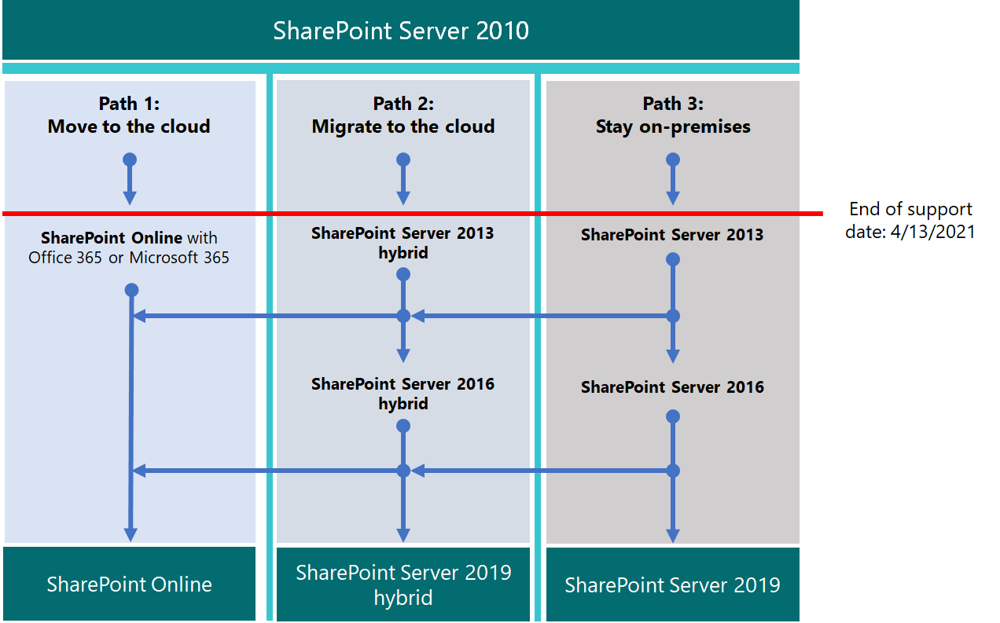

# 從 SharePoint 2010 升級

*本文適用於 Microsoft 365 企業版和 Office 365 企業版。*

Microsoft SharePoint 2010 和 SharePoint Server 2010 會在 **年4月 13 2021 日** 到達支援的支援。 本文提供的資源可協助您將現有的 SharePoint 伺服器2010資料移轉至 Microsoft 365 或升級內部部署 SharePoint Server 2010 環境中 SharePoint 線上。

## 什麼是 *支援終止*？

大部分的 Microsoft 產品都有支援週期，在此期間內可取得新功能、錯誤修正、安全性修正等等。 在支援終止的日期之後，產品不會停止運作，但 Microsoft 不再提供：

- 可能發生問題的技術支援。

- 針對可能會影響伺服器穩定性和可用性問題的錯誤修正。

- 安全性修正程式可能會導致伺服器遭受安全性破壞的漏洞。

- 時區更新。

這表示產品 (不會有進一步的更新、修補程式或修復程式，包括安全性修補程式/修正) 。 Microsoft 支援人員已將其支援工作完全移至較新的版本。

隨著 SharePoint Server 2010 的支援，在升級產品及遷移重要資料之前，請先刪除您不再需要的資料。

> [!NOTE]
> 軟體生命週期一般會從最初發行的10年持續。 [Microsoft 解決方案供應商](https://go.microsoft.com/fwlink/?linkid=841249)可以協助您升級至下一個版本的軟體，或遷移至 Microsoft 365 遷移 (或兩者都) 。 此外，請確定您已知道重要基礎技術的支援終止日期，尤其是在 SharePoint 使用 Microsoft SQL Server 的版本。 如需詳細資訊，請參閱 [固定生命週期原則](https://support.microsoft.com/help/14085)。

## 預先規劃

檢查 [產品生命週期網站](https://support.microsoft.com/lifecycle/search?alpha=SharePoint%20Server%202010)上支援結束的日期。 請考慮使用這些日期規劃升級或遷移。 請記住，您的產品不會在列出的日期 *停止運作* 。 不過，因為在該日期之後將不再會修補您的安裝，所以您需要規劃對產品的下一個版本的順利轉換。

此矩陣可協助您在遷移選項中繪製課程：

|支援產品的結束|良好 |最佳|
|---|---|---|
|SharePoint Server 2010|SharePoint伺服器 2013 (內部部署) |SharePoint Online|
||SharePoint伺服器2013與 SharePoint 線上混合|SharePoint伺服器 2016 (內部部署) |
|||SharePoint雲端混合式搜尋|

如果您選擇規模低端的選項 (良好) ，您必須在從 SharePoint Server 2010 遷移後，立即開始規劃其他升級。

您可以採取三個路徑，以避免 SharePoint Server 2010 的支援結束。

> [!NOTE]
> 目前已將 SharePoint Server 2010 和 SharePoint Foundation 2010 的支援終止安排于4月13日2021。 不過，請務必檢查 [產品生命週期網站](https://support.microsoft.com/lifecycle) 的最新日期。

## 下一步是什麼？

SharePoint伺服器2013和 SharePoint Foundation 2013 可以安裝在您自己的伺服器上內部部署。 您也可以使用 SharePoint 線上，也就是 Microsoft 365 的一部分線上服務。 您可以選擇：

- 線上遷移至 SharePoint。

- SharePoint server 或 SharePoint Foundation 內部部署升級。

- 請進行上述兩項操作。

- 實施[SharePoint 的混合](/sharepoint/hybrid/hybrid)式解決方案。

考慮維護伺服器陣列的隱藏成本，包括維護或遷移自訂專案，以及升級硬體。 如果您已考慮這些因素，將會更容易升級內部部署。 如果您在舊版的 SharePoint 伺服器上執行伺服器陣列，但沒有大量自訂，您可以從規劃的遷移受益于線上 SharePoint。 若為內部部署 SharePoint 伺服器環境，您也可以考慮將部分資料移 SharePoint Online 中，以減少硬體管理的額外負荷。

> [!NOTE]
> SharePoint 系統管理員可以建立 Microsoft 365 訂閱、設定新的 SharePoint 線上網站，然後徹底剪下 SharePoint 的伺服器2010，只會將基本的檔移至最新的網站。 然後，任何剩餘的資料都可以從 SharePoint Server 2010 網站耗盡為內部部署封存。

|SharePoint Online|SharePoint Server 內部部署|
|---|---|
|高成本的時間 (規劃/執行/驗證) |高成本的時間 (規劃/執行/驗證) |
|降低基金成本 (未購買硬體) |基金 (購買硬體) 更高成本|
|遷移時成本為一次|每個未來遷移重複的單一時間成本|
|低擁有權總成本/維護|高擁有權總成本/維護|

當您組織資料並決定要對雲端採取的功能和留下的功能時，單一時間移動至 Microsoft 365 會有較高的成本。 但在遷移資料後，未來升級將會自動進行，因為您將不再需要管理硬體和軟體更新。 伺服器陣列的時間將由 [Microsoft 服務等級協定 (SLA) ](/office365/servicedescriptions/office-365-platform-service-description/service-level-agreement)所備份。

### 移轉至 SharePoint Online

請確定 SharePoint 線上提供您所需的所有功能。 請參閱[SharePoint 服務描述](/office365/servicedescriptions/sharepoint-online-service-description/sharepoint-online-service-description)。

您無法直接從 SharePoint Server 2010 (或 SharePoint Foundation 2010) 遷移，以 SharePoint 線上。 許多遷移工作是手動。 不過，此階段可讓您刪除移動之前不再需要的資料和網站。 您可以將其他資料封存到儲存體。 

請記住 SharePoint Server 2010 和 SharePoint Foundation 2010 不會在支援終止時停止運作。 因此，如果客戶忘記移動部分資料，則系統管理員可以在 SharePoint 仍會執行的期間。

如果您升級為 SharePoint server 2013 或 SharePoint Server 2016，並決定將資料放入 SharePoint 線上，您可以使用[SharePoint 遷移 API](https://support.office.com/article/Upload-on-premises-content-to-SharePoint-Online-using-PowerShell-cmdlets-555049c6-15ef-45a6-9a1f-a1ef673b867c?ui=en-US&amp;rs=en-US&amp;ad=US)將資訊遷移至商務用 OneDrive。

|SharePoint線上優勢|SharePoint線上缺點|
|---|---|
|Microsoft 提供 SPO 硬體和所有硬體管理。|SharePoint Server 內部部署和 SPO 之間可用的功能可能會有所不同。|
|您是訂閱的全域系統管理員，而且可以指派系統管理員 SPO 網站。|在 Microsoft 365 的 SharePoint 系統管理員角色中，不會存在 (或不) 需要在 SharePoint 伺服器內部部署中使用的伺服器陣列管理員的某些動作。 但 SharePoint 管理、網站集合管理和網站擁有權是您的組織當地的地方。|
|Microsoft 會對底層的硬體和軟體（包括 SharePoint 線上執行的 SQL 伺服器）套用修補程式、修正及更新。|因為在服務中無法存取基礎檔案系統，所以自訂專案有限。|
|Microsoft 發佈 [服務等級協定](/office365/servicedescriptions/office-365-platform-service-description/service-level-agreement) ，並快速移動以解決服務層級事件。|備份與還原及其他修復選項會透過 SharePoint 線上的服務自動進行。 如果不使用，則會覆寫備份。|
|Microsoft 的安全性測試和伺服器效能調整是在服務上連續執行。|變更使用者介面及其他 SharePoint 功能會由服務安裝，而且可能需要切換開啟或關閉。|
|Microsoft 365 符合許多行業標準： [Microsoft 規範服務](/compliance/regulatory/offering-home)。|遷移的[FastTrack](https://go.microsoft.com/fwlink/?linkid=518597)協助是有限的。    大部分的升級是手動或透過[SharePoint 線上及 OneDrive 遷移內容藍圖](/sharepointmigration/upload-on-premises-content-to-sharepoint-online-using-powershell-cmdlets)中所述的 SPO 遷移 API。|
|Microsoft 支援工程師和資料中心員工不具無限制的系統管理員存取您的訂閱。|若需要升級硬體基礎結構，以支援較新版本的 SharePoint，或若升級需要次要伺服器陣列，可能會有額外的成本。|
|解決方案供應商可以協助您將資料移轉到線上 SharePoint 的單一時間工作。|您的控制項內並未 SharePoint 線上的所有變更。 遷移後，功能表、文件庫和其他功能的設計差異可能會暫時影響可用性。|
|線上產品會自動更新整個服務。 功能可能會取代，但沒有真正的支援週期。|SharePoint server 或 SharePoint Foundation 和基礎 SQL 伺服器都有支援週期。|

如果您決定建立新的 Microsoft 365 網站，並根據需要將資料手動遷移至該網站，請檢查[Microsoft 365 選項](https://www.microsoft.com/microsoft-365/)。

### 升級 SharePoint 伺服器內部部署

從 SharePoint Server 2019 開始，升級必須 *順序* 進行。 無法從 SharePoint Server 2010 升級成 SharePoint 伺服器2016或直接 SharePoint 2019。 串列升級路徑：

- SharePoint伺服器 2010 \> SharePoint server 2013 \> SharePoint 伺服器2016

需要一些時間，並計畫追蹤從 SharePoint 2010 到 SharePoint Server 2016 的整個路徑。 升級涉及硬體 (SQL 伺服器的成本也必須升級) 、軟體和管理。 此外，自訂專案可能也需要升級或甚至放棄。 在升級 SharePoint 伺服器陣列之前，請務必先記錄重要自訂專案。

> [!NOTE]
> 您可以維護 SharePoint 2010 伺服器陣列的支援，在新的硬體 (上安裝 SharePoint 伺服器2016伺服器陣列，讓個別的伺服器陣列執行並列) ，然後規劃並執行手動遷移內容 (，以下載及重新上傳內容，例如) 。 不過，這些手動移動會有可能的缺陷，例如，來自2010的檔具有目前最後一個修改的帳戶，且具有手動移動的帳號別名。 而且部分工作必須提早完成，例如重新建立網站、子網站、許可權和清單結構。 在升級之前，請務必清理您的環境。 考慮哪些資料可以移至儲存區，或不再需要。 這可減少遷移的影響。 請確定您的現有伺服器陣列在您升級之前是正常運作的，而且 (當然) 之後您解除委任！

請記得查看 *支援和不支援的升級路徑*：

- [SharePoint Server 2010](/previous-versions/office/sharepoint-2007-products-and-technologies/cc262747(v=office.12))

- [SharePoint Server 2013](/SharePoint/upgrade-and-update/review-supported-editions-and-products-for-upgrading-to-sharepoint-2013)

如果您有 *自訂*，您必須規劃遷移路徑中的每個步驟，這一點很重要：

- [SharePoint Server 2010](/previous-versions/office/sharepoint-server-2010/cc263203(v=office.14))

- [SharePoint Server 2013](/SharePoint/upgrade-and-update/create-a-communication-plan-for-the-upgrade-to-sharepoint-2013)

|內部部署優勢|內部部署缺點|
|---|---|
|完全控制 SharePoint 伺服器陣列的所有層面 (及其 SQL) 從伺服器硬體。|所有中斷和修正都是貴公司的責任。 不過，如果您的產品尚不支援，您可以接洽付費的 Microsoft 支援服務。|
|SharePoint Server 內部部署的完整功能集合，具有透過混合方式將內部部署伺服器陣列連線至 SharePoint Online 訂閱的選項。|SharePoint Server 及其 SQL 伺服器陣列的升級、修補程式、安全性修正程式、硬體升級和所有維護都是在內部部署管理。|
|自訂選項的完整存取權，與 SharePoint 線上的功能更高。|[Microsoft 規範服務](/compliance/regulatory/offering-home) 必須手動設定內部部署。|
|在您的內部部署中，安全性測試和伺服器效能調整是由您的內部部署所執行。|Microsoft 365 可能會讓 SharePoint 線上使用的功能，而不會與內部部署 SharePoint 伺服器互動。|
|解決方案供應商可以協助將資料移轉至下一版的 SharePoint Server (和) 以外。|您的 SharePoint 伺服器網站不會自動使用 SharePoint Online 中所看到[SSL/TLS](/SharePoint/security-for-sharepoint-server/enable-tls-1-1-and-tls-1-2-support-in-sharepoint-server-2016)憑證。|
|在內部部署中 SharePoint Server 內部部署命名慣例與備份與還原及其他復原選項的完整控制權。|SharePoint伺服器內部部署對產品生命週期保密。|

### 升級資源

請先比較硬體和軟體需求。 如果您目前的環境不符合基本需求，您可能必須先升級伺服器陣列或 SQL 伺服器中的硬體。 

您可以決定將一些網站移至 SharePoint 線上的「長綠」硬體。 進行評估之後，請遵循支援的升級路徑和方法。

- *硬體/軟體需求：*

    [SharePoint Server 2010](/previous-versions/office/sharepoint-server-2010/cc262485(v=office.14))  | [SharePoint Server 2013](/SharePoint/install/hardware-and-software-requirements-0)  | [SharePoint Server 2016](/SharePoint/install/hardware-and-software-requirements)

- *軟體界限和限制：*

    [SharePoint Server 2010](/previous-versions/office/sharepoint-server-2010/cc262787(v=office.14))  | [SharePoint Server 2013](/SharePoint/install/software-boundaries-and-limits)  | [SharePoint Server 2016](/SharePoint/install/software-boundaries-and-limits-0)

- *下列專案的升級程式概述：*

    [SharePoint Server 2010](/previous-versions/office/sharepoint-server-2010/cc303420(v=office.14))  | [SharePoint Server 2013](/SharePoint/upgrade-and-update/upgrade-to-sharepoint-server-2016)  | [SharePoint Server 2016](/SharePoint/upgrade-and-update/upgrade-to-sharepoint-server-2016)

### 使用 SharePoint 線上及 SharePoint 伺服器內部部署建立混合式解決方案

混合式安裝為內部部署和線上提供了一些遷移需求的最佳功能。 您可以將 SharePoint Server 2013、2016或2019伺服器陣列連線至 SharePoint 線上以建立 SharePoint 混合式：[深入瞭解 SharePoint 混合式解決方案](https://support.office.com/article/4c89a95a-a58c-4fc1-974a-389d4f195383.aspx)。

如果混合式 SharePoint 伺服器陣列是您的遷移目標，請找出線上移動的網站和使用者，以及需要在內部部署中使用的網站和使用者。 將您的 SharePoint 伺服器陣列內容排名為高、中或低對您公司的影響，可協助您做出這種決策。 您可能只需要在線上 SharePoint 中共用使用者帳戶以進行登入和 SharePoint 伺服器搜尋索引。 但在您查看網站的使用方式之前，此因素可能不會是顯而易見的。 如果您的公司後來決定將所有內容遷移至 SharePoint 線上，您可以將所有剩餘的帳戶和資料線上移動，並解除委任您的內部部署伺服器陣列。 SharePoint 伺服器陣列的管理/管理將透過從該點開始的 Microsoft 365 主控台進行。

請務必熟悉現有類型的混合式，以及如何設定內部部署 SharePoint 伺服器陣列與您 Microsoft 365 訂閱之間的連線。

|選項|描述|
|---|---|
|[Microsoft 規範服務](/compliance/regulatory/offering-home)。|遷移的[FastTrack](https://www.microsoft.com/fasttrack/microsoft-365)協助是有限的。   大部分的升級是手動或透過[SharePoint 線上及 OneDrive 遷移內容藍圖](/sharepointmigration/upload-on-premises-content-to-sharepoint-online-using-powershell-cmdlets)中所述的 SPO 遷移 API。|
|Microsoft 支援工程師和資料中心員工不具無限制的系統管理員存取您的訂閱。|若需要升級硬體基礎結構以支援較新版本的 SharePoint，或需要次要伺服器陣列時，可能會有額外的成本。|
|合作夥伴可協助您將資料移轉到線上 SharePoint 的單一時間工作。||
|線上產品會自動更新整個服務。 功能可能取代，但沒有真正的支援端點。||

如果您決定建立新的 Microsoft 365 網站，並視需要手動將資料移轉至該網站，請檢查[Microsoft 365 選項](https://www.microsoft.com/microsoft-365/)。

### 升級 SharePoint 伺服器內部部署

無法在 SharePoint 升級中略過版本。 這表示升級順序如下：

- SharePoint 2007 \> SharePoint server 2010 \> SharePoint server 2013 \> SharePoint server 2016

若要從 SharePoint 2007 到 SharePoint Server 2016 的完整途徑，將會帶來大量的時間，而且會考慮到硬體 (SQL 伺服器也必須升級) 、軟體及系統管理成本。 根據功能的重要性，必須升級或放棄自訂專案。

> [!NOTE]
> 您可以維持生命週期的 SharePoint 2007 伺服器陣列，在新的硬體 (上安裝 SharePoint 伺服器2016伺服器陣列，讓個別的伺服器陣列執行並列) ，然後規劃並執行手動遷移內容 (，以下載及重新上傳內容，例如) 。 不過，這些手動移動有一些缺點，例如，移動檔會以手動移動的帳號別名取代最後修改的帳戶。 而且必須在一段時間後完成許多工作，例如重新建立網站、子網站、許可權和清單結構。 在任何情況下，請考慮您可以移至儲存體或不再需要的資料，以降低遷移的影響。

在升級之前，請務必先清理您的環境。 請確定您的現有伺服器陣列在您升級之前是正常運作的，當然也是在您解除委任之前。

請記得查看 *支援和不支援的升級路徑*：

- [SharePoint Server 2007](/previous-versions/office/sharepoint-2007-products-and-technologies/cc262747(v=office.12))

- [SharePoint Server 2010](/previous-versions/office/sharepoint-2007-products-and-technologies/cc262747(v=office.12))

- [SharePoint Server 2013](/SharePoint/upgrade-and-update/review-supported-editions-and-products-for-upgrading-to-sharepoint-2013)

如果您有 *自訂*，請務必規劃遷移路徑中每個步驟的升級：

- [SharePoint 2007](/previous-versions/office/sharepoint-2007-products-and-technologies/cc263203(v=office.12))

- [SharePoint Server 2010](/previous-versions/office/sharepoint-server-2010/cc263203(v=office.14))

- [SharePoint Server 2013](/SharePoint/upgrade-and-update/create-a-communication-plan-for-the-upgrade-to-sharepoint-2013)

|內部部署 pro|內部部署 con|
|---|---|
|完全控制 SharePoint 伺服器陣列的所有層面，從伺服器硬體向上。|所有中斷和修正都是貴公司的責任。  (，但是如果您的產品尚不支援，您可以接洽付費的 Microsoft 支援人員。 ) |
|SharePoint Server 內部部署的完整功能集合，具有透過混合方式將內部部署伺服器陣列連線至 SharePoint Online 訂閱的選項。|升級、修補程式、安全性修正程式，以及 SharePoint 伺服器的所有維護都受內部部署管理。|
|取得更佳自訂的完整存取權。|[Microsoft 規範服務](/compliance/regulatory/offering-home) 必須手動設定內部部署。|
|在您的內部部署中，安全性測試和伺服器效能調整是由您的內部部署所執行。|Microsoft 365 可能會讓 SharePoint 線上使用的功能，不會與 SharePoint 伺服器內部部署互動。|
|合作夥伴可協助您將資料移轉至下一版的 SharePoint Server (和) 以外。|您的 SharePoint 伺服器網站不會自動使用 SharePoint Online 中所看到[SSL/TLS](/SharePoint/security-for-sharepoint-server/enable-tls-1-1-and-tls-1-2-support-in-sharepoint-server-2016)憑證。|
|在內部部署中 SharePoint Server 內部部署命名慣例與備份與還原及其他復原選項的完整控制權。|SharePoint伺服器內部部署對產品生命週期保密。|

### 升級資源

請先知道您符合硬體和軟體需求，然後再遵循支援的升級方法。

- *硬體/軟體需求*：

    [SharePoint Server 2010](/previous-versions/office/sharepoint-server-2010/cc262485(v=office.14))  | [SharePoint Server 2010](/previous-versions/office/sharepoint-server-2010/cc262485(v=office.14))  | [SharePoint Server 2013](/SharePoint/install/hardware-and-software-requirements-0)  | [SharePoint Server 2016](/SharePoint/install/hardware-and-software-requirements)

- *軟體界限和限制*：

    [SharePoint Server 2007](/previous-versions/office/sharepoint-2007-products-and-technologies/cc262787(v=office.12))  | [SharePoint Server 2010](/previous-versions/office/sharepoint-server-2010/cc262787(v=office.14))  | [SharePoint Server 2013](/SharePoint/install/software-boundaries-and-limits)  | [SharePoint Server 2016](/SharePoint/install/software-boundaries-and-limits-0)

- 下列專案 *的升級程式概述*：

    [SharePoint Server 2007](/previous-versions/office/sharepoint-2007-products-and-technologies/cc303420(v=office.12))  | [SharePoint Server 2010](/previous-versions/office/sharepoint-server-2010/cc303420(v=office.14))  | [SharePoint Server 2013](/SharePoint/upgrade-and-update/upgrade-to-sharepoint-server-2016)  | [SharePoint Server 2016](/SharePoint/upgrade-and-update/upgrade-to-sharepoint-server-2016)

### 在 SharePoint Online 與內部部署之間建立 SharePoint 的混合式解決方案

如果您遷移的答案需要在內部部署所提供的控制項之間，且 SharePoint 線上擁有的擁有成本較低的地方，您可以透過混合方式，將 SharePoint Server 2013 或2016伺服器陣列連線至 SharePoint。 [深入瞭解 SharePoint 混合式解決方案](https://support.office.com/article/4c89a95a-a58c-4fc1-974a-389d4f195383.aspx)

如果您決定混合式 SharePoint 伺服器陣列將會對您的業務帶來好處，請熟悉現有類型的混合，以及如何設定內部部署 SharePoint 伺服器陣列與 Microsoft 365 訂閱之間的連線。

您可能想要建立 Microsoft 365 開發/測試環境，您可以使用[測試實驗室指南](m365-enterprise-test-lab-guides.md)來設定。 在您取得試用版或購買 Microsoft 365 訂閱後，您可以在 SharePoint Online 中建立網站集合、網站及文件庫，以便您可以將資料移轉至該位置。 您可以使用遷移 API 手動遷移，或者，如果您想透過混合式嚮導將「我的網站」內容遷移至商務用 OneDrive。

> [!NOTE]
> 若要使用 [混合] 選項，您的 SharePoint 伺服器2010伺服器陣列必須先升級內部部署，以 SharePoint 伺服器2013或2016。 SharePointfoundation 2010 和 SharePoint foundation 2013 不支援具有 SharePoint 線上的混合連線。

## 適用於 Office 2010 用戶端與伺服器和 Windows 7 的選項摘要

如需適用於 Office 2010 用戶端與伺服器和 Windows 7 的升級、移轉和移至雲端選項的視覺摘要，請參閱[終止支援海報](../downloads/Office2010Windows7EndOfSupport.pdf)。

此海報說明您可以採取的各種途徑，以避免 Office 2010 用戶端和伺服器產品，並 Windows 7 的支援，並在 Microsoft 365 企業版反白顯示的喜好路徑和選項支援。

您也可以 [下載](https://github.com/MicrosoftDocs/microsoft-365-docs/raw/public/microsoft-365/downloads/Office2010Windows7EndOfSupport.pdf) 此標牌，並以 letter、法律或卡片 (11 x 17) 格式來列印。

## 相關文章

[協助您從 Office 2007 或2010伺服器及用戶端升級的資源](upgrade-from-office-2010-servers-and-products.md)

[Overview of the upgrade process from SharePoint 2010 to SharePoint 2013](/SharePoint/upgrade-and-update/overview-of-the-upgrade-process-from-sharepoint-2010-to-sharepoint-2013)

[從 SharePoint 2010 升級至 SharePoint 2013 的最佳作法](/SharePoint/upgrade-and-update/best-practices-for-upgrading-from-sharepoint-2010-to-sharepoint-2013)

[在 SharePoint 2013 中針對資料庫的升級問題進行疑難排解](/SharePoint/upgrade-and-update/troubleshoot-database-upgrade-issues-in-sharepoint-2013)

[搜尋 Microsoft 解決方案供應商以協助您升級](https://go.microsoft.com/fwlink/?linkid=841249)

[已更新 SharePoint 2013 的產品服務原則](/SharePoint/product-servicing-policy/updated-product-servicing-policy-for-sharepoint-2013)

[已更新 SharePoint Server 2016 的產品服務原則](/SharePoint/product-servicing-policy/updated-product-servicing-policy-for-sharepoint-server-2016)