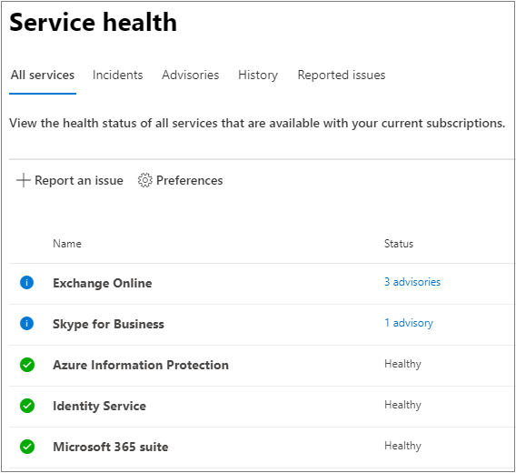

# 如何檢查 Microsoft 365 服務健康情況How to check Microsoft 365 service health

[![[標籤] 可讓您知道系統管理中心正在變更，您可以在 aka.ms/aboutM365preview 取得更多詳細資料。](../media/O365-Admin-AdminCenterChanging.png)](/office365/admin/microsoft-365-admin-center-preview?preserve-view=true&view=o365-worldwide)

您可以在 [Microsoft 365 系統管理中心](https://go.microsoft.com/fwlink/p/?linkid=2024339)的 [**服務健康情況**] 頁面上，查看 Microsoft 服務的健康情況，包括 Office 網頁版、Yammer、Microsoft Dynamics CRM 及行動裝置管理雲端服務。You can view the health of your Microsoft services, including Office on the web, Yammer, Microsoft Dynamics CRM, and mobile device management cloud services, on the **Service health** page in the [Microsoft 365 admin center](https://go.microsoft.com/fwlink/p/?linkid=2024339). 如果雲端服務發生問題，在您連絡支援人員或花時間進行疑難排解之前，可以查看服務健康情況，以確定是否為正在開發解決方法的已知問題。If you are experiencing problems with a cloud service, you can check the service health to determine whether this is a known issue with a resolution in progress before you call support or spend time troubleshooting.

如果您無法登入系統管理中心，您可以使用 [ [服務狀態] 頁面](https://status.office365.com) 檢查是否有已知的問題，使您無法登入您的租使用者。If you are unable to sign in to the admin center, you can use the [service status page](https://status.office365.com) to check for known issues preventing you from logging into your tenant.  此外，請在 Twitter 上的 [@MSFT365status](https://twitter.com/MSFT365Status) 上進行註冊，以查看特定事件的資訊。Also sign up to follow us at [@MSFT365status](https://twitter.com/MSFT365Status) on Twitter to see information on certain events.

## 如何查看服務健全狀態How to check service health

1. 移至 Microsoft 365 系統管理中心 [https://admin.microsoft.com](https://go.microsoft.com/fwlink/p/?linkid=2024339) ，然後使用管理員帳戶登入。Go to the Microsoft 365 admin center at [https://admin.microsoft.com](https://go.microsoft.com/fwlink/p/?linkid=2024339), and sign in with an admin account.

    > [!NOTE]
    > 獲指派全域管理員或服務支援系統管理員角色的人員可查看服務健康情況。People who are assigned the global admin or service support admin role can view service health. 若要允許 Exchange、SharePoint 以及商務用 Skype 管理員檢視服務健康情況，必須同時將服務系統管理員角色指派給他們。To allow Exchange, SharePoint, and Skype for Business admins to view service health, they must also be assigned the Service admin role. 如需可查看服務健康情況之角色的詳細資訊，請參閱 [關於系統管理員角色](../admin/add-users/about-admin-roles.md?preserve-view=true&view=o365-worldwide#commonly-used-microsoft-365-admin-center-roles)。For more information about roles that can view service health, see [About admin roles](../admin/add-users/about-admin-roles.md?preserve-view=true&view=o365-worldwide#commonly-used-microsoft-365-admin-center-roles).

2. 若要查看服務健康情況，請在系統管理中心中，移至 [**健康** 情況  >  **服務健康** 情況]，或選取 **首頁儀表板** 上的 **服務健康** 情況卡片。To view service health, in the admin center, go to **Health** > **Service health**, or select the **Service health** card on the **Home dashboard**. 儀表板卡會指出是否有主動服務問題，以及詳細的 **服務健康** 情況頁面連結。The dashboard card indicates whether there is an active service issue and links to the detailed **Service health** page.

3. 在 [ **服務健康** 情況] 頁面上，每個雲端服務的健康狀態是以表格格式顯示。On the **Service health** page, the health state of each cloud service is shown in a table format.

   

[ **所有服務** ] 索引標籤 (預設 view) 會顯示所有服務、其目前的健康狀態，以及任何作用中的事件或諮詢。The **All services** tab (the default view) shows all services, their current health state, and any active incidents or advisories. [ **狀況** ] 欄中的圖示及狀態會指出每項服務的狀態。An icon and status in the **Health** column indicate the state of each service.

如果有服務有作用中的事件或建議，其將會直接列在巢狀表格格中的服務名稱下。If there is an active incident or advisory for a service they will be listed directly under the service name in a nested table. 您可以按一下服務名稱左側的 v 形圖示，以壓縮巢狀表格格以隱藏此視圖中的事件或諮詢。You can collapse the nested table to hide the incidents or advisories in this view by clicking on the chevron icon to the left of the service name.   

若要篩選您的視圖只顯示所有作用中的事件，請選取頁面頂端的 [ **事件** ] 索引標籤。To filter your view to only show all the active incidents, select the **Incidents** tab at the top of the page. 選取 [ **建議** ] 索引標籤只會顯示所有已發佈的主動建議。Selecting the **Advisories** tab will only show all the active advisories posted.

[ **記錄** ] 索引標籤會顯示過去7天或30天內已解決的所有事件和提議。The **History** tab shows all incidents and advisories that have been resolved within the last seven or 30 days.

如果您遇到 Microsoft 365 服務的問題，但您未在 [**服務健康** 情況] 頁面上看到該問題，請選取 [**報告問題**]，並完成簡寫表單，以告知我們。If you're experiencing an issue with a Microsoft 365 service and you don’t see it listed on the **Service health** page, tell us about it by selecting **Report an issue**, and completing the short form. 我們將從其他組織查看相關資料和報告，以查看問題的程度，以及是否與我們的服務有關。We’ll look at related data and reports from other organizations to see how widespread the issue is, and if it originated with our service. 如果是的話，我們會將其新增為 [ **服務健康** 情況] 頁面上的新事件或建議，您可以在這裡追蹤其解決方法。If it did, we’ll add it as a new incident or advisory on the **Service health** page, where you can track its resolution. 「 **報告的問題** 」頁面會顯示您租使用者從這個表單報告的所有問題及狀態。The **Reported Issues** page will show all issues your tenant has reported from this form and the status.

若要自訂在儀表板上顯示服務的視圖，請選取 [**喜好** 設定  >  **自訂視圖**]，然後清除您要從服務健康情況儀表板視圖中篩選出之服務的核取方塊。To customize your view of which services show up on the dashboard, select **Preferences** > **Custom view**,  and clear the checkboxes for the services you want to filter out of your Service health dashboard view. 請確定已針對您要監視的每個服務選取此核取方塊。Make sure that the checkbox is selected for each service that you want to monitor.

若要註冊會影響租使用者的新事件的電子郵件通知，以及對使用中事件的狀態變更，請選取 [**喜好** 設定  >  **電子郵件**]，按一下 [**以電子郵件傳送我的服務 heath 通知**]，然後指定：To sign up for email notifications of new incidents that affect your tenant and status changes for an active incident, select **Preferences** > **Email**, click **Send me service heath notifications in email**, and then specify:

- 最多兩個電子郵件地址。Up to two email addresses.
- 您是否需要事件或建議的通知Whether you want notifications for incidents or advisories
- 您要通知的服務The services for which you want notification

您也可以訂閱個別事件的電子郵件通知，而不是服務的每個事件。You can also subscribe to email notifications for individual events instead of every event for a service. 若要這麼做，請選取您想要接收電子郵件通知更新的使用中問題，選取 [ **管理此問題的通知**]，然後指定：To do so, select the active issue you want to receive email notification updates for, select **Manage notifications for this issue**, and then specify: 
- 最多兩個電子郵件地址。Up to two email addresses.

> [!NOTE]
> 每個系統管理員都可以設定其偏好設定，而每個系統管理員帳戶的上述限制為兩個電子郵件地址。Each admin can have their Preferences set and the above limit of two email address is per admin account.

> [!TIP]
> 您也可以使用行動裝置上的[Microsoft 365 系統管理應用程式](https://go.microsoft.com/fwlink/p/?linkid=627216)來查看服務健康情況，這是使用推播通知保持最新狀態的絕佳方式。You can also use the [Microsoft 365 Admin app](https://go.microsoft.com/fwlink/p/?linkid=627216) on your mobile device to view Service health, which is a great way to stay current with push notifications.

### 檢視已張貼的服務健康情況詳細資料View details of posted service health

在 [ **所有服務** ] 視圖上，選取 [問題標題] 以查看 [問題詳細資料] 頁面，其中會顯示有關問題的詳細資訊，包括在處理方案時所發佈之所有訊息的摘要。On the **All services** view, select the issue title to see the issue detail page, which shows more information about the issue, including a feed of all the messages posted while we work on a solution. 

[ 的螢幕擷取畫面](../media/service-health-advisory.png#lightbox)

建議或事件摘要會提供下列資訊：The advisory or incident summary provides the following information:

- **Title** -問題的摘要。**Title** - A summary of the problem.
- **ID** -問題的數值識別碼。**ID** - A numeric identifier for the problem.
- **服務** -受影響服務的名稱。**Service** - The name of the affected service.
- **上次更新** 時間-上次更新服務狀況訊息的時間。**Last updated** - The last time that the service health message was updated.
- **預估開始時間** -問題已開始的預估時間。**Estimated Start time** - The estimated time when the issue started.
- **狀態** -此問題對服務的影響。**Status** - How this problem affects the service.
- **使用者影響** -此問題對使用者之影響的簡短描述。**User Impact** - A brief description of the impact this issue has on the end user.
- **所有更新** -我們經常發佈訊息，讓您知道我們在套用方案中所進行的進度。**All Updates** - We post frequent messages to let you know the progress that we're making in applying a solution.

### 翻譯服務健康情況詳細資料Translate service health details

我們使用機器翻譯以您慣用的語言自動顯示郵件。We use machine translation to automatically display messages in your preferred language. 有關如何設定語言的詳細資訊，請閱讀 [郵件中心文章的語言翻譯](/microsoft-365/admin/manage/language-translation-for-message-center-posts) 。Read [Language translation for Message center posts](/microsoft-365/admin/manage/language-translation-for-message-center-posts) for more information on how to set your language.

### 定義Definitions

在大部分的情況下，服務會顯示為良好狀態，而不會進一步資訊。Most of the time, services will appear as healthy with no further information. 如果服務發生問題，系統就會以建議或事件的方式表示發生問題，並顯示目前的狀態。When a service is having a problem, the issue is identified as either an advisory or an incident and shows a current status.

> [!TIP]
> 預定維修事件不會顯示在服務健康情況中。Planned maintenance events aren't shown in service health. 您可以在 **郵件中心** 保持最新狀態，追蹤計畫的維護事件。You can track planned maintenance events by staying up to date with the **Message center**. 篩選至歸類為「規劃變更」 的訊息，即可了解何時要進行變更、變更的作用以及如何準備因應。Filter to messages categorized as Plan for change to find out when the change is going to happen, its effect, and how to prepare for it. 如需詳細資訊，請參閱[Microsoft 365 中的訊息中心](https://support.office.com/article/38fb3333-bfcc-4340-a37b-deda509c2093)。See [Message center in Microsoft 365](https://support.office.com/article/38fb3333-bfcc-4340-a37b-deda509c2093) for more details.

### 事件和建議Incidents and advisories

| 圖示Icon | 描述Description |
|:-----|:-----|
||如果系統針對某個服務顯示「建議」，表示我們發現了會對部分使用者造成影響的問題，但該服務仍可使用。建議中通常會提供問題的因應措施，且該問題可能是間歇發生，或其波及範圍和對使用者造成的影響並不大。If a service has an advisory shown, we are aware of a problem that is affecting some users, but the service is still available. In an advisory, there is often a workaround to the problem and the problem may be intermittent or is limited in scope and user impact.    |
||如果系統針對某個服務顯示有作用中的「事件」，代表這是一個重大問題，且該服務或其主要功能無法使用。例如，使用者可能無法傳送和接收電子郵件，或者無法登入。事件會對使用者造成明顯影響。當有進行中的事件時，我們會在服務健康情況儀表板中提供更新資訊，讓您掌握調查和移轉作業的進度，以及確認解決方案。If a service has an active incident shown, it's a critical issue and the service or a major function of the service is unavailable. For example, users may be unable to send and receive email or unable to sign-in. Incidents will have noticeable impact to users. When there is an incident in progress, we will provide updates regarding the investigation, mitigation efforts, and confirmation of resolution in the Service health dashboard.    |

### 狀態定義Status definitions

| 狀態Status | 定義Definition |
|:-----|:-----|
|**調查****Investigating** | 我們已發現潛在問題，正在收集關於其原因和影響範圍的詳細資訊。We're aware of a potential issue and are gathering more information about what's going on and the scope of impact. |
|**服務效能下降****Service degradation** | 我們已確認某個問題可能會對服務或功能的使用造成影響。舉例來說，如果某個服務的執行速度比平常慢、出現間歇性中斷，或者某個功能無法正常運作，您就會看見此狀態。We've confirmed that there is an issue that may affect use of a service or feature. You might see this status if a service is performing more slowly than usual, there are intermittent interruptions, or if a feature isn't working, for example. |
|**服務中斷****Service interruption** | 如果我們判斷某個問題會影響使用者存取服務的能力，您就會看見此狀態。這種情況表示問題相當嚴重，且在相同條件下會固定發生。You'll see this status if we determine that an issue affects the ability for users to access the service. In this case, the issue is significant and can be reproduced consistently. |
|**正在恢復服務****Restoring service** | 我們已經找出問題的成因，知道要採取什麼修正動作，且正在讓服務恢復到健康情況良好的狀態。The cause of the issue has been identified, we know what corrective action to take, and are in the process of bringing the service back to a healthy state. |
|**擴充的復原****Extended recovery** | 此狀態表示我們正在進行矯正措施，以便為大多數使用者恢復服務，但需要一些時間才能讓所有受影響的系統恢復正常運作。如果我們在尚未進行永久修復期間先採用暫時修正方法以降低影響，您也可能會看到此狀態。This status indicates that corrective action is in progress to restore service to most users but will take some time to reach all the affected systems. You might also see this status if we've made a temporary fix to reduce impact while we wait to apply a permanent fix. |
|**調查暫停****Investigation suspended** | 在我們詳細調查潛在問題後，如果需要客戶提供額外資訊以進行更深入的調查，您就會看到此狀態。如果我們需要您採取行動，我們會告知您我們所需的資料或記錄。If our detailed investigation of a potential issue results in a request for additional information from customers to allow us to investigate further, you'll see this status. If we need you to act, we'll let you know what data or logs we need. |
|**服務已恢復****Service restored** | 我們確認矯正措施已解決根本問題，且服務也已恢復為健康情況良好的狀態。如需了解何處發生錯誤，請檢視問題詳細資料。We've confirmed that corrective action has resolved the underlying problem and the service has been restored to a healthy state. To find out what went wrong, view the issue details. |
|**False 正值****False positive** | 在詳細調查之後，我們已確認服務狀況良好，且如設計方式運作。After a detailed investigation, we’ve confirmed the service is healthy and operating as designed. 不會對服務的影響，或從服務之外產生事件的原因。No impact to the service was observed or the cause of the incident originated outside of the service. |
|**發佈的事件後報告****Post-incident report published** | 我們已發佈一個包含根本原因資訊的特定問題的文章附隨報告及後續步驟，以確保不再發生類似的問題。We’ve published a Post Incident Report for a specific issue that includes root cause information and next steps to ensure a similar issue doesn’t reoccur. |

### 訊息發佈類型Message Post Types

| 類型Type | 定義Definition |
|:-----|:-----|
|**快速更新****Quick Update** | 適用于廣泛影響的事件的簡短和經常性增量更新，可供所有客戶使用。Short and frequent incremental updates for broadly impacting incidents, available to all customers. |
|**其他詳細資料****Additional Details** | 這些額外文章會提供更豐富的技術和解析度詳細資料，以提供對事件處理的深入瞭解。These additional posts will provide richer technical and resolution details to offer deeper visibility into the handling of incidents. 這適用于符合[Exchange Online 監控](/microsoft-365/enterprise/microsoft-365-exchange-monitoring?view=o365-worldwide#requirements)所述相同需求的承租人。This is available for tenants that meet the same requirements outlined for [Exchange Online monitoring](/microsoft-365/enterprise/microsoft-365-exchange-monitoring?view=o365-worldwide#requirements), |

### 歷程記錄History

服務健康情況可讓您查看目前的健全狀態，並查看過去30天內，對租使用者造成影響的任何服務建議和事件的記錄。Service health lets you look at your current health status and view the history of any service advisories and incidents that have affected your tenant in the past 30 days. 若要查看所有服務的過去健康情況，請選取 [ **史** view]。To view the past health of all services, select **History** view.

如需關於我們工作時間承諾的詳細資訊，請參閱[Microsoft 365 的透明作業](/office365/servicedescriptions/office-365-platform-service-description/service-health-and-continuity)。For more information about our commitment to uptime, see [Transparent operations from Microsoft 365](/office365/servicedescriptions/office-365-platform-service-description/service-health-and-continuity).

## 相關主題Related topics

[Microsoft 365 系統管理中心中的活動報告Activity Reports in the Microsoft 365 admin center](https://support.office.com/article/0d6dfb17-8582-4172-a9a9-aed798150263)

[訊息中心喜好設定Message center Preferences](../admin/manage/message-center.md?preserve-view=true&view=o365-worldwide#preferences)

[如何檢查系統管理中心的 Windows 版本健康情況How to check Windows release health on admin center](/windows/deployment/update/check-release-health)
