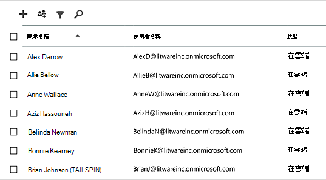
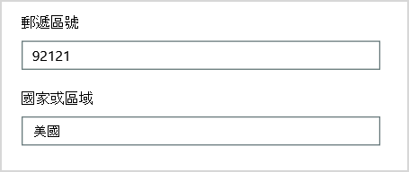
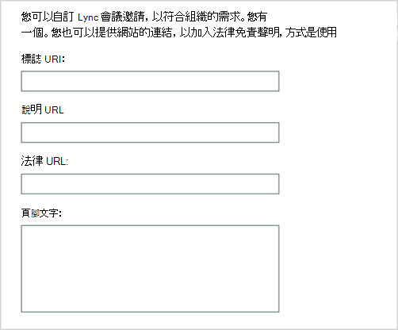
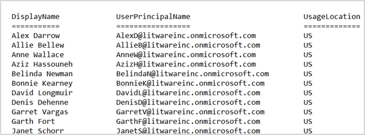

# <a name="why-you-need-to-use-powershell-for-microsoft-365"></a>為什麼您需要使用適用於 Microsoft 365 的 PowerShell

*本文適用於 Microsoft 365 企業版和 Office 365 企業版。*

您可以使用 Microsoft 365 系統管理中心，管理您的 Microsoft 365 使用者帳戶和授權。 您也可以管理 Microsoft 365 服務，例如 Exchange Online、小組和 SharePoint 線上。 [！注意] 如果您改為使用 PowerShell 來管理這些服務，您可以並利用命令列及指令碼語言環境，以取得速度、自動化及其他功能。
  
本文說明如何使用 PowerShell 來管理 Microsoft 365，以進行下列作業：
  
- 顯示您在 Microsoft 365 系統管理中心中看不到的其他資訊
    
- 設定 PowerShell 的功能和設定
    
- 執行大量作業
    
- 篩選資料
    
- 列印或儲存資料
    
- 跨服務管理
    
請注意，Microsoft 365 的 PowerShell 是一組 Windows PowerShell 模組，也就是 Windows 服務和平臺的命令列環境。 此環境會建立命令介面語言，該語言可與其他模組擴充。 它提供執行簡易或複雜命令或腳本的方式。 例如，在您安裝 Microsoft 365 模組的 PowerShell 並聯機至您的 Microsoft 365 訂閱後，您可以執行下列命令來列出 Microsoft Exchange Online 的所有使用者信箱：
  
```powershell
Get-Mailbox
```

您也可以使用 Microsoft 365 系統管理中心取得信箱清單，但為所有 web 應用程式的所有網站計算所有清單中的專案，並不容易。
  
Microsoft 365 的 PowerShell 設計用來協助您管理 Microsoft 365，而不是取代 Microsoft 365 系統管理中心。 系統管理員必須能夠對 Microsoft 365 使用 PowerShell，因為某些設定程式只能透過 PowerShell Microsoft 365 命令進行。 在這些情況下，您必須瞭解如何進行下列作業：
  
- 安裝 Microsoft 365 模組的 PowerShell (每個系統管理員電腦) 只執行一次。
    
- 在每個 PowerShell 會話) 上，連線至您的 Microsoft 365 訂閱 (一次。
    
- 收集為 Microsoft 365 命令執行必要 PowerShell 所需的資訊。
    
- 針對 Microsoft 365 命令執行 PowerShell。
    
瞭解這些基本技能之後，您不需要使用 **Get-Mailbox** 命令列出信箱使用者。 您也不需要瞭解如何建立新的命令，如先前提及的命令，用來統計所有 web 應用程式之所有網站的所有清單中的所有專案。 Microsoft 和系統管理員群組可以視需要協助您進行這類工作。
  
## <a name="powershell-for-microsoft-365-can-reveal-information-that-you-cant-see-with-the-microsoft-365-admin-center"></a>Microsoft 365 的 PowerShell 會顯示您無法使用 Microsoft 365 系統管理中心所看到的資訊

Microsoft 365 系統管理中心會顯示許多有用資訊。 但不會顯示 Microsoft 365 儲存的使用者、授權、信箱和網站的所有可能資訊。 以下是 Microsoft 365 系統管理中心中 *使用者和群組* 的範例：
  

  
此視圖提供您在許多情況下所需的資訊。 不過，您有時需要更多的資訊。 例如，Microsoft 365 授權 (和 Microsoft 365 功能可供使用者) 中的部分取決於使用者的地理位置。 您可以延伸至位於美國地區之使用者的原則和功能，與您可以擴充到印度或比利時之使用者的原則和功能可能並不相同。 請遵循 Microsoft 365 系統管理中心的下列步驟，判斷使用者的地理位置：
  
1. 連按兩下使用者的 **[顯示名稱]** 。
    
2. 在 [使用者屬性] 顯示窗格中，選取 [ **詳細資料**]。
    
3. 在詳細資料顯示中，選取 [ **其他詳細資料**]。
    
4. 向中滾動直到您找到該標題的 **國家或地區**：
    
     
  
5. 在一張紙上寫下使用者的顯示名稱和位置，或複製並貼到 [記事本]。
    
您必須為每位使用者重複此程序。 如果您有許多使用者，此程式可能是單調乏味的。 使用 Microsoft 365 的 PowerShell，您可以使用下列命令，為所有使用者顯示此資訊：
  
```powershell
Get-AzureADUser | Select DisplayName, UsageLocation
```


>[!Note]
>PowerShell 核心不支援 Windows PowerShell 模組的 Microsoft Azure Active Directory 模組，以及其名稱中具有 *Msol* 的 Cmdlet。 您必須從 [Windows PowerShell 執行這些 Cmdlet。
>

以下是結果的範例：
  
```powershell
DisplayName                               UsageLocation
-----------                               -------------
Bonnie Kearney                            GB
Fabrice Canel                             BR
Brian Johnson (TAILSPIN)                  US
Anne Wallace                              US
Alex Darrow                               US
David Longmuir                            BR
```

此 PowerShell 命令的轉譯如下： (**AzureADUser**) 中取得目前 Microsoft 365 訂閱中的所有使用者，但只顯示每位使用者的名稱和位置 (**選取 DisplayName，UsageLocation**) 。
  
因為 Microsoft 365 PowerShell 支援命令介面語言，所以您可以進一步操縱 **AzureADUser** 命令取得的資訊。 例如，您可能想要依其位置排序使用者、將所有巴西使用者組合在一起，將美國所有使用者組合在一起，等等。 命令如下：
  
```powershell
Get-AzureADUser | Select DisplayName, UsageLocation | Sort UsageLocation, DisplayName
```

以下是結果的範例：
  
```powershell
DisplayName                                 UsageLocation
-----------                                 -------------
David Longmuir                              BR
Fabrice Canel                               BR
Bonnie Kearney                              GB
Alex Darrow                                 US
Anne Wallace                                US
Brian Johnson (TAILSPIN)                    US
```

此 PowerShell 命令的轉譯如下：取得目前 Microsoft 365 訂閱中的所有使用者，但只顯示每位使用者的名稱和位置，並依其位置排序，然後再依其名稱 (**sort UsageLocation DisplayName**) 。
  
您也可以使用其他篩選。 例如，如果您只想看到巴西使用者的資訊，請使用這個命令：
  
```powershell
Get-AzureADUser | Where {$_.UsageLocation -eq "BR"} | Select DisplayName, UsageLocation 
```

以下是結果的範例：
  
```powershell
DisplayName                                           UsageLocation
-----------                                           -------------
David Longmuir                                        BR
Fabrice Canel                                         BR
```

此 PowerShell 命令的轉譯如下：取得目前 Microsoft 365 訂閱中的所有使用者，其位置是巴西 (**其中 {$ \_ 。UsageLocation-eq "BR"}**) 然後顯示每位使用者的名稱和位置。
  
 **有關大型網域的附注**
  
如果您有成千上萬位使用者的大型網域，請嘗試我們在本文中顯示的部分範例，以進行節流。 根據計算能力和可用網路頻寬等因素，您可能嘗試一次執行太多動作。 大型組織可能會想要將一些 PowerShell 作業分割成兩個命令。

例如，下列命令會傳回所有使用者帳戶，並顯示每個使用者帳戶的名稱和位置：
  
```powershell
Get-AzureADUser | Select DisplayName, UsageLocation
```

該命令非常適合較小型的網域。 但在大型組織中，您可能會想要將該作業分割成兩個命令：一個命令，可將使用者帳戶資訊儲存在變數中，另一個則顯示必要的資訊。 以下為範例：
  
```powershell
$x = Get-AzureADUser
$x | Select DisplayName, UsageLocation
```

這組 PowerShell 命令的轉譯如下：
1. 取得目前 Microsoft 365 訂閱中的所有使用者，並將資訊儲存在名為 $x 的變數中 (**$x = AzureADUser**) 。
1.  顯示變數 *$x* 的內容，但只包含每個使用者 (的名稱和位置 **$x |選取 [DisplayName]，UsageLocation**) ]。
  
## <a name="microsoft-365-has-features-that-you-can-only-configure-with-powershell-for-microsoft-365"></a>Microsoft 365 具有您只能使用 Microsoft 365 PowerShell 所設定的功能

Microsoft 365 系統管理中心的設計是要提供適用于大部分環境的一般管理工作的存取。 換句話說，已設計 Microsoft 365 系統管理中心，讓一般管理員可以執行最常見的管理工作。 但有一些工作無法在系統管理中心執行。
  
例如，商務用 Skype Online 系統管理中心提供一些選項來建立自訂會議邀請：
  

  
使用這些設定，您可以新增會議邀請的一些個人化和專門技術。 不過，會議配置設定更多，只是建立自訂會議邀請。 例如，會議預設允許：
  
- 匿名使用者自動進入每個會議。
    
- 出席者記錄會議。
    
- 您組織的所有使用者在加入會議時都會指定為主持人。
    
您無法從商務用 Skype Online 系統管理中心取得這些設定。 您可以從 Microsoft 365 的 PowerShell 控制它們。 以下是停用這三個設定的命令：
  
```powershell
Set-CsMeetingConfiguration -AdmitAnonymousUsersByDefault $False -AllowConferenceRecording $False -DesignateAsPresenter "None"
```

> [!NOTE]
> 若要執行此命令，您必須安裝 [商務用 Skype Online PowerShell 模組 ](https://www.microsoft.com/download/details.aspx?id=39366)。
  
此 PowerShell 命令的轉譯如下：
 
1. 在 [新的商務用 Skype Online 會議設定] 中 (**Set-CsMeetingConfiguration**) ]，停用 [允許匿名使用者自動進入會議 (**-AdmitAnonymousUsersByDefault $False**) ]。
2.  停用出席者記錄會議 (**AllowConferenceRecording $False**) 的功能。
3. 請勿將組織中的所有使用者指定為簡報者 (**-DesignateAsPresenter "None"**) 。
  
若要還原這些預設設定 (啟用選項) ，請執行下列命令：
  
```powershell
Set-CsMeetingConfiguration -AdmitAnonymousUsersByDefault $True -AllowConferenceRecording $True -DesignateAsPresenter "Company"
```

另外還有其他類似案例，也就是管理員應該知道如何針對 Microsoft 365 命令執行 PowerShell 的原因。
  
## <a name="powershell-for-microsoft-365-is-great-for-bulk-operations"></a>Microsoft 365 的 PowerShell 非常適合大量作業

當您有單一作業時，像是 Microsoft 365 系統管理中心的視覺介面最有價值。 例如，如果您需要停用一個使用者帳戶，您可以使用系統管理中心，快速找出並清除核取方塊。 這可能會比在 PowerShell 中執行類似的作業更為容易。
  
不過，如果您必須在大量的其他專案中變更許多專案或某些選取的專案，則 Microsoft 365 系統管理中心可能不是最佳工具。 例如，假設您必須在數以千計的電話號碼上變更前置詞，或是移除所有 SharePoint Online 網站的特定使用者 *Ken Myer* 。 如何在 Microsoft 365 系統管理中心中執行該動作？
  
在最後一個範例中，假設您有數個 SharePoint 線上網站，而且您不知道哪些 Ken Meyer 是的成員。 您必須從 Microsoft 365 系統管理中心開始，然後針對每個網站執行此程式：
  
1. 選取網站的 **URL** 。
    
2. 在 [ **網站集合屬性** ] 方塊中，選取 [網站 **位址** ] 連結以開啟網站。
    
3. 在網站上，選取 [ **共用**]。
    
4. 在 [ **共用** ] 對話方塊中，選取顯示所有具有網站許可權的使用者的連結：
    
     
  
5. 在 [ **共用物件** ] 對話方塊中，選取 [ **高級**]。
    
6. 向下滾動使用者清單，尋找並選取 Ken Myer (假設他具有網站) 的許可權，然後選取 [ **移除使用者** 權力]。
    
這會花費 *很長* 的時間進行數百個網站。
  
另一種方法是在 Microsoft 365 PowerShell 中執行下列命令，以從所有網站中移除 Ken Myer：
  
```powershell
Get-SPOSite | ForEach {Remove-SPOUser -Site $_.Url -LoginName "kenmyer@litwareinc.com"}
```

> [!NOTE]
> 這個命令需要您安裝 [SharePoint 線上 PowerShell 模組](/powershell/sharepoint/sharepoint-online/connect-sharepoint-online?view=sharepoint-ps)。 
  
此 PowerShell 命令的轉譯如下：取得目前 Microsoft 365 訂閱中的所有 SharePoint 網站 (**Get-SPOSite**) ，並針對每個網站，從可以存取它的使用者清單中移除 Ken Meyer (**ForEach {Remove-SPOUser-site $ \_ 。Url-LoginName "kenmyer \@ litwareinc.com"}**) 。
  
我們告訴 Microsoft 365 從每個網站（包括他沒有存取權）中移除 Ken Meyer。 因此，結果會顯示其沒有存取權之網站的錯誤。 我們可以在這個命令上使用另一個條件，只從其登入清單的網站中移除 Ken Meyer。 但是傳回的錯誤，對網站本身不會造成任何損害。 這個命令可能需要幾分鐘的時間來執行數百個網站，而不是透過 Microsoft 365 系統管理中心的工作時間。
  
以下是另一個大量的操作範例。 使用此命令將 *Bonnie Kearney*（新 SharePoint 管理員）新增至組織中的所有網站：
  
```powershell
Get-SPOSite | ForEach {Add-SPOUser -Site $_.Url -LoginName "bkearney@litwareinc.com" -Group "Members"}
```

此 PowerShell 命令的轉譯如下：取得目前 Microsoft 365 訂閱中的所有 SharePoint 網站，並針對每個網站，將其登入名稱新增至網站的 Members 群組，以允許 Bonnie Kearney 存取 (**ForEach {Add-SPOUser-site $ \_ 。Url-LoginName "bkearney \@ litwareinc.com"-Group "Members"}**) 。
  
## <a name="powershell-for-microsoft-365-is-great-at-filtering-data"></a>Microsoft 365 的 PowerShell 非常適合篩選資料

Microsoft 365 系統管理中心提供數種方式來篩選您的資料，以輕鬆找到目標的資訊子集。 例如，Exchange 可輕鬆篩選使用者信箱的任何內容。 例如，以下是居住在 Bloomington 城市中之所有使用者的信箱清單：
  

  
Exchange 系統管理中心也可讓您合併篩選準則。 例如，您可以尋找居住在 Bloomington 中，且在財務部門中運作之所有人員的信箱。
  
不過，您可以在 Exchange 系統管理中心中做什麼限制。 例如，您無法輕鬆尋找居住于 Bloomington *或* 聖地牙哥的人員信箱，或是未在 Bloomington 中生活之所有人員的信箱。
  
您可以使用下列 Microsoft 365 命令 PowerShell，以取得居住在 Bloomington 或聖地牙哥之所有人員的信箱清單：
  
```powershell
Get-User | Where {$_.RecipientTypeDetails -eq "UserMailbox" -and ($_.City -eq "San Diego" -or $_.City -eq "Bloomington")} | Select DisplayName, City
```

以下是結果的範例：
  
```powershell
DisplayName                              City
-----------                              ----
Alex Darrow                              San Diego
Bonnie Kearney                           San Diego
Julian Isla                              Bloomington
Rob Young                                Bloomington
```

此 PowerShell 命令的轉譯如下：取得目前 Microsoft 365 訂閱中的所有使用者，該訂閱具有位於聖地牙哥或 Bloomington (中的信箱 **，其中 {$ \_ 。RecipientTypeDetails-eq "UserMailbox" 和 ($ \_ 。城市-eq "聖地牙哥"-或 $ \_ 。City-eq "Bloomington" ) }**) ，然後顯示每個 (**選取 DisplayName，城市**) 的名稱和城市。
  
以下命令可以列出除 Bloomington 之外任何地方生活的人員的所有信箱：
  
```powershell
Get-User | Where {$_.RecipientTypeDetails -eq "UserMailbox" -and $_.City -ne "Bloomington"} | Select DisplayName, City
```

以下是結果的範例：
  
```powershell
DisplayName                               City
-----------                               ----
MOD Administrator                         Redmond
Alex Darrow                               San Diego
Allie Bellew                              Bellevue
Anne Wallace                              Louisville
Aziz Hassouneh                            Cairo
Belinda Newman                            Charlotte
Bonnie Kearney                            San Diego
David Longmuir                            Waukesha
Denis Dehenne                             Birmingham
Garret Vargas                             Seattle
Garth Fort                                Tulsa
Janet Schorr                              Bellevue
```

此 PowerShell 命令的轉譯如下：取得目前 Microsoft 365 訂閱中的信箱未位於 Bloomington 的城市中的所有使用者 (**其中 {$ \_ 。RecipientTypeDetails-eq "UserMailbox"-和 $ \_ 。City-ne "Bloomington"}**) ，然後顯示每個的名稱和城市。
  
### <a name="use-wildcards"></a>使用萬用字元

您也可以在 PowerShell 篩選中使用萬用字元，以符合部分名稱。 例如，假設您正在尋找使用者帳戶。 您可以記得，使用者的姓氏是 *Anderson* 或可能是 *Henderson* 或 *Jorgenson*。
  
您可以使用搜尋工具並執行三種不同的搜尋，以在 Microsoft 365 系統管理中心中追蹤該使用者：
  
- 一個用於  *Anderson* 
    
- 一個用於  *Henderson* 
    
- 一個用於  *Jorgenson* 
    
因為這些名稱中的三個都以 "兒子" 結尾，您可以告訴 PowerShell 顯示名稱以 "兒子" 結尾的所有使用者。 命令如下：
  
```powershell
Get-User -Filter '{LastName -like "*son"}'
```

此 PowerShell 命令的轉譯如下：取得目前 Microsoft 365 訂閱中的所有使用者，但使用僅列出姓氏結尾為 "兒子" (**篩選器 "{LastName-like" 子系 \* "}"**) 的使用者。 \*代表任何一組字元，也就是使用者的姓氏中的字母。
  
## <a name="powershell-for-microsoft-365-makes-it-easy-to-print-or-save-data"></a>Microsoft 365 的 PowerShell 可讓您輕鬆地列印或儲存資料

Microsoft 365 系統管理中心可讓您查看資料清單。 以下是商務用 Skype Online 系統管理中心的範例，顯示已啟用商務用 Skype Online 的使用者清單：
  

  
若要將該資訊儲存至檔案，您必須將其貼到檔或 Microsoft Excel 工作表中。 這兩種情況可能需要其他格式。 此外，Microsoft 365 系統管理中心不會提供直接列印所顯示清單的方式。
  
幸運的是，您可以使用 PowerShell，而不只顯示清單，但可將其儲存至可輕鬆匯入 Excel 的檔案。 以下是範例命令，可將商務用 Skype Online 使用者資料儲存到以逗號分隔的值 (CSV) 檔中，然後就可以輕鬆地匯入為 Excel 工作表中的資料表：
  
```powershell
Get-CsOnlineUser | Select DisplayName, UserPrincipalName, UsageLocation | Export-Csv -Path "C:\Logs\SfBUsers.csv" -NoTypeInformation
```

以下是結果的範例：
  

  
此 PowerShell 命令的轉譯如下：在目前的 Microsoft 365 訂閱中取得所有商務用 Skype Online 使用者 (**Get-CsOnlineUser**) ;只取得「使用者名稱」、「UPN」和「位置」 (**選取 DisplayName、UserPrincipalName、UsageLocation**) ;然後將此資訊儲存在名為 C： logsSfBUsers.csv 的 CSV 檔案中 \\ \\ (**匯出 Csv 路徑 "c： \\ Logs \\SfBUsers.csv"-NoTypeInformation**) 。
  
您也可以使用選項將此清單儲存為 XML 檔或 HTML 頁面。 實際上，使用其他的 PowerShell 命令，您可以將它直接儲存為 Excel 檔案，並以您想要的任何自訂格式設定。
  
您也可以傳送 PowerShell 命令的輸出，將清單直接顯示在 Windows 中的預設印表機。 以下是範例命令：
  
```powershell
Get-CsOnlineUser | Select DisplayName, UserPrincipalName, UsageLocation | Out-Printer
```

以下是您將列印出的文件樣貌：
  

  
此 PowerShell 命令的轉譯如下：在目前的 Microsoft 365 訂閱中取得所有商務用 Skype Online 使用者;只取得使用者名稱、UPN 和位置;，然後將該資訊傳送至預設 Windows 印表機 (**Out-Printer**) 。
  
列印的檔與 PowerShell 命令視窗中的顯示具有相同的簡易格式。 若要取得硬拷貝，只要新增 **|Out-Printer** 至命令的結尾。
  
## <a name="powershell-for-microsoft-365-lets-you-manage-across-server-products"></a>Microsoft 365 的 PowerShell 可讓您跨伺服器產品進行管理

組成 Microsoft 365 的元件是設計成共同運作。 例如，假設您將新使用者新增至 Microsoft 365，並指定使用者的部門和電話號碼等資訊。 當您在任何 Microsoft 365 服務中存取使用者的資訊時，就可以使用該資訊：商務用 Skype Online、Exchange 或 SharePoint。
  
不過，這是對跨越產品系列的一般資訊而言。 產品特有的資訊，例如使用者的 Exchange 信箱的相關資訊，通常無法用於整個套件。 例如，有關使用者信箱是否已啟用的資訊，只適用于 Exchange 系統管理中心。
  
假設您想要製作一份報告，顯示所有使用者的下列資訊：
  
- 使用者的顯示名稱
    
- 使用者是否已取得 Microsoft 365 的授權
    
- 使用者的 Exchange 信箱是否已啟用
    
- 是否已對使用者啟用商務用 Skype Online
    
您無法在 Microsoft 365 系統管理中心中輕鬆產生這類報表。 相反地，您必須建立個別的檔來儲存資訊，例如 Excel 工作表。 然後，從 Microsoft 365 系統管理中心取得所有的使用者名稱和授權資訊、從 Exchange 系統管理中心取得信箱資訊、從商務用 Skype Online 系統管理中心取得商務用 Skype Online 資訊，然後再將該資訊結合在一起。
  
另一種方法是使用 PowerShell 腳本為您編譯報告。
  
下列範例腳本比您在本文中所看到的命令複雜。 不過，它會顯示使用 PowerShell 建立很難取得的資訊視圖的可能性。 以下是腳本，用來編譯及顯示您需要的清單：
  
```powershell
$x = Get-AzureADUser

foreach ($i in $x)
    {
      $y = Get-Mailbox -Identity $i.UserPrincipalName
      $i | Add-Member -MemberType NoteProperty -Name IsMailboxEnabled -Value $y.IsMailboxEnabled

      $y = Get-CsOnlineUser -Identity $i.UserPrincipalName
      $i | Add-Member -MemberType NoteProperty -Name EnabledForSfB -Value $y.Enabled
    }

$x | Select DisplayName, IsLicensed, IsMailboxEnabled, EnabledforSfB
```

以下是結果的範例：
  
```powershell
DisplayName             IsLicensed   IsMailboxEnabled   EnabledForSfB
-----------             ----------   ----------------   --------------
Bonnie Kearney          True         True               True
Fabrice Canel           True         True               True
Brian Johnson           False        True               False
Anne Wallace            True         True               True
Alex Darrow             True         True               True
David Longmuir          True         True               True
Katy Jordan             False        True               False
Molly Dempsey           False        True               False
```

此 PowerShell 腳本的轉譯如下：  

1. 取得目前 Microsoft 365 訂閱中的所有使用者，並將資訊儲存在名為 *$x* 的變數中 (**$x = AzureADUser**) 。
1. 啟動迴圈，以執行 (**foreach ($i 中** 的所有使用者 $x foreach $x) ) 。  
1. 定義名為 *$y* 的變數，並將使用者的信箱資訊儲存 (**$y = Get-Mailbox 身分 $i.UserPrincipalName**) 。
1. 將新屬性新增至名為 *IsMailBoxEnabled* 的使用者資訊中。 將它設定為使用者信箱的 IsMailBoxEnabled 屬性值 (**$i | Add-Member-MemberType NoteProperty 名稱 IsMailBoxEnabled-value $Y IsMailBoxEnabled**) 。
1. 定義名為 *$y* 的變數，然後將該使用者的商務用 Skype Online 資訊儲存 (**$Y = Get-CsOnlineUser 識別碼 $i.UserPrincipalName**) 。
1. 將新屬性新增至名為 *EnabledForSfB* 的使用者資訊中。 將它設定為使用者商務用 Skype Online 資訊 (**$i | Add-Member-MemberType NoteProperty-Name EnabledForSfB-value $y** 的 enabled 屬性值。已啟用) 。
1. 顯示使用者清單，但不論其是否已授權，都只包含他們的名稱，以及是否啟用其信箱的兩個新屬性，以及是否為商務用 Skype Online (**$x |選取 [DisplayName]、Islicensed 內容、IsMailboxEnabled、EnabledforSfB**) 。
  
## <a name="see-also"></a>另請參閱

[開始使用適用於 Microsoft 365 的 PowerShell](getting-started-with-microsoft-365-powershell.md)
  
[以 PowerShell 管理 Microsoft 365 使用者帳戶、授權和群組](manage-user-accounts-and-licenses-with-microsoft-365-powershell.md)
  
[在 Microsoft 365 中使用 Windows PowerShell 建立報告](use-windows-powershell-to-create-reports-in-microsoft-365.md)