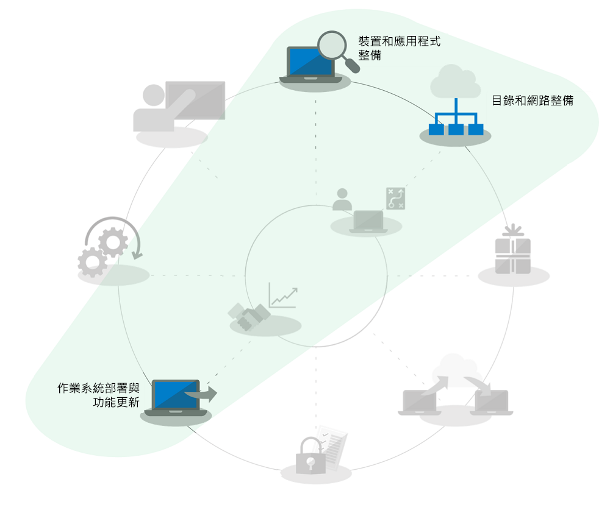
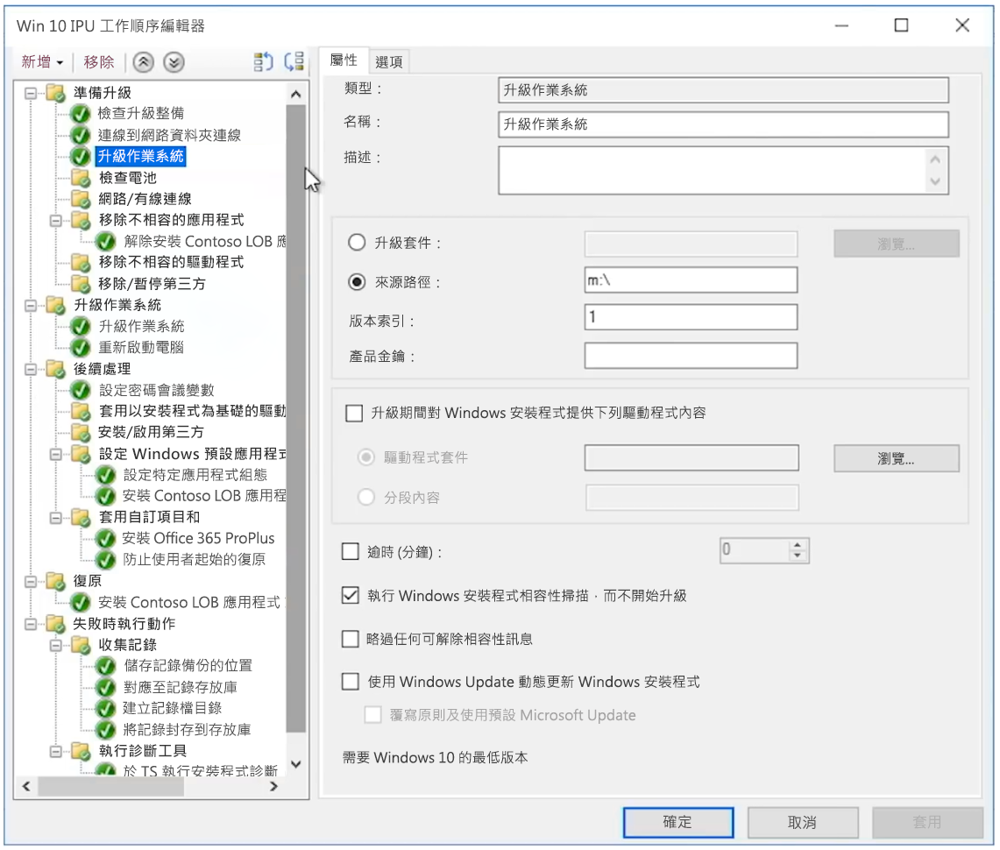

# 適用於大型組織的 Windows 7 至 Windows 10 自動就地升級

自 2020 年 1 月 14 日起，我們不再提供適用於執行 Windows 7 電腦的安全性更新或支援。 從 Windows 7 升級至 Windows 10 的時間只剩幾個月，卻還有許多選項需要進行部署，因此 IT 社群內最常見的問題便是「從 Windows 7 移至 Windows 10 的最快方法是什麼？」 簡單來說，答案就是針對現有的電腦執行就地升級，這樣做的好處是可以減少對桌面部署程序幾個層面的關注。

使用就地升級可以在範圍內大幅降低數個桌面部署程序，尤其是：

  - **應用程式封裝**和重新傳遞所需的企業營運應用程式 - 這些項目會直接從 Windows 7 環境轉移

  - **檔案移轉**和基本的使用者設定 - 保留裝置的使用者相同時，這些項目也會從先前的安裝轉移

在上方的部署程序轉輪圖形中，呈現灰色的工作不是可以完全略過的項目，但是為節省時間，此處假設您會轉移安全性組態，在部署後變更軟體更新程序；此外，自 2012 年起，私人購買的 Windows 電腦大部分都沒有預先載入 Windows 7，而且從 2015 年發行 Windows 10 開始，大多數的 Windows 7 家用系統已升級至 Windows 10，因此我們將假設您的 Windows 元件使用者訓練已大範圍地在使用者家中實施。

## 就地升級的可靠性、保護措施和規模

就地升級至 Windows 10 是可靠的方法，可以將現有執行 Windows 7 或更新版裝置移至 Windows 10，而且不需要移轉檔案或重新安裝應用程式。 就地升級之後，使用者的檔案、設定以及可使用的應用程式會與先前的 Windows 7 安裝一致。 您可能想要趁這個機會清理現有的應用程式或設定，然而實際上，由於我們已越來越接近 2020 年 1 月 Windows 7 支援終止的時間，時間上已不容許我們尋求其他的選項。 若是類似架構之間的移動 (32 位元移至 32 位元，或 64 位元移至 64 位元) 以及 Windows 類似版本之間的移動 (Professional 移至專業版，或企業版移至企業版)，這類的升級同樣也適用。

依預設，升級程序會備份您先前的 Windows 安裝作為升級的一部分，因此發生升級失敗，或是如果裝置或應用程式在升級後無法正常運作時，電腦可以回復至 Windows 7。 已升級的電腦依預設有 10 天的期限，因此您可以在需要時手動啟動 Windows 7 的回復。

使用作業系統部署工具，如 [Microsoft Endpoint Configuration Manager](https://docs.microsoft.com/configmgr/osd/deploy-use/create-a-task-sequence-to-upgrade-an-operating-system) 或 [Microsoft 部署工具組](https://docs.microsoft.com/windows/deployment/upgrade/upgrade-to-windows-10-with-the-microsoft-deployment-toolkit)，可以自動化就地升級。 本文內容強調自動化方法和最佳化，以及可取得其他協助的相關資源連結。

## 升級少量電腦

若是單一部電腦或少數幾部電腦，相較於更加自動化的方法，手動升級的方法通常是最佳的選擇。 您可以在 [Microsoft 市集](https://go.microsoft.com/fwlink/p/?LinkId=808282)、其他軟體零售商或在[大量授權服務中心](https://www.microsoft.com/licensing/servicecenter/default.aspx) (如果您有大量授權) 找到所需的軟體與授權。 如需將單一部電腦升級至 Windows 10 的詳細指引以及升級後的還原選項，請參閱 [Windows 7 至 Windows 10 手動升級逐步指南](https://docs.microsoft.com/microsoft-365/enterprise/windows-7-to-windows-10-upgrade)。

## 如何升級大量電腦

如果您管理的電腦有數十或數千部，您的最佳選擇就是透過 Microsoft Endpoint Configuration Manager 或 Microsoft 部署工具組，執行工作順序自動化就地升級。 雖然在大多數的情況下這個程序非常可靠，但是根據您升級的電腦數量，仍然有必要就地測試和控制以確保大規模成功。

這表示您可以略過與 Azure Active Directory 相關聯的目錄整備和工作、Office 和企業營運應用程式的傳遞和封裝，以及使用者檔案移轉，因為這些層面會保留作為升級的一部分，而且安全性是至少應轉移的部分。 這些方面可以隨時間進行增強。

升級部署的選項詳述於＜[作業系統部署與功能更新](https://www.aka.ms/mdd6)＞，雖然您可以輕鬆建立指令碼解決方案，以自動化方式執行 Windows 10 安裝程式，將與系統管理員的互動最小化或甚至完全不需要，但是工作順序可以讓您進行更精細的控制：

  - 執行預先部署檢查、

  - 在升級前管理磁碟機加密狀態、

  - 在升級前解除安裝已知有問題的驅動程式和應用程式、

  - 在升級後安裝其他驅動程式和應用程式、

  - 在升級後管理磁碟機加密狀態、

  - 發生升級失敗時，將電腦還原至先前的狀態 - 已解除安裝的應用程式或驅動程式會重新安裝、

  - 以及任何您需要設定以達到企業就緒狀態的項目

升級無法完成或無法進行的最常見原因包括這些挑戰：

  - 過時裝置的驅動程式

  - 第三方磁碟加密

  - 低階程式碼解決方案，例如反惡意程式碼、VPN 或虛擬化

[升級工作順序](https://docs.microsoft.com/configmgr/osd/deploy-use/create-a-task-sequence-to-upgrade-an-operating-system)範本已內建於 Microsoft Endpoint Configuration Manager (最新分支)，並已提供數種版本。 在最新版本中，Microsoft Endpoint Configuration Manager 有顯著的技術增強，能讓程序更有效率地判斷裝置和 Office 的相容性整備、降低網路流量並設定新的選項，例如 OneDrive 備份。 請觀賞這段 [Microsoft Mechanics 節目](https://youtu.be/CYRnAmCD7ls)，深入了解 Configuration Manager 作業系統部署最近的更新。

如果不使用 Microsoft Endpoint Configuration Manager，您可以使用 Microsoft 部署工具組建立並執行升級部署工作順序。

## 預先快取工作順序升級

Configuration Manager 部署工作順序的[預先快取選項](https://docs.microsoft.com/configmgr/osd/deploy-use/create-a-task-sequence-to-upgrade-an-operating-system#configure-pre-cache-content)可讓用戶端在工作順序升級作業系統之前，先下載相關的作業系統升級套件內容。 在之前，啟動工作順序會啟動套件內容的下載。 預先快取內容也可以讓您選擇，使用戶端一接收到部署時，只能下載適用的作業系統升級套件和所有其他的參考內容。

預先快取工作順序與相容性掃描結合

除了節省套件下載的時間外，您可以預先快取升級套件，並使用 Windows 安裝程式評估就地升級是否會在執行實際的 Windows 升級之前成功完成。 下列命令列語法可以無訊息方式執行相容性掃描，找出 Windows 安裝程式評估為是否可以準備升級的裝置。

接下來，記錄會傳送至您定義的伺服器路徑，Windows 安裝程式本身不會顯示讓使用者看見，也無需使用者的互動來關閉。

記錄的結果本身會是：

1.  如果安裝程式找不到任何相容性問題，而且電腦顯示為符合所有要求，安裝程式會傳回 MOSETUP\_E\_COMPAT\_SCANONLY (0xC1900210)

2.  如果安裝程式找到可採取動作的相容性問題，例如已知是不相容的應用程式，則安裝程式會傳回 MOSETUP\_E\_COMPAT\_INSTALLREQ\_BLOCK (0xC1900208)

3.  如果安裝程式找到的電腦不符合安裝 Windows 10 的要求，安裝程式會傳回 MOSETUP\_E\_COMPAT\_SYSREQ\_BLOCK (0xC1900200)

4.  如果安裝程式找到的電腦沒有足夠的可用空間進行安裝，安裝程式會傳回 MOSETUP\_E\_INSTALLDISKSPACE\_BLOCK (0xC190020E)

您部署預先快取順序，對集合中的大量電腦執行相容性掃描後，您可以開始剖析裝置整備的記錄檔。 以上方列出的輸出結果為例，\#1 (0xC1900210) 可以採取的動作為「可開始部署」，\#4 (0xC190020E) 可以採取的動作為釋放磁碟空間。 此處要注意的是您要刪除的內容，不過 Windows Update 清理、資源回收筒和暫存檔都是您可以開始刪除的地方，而且有許多情況都能提供足夠的空間使升級成功完成。 您可以視需求時常執行相容性掃描，直到找到已準備就緒可以進行就地升級的電腦為止。 您可以在此找到更多有關 Windows 安裝程式命令列選項的資訊：<https://aka.ms/setupswitches>

## [桌面部署中心](https://aka.ms/howtoshift)
