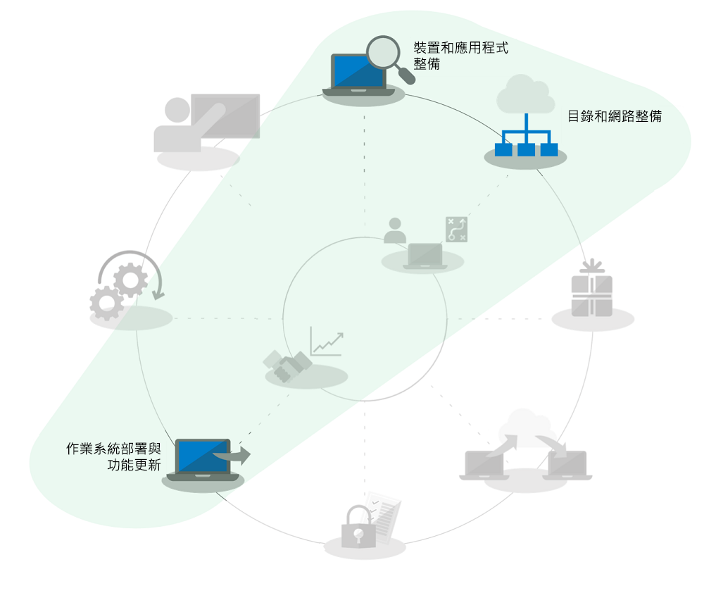
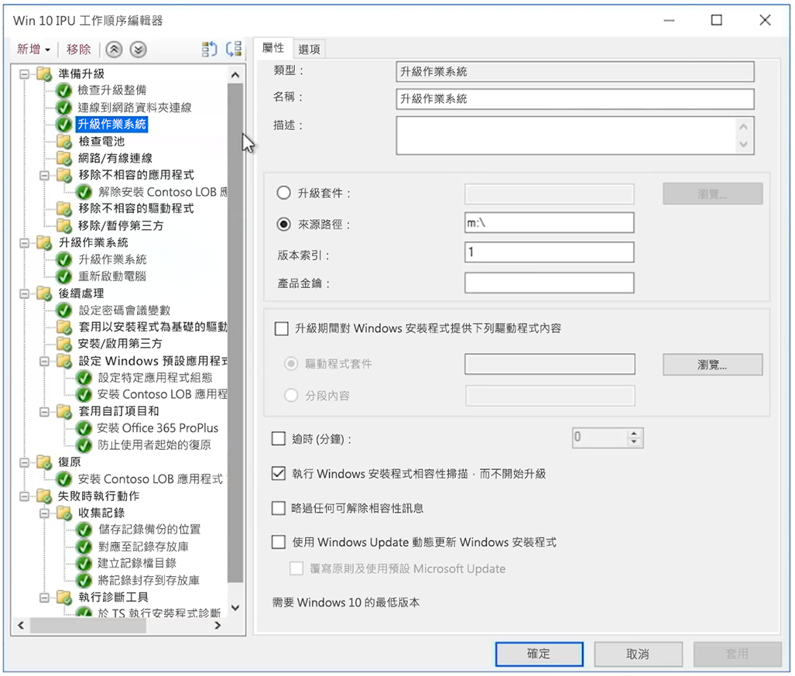

# 適用於大型組織的 Windows 7 至 Windows 10 自動就地升級Windows 7 to Windows 10 automated in-place upgrades for large organizations

自 2020 年 1 月 14 日起，我們不再提供適用於執行 Windows 7 電腦的安全性更新或支援。Starting January 14, 2020, security updates or support for PCs running Windows 7 will no longer be provided. 從 Windows 7 升級至 Windows 10 的時間只剩幾個月，卻還有許多選項需要進行部署，因此 IT 社群內最常見的問題便是「從 Windows 7 移至 Windows 10 的最快方法是什麼？」With just a months left to shift from Windows 7 to Windows 10 and multiple options to deploy, a common question in the IT community is, “What’s the fastest way to move from Windows 7 to Windows 10?” 簡單來說，答案就是針對現有的電腦執行就地升級，這樣做的好處是可以減少對桌面部署程序幾個層面的關注。The short answer is to perform in-place upgrades for existing PCs and in doing that you can reduce focus on several aspects of the desktop deployment process.

使用就地升級可以在範圍內大幅降低數個桌面部署程序，尤其是：Using in-place upgrades, several desktop deployment processes get reduced dramatically in scope, especially:

  - **應用程式封裝**和重新傳遞所需的企業營運應用程式 - 這些項目會直接從 Windows 7 環境轉移**Application packaging** and redelivery of required line-of-business apps – these are simply carried forward from the Windows 7 environment

  - **檔案移轉**和基本的使用者設定 - 保留裝置的使用者相同時，這些項目也會從先前的安裝轉移**File migration** and basic user settings – these are also carried forward from the previous install when the same user retains the device

在上方的部署程序轉輪圖形中，呈現灰色的工作不是可以完全略過的項目，但是為節省時間，此處假設您會轉移安全性組態，在部署後變更軟體更新程序；此外，自 2012 年起，私人購買的 Windows 電腦大部分都沒有預先載入 Windows 7，而且從 2015 年發行 Windows 10 開始，大多數的 Windows 7 家用系統已升級至 Windows 10，因此我們將假設您的 Windows 元件使用者訓練已大範圍地在使用者家中實施。The grayed-out tasks in the deployment process wheel graphic above are not items that you can completely ignore, but to save time this assumes that you’ll bring forward your security configuration, change software update processes post-deployment, and we’ll assume that your user training for the Windows component has largely happened at home for your users, as privately purchased Windows computers since 2012 for most part have not had Windows 7 pre-loaded and since the release of Windows 10 in 2015, the majority of Windows 7 home systems have also been upgraded to Windows 10.

## 就地升級的可靠性、保護措施和規模In-place upgrade reliability, safeguards, and scale

就地升級至 Windows 10 是可靠的方法，可以將現有執行 Windows 7 或更新版裝置移至 Windows 10，而且不需要移轉檔案或重新安裝應用程式。In-place upgrades to Windows 10 are a reliable approach for moving an existing device running Windows 7 or newer to Windows 10, without requiring file migration or application reinstallation. 就地升級之後，使用者的檔案、設定以及可使用的應用程式會與先前的 Windows 7 安裝一致。After an in-place upgrade, the user’s files, settings and available apps are consistent with their previous Windows 7 installation. 您可能想要趁這個機會清理現有的應用程式或設定，然而實際上，由於我們已越來越接近 2020 年 1 月 Windows 7 支援終止的時間，時間上已不容許我們尋求其他的選項。While you might want to take this opportunity to clean-up existing apps or settings, realistically as we get closer to the Windows 7 end of support date in January 2020, time is running out to pursue other options. 若是類似架構之間的移動 (32 位元移至 32 位元，或 64 位元移至 64 位元) 以及 Windows 類似版本之間的移動 (Professional 移至專業版，或企業版移至企業版)，這類的升級同樣也適用。Upgrades also work when moving from like-to-like architectures (32-bit to 32-bit or 64-bit to 64-bit) and like-to-like editions of Windows (Professional to Pro or Enterprise to Enterprise).

依預設，升級程序會備份您先前的 Windows 安裝作為升級的一部分，因此發生升級失敗，或是如果裝置或應用程式在升級後無法正常運作時，電腦可以回復至 Windows 7。The upgrade process by default backs-up your previous Windows installation as part of upgrade, so that in the event of an upgrade failure or if a device or application doesn’t function properly post-upgrade, the computer can roll back to Windows 7. 已升級的電腦依預設有 10 天的期限，因此您可以在需要時手動啟動 Windows 7 的回復。Upgraded PCs by default have 10 days so you can manually initiate a roll back to Windows 7 if necessary.

使用作業系統部署工具，如 [System Center Configuration Manager](https://docs.microsoft.com/zh-TW/sccm/osd/deploy-use/create-a-task-sequence-to-upgrade-an-operating-system) 或 [Microsoft 部署工具組](https://docs.microsoft.com/zh-TW/windows/deployment/upgrade/upgrade-to-windows-10-with-the-microsoft-deployment-toolkit)，可以自動化就地升級。In-place upgrades can be automated using operating system deployment tools like [System Center Configuration Manager](https://docs.microsoft.com/zh-TW/sccm/osd/deploy-use/create-a-task-sequence-to-upgrade-an-operating-system) or the [Microsoft Deployment Toolkit](https://docs.microsoft.com/zh-TW/windows/deployment/upgrade/upgrade-to-windows-10-with-the-microsoft-deployment-toolkit). 本文內容強調自動化方法和最佳化，以及可取得其他協助的相關資源連結。This article highlights the automated approaches and optimizations along with links to related resources for additional help.

## 升級少量電腦Upgrading a small number of computers

若是單一部電腦或少數幾部電腦，相較於更加自動化的方法，手動升級的方法通常是最佳的選擇。For a single computer or a handful of computers, the manual approach to upgrade is usually the best option compared to more automated approaches. 您可以在 [Microsoft 市集](http://go.microsoft.com/fwlink/p/?LinkId=808282)、其他軟體零售商或在[大量授權服務中心](https://www.microsoft.com/licensing/servicecenter/default.aspx) (如果您有大量授權) 找到所需的軟體與授權。You can find the necessary software and licenses at the [Microsoft Store](http://go.microsoft.com/fwlink/p/?LinkId=808282), other software retailers, or at the [Volume Licensing Service Center](https://www.microsoft.com/licensing/servicecenter/default.aspx) if you have volume licensing. 如需將單一部電腦升級至 Windows 10 的詳細指引以及升級後的還原選項，請參閱 [Windows 7 至 Windows 10 手動升級逐步指南](https://docs.microsoft.com/zh-TW/microsoft-365/enterprise/windows-7-to-windows-10-upgrade)。For detailed guidance to upgrade a single PC to Windows 10 as well as post-upgrade restore options, see the [Windows 7 to Windows 10 manual upgrade step-by-step guide](https://docs.microsoft.com/zh-TW/microsoft-365/enterprise/windows-7-to-windows-10-upgrade).

## 如何升級大量電腦How to upgrade many computers

如果您管理的電腦有數十或數千部，您的最佳選擇就是透過 System Center Configuration Manager 或 Microsoft 部署工具組，執行工作順序自動化就地升級。If you manage dozens or thousands of computers, then your best option is to perform in-place upgrades using task sequence automation with System Center Configuration Manager or the Microsoft Deployment Toolkit. 雖然在大多數的情況下這個程序非常可靠，但是根據您升級的電腦數量，仍然有必要就地測試和控制以確保大規模成功。While the process is very reliable in most situations, depending on the number of PCs you are upgrading, it still makes sense to have the necessary testing and controls in place to ensure success at scale.

這表示您可以略過與 Azure Active Directory 相關聯的目錄整備和工作、Office 和企業營運應用程式的傳遞和封裝，以及使用者檔案移轉，因為這些層面會保留作為升級的一部分，而且安全性是至少應轉移的部分。This means that you may skip directory readiness or tasks associated with Azure Active Directory, Office and line of business app delivery and packaging and user file migration since those aspects are retained as part of upgrade, and security should be at minimum carried forward. 這些方面可以隨時間進行增強。These areas can all be enhanced over time.

升級部署的選項詳述於＜[作業系統部署與功能更新](http://www.aka.ms/mdd6)＞，雖然您可以輕鬆建立指令碼解決方案，以自動化方式執行 Windows 10 安裝程式，將與系統管理員的互動最小化或甚至完全不需要，但是工作順序可以讓您進行更精細的控制：The upgrade deployment option is covered in [OS Deployment and Feature Updates](http://www.aka.ms/mdd6) and although you can easily build scripted solutions that will run Windows 10 setup in an automated way with minimal or no admin interaction, a task sequence will give you more granular control to:

  - 執行預先部署檢查、Perform pre-deployment checks,

  - 在升級前管理磁碟機加密狀態、Manage drive encryption state pre-upgrade,

  - 在升級前解除安裝已知有問題的驅動程式和應用程式、Uninstall known problematic drivers and apps pre-upgrade,

  - 在升級後安裝其他驅動程式和應用程式、Install additional drivers and apps post-upgrade,

  - 在升級後管理磁碟機加密狀態、Manage drive encryption state post-upgrade,

  - 發生升級失敗時，將電腦還原至先前的狀態 - 已解除安裝的應用程式或驅動程式會重新安裝、Restore a PC to a previous state – where uninstalled apps or drivers are reinstalled – in the event of a failed upgrade,

  - 以及任何您需要設定以達到企業就緒狀態的項目Along with anything else you need to configure to achieve a business ready state

升級無法完成或無法進行的最常見原因包括這些挑戰：The most common reasons upgrades may not complete or are not possible include challenges with:

  - 過時裝置的驅動程式Outdated device drivers

  - 第三方磁碟加密3rd party disk encryption

  - 低階程式碼解決方案，例如反惡意程式碼、VPN 或虛擬化Low level code solutions, such as anti-malware, VPN or virtualization

[升級工作順序](https://docs.microsoft.com/zh-TW/sccm/osd/deploy-use/create-a-task-sequence-to-upgrade-an-operating-system)範本已內建於 System Center Configuration Manager 最新分支，並已提供數種版本。[Upgrade task sequence](https://docs.microsoft.com/zh-TW/sccm/osd/deploy-use/create-a-task-sequence-to-upgrade-an-operating-system) templates are built into System Center Configuration Manager current branch and have been available for several releases. 在最新版本中，System Center Configuration Manager 有顯著的技術增強，能讓程序更有效率地判斷裝置和 Office 的相容性整備、降低網路流量並設定新的選項，例如 OneDrive 備份。In recent releases, there have been significant technology enhancements to System Center Configuration Manager that make the process even more efficient for determining device and Office compatibility readiness, reducing network traffic, and configuring new options such as OneDrive backup. 請觀賞這段 [Microsoft Mechanics 節目](https://youtu.be/CYRnAmCD7ls)，深入了解 System Center Configuration Manager 作業系統部署最近的更新。Watch this [Microsoft Mechanics show](https://youtu.be/CYRnAmCD7ls) to learn more about recent updates to System Center Configuration Manager OS deployment.

如果不使用 System Center Configuration Manager，您可以使用 Microsoft 部署工具組建立並執行升級部署工作順序。If you do not use System Center Configuration Manager, you can use the Microsoft Deployment Toolkit to build and execute upgrade deployment task sequences.

## 預先快取工作順序升級Pre-cache task sequence upgrades

Configuration Manager 部署工作順序的[預先快取選項](https://docs.microsoft.com/zh-TW/sccm/osd/deploy-use/create-a-task-sequence-to-upgrade-an-operating-system#configure-pre-cache-content)可讓用戶端在工作順序升級作業系統之前，先下載相關的作業系統升級套件內容。The [pre-cache option](https://docs.microsoft.com/zh-TW/sccm/osd/deploy-use/create-a-task-sequence-to-upgrade-an-operating-system#configure-pre-cache-content) for Configuration Manager deployment task sequence allows clients to download relevant OS upgrade package content before the task sequence upgrades the operating system. 在之前，啟動工作順序會啟動套件內容的下載。Previously, initiating the task sequence would initiate the download of package content. 預先快取內容也可以讓您選擇，使用戶端一接收到部署時，只能下載適用的作業系統升級套件和所有其他的參考內容。Pre-cache content also gives you the option for the client to only download the applicable OS upgrade package and all other referenced content as soon as it receives the deployment.

預先快取工作順序與相容性掃描結合Pre-cache task sequences combined with compatibility scans

除了節省套件下載的時間外，您可以預先快取升級套件，並使用 Windows 安裝程式評估就地升級是否會在執行實際的 Windows 升級之前成功完成。In addition to saving time for the package download, you can pre-cache the upgrade package and use Windows setup to assess whether the in-place upgrade will succeed prior to executing the actual Windows upgrade. 下列命令列語法可以無訊息方式執行相容性掃描，找出 Windows 安裝程式評估為是否可以準備升級的裝置。The following command line syntax can be used to silently execute a compatibility scan and find out whether or not Windows Setup assesses the device as ready for upgrade.

接下來，記錄會傳送至您定義的伺服器路徑，Windows 安裝程式本身不會顯示讓使用者看見，也無需使用者的互動來關閉。Logs will then be sent to your defined server path and Windows Setup will not show itself to the user and close without user interaction.

記錄的結果本身會是：The results of the logs themselves will be:

1.  如果安裝程式找不到任何相容性問題，而且電腦顯示為符合所有要求，安裝程式會傳回 MOSETUP\_E\_COMPAT\_SCANONLY (0xC1900210)If Setup does not find any compatibility issue and the PC appears to meet all requirements, it will return MOSETUP\_E\_COMPAT\_SCANONLY (0xC1900210)

2.  如果安裝程式找到可採取動作的相容性問題，例如已知是不相容的應用程式，則安裝程式會傳回 MOSETUP\_E\_COMPAT\_INSTALLREQ\_BLOCK (0xC1900208)If Setup finds actionable compatibility issues, like apps known incompatible, it will return MOSETUP\_E\_COMPAT\_INSTALLREQ\_BLOCK (0xC1900208)

3.  如果安裝程式找到的電腦不符合安裝 Windows 10 的要求，安裝程式會傳回 MOSETUP\_E\_COMPAT\_SYSREQ\_BLOCK (0xC1900200)If Setup finds the PC is not eligible for Windows 10, it will return MOSETUP\_E\_COMPAT\_SYSREQ\_BLOCK (0xC1900200)

4.  如果安裝程式找到的電腦沒有足夠的可用空間進行安裝，安裝程式會傳回 MOSETUP\_E\_INSTALLDISKSPACE\_BLOCK (0xC190020E)If Setup finds that PC does not have enough free space to install, it will return MOSETUP\_E\_INSTALLDISKSPACE\_BLOCK (0xC190020E)

您部署預先快取順序，對集合中的大量電腦執行相容性掃描後，您可以開始剖析裝置整備的記錄檔。Once you’ve deployed pre-cache sequences with compatibility scans to a large number of PCs in a collection, you can begin to parse the log files for device readiness. 以上方列出的輸出結果為例，\#1 (0xC1900210) 可以採取的動作為「可開始部署」，\#4 (0xC190020E) 可以採取的動作為釋放磁碟空間。Using the outputs listed above, \#1 (0xC1900210) can be actioned as “ready to deploy” and \#4 (0xC190020E) can be actioned by freeing up disk space. 此處要注意的是您要刪除的內容，不過 Windows Update 清理、資源回收筒和暫存檔都是您可以開始刪除的地方，而且有許多情況都能提供足夠的空間使升級成功完成。Here, you’ll want to be careful about what to delete, but Windows Update Cleanup, Recycle Bin, and Temporary Files are places to start and many cases will provide enough space for the upgrade to succeed. 您可以視需求時常執行相容性掃描，直到找到已準備就緒可以進行就地升級的電腦為止。Can you run the compat scan as often as needed until the PC is found ready for the in-place upgrade. 您可以在此找到更多有關 Windows 安裝程式命令列選項的資訊：<https://aka.ms/setupswitches>You can find more information about Windows Setup command line options at <https://aka.ms/setupswitches>

## [桌面部署中心Desktop Deployment Center](https://aka.ms/howtoshift)
