# Windows 7 至 Windows 10 手動升級逐步指南

本文說明將 Windows 7 企業版電腦手動升級至 Windows 10 企業版的程序。 其他 Windows 7 版本 (例如家用版和專業版) 的程序非常相似，但您也可以選擇使用媒體建立工具直接升級。 從 Windows 7 任何版本升級至 Windows 10 需要有效的產品金鑰，以及相符或更高版本的 Windows，例如 Windows 7 專業版可以升級至 Windows 10 專業版，但無法升級至 Windows 10 家用版。 Windows 7 旗艦版必須升級至 Windows 10 專業版。

## 使用媒體建立工具或 ISO 檔案的 Windows 10 升級

您可以使用[媒體建立工具](https://www.microsoft.com/en-us/software-download/windows10ISO)直接升級至 Windows 10，或使用該工具將 Windows 10 下載為 ISO 檔案。 您必須知道您目前的系統是 32 還是 64 位元、系統的預設語言和 Windows 7 版本 (例如家用版、專業版或企業版)。 在 Windows 7 中，這項資訊位於 [控制台] \> [系統及安全性] \> [系統]。 媒體建立工具不支援 Windows 10 企業版進行升級、建立安裝媒體，或下載 ISO 檔案。 如果是從 Windows 7 企業版升級，您需要 Windows 10 企業版。

從 Windows 7 企業版升級至 Windows 10 企業版時，您必須從[大量授權服務中心](https://www.microsoft.com/licensing/servicecenter/default.aspx)下載適用於您的語言與架構 (32 位元或 64 位元) 的 ISO 檔案。

如果您規劃使用 ISO 檔案執行升級，您必須將 ISO 內的檔案擷取至您的本機檔案系統、卸除式磁碟機，或將 ISO 檔案燒錄至 DVD。 您可以使用 Windows 8 或更新的電腦擷取 ISO 內的安裝檔案，然後將這些檔案儲存到卸除式 USB 儲存裝置，或使用應用程式 (例如 [7zip](https://www.7-zip.org/)) 將 ISO 檔案的內容解壓縮到 Windows 7 本機磁碟機上的資料夾。

在 Windows 7 有了安裝媒體之後，您就可以執行 setup.exe 啟動升級程序，如下所示。

**重要提示：如果要進行就地升級 (亦即應用程式與您的資料要移轉至 Windows 10)，您必須從執行 Windows 7 的工作階段內啟動程序。從 DVD 或 USB 磁碟機開機進入安裝媒體不會提供您保留應用程式和檔案的選項，而是會執行 Windows 10 的全新安裝。**

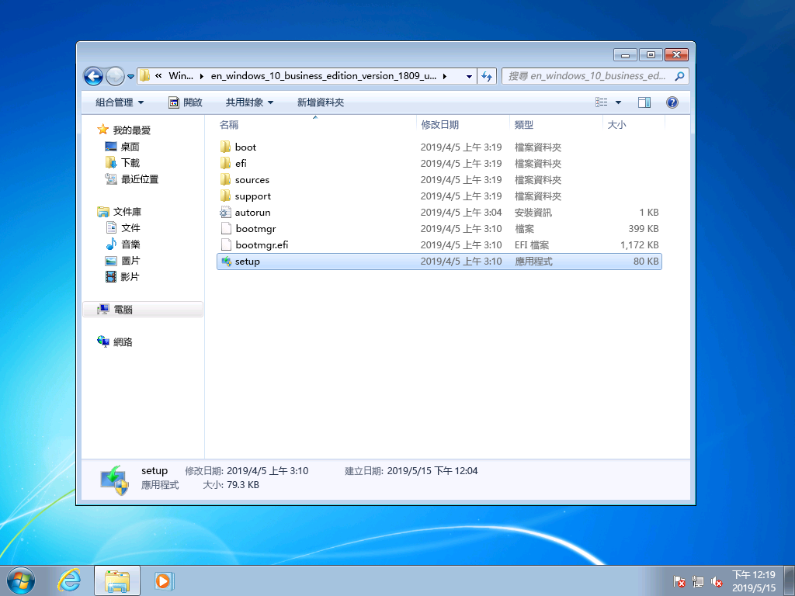

在 Windows 10 安裝程式中，程式將會引導您完成安裝程序，第一個畫面會提供下載更新、驅動程式和選擇性功能的選項。 建議您使用此選項，協助確保升級成功

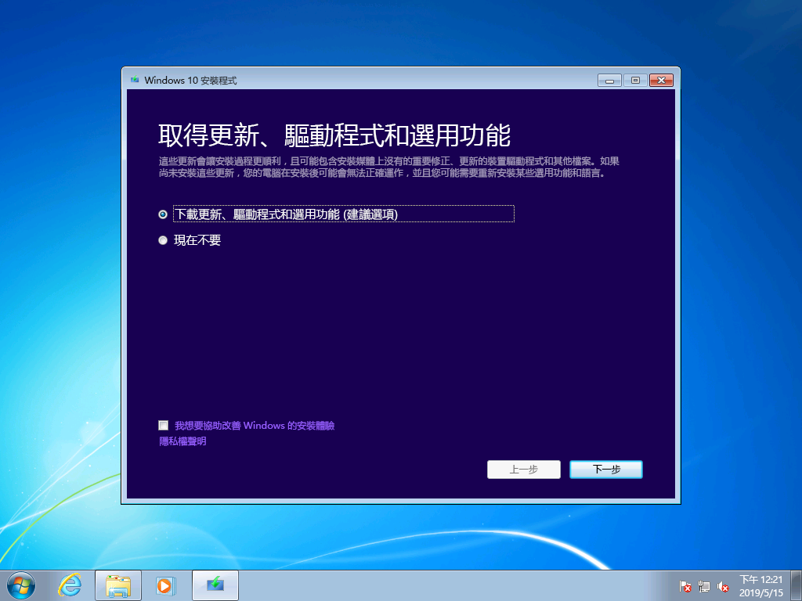

套用更新之後，Windows 10 安裝程式會移至下一個階段：選取映像。 在這裡，您必須選取您的 Windows 版本。 在此案例中，因為電腦安裝的是 Windows 7 企業版，所以您要選取 Windows 10 企業版。

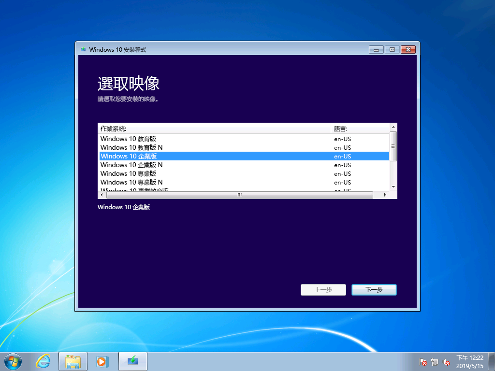

在 Windows 10 安裝程式的下一個畫面中，您會看到適用的注意事項與授權條款。 閱讀並了解注意事項和條款之後，請按一下 [接受] 繼續，或按一下 [拒絕] 取消安裝。

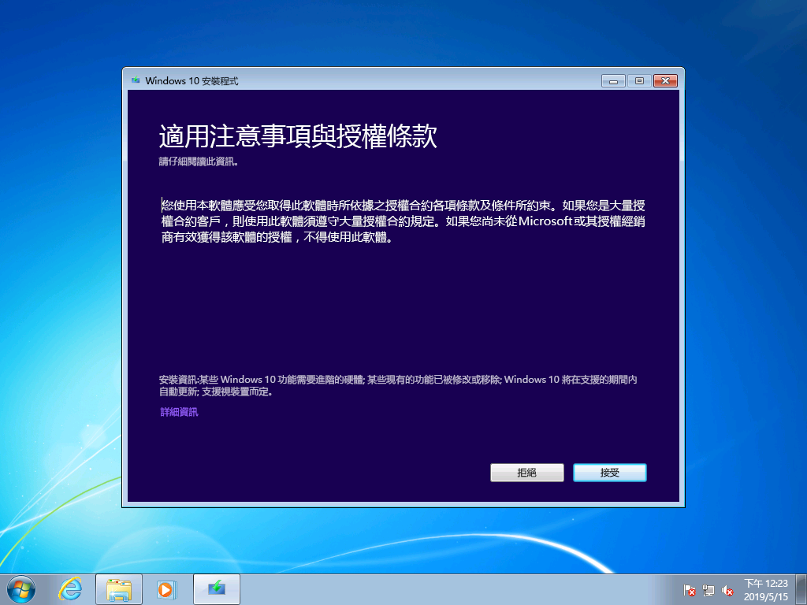

現在 Windows 10 安裝程式會尋找其他更新。

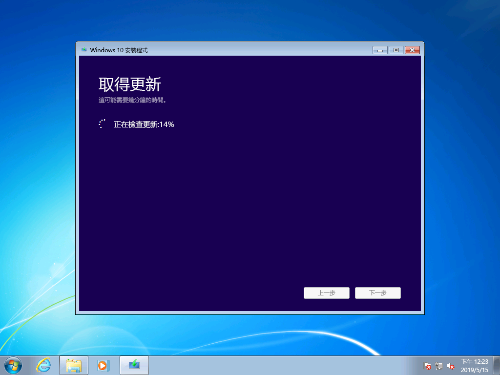

完成之後，Windows 10 安裝程式就可以開始安裝，而且依預設是設定為安裝 Windows 10，並且保留您的個人檔案和已安裝的應用程式。 此為建議選項。 按一下 [變更要保留的項目]，您會發現其他選項。 否則，請按一下 [安裝]。

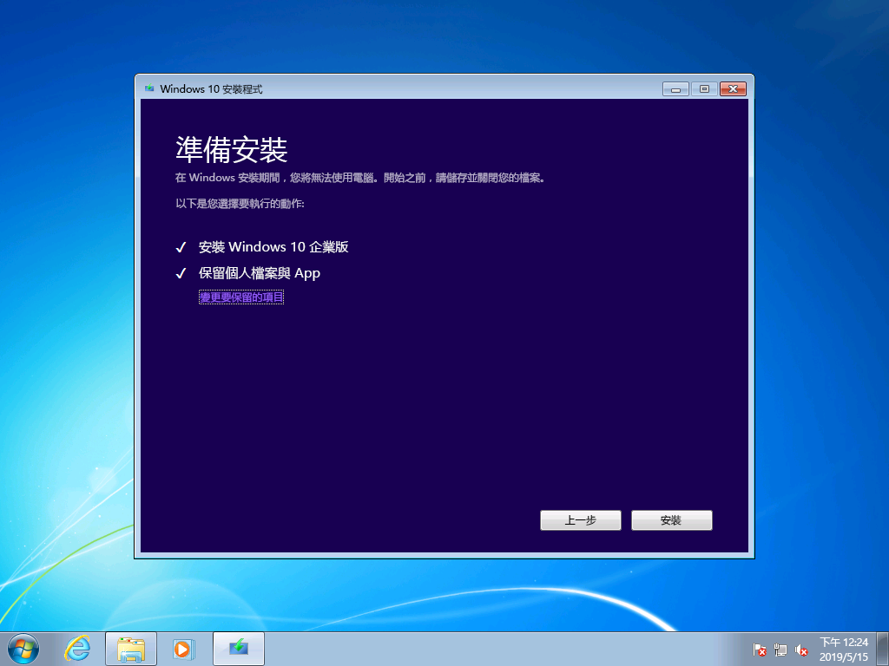

如果您選取 [變更要保留的項目]，您會看到下列選項：

[只保留個人檔案] 不會從 Windows 7 將您已安裝的應用程式或設定移動到 Windows 10。 只會將您的檔案和使用者帳戶移動到 Windows。 使用此選項，您之後必須重新安裝應用程式。 只有當您確定在 Windows 安裝之後，您可以重新安裝或設定需要的應用程式時，才使用此選項，否則請維持預設的 [保留個人檔案與應用程式] 選項。

[不保留任何項目] 會刪除您的檔案、應用程式及設定，並執行 Windows 的全新安裝。 只有當您先前已經備份想要保留的資料，而且能夠重新安裝您的應用程式時，才使用此選項。

現在 Windows 10 安裝程式會根據您在上一個畫面中選取的項目再次取得更新。

現在 Windows 10 會花幾分鐘的時間安裝，如果您選擇保留您的個人檔案和應用程式，所有項目都會在相同的檔案位置，您的應用程式現在會出現在 Windows 10 中。

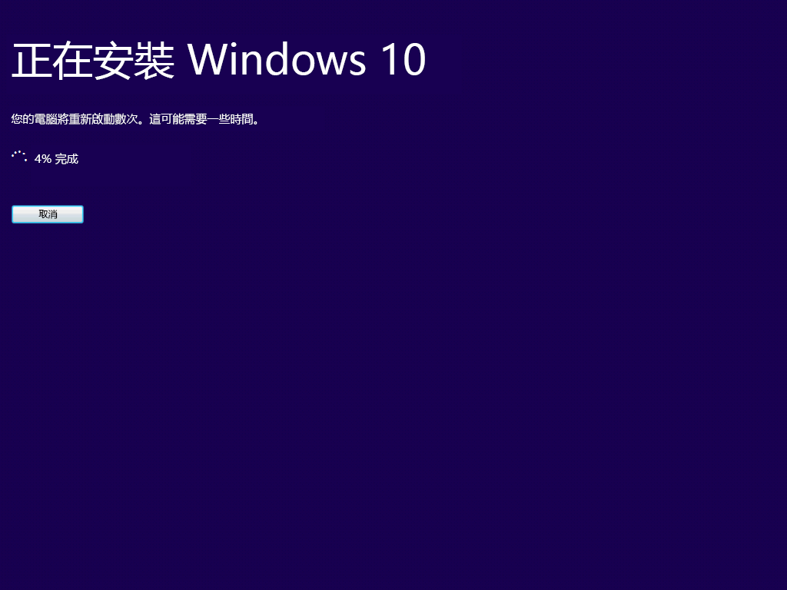

## 

## 在 Windows 10 中復原

安裝 Windows 10 之後，Windows 10 中的 [復原] 選項提供您最多 10 天的時間可以回復到 Windows 7。 如果裝置或您系統上的應用程式無法正常執行，使得您必須回復到先前的 Windows 7 安裝，這個選項很好用。 10 天之後，依預設 Windows 10 會釋出您硬碟上由 Windows 7 復原檔案所使用的空間，然後刪除先前安裝的檔案。 在這之後，雖然 Windows 7 已刪除，您也無法還原成 Windows 7，但是您的應用程式和個人檔案仍會保留在 Windows 10。

若要啟動「回復到 Windows 7」程序，請瀏覽至 [設定] \> [更新與安全性] \> [復原]。 在 [回到 Windows 7] 下，選取 [開始]。

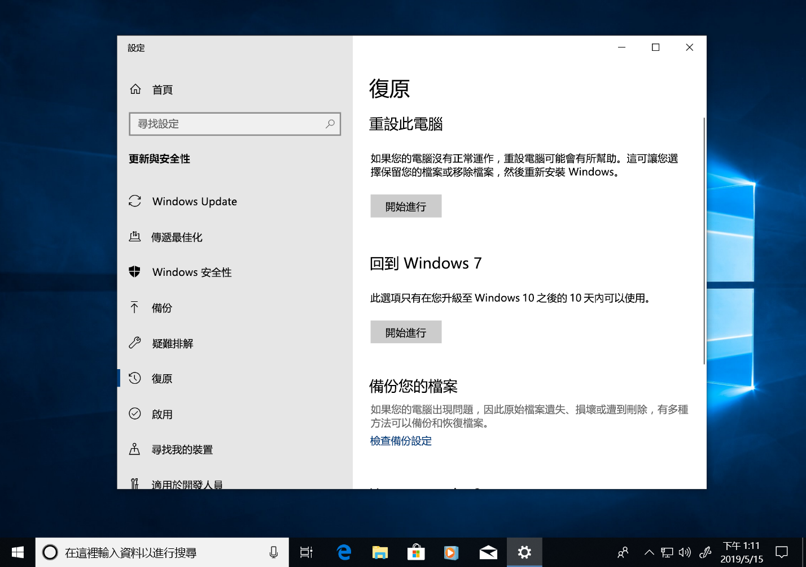

現在，Windows 10 會詢問您為什麼要回復。 如果有技術方面的原因，填寫內容有助於推動解決方案，確保其他人可以從您的經驗中獲益。

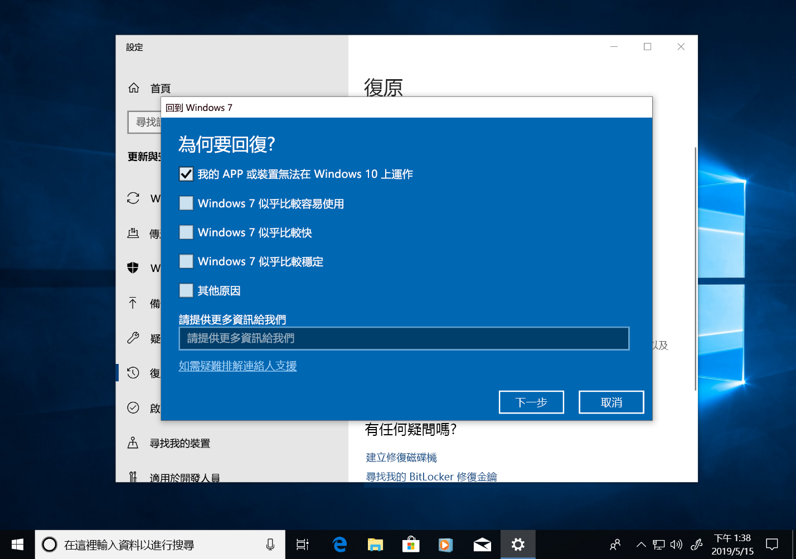

很多時候，您的 Windows 10 版本會有更新，或許可以解決技術性問題。 建議您檢查是否有更新，如果找到並安裝更新，請檢查是否能夠修正您遇到的問題。

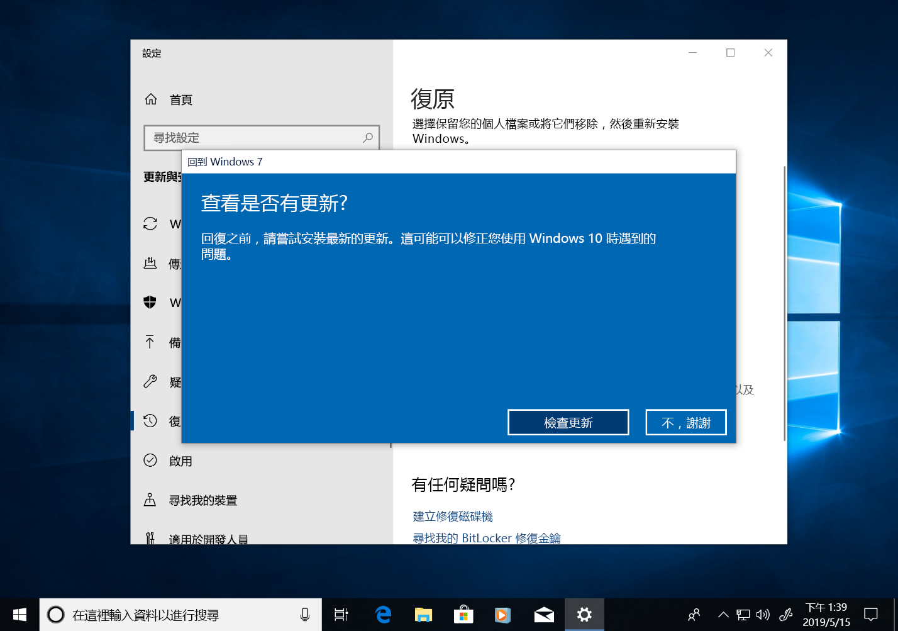

如果更新無法解決問題，您還是需要還原到先前安裝的 Windows 7，您可能必須重新安裝某些應用程式 (例如您在執行 Windows 10 期間安裝的任何應用程式)，也可能會遺失某些設定。 重要的是，您在使用 Windows 10 時儲存在本機的檔案和文件都會保留，當您回到 Windows 7 之後，就能使用。 

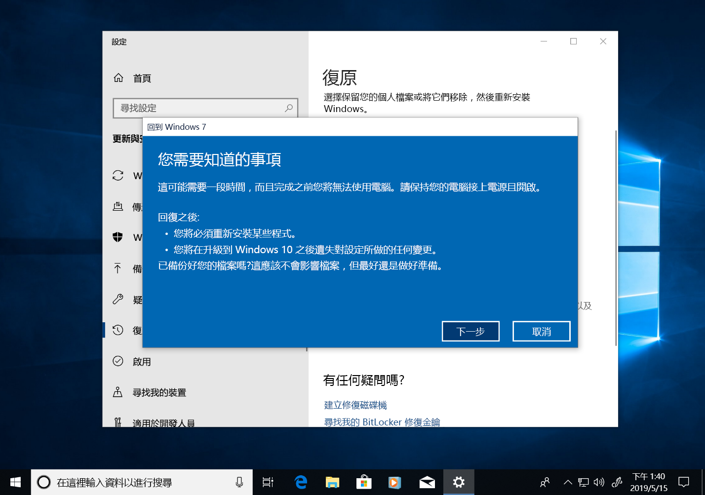

在您開始之前，請確認您已經準備好先前 Windows 7 安裝的本機或網域帳戶和密碼。

在這裡，您可以啟動回到 Windows 7 的程序。 幾分鐘之後，電腦會開機回到 Windows 7，您的體驗就會與升級到 Windows 10 之前相同。

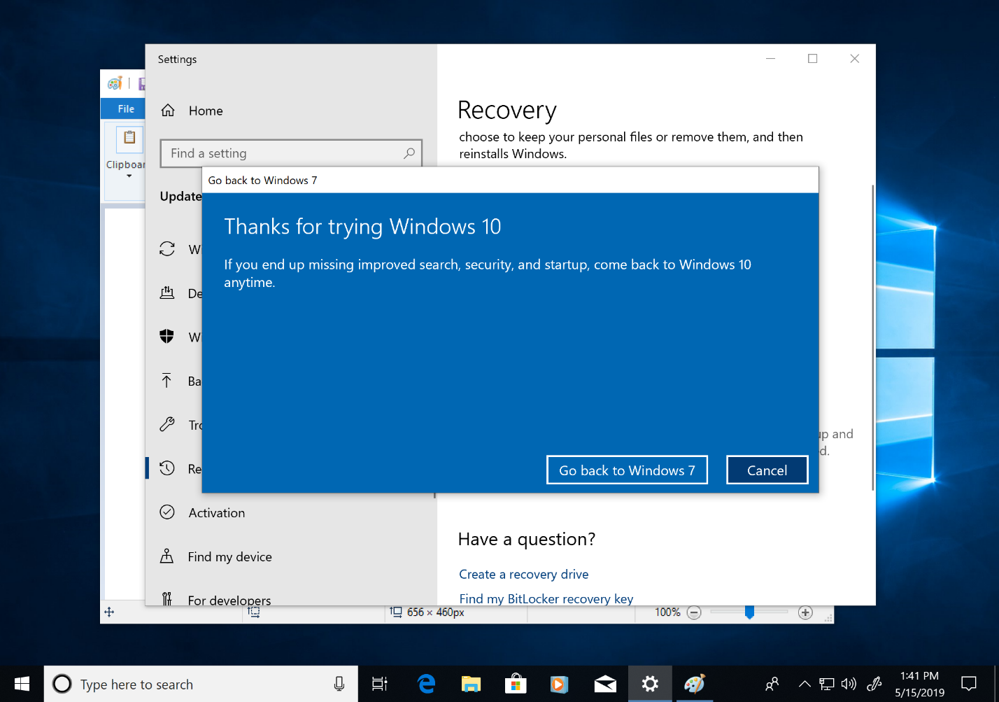

## 在新電腦上移至 Windows 10

另外一個建議的方法是在新電腦上移至 Windows 10。 如果您偏好這麼做，可以使用 [OneDrive](https://support.office.com/article/b5e918be-0fd4-4095-98da-bceed57f8e0c?ocid=MoveToWindows10) 備份、[內建於 Windows 的備份與還原](https://support.microsoft.com/help/4469209?ocid=MoveToWindows10)、手動使用[外部儲存裝置](https://support.microsoft.com/en-us/help/4465814/windows-7-move-files-off-pc-with-an-external-storage-device?ocid=MoveToWindows10)，或使用像 [Laplink 的 PCmover Express](https://www.microsoft.com/en-us/windows/transfer-your-data) 的工具，轉移舊電腦的檔案。 如果使用上述任何一種選項，您還是必須重新安裝未隨附於 Windows 10 的所有必要應用程式。 若要深入了解從執行 Windows 7 的現有電腦手動移至 Windows 10 新電腦的選項，請參閱 Windows 支援中的[移至 Windows 10 電腦](https://support.microsoft.com/en-us/help/4229823?ocid=MoveToWindows10)。

## [桌面部署中心](https://aka.ms/howtoshift)