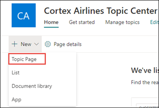
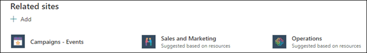
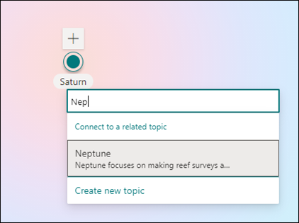
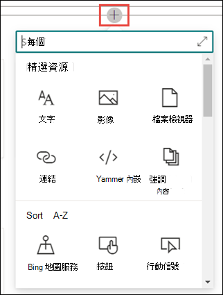

# 建立新主題Create a new topic 

在 Viva 主題中，您可以建立新的主題如果沒有透過索引探索，或是 AI 技術沒有找到足夠的證據來建立主題。In Viva Topics, you can create a new topic if one is not discovered through indexing or if the AI technology did not find enough evidence to establish it as a topic.

> [!Note] 
> 雖然 AI 收集的主題中的資訊是 [安全修整](topic-experiences-security-trimming.md)的，請注意，所有具有查看主題許可權的使用者皆可看到手動建立主題中的資訊。While information in a topic that is gathered by AI is [security trimmed](topic-experiences-security-trimming.md), note that information in a manually created topic is visible to all users who have permissions to view the topic. 

## 需求Requirements

若要建立新的主題，您必須：To create a new topic, you need to:
- 具有 Viva 主題授權。Have a Viva Topics license.
- 具有 [**可建立或編輯主題的人員**](https://docs.microsoft.com/microsoft-365/knowledge/topic-experiences-user-permissions)許可權。Have permissions to [**Who can create or edit topics**](https://docs.microsoft.com/microsoft-365/knowledge/topic-experiences-user-permissions). 知識系統管理員可以在 Viva 主題主題許可權設定中，將此許可權授與使用者。Knowledge admins can give users this permission in the Viva Topics topic permissions settings. 

> [!Note] 
> 有權管理主題中心主題的使用者 (知識管理員) 已具備建立及編輯主題的許可權。Users who have permission to manage topics in the topic center (knowledge managers) already have permissions to create and edit topics.

## 若要建立主題To create a topic

您可以從兩個位置建立新的主題：You can create a new topic from two locations:

- 主題中心首頁：具有 **可建立或編輯主題** 許可權 (參與者的任何授權使用者) 可以從主題中心建立新的主題，方法是選取 [ <b>新增</b> ] 功能表，然後選取 [ <b>主題] 頁面</b>。Topic center home page: Any licensed user with the **Who can create or edit topics** permission (contributors) can create a new topic from the topic center by selecting the <b>New</b> menu and select <b>Topic page</b>.  

       

- 「管理主題」頁面：任何有 **權管理主題** 許可權的授權使用者 (知識管理員) 可以從主題中心的 [管理主題] 頁面，選取 [ <b>新增主題] 頁面</b>，以建立新的主題。Manage topics page:  Any licensed user who has **Who can manage topics** permission (knowledge managers) can create a new topic from the Manage topics page in the Topic Center by selecting <b>New topic page</b>.  

       

### 若要建立新的主題：To create a new topic:

1. 在 [ **名稱這個主題** ] 區段中，輸入新主題的名稱。In the **Name this topic** section, type the name of the new topic.

       

2. 在 [ <b>替代名稱</b> ] 區段中，輸入該主題可能參考的任何其他名稱。In the <b>Alternate Names</b> section, type any other names that the topic might be referred to. 

       
3. 在 [ <b>描述</b> ] 區段中，輸入一些描述主題的句子。In the <b>Description</b> section, type a couple of sentences that describe the topic. 

     

4. 在 [ <b>固定人員</b> ] 區段中，您可以「鎖定」人員，將其顯示為主題上的主題專家。In the <b>Pinned people</b> section, you can "pin" a person to show them as a subject matter expert on the topic. 請先在 [ <b>新增使用者</b> ] 方塊中輸入他們的名稱或電子郵件地址，然後從搜尋結果中選取您要新增的使用者。Begin by typing their name or email address in the <b>add a new user</b> box, and then select the user you want to add from the search results. 您也可以從使用者卡片上選取 [ <b>從清單移除</b> ] 圖示來「解除固定」。You can also "unpin" them by selecting the <b>Remove from list</b> icon on the user card. 您也可以拖曳人員，以變更人員清單的顯示順序。You can also drag the person to change the order that the list of people appear.
 
     

5. 在 [ <b>附加的檔案與頁面</b> ] 區段中，您可以新增或「固定」與主題相關聯的檔案或 SharePoint 網站] 頁面。In the <b>Pinned files and pages</b> section, you can add or "pin" a file or SharePoint site page that is associated to the topic.

    
 
    若要新增檔案，請選取 [ <b>新增</b>]，選取您經常或已追蹤網站的 SharePoint 網站，然後從網站的文件庫中選取檔案。To add a new file, select <b>Add</b>, select the SharePoint site from your Frequent or Followed sites, and then select the file from the site's document library.

    您也可以透過提供 URL，使用 [ <b>發件</b> 人] 中的 [連結] 選項來新增檔或頁面。You can also use the <b>From a link</b> option to add a file or page by providing the URL. 

6.  [ <b>相關網站</b> ] 區段會顯示網站，其中包含主題的相關資訊。The <b>Related sites</b> section shows sites that have information about the topic. 

     

    您可以選取 [ <b>新增</b> ]，然後搜尋網站，或從您經常或最近的網站清單中進行選取，以新增相關的網站。You can add a related site by selecting <b>Add</b> and then either searching for the site, or selecting it from your list of Frequent or Recent sites. 
    
     

7. [ <b>相關主題</b> ] 區段會顯示主題之間存在的連線。The <b>Related topics</b> section shows connections that exist between topics. 您可以選取 [ <b>連線至相關主題]</b> 按鈕，然後輸入相關主題的名稱，然後再從搜尋結果中進行選取，以新增與其他主題的連接。You can add a connection to a different topic by selecting the <b>Connect to a related topic</b> button, and then typing the name of the related topic, and selecting it from the search results. 

      

    您可以接著提供相關主題的相關描述，然後選取 [ <b>更新</b>]。You can then give a description of how the topics are related, and select <b>Update</b>. 

     

   您新增的相關主題會顯示為連線的主題。The related topic you added will display as a connected topic.

     

8. 您也可以選取 [畫布] 圖示，將靜態專案新增至頁面 (例如文字、圖像或連結) ，您可以在簡短描述下方找到該圖示。You can also add static items to the page (such as text, images, or links) by selecting the canvas icon, which you can find below the short description. 選取它會開啟 SharePoint 工具箱，您可以從中選擇要新增至頁面的專案。Selecting it will open the SharePoint toolbox from which you can choose the item you want to add to the page.

     

9. 選取 [ **發佈** ] 以儲存變更。Select **Publish** to save your changes. 

在您發佈頁面後，主題名稱、替代名稱、描述及固定人員將會向所有查看該主題的授權使用者顯示。After you publish the page, the topic name, alternate name, description, and pinned people will display to all licensed users who view the topic. 只有當檢視器具有專案的 Office 365 許可權時，特定檔案、頁面和網站才會出現在 [主題] 頁面上。Specific files, pages, and sites will only appear on the topic page if the viewer has Office 365 permissions to the item. 

## 請參閱See also

  

