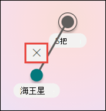

# 在 Microsoft Viva 主題中建立新的主題

在 Viva 主題中，您可以建立新的主題如果沒有透過索引探索，或是 AI 技術沒有找到足夠的證據來建立主題。

> [!Note] 
> [！附注] 透過 AI 收集的主題中的資訊是 [安全修整](topic-experiences-security-trimming.md)的，請注意，所有具有查看主題許可權的使用者皆可看到手動建立主題中的主題描述和人員資訊。 

## 需求

若要建立新的主題，您必須：
- 擁有 Viva Topics 授權。
- 具有神秘的許可權 [**可以建立或編輯主題**](./topic-experiences-user-permissions.md)。 知識系統管理員可以在 Viva Topics 主題權限設定中將此權限給予使用者。 

> [!Note] 
> 有權管理主題中心主題的使用者 (知識管理員) 已具備建立及編輯主題的許可權。

## 若要建立主題

您可以從兩個位置建立新主題：

- 主題中心首頁：任何使用神秘的授權使用者 **都可以建立或編輯主題** 許可權 (參與者) 可以從主題中心建立新的主題，方法是選取 [**新增**] 功能表，然後選取 [**主題] 頁面**。 

      

- 「管理主題」頁面：任何有神秘的授權使用者 **可以管理主題** 許可權 (知識管理員) 可以從主題中心的 [管理主題] 頁面，選取 [**新增主題] 頁面**，以建立新的主題。 

      

### 若要建立新主題：

1. 選取選項，從[管理主題] 頁面上的功能區建立新的主題頁面。

2.  在 ****[為此主題命名] 區段中，輸入新主題的名稱。

      

3. 在 **[替代名稱]** 章節中，輸入任何可能參考主題的其他名稱。 

      

4. 在 [ **描述** ] 區段中，輸入一些描述主題的句子。 

    

4. 在 [ **固定人員** ] 區段中，您可以「固定」人員，將其顯示為與主題的連線 (例如，連接資源的擁有者) 。 首先在 **[新增使用者方塊]** 中輸入其名稱或電子郵件地址，然後從搜尋結果中選取您要新增的使用者。 您也可以從使用者卡片上選取 [ **從清單移除** ] 圖示來「解除固定」。 您也可以將人員拖曳到清單中的另一個位置。
 
    

5. 在 **[釘選的檔案和網頁]** 章節中，新增或「釘選」與主題相關聯的檔案或 SharePoint 網站頁面。

   
 
    若要新增檔案，請選取 [**新增**]，選取您經常或已追蹤網站的 SharePoint 網站，然後從網站的文件庫中選取檔案。

    您也可以使用 **[從連結]** 選項，藉由提供 URL 來新增檔案或頁面。 

    > [!Note] 
    > 您新增的檔案和頁面必須位於相同的 Microsoft 365 租使用者內。 如果您想要在主題中新增外部資源的連結，您可以透過步驟8中的 canvas 圖示加以新增。

6.  **[相關網站]** 章節會顯示具有主題相關資訊的網站。 

    

    您可以選取 [ **新增** ]，然後搜尋網站，或從您經常或最近的網站清單中進行選取，以新增相關的網站。
    
    

7. [ **相關主題** ] 區段會顯示主題之間存在的連線。 您可以選取 [**連線至相關主題**] 按鈕，然後輸入相關主題的名稱，然後再從搜尋結果中進行選取，以新增與其他主題的連接。 

     

    您可以接著提供相關主題的相關描述，然後選取 [ **更新**]。

    

   您新增的相關主題會顯示為已連結的主題。

    

   若要移除相關主題，請選取您要移除的主題，然後選取 **移除主題** 圖示。
 
     

   然後選取 [ **移除**]。

    

8. 您也可以選取 [畫布] 圖示，將靜態專案新增至頁面 (例如文字、圖像或連結) ，您可以在簡短描述下方找到該圖示。 選取它會開啟 SharePoint 工具箱，您可以從中選擇要新增至頁面的專案。

    

9. 選取 ****[發佈] 以儲存變更。 

發佈頁面之後，主題名稱、替代名稱、描述和釘選的人員都會顯示給所有檢視主題的授權使用者。 如果檢視者具有 Office 365 權限，則特定檔案、頁面和網站只會出現在主題頁面上。 

## 請參閱

