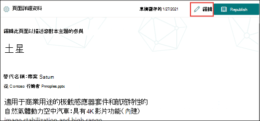
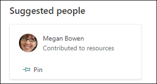

# 編輯現有主題 

 

> [!VIDEO https://www.microsoft.com/videoplayer/embed/RE4LA4n]  

 

在 Viva 主題中，您可以編輯現有的主題。 如果您想要更正或將其他資訊新增至現有的主題頁面，您可能需要執行此動作。 

> [!Note] 
> [！附注] 透過 AI 收集的主題中的資訊是 [安全修整](topic-experiences-security-trimming.md)的，請注意，在編輯現有主題時，您手動新增的資訊可對所有具有「查看主題」許可權的使用者顯示。 

## 需求

若要編輯現有的主題，您必須：
- 具有 Viva 主題授權。
- 具有 [**可建立或編輯主題的人員**](https://docs.microsoft.com/microsoft-365/knowledge/topic-experiences-user-permissions)許可權。 知識系統管理員可以在 Viva 主題主題許可權設定中，將此許可權授與使用者。 

> [!Note] 
> 有權管理主題中心主題的使用者 (知識管理員) 已具備建立及編輯主題的許可權。

## 如何編輯主題頁面

擁有 **誰可以建立或編輯主題** 許可權的使用者可以從主題醒目提示中開啟 [主題] 頁面，然後選取 [主題] 頁面右上方的 [ <b>編輯</b> ] 按鈕來編輯主題。 您也可以從主題中心首頁開啟 [主題] 頁面，您可以在此首頁找到您連接的所有主題。

      

知識管理員也可以從 [管理主題] 頁面直接編輯主題，方法是選取主題，然後選取工具列中的 [ <b>編輯</b> ]。

      

### 編輯主題頁面

1. 在 [主題] 頁面上，選取 [ **編輯**]。 這可讓您在 [主題] 頁面上進行所需的變更。

       

2. 在 [ <b>替代名稱</b> ] 區段中，輸入該主題可能參考的任何其他名稱。 

       
3. 在 [ <b>描述</b> ] 區段中，輸入一些描述主題的句子。 或者，如果有描述已存在，請視需要加以更新。

     

4. 在 [ <b>固定人員</b> ] 區段中，您可以「鎖定」人員，將其顯示為主題上的主題專家。 請先在 [ <b>新增使用者</b> ] 方塊中輸入他們的名稱或電子郵件地址，然後從搜尋結果中選取您要新增的使用者。 您也可以從使用者卡片上選取 [ <b>從清單移除</b> ] 圖示來「解除固定」。
 
     

    [ <b>建議人員</b> ] 區段會向使用者顯示 AI 思考可能成為主題相關主題的主題專家的使用者。 您可以選取使用者卡片上的 pin 圖示，將其狀態變更為 [已建議] （已鎖定）。

    

5. 在 [ <b>附加的檔案與頁面</b> ] 區段中，您可以新增或「固定」與主題相關聯的檔案或 SharePoint 網站] 頁面。

   ![[已固定的檔案與頁面] 區段](../media/knowledge-management/pinned-files-and-pages.png) 
 
    若要新增檔案，請選取 [ <b>新增</b>]，選取您經常或已追蹤網站的 SharePoint 網站，然後從網站的文件庫中選取檔案。

    您也可以透過提供 URL，使用 [ <b>發件</b> 人] 中的 [連結] 選項來新增檔或頁面。 

6. [ <b>建議的檔案與頁面</b> ] 區段會顯示 AI 建議與主題相關聯的檔案與頁面。

   ![[建議的檔案與頁面] 區段](../media/knowledge-management/suggested-files-and-pages.png) 

    您可以選取釘選的圖示，將建議的檔案或頁面設定為固定的檔案或頁面。

7.  [ <b>相關網站</b> ] 區段會顯示網站，其中包含主題的相關資訊。 

     

    您可以選取 [ <b>新增</b> ]，然後搜尋網站，或從您經常或最近的網站清單中進行選取，以新增相關的網站。 
    
     

8. [ <b>相關主題</b> ] 區段會顯示主題之間存在的連線。 您可以選取 [ <b>連線至相關主題]</b> 按鈕，然後輸入相關主題的名稱，然後再從搜尋結果中進行選取，以新增與其他主題的連接。 

      

    您可以接著提供相關主題的相關描述，然後選取 [ <b>更新</b>]。 

     

   您新增的相關主題會顯示為連線的主題。

     

9. 您也可以將靜態專案新增至頁面（如文字、圖像或連結），方法是選取 [畫布] 圖示，您可以在簡短描述下方找到該圖示。 選取它會開啟 SharePoint 工具箱，您可以從中選擇要新增至頁面的專案。

     

10. 選取 [ **發佈** ] 或 [重新 **發佈** ] 以儲存您的變更。 如果您先前已發佈主題，則重新 **發佈** 將會是可用選項。

## 請參閱

  

