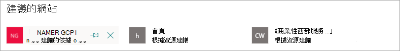

# 編輯 Microsoft Viva 主題中的現有主題 

 

> [!VIDEO https://www.microsoft.com/videoplayer/embed/RE4LA4n]  

 

在 Viva 主題中，您可以編輯現有的主題。 如果您想要更正或將其他資訊新增至現有的主題頁面，您可能需要執行此動作。 

> [!Note] 
> 雖然 AI 收集的主題中的資訊是 [安全修整](topic-experiences-security-trimming.md)，但在編輯現有主題時手動新增的主題描述和人員資訊，對所有具有查看主題許可權的使用者都是可見的。 

## 需求

若要編輯現有的主題，您必須：
- 擁有 Viva Topics 授權。
- 具有 [建立或編輯主題](./topic-experiences-user-permissions.md)的許可權。 知識系統管理員可以在 Viva Topics 主題權限設定中將此權限給予使用者。 

> [!Note] 
> 有權管理主題中心主題的使用者 (知識管理員) 已具備建立及編輯主題的許可權。

## 如何編輯主題頁面

具有神秘的使用者 *可以建立或編輯主題* 許可權：從主題醒目提示中開啟 [主題] 頁面，然後選取主題頁面右上方的 [**編輯**] 按鈕，即可編輯主題。 您也可以從主題中心首頁開啟 [主題] 頁面，您可以在此首頁找到您連接的所有主題。

   ![顯示 [編輯] 按鈕的螢幕擷取畫面。](../media/knowledge-management/edit-button.png)   

知識管理員也可以從 [ **管理主題** ] 頁面直接編輯主題，方法是選取主題，然後選取工具列中的 [ **編輯** ]。

   

### 編輯主題頁面

1. 在 [主題] 頁面上，選取 [ **編輯**]。 這可讓您視需要對主題頁面進行變更。

   ![螢幕擷取畫面顯示主題頁面上的 [編輯] 按鈕。](../media/knowledge-management/topic-page-edit.png)  

2. 在 [ **替代名稱** ] 區段中，輸入該主題可能參考的任何其他名稱。 

    ![顯示 [替代名稱] 區段的螢幕擷取畫面。](../media/knowledge-management/alt-names.png)

3. 在 **[描述]** 章節中，輸入描述主題的幾個句子。 或者，如果描述已經存在，請視需要加以更新。

     

4. 在 **已釘選人員** 章節中，您可以「釘選」人員，以顯示他們與主題有連結 (例如，已連結資源的擁有者)。 請先在 [ **新增使用者** ] 方塊中輸入他們的名稱或電子郵件地址，然後從搜尋結果中選取您要新增的使用者。 您也可以從使用者卡片上選取 [ **從清單移除** ] 圖示來「解除固定」。
 
    ![顯示 [新增固定人員] 區段的螢幕擷取畫面。](../media/knowledge-management/pinned-people.png) 

    此 **建議人員** 章節會顯示 AI 認為可能會從與主題相關資源之間的連結而連結到主題的使用者。 您可以選取使用者卡片上的釘選圖示，將其狀態從 已建議 變更為 已釘選。

   

5. 在 **[釘選的檔案和網頁]** 章節中，新增或「釘選」與主題相關聯的檔案或 SharePoint 網站頁面。

   ![顯示 [已固定的檔案與頁面] 區段的螢幕擷取畫面。](../media/knowledge-management/pinned-files-and-pages.png)
 
    若要新增檔案，請選取 [**新增**]，選取您經常或已追蹤網站的 SharePoint 網站，然後從網站的文件庫中選取檔案。

    您也可以使用 **[從連結]** 選項，藉由提供 URL 來新增檔案或頁面。 

   > [!Note] 
   > 您新增的檔案和頁面必須位於相同的 Microsoft 365 租使用者內。 如果您想要在主題中新增外部資源的連結，您可以透過步驟9中的 canvas 圖示加以新增。

6. [ **建議的檔案與頁面** ] 區段會顯示 AI 建議與主題相關聯的檔案與頁面。

   ![顯示 [建議的檔案與頁面] 區段的螢幕擷取畫面。](../media/knowledge-management/suggested-files-and-pages.png)

    您可以選取釘選的圖示，將建議的檔案或頁面變更為釘選的檔案或頁面。

7.  在 [ **固定的網站** ] 區段中，您可以新增或「固定」與主題相關聯的網站。 

    ![顯示 [固定的網站] 區段的螢幕擷取畫面。](../media/knowledge-management/pinned-sites-section.png)

    若要新增網站，請選取 [ **新增** ]，然後搜尋網站，或從您經常或最近的網站清單中進行選取。
    
    ![顯示 [新增或移除固定的網站] 區段的螢幕擷取畫面。](../media/knowledge-management/add-or-remove-pinned-sites.png)

8. [ **建議的網站** ] 區段會顯示 AI 建議與主題相關聯的網站。 

     

    您可以選擇釘選的圖示，將建議的網站變更為釘住的網站。

<!---

7.  The <b>Related sites</b> section shows sites that have information about the topic. 

     

    You can add a related site by selecting <b>Add</b> and then either searching for the site, or selecting it from your list of Frequent or Recent sites. 
    
     

8. The <b>Related topics</b> section shows connections that exists between topics. You can add a connection to a different topic by selecting the <b>Connect to a related topic</b> button, and then typing the name of the related topic, and selecting it from the search results. 

      

    You can then give a description of how the topics are related, and select <b>Update</b>. 

     

   The related topic you added will display as a connected topic.

     

   To remove a related topic, select the topic you want to remove, then select the <b>Remove topic</b> icon. 
 
      

   Then select <b>Remove</b>. 

     

--->

9. 您也可以選取創作區圖示 (可在簡短描述下方找到) 來將靜態項目 (例如文字、影像或連結) 新增到頁面。 選取它會開啟 SharePoint 工具箱，您可以從中選擇要新增至頁面的專案。

   

10. 選取 **[發佈]** 或 **[重新發佈]** 以儲存變更。 如果您先前已發佈主題，則重新 **發佈** 將會是可用選項。

