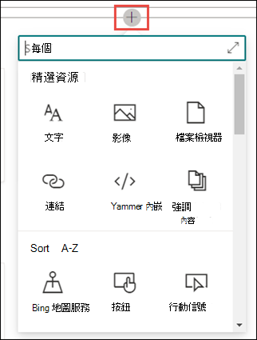

# 編輯 Microsoft Viva 主題中的現有主題 

 

> [!VIDEO https://www.microsoft.com/videoplayer/embed/RE4LA4n]  

 

在 Viva 主題中，您可以編輯現有的主題。 如果您想要更正或將其他資訊新增至現有的主題頁面，您可能需要執行此動作。 

> [!Note] 
> [！附注] 透過 AI 收集的主題中的資訊是 [安全修整](topic-experiences-security-trimming.md)的，請注意，您在編輯現有主題時手動新增的主題描述和人員資訊，對所有具有「查看主題」許可權的使用者都是可見的。 

## 需求

若要編輯現有的主題，您必須：
- 擁有 Viva Topics 授權。
- 具有神秘的許可權 [**可以建立或編輯主題**](./topic-experiences-user-permissions.md)。 知識系統管理員可以在 Viva Topics 主題權限設定中將此權限給予使用者。 

> [!Note] 
> 有權管理主題中心主題的使用者 (知識管理員) 已具備建立及編輯主題的許可權。

## 如何編輯主題頁面

具有神秘的使用者 **可以建立或編輯主題** 許可權：從主題醒目提示中開啟 [主題] 頁面，然後選取主題頁面右上方的 [<b>編輯</b>] 按鈕，即可編輯主題。 您也可以從主題中心首頁開啟 [主題] 頁面，您可以在此首頁找到您連接的所有主題。

      

知識管理員也可以從 [管理主題] 頁面直接編輯主題，方法是選取主題，然後選取工具列中的 [ <b>編輯</b> ]。

      

### 編輯主題頁面

1. 在 [主題] 頁面上，選取 [ **編輯**]。 這可讓您視需要對主題頁面進行變更。

       

2. 在 <b>[替代名稱]</b> 章節中，輸入任何可能參考主題的其他名稱。 

       
3. 在 <b>[描述]</b> 章節中，輸入描述主題的幾個句子。 或者，如果描述已經存在，請視需要加以更新。

     

4. 在 <b>已釘選人員</b> 章節中，您可以「釘選」人員，以顯示他們與主題有連結 (例如，已連結資源的擁有者)。 請先在 [ <b>新增使用者</b> ] 方塊中輸入他們的名稱或電子郵件地址，然後從搜尋結果中選取您要新增的使用者。 您也可以從使用者卡片上選取 [ <b>從清單移除</b> ] 圖示來「解除固定」。
 
     

    此 <b>建議人員</b> 章節會顯示 AI 認為可能會從與主題相關資源之間的連結而連結到主題的使用者。 您可以選取使用者卡片上的釘選圖示，將其狀態從 已建議 變更為 已釘選。

    

5. 在 <b>[釘選的檔案和網頁]</b> 章節中，新增或「釘選」與主題相關聯的檔案或 SharePoint 網站頁面。

   ![[已固定的檔案與頁面] 區段](../media/knowledge-management/pinned-files-and-pages.png) 
 
    若要新增檔案，請選取 [<b>新增</b>]，選取您經常或已追蹤網站的 SharePoint 網站，然後從網站的文件庫中選取檔案。

    您也可以使用 <b>[從連結]</b> 選項，藉由提供 URL 來新增檔案或頁面。 

   > [!Note] 
   > 您新增的檔案和頁面必須位於相同的 Microsoft 365 租使用者內。 如果您想要在主題中新增外部資源的連結，您可以透過步驟9中的 canvas 圖示加以新增。

6. [ <b>建議的檔案與頁面</b> ] 區段會顯示 AI 建議與主題相關聯的檔案與頁面。

   ![[建議的檔案與頁面] 區段](../media/knowledge-management/suggested-files-and-pages.png) 

    您可以選取釘選的圖示，將建議的檔案或頁面變更為釘選的檔案或頁面。

7.  <b>[相關網站]</b> 章節會顯示具有主題相關資訊的網站。 

     

    您可以選取 [ <b>新增</b> ]，然後搜尋網站，或從您經常或最近的網站清單中進行選取，以新增相關的網站。 
    
     

8. [ <b>相關主題</b> ] 區段會顯示主題之間存在的連線。 您可以選取 [<b>連線至相關主題</b>] 按鈕，然後輸入相關主題的名稱，然後再從搜尋結果中進行選取，以新增與其他主題的連接。 

      

    您可以接著提供相關主題的相關描述，然後選取 [ <b>更新</b>]。 

     

   您新增的相關主題會顯示為已連結的主題。

     

   若要移除相關主題，請選取您要移除的主題，然後選取 <b>移除主題</b> 圖示。 
 
      

   然後選取 [ <b>移除</b>]。 

     

9. 您也可以選取創作區圖示 (可在簡短描述下方找到) 來將靜態項目 (例如文字、影像或連結) 新增到頁面。 選取它會開啟 SharePoint 工具箱，您可以從中選擇要新增至頁面的專案。

     

10. 選取 **[發佈]** 或 **[重新發佈]** 以儲存變更。 如果您先前已發佈主題，則重新 **發佈** 將會是可用選項。

## 請參閱

