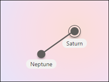

# 編輯現有主題Edit an existing topic 

 

> [!VIDEO https://www.microsoft.com/videoplayer/embed/RE4LA4n]  

 

在 Viva 主題中，您可以編輯現有的主題。In Viva Topics, you can edit an existing topic. 如果您想要更正或將其他資訊新增至現有的主題頁面，您可能需要執行此動作。You may need to do this if you want to correct or add additional information to an existing topic page. 

> [!Note] 
> [！附注] 透過 AI 收集的主題中的資訊是 [安全修整](topic-experiences-security-trimming.md)的，請注意，您在編輯現有主題時手動新增的主題描述和人員資訊，對所有具有「查看主題」許可權的使用者都是可見的。While information in a topic that is gathered by AI is [security trimmed](topic-experiences-security-trimming.md), note that topic description and people information that you manually add when editing an existing topic is visible to all users who have permissions to view topics. 

## 需求Requirements

若要編輯現有的主題，您必須：To edit an existing topic, you need to:
- 具有 Viva 主題授權。Have a Viva Topics license.
- 具有 [**可建立或編輯主題的人員**](https://docs.microsoft.com/microsoft-365/knowledge/topic-experiences-user-permissions)許可權。Have permissions to [**Who can create or edit topics**](https://docs.microsoft.com/microsoft-365/knowledge/topic-experiences-user-permissions). 知識系統管理員可以在 Viva 主題主題許可權設定中，將此許可權授與使用者。Knowledge admins can give users this permission in the Viva Topics topic permissions settings. 

> [!Note] 
> 有權管理主題中心主題的使用者 (知識管理員) 已具備建立及編輯主題的許可權。Users who have permission to manage topics in the Topic center (knowledge managers) already have permissions to create and edit topics.

## 如何編輯主題頁面How to edit a topic page

擁有 **誰可以建立或編輯主題** 許可權的使用者可以從主題醒目提示中開啟 [主題] 頁面，然後選取 [主題] 頁面右上方的 [ <b>編輯</b> ] 按鈕來編輯主題。Users who have the **Who can create or edit topics** permission can edit a topic by opening the topic page from a topic highlight, and then selecting the <b>Edit</b> button on the top right of the topic page. 您也可以從主題中心首頁開啟 [主題] 頁面，您可以在此首頁找到您連接的所有主題。The topic page can also be opened from the topic center home page where you can find all the topics that you have a connection to.

      

知識管理員也可以從 [管理主題] 頁面直接編輯主題，方法是選取主題，然後選取工具列中的 [ <b>編輯</b> ]。Knowledge managers can also edit topics directly from the Manage Topics page by selecting the topic, and then selecting <b>Edit</b> in the toolbar.

      

### 編輯主題頁面To edit a topic page

1. 在 [主題] 頁面上，選取 [ **編輯**]。On the topic page, select **Edit**. 這可讓您在 [主題] 頁面上進行所需的變更。This allows you to make changes as you need to the topic page.

       

2. 在 [ <b>替代名稱</b> ] 區段中，輸入該主題可能參考的任何其他名稱。In the <b>Alternate Names</b> section, type any other names that the topic might be referred to. 

       
3. 在 [ <b>描述</b> ] 區段中，輸入一些描述主題的句子。In the <b>Description</b> section, type a couple of sentences that describes the topic. 或者，如果有描述已存在，請視需要加以更新。Or if a description already exists, update it if needed.

     

4. 在 [ <b>固定人員</b> ] 區段中，您可以「鎖定」人員，將其顯示為主題上的主題專家。In the <b>Pinned people</b> section, you can "pin" a person to show them as a subject matter expert on the topic. 請先在 [ <b>新增使用者</b> ] 方塊中輸入他們的名稱或電子郵件地址，然後從搜尋結果中選取您要新增的使用者。Begin by typing their name or email address in the <b>Add a new user</b> box, and then selecting the user you want to add from the search results. 您也可以從使用者卡片上選取 [ <b>從清單移除</b> ] 圖示來「解除固定」。You can also "unpin" them by selecting the <b>Remove from list</b> icon on the user card.
 
     

    [ <b>建議人員</b> ] 區段會向使用者顯示 AI 思考可能成為主題相關主題的主題專家的使用者。The <b>Suggested people</b> section shows users that AI thinks might be subject matter experts on the topic from their connection to resources about the topic. 您可以選取使用者卡片上的 pin 圖示，將其狀態變更為 [已建議] （已鎖定）。You can change their status from Suggested to Pinned by selecting the pin icon on the user card.

    

5. 在 [ <b>附加的檔案與頁面</b> ] 區段中，您可以新增或「固定」與主題相關聯的檔案或 SharePoint 網站] 頁面。In the <b>Pinned files and pages</b> section, you can add or "pin" a file or SharePoint site page that is associated to the topic.

   ![[已固定的檔案與頁面] 區段](../media/knowledge-management/pinned-files-and-pages.png) 
 
    若要新增檔案，請選取 [ <b>新增</b>]，選取您經常或已追蹤網站的 SharePoint 網站，然後從網站的文件庫中選取檔案。To add a new file, select <b>Add</b>, select the SharePoint site from your Frequent or Followed sites, and then select the file from the site's document library.

    您也可以透過提供 URL，使用 [ <b>發件</b> 人] 中的 [連結] 選項來新增檔或頁面。You can also use the <b>From a link</b> option to add a file or page by providing the URL. 

   > [!Note] 
   > 您新增的檔案和頁面必須位於相同的 Microsoft 365 租使用者內。Files and pages that you add must be located within the same Microsoft 365 tenant. 如果您想要在主題中新增外部資源的連結，您可以透過步驟9中的 canvas 圖示加以新增。If you want to add a link to an external resource in the topic, you can add it through the canvas icon in step 9.

6. [ <b>建議的檔案與頁面</b> ] 區段會顯示 AI 建議與主題相關聯的檔案與頁面。The <b>Suggested files and pages</b> section shows files and pages that AI suggests to be associated to the topic.

   ![[建議的檔案與頁面] 區段](../media/knowledge-management/suggested-files-and-pages.png) 

    您可以透過選取釘選的圖示，將建議的檔案或頁面變更為固定的檔案或頁面。You can change a suggested file or page to a pinned file or page by selecting the pinned icon.

7.  [ <b>相關網站</b> ] 區段會顯示網站，其中包含主題的相關資訊。The <b>Related sites</b> section shows sites that have information about the topic. 

     

    您可以選取 [ <b>新增</b> ]，然後搜尋網站，或從您經常或最近的網站清單中進行選取，以新增相關的網站。You can add a related site by selecting <b>Add</b> and then either searching for the site, or selecting it from your list of Frequent or Recent sites. 
    
     

8. [ <b>相關主題</b> ] 區段會顯示主題之間存在的連線。The <b>Related topics</b> section shows connections that exists between topics. 您可以選取 [ <b>連線至相關主題]</b> 按鈕，然後輸入相關主題的名稱，然後再從搜尋結果中進行選取，以新增與其他主題的連接。You can add a connection to a different topic by selecting the <b>Connect to a related topic</b> button, and then typing the name of the related topic, and selecting it from the search results. 

      

    您可以接著提供相關主題的相關描述，然後選取 [ <b>更新</b>]。You can then give a description of how the topics are related, and select <b>Update</b>. 

     

   您新增的相關主題會顯示為連線的主題。The related topic you added will display as a connected topic.

     

   若要移除相關主題，請選取您要移除的主題，然後選取 <b>移除主題</b> 圖示。To remove a related topic, select the topic you want to remove, then select the <b>Remove topic</b> icon. 
 
      

   然後選取 [ <b>移除</b>]。Then select <b>Remove</b>. 

     

9. 您也可以將靜態專案新增至頁面（如文字、圖像或連結），方法是選取 [畫布] 圖示，您可以在簡短描述下方找到該圖示。You can also add static items to the page — such as text, images, or links - by selecting the canvas icon, which you can find below the short description. 選取它會開啟 SharePoint 工具箱，您可以從中選擇要新增至頁面的專案。Selecting it will open the SharePoint toolbox from which you can choose the item you want to add to the page.

     

10. 選取 [ **發佈** ] 或 [重新 **發佈** ] 以儲存您的變更。Select **Publish** or **Republish** to save your changes. 如果您先前已發佈主題，則重新 **發佈** 將會是可用選項。**Republish** will be your available option if the topic has been published previously.

## 請參閱See also

  

