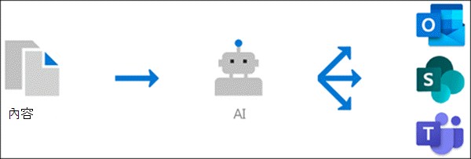

#  (預覽的知識管理概述) 

> [!Note] 
> 本文內容適用于 Project Cortex 私人預覽。 [如需詳細資訊，請參閱 Project Cortex](https://aka.ms/projectcortex)。

知識管理使用 Microsoft AI 技術、Microsoft 365、Delve、搜尋及其他元件和服務，在您的 Microsoft 365 環境中建立知識網路。 

      

其目標是將資訊傳送給使用者，讓他們在日常使用的應用程式中，例如，Outlook、小組和 SharePoint。

例如，使用者會在他們的電子郵件、SharePoint 網站或小組交談中看到不熟悉的字詞，他們想要深入瞭解。 知識管理使用 AI 來自動搜尋及識別這些 **主題** ，並編譯其相關資訊，例如主題的簡短描述、主題專家、網站、檔案及與其相關的頁面。 您可以視需要選擇更新主題資訊。 然後您可以讓使用者使用這些主題，這表示針對 Outlook、小組和 SharePoint 等應用程式中顯示的每個主題實例，文字都會反白顯示。 使用者可選擇透過主題詳細資料深入瞭解主題。

## 主題索引

知識管理使用 Microsoft AI 技術來識別 Office 365 環境中的 **主題** 。

主題是一種組織很重要或很重要的片語或字詞。 組織中有特定的意義，也有相關的資源可協助人員瞭解其內容及找到相關資訊。

識別主題時，會為其建立 **主題頁面** ，其中包含透過主題編制索引所收集的資訊，例如：

- 替代名稱和/或縮寫。
- 主題的簡短描述。
- 熟悉主題的使用者。
- 與主題相關的檔案、頁面和網站。

## 主題探索
在 SharePoint 新聞及頁面的內容中提及主題時，您會看到該主題為反白顯示狀態。 從醒目提示中開啟主題摘要。 從摘要的標題開啟主題詳細資料。 <!--(msg for Efren: not sure if I should use discovery for this; we use discovered in-product for indexing?)--> 您可以自動識別上述主題，也可以使用頁面作者直接參考主題，將其新增至頁面。

您也可以透過 Microsoft 搜尋探索主題。

## 主題管理

主題管理是在您組織的 **主題中心** 完成。 主題中心網站會在安裝期間建立，並作為您組織的知識中心。 它會包含您環境中已發現的所有主題清單，以及這些主題所建立的所有主題頁面。 

提供正確許可權的使用者將可以在主題中心執行下列動作：

- 確認或拒絕您租使用者中探索的主題。
- 在需要時手動建立新的主題 (例如，如果沒有提供足夠的資訊供透過 AI) 探索。
- 編輯現有的主題頁面。 

如需詳細資訊，請參閱 [主題中央的使用主題](work-with-topics.md) 。  

## 系統管理控制

Microsoft 365 系統管理中心中的管理控制可讓您管理您的知識網路。 它們允許 Microsoft 365 全域或 SharePoint 管理員：

- 控制組織中的哪些使用者可以查看其用戶端應用程式中或 SharePoint 搜尋結果中的主題。
- 控制將編目哪個 SharePoint 網站來搜尋主題。
- 將主題探索設定為排除您不想要成為主題的特定字詞。
- 控制哪些使用者可以確認或拒絕主題中心中的主題。
- 控制哪些使用者可以在主題中心建立及編輯主題。

請參閱 [管理您的知識網路](manage-knowledge-network.md) 以取得詳細資訊。 

## 主題 curation & 意見反應

AI 會持續運作，提供您在環境中發生變更時改進主題的建議。

允許存取權在日常工作中查看主題的使用者，可提供建議以加以改善。 例如，如果使用者查看 [主題] 頁面，並看到不正確或需要新增的資訊，[主題] 頁面上的連結可讓他們直接編輯資訊。 另一個範例是，如果使用者在 SharePoint 新聞] 頁面上查看醒目提示，您會發現問題，詢問您是否有適當的醒目提示或建議的主題是否適用于您的組織。 您的回答會協助決定主題摘要和主題詳細資料中顯示的內容。

此外，具有適當許可權的使用者可以將相關的 Yammer 交談等專案標記為相關專案，並將其新增至特定主題。 <!--(msg for Efren: changed to Yammer, because we will not have shipped Teams yet)-->

## 另請參閱
[設定知識管理](set-up-knowledge-network.md) 
[主題中心概述](topic-center-overview.md)
