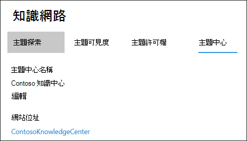
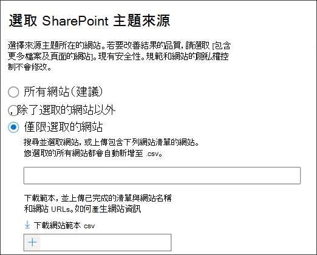
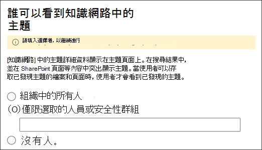
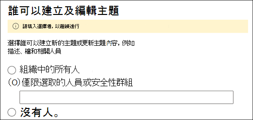
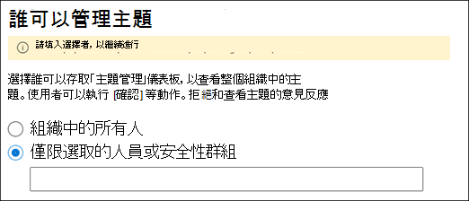
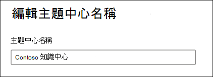

# 管理您的知識管理網路（預覽）Manage your knowledge management network (Preview)

> [!Note] 
> 本文內容適用于 Project Cortex 私人預覽。The content in this article is for Project Cortex Private Preview. [進一步瞭解專案 Cortex](https://aka.ms/projectcortex)。[Find out more about Project Cortex](https://aka.ms/projectcortex).

在您[設定知識管理](set-up-knowledge-network.md)之後，任何時候，系統管理員都可以透過 Microsoft 365 系統管理中心對設定設定進行調整。After you [set up knowledge management](set-up-knowledge-network.md), at any time afterwards an admin can make adjustments to your configuration settings through the Microsoft 365 admin center.

例如，您可能需要調整下列專案的設定：For example, you may need to adjust your settings for any of the following:
- 將新的 SharePoint 來源新增至本主題。Add new SharePoint sources to mine topics.
- 變更哪些使用者將可以存取主題。Change which users will have access to topics.
- 變更哪些使用者具有在主題中心執行工作的許可權。Change which users have permissions to do tasks on the topic center.
- 變更主題中心的名稱Change the name of your topic center

## 需求Requirements 
您必須具有全域管理員或 SharePoint 系統管理員許可權，才能存取 Microsoft 365 系統管理中心和管理組織知識工作。You must have Global Admin or SharePoint admin permissions to be able to access the Microsoft 365 admin center and manage Organizational knowledge tasks.

## 若要存取知識管理設定：To access knowledge management settings:

1. 在 Microsoft 365 系統管理中心中，選取 [**安裝**]，然後查看 [**組織知識**] 區段。In the Microsoft 365 admin center, select **Setup**, and then view the **Organizational Knowledge** section.
2. 在 [**組織知識**] 區段中，按一下 **[將人員連線到知識]**。In the **Organizational Knowledge** section, click **Connect people to knowledge**. 

      

3. 在 [連線**人員至知識**] 頁面上，選取 [**管理**] 開啟 [**知識網路設定**] 窗格。On the **Connect people to knowledge** page, select **Manage** to open the **Knowledge network settings** pane. 

      

## 變更知識網路可尋找主題的方式Change how the knowledge network can find topics

如果您想要為 SharePoint 主題來源更新您的選擇，請選取 [**主題探索**] 索引標籤。Select the **Topic discovery** tab if you want to update your choices for  for SharePoint topic sources. 此設定可讓您選取您租使用者中的 SharePoint 網站，將會針對主題進行編目及挖掘。This setting let you select the SharePoint sites in your tenant that will be crawled and mined for topics.

1. 在 [**主題探索**] 索引標籤上，選取 [ **SharePoint 主題來源**] 底下的 [**編輯**]。On the **Topic discovery** tab, under **Select SharePoint topic sources**, select **Edit**.
2. 在 [**選取 SharePoint 主題來源**] 頁面上，選取要在探索過程中將其編目為主題來源的 SharePoint 網站。On the **Select SharePoint topic sources** page, select which SharePoint sites will be crawled as sources for your topics during discovery. 這包括：This includes: 
    a.a. **所有網站**：您租使用者中的所有 SharePoint 網站。**All sites**: All SharePoint sites in your tenant. 這會捕獲目前和未來的網站。This captures current and future sites. 
    b.b. **全部，除了選取的網站以外**：請輸入您要排除的網站名稱。**All, except selected sites**: Type the names of the sites you want to exclude.  您也可以從探索中上傳想要選擇從探索中移除的網站清單。You can also upload a list of sites you want to opt out from discovery. 未來建立的網站會包含為主題探索的來源。Sites created in the future will be included as sources for topic discovery.  
    c.c. **僅限選取的網站**：輸入您要包含的網站名稱。**Only selected sites**: Type the names of the sites you want to include. 您也可以上傳網站清單。You can also upload a list of sites. 未來建立的網站不會包含為主題探索的來源。Sites created in the future will not be included as sources for topic discovery.  

      
   
    如果您有多個您想要排除的網站（如果您選取 [**所有] （選取的網站除外**）或 [包含] （如果您**只選取了 [選取的網站**]），您可以選擇上載包含網站名稱和 URLs 的 CSV 檔案。If you have a number of sites that you want to exclude (if you select **All, except selected sites**) or include (if you selected **Only selected sites**), you can choose to upload a CSV file with the site names and URLs. 如果您想要使用 CSV 範本檔案，您可以選取 [**下載網站範本 .csv** ]。You can select **Download site template .csv** if you want to use the CSV template file.

3. 選取 **「儲存」**。Select **Save**.

##  變更可以查看組織中主題的人員Change who can see topics in your organization

如果您想要更新組織中的哪些人員可以查看搜尋結果中已發現的主題，以及在 SharePoint 頁面等內容中突出顯示主題，請選取 [**主題探索**] 索引標籤。Select the **Topic discovery** tab if you want to update who in your organization can see discovered topics in search results and when topics are highlighted in content like SharePoint pages.

1. 在 [**主題探索**] 索引標籤上，于 [**誰可以在知識網路中查看主題**] 底下，選取 [**編輯**]。On the **Topic discovery** tab, under **Who can see topics in the knowledge network**, select **Edit**.
2. 在 [**知識網路] 頁面中的 [可查看主題**] 頁面上，您可以選擇誰將有權存取主題詳細資料，例如高亮主題、主題卡片、搜尋中的主題答案及主題頁面。On the **Who can see topics in the knowledge network** page, you choose who will have access to topic details, such as highlighted topics, topic cards, topic answers in search, and topic pages. 您可以選取：You can select: 
    a.a. **組織中的所有人****Everyone in your organization** 
    b.b. **僅限選取的人員或安全性群組****Only selected people or security groups** 
    c.c. **沒人****No one** 

       
3. 選取 **「儲存」**。Select **Save**.  
 
> [!Note] 
> 雖然此設定可讓您選取組織中的任何使用者，但只有具有指派的知識管理授權的使用者才能查看主題。While this setting allows you to select any user in your organization, only users who have knowledge management licenses assigned to them will be able to view topics.

## 變更誰有權在主題中心執行工作？Change who has permissions to do tasks on the topic center

如果您想要更新主題中心頁面上具有下列許可權的人員，請選取 [**主題許可權**] 索引標籤：Select the **Topic permissions** tab if you want to update who has permissions to do the following in the topic center page:

- 哪些使用者可以建立及編輯主題：在探索或編輯現有主題頁面詳細資料時，建立未找到的新主題。Which users can create and edit topics: Create new topics that were not found during discovery or edit existing topic page details.
- 哪些使用者可以管理下列主題：確認或拒絕已探索的主題。Which users can manage topics: Confirm or reject discovered topics.

若要更新誰有權建立及編輯主題：To update who has permissions to create and edit topics:

1. 在 [**主題許可權**] 索引標籤的 [**誰可以建立及編輯主題**] 中，選取 [**編輯**]。On the **Topic permissions** tab, under **Who can create and edit topics**, select **Edit**. 
2. 您可以在 [**誰可以建立及編輯主題**] 頁面上，選取：On the **Who can create and edit topics** page, you can select: 
    a.a. **組織中的所有人****Everyone in your organization** 
    b.b. **僅限選取的人員或安全性群組****Only selected people or security groups** 

       

3. 選取 **「儲存」**。Select **Save**. 

若要更新誰具有管理主題的許可權：To update who has permissions to manage topics:

1. 在 [**主題許可權**] 索引標籤的 [**誰可以管理主題**] 下，選取 [**編輯**]。On the **Topic permissions** tab, under **Who can manage topics**, select **Edit**. 
2. 您可以在 [**誰可以管理主題**] 頁面上，選取：On the **Who can manage topics** page, you can select: 
    a.a. **組織中的所有人****Everyone in your organization** 
    b.b. **選取的人員或安全性群組****Selected people or security groups** 

       

3. 選取 **「儲存」**。Select **Save**. 

##  更新主題中心名稱Update your topic center name

如果您想要更新主題中心的名稱，請選取 [**主題中心**] 索引標籤。Select the **Topic center** tab if you want to update the name of your topic center. 

1. 在 [**主題中心**] 索引標籤的 [**主題中心名稱**] 下，選取 [**編輯**]。On the **Topic center** tab, under **Topic center name**, select **Edit**.
2. 在 [**編輯主題中心名稱**] 頁面上，于 [**主題中心名稱**] 方塊中，輸入主題中心的新名稱。On the **Edit topic center name** page, in the **Topic center name** box, type the new name for your topic center.
3. 選取 **[儲存]**Select **Save**

       

## 另請參閱See also

  

