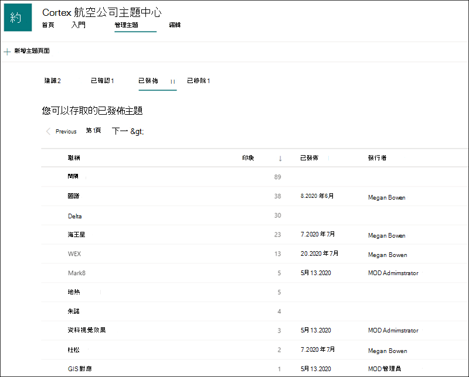

# 管理主題中心的主題Manage topics in the Topic center 

 

> [!VIDEO https://www.microsoft.com/videoplayer/embed/RE4LxDx]  

 

在 Viva 主題主題中心，知識管理員可以查看「 **管理主題** 」頁面，以查看已在您的知識系統管理員所指定 SharePoint 來源位置識別的主題。In the Viva Topics Topic center, a knowledge manager can view the **Manage topics** page to review topics that have been identified in SharePoint source locations as specified by your knowledge admin.  

      

知識管理員會協助您透過主題生命週期來引導探索的主題：Knowledge managers help to guide discovered topics through the topic lifecycle in which topics are:

- 建議：主題已透過 AI 識別，且具有足夠的支援資源、連線和屬性。Suggested: A topic has been identified by AI and has enough supporting resources, connections, and properties.
- 已確認：已驗證 AI 已建議的主題。Confirmed: A topic that has been suggested by AI is validated. 驗證是由知識管理員的確認所完成。Validation is done by confirmation from a knowledge manager. 此外，如果至少有兩位使用者透過主題卡片上的意見反應提供積極的意見反應，也可以確認主題。Additionally, a topic can be confirmed if at least two users give positive feedback through the feedback question on the topic card.
- 已發佈：已策劃的已確認主題：已進行手動編輯，以提升其品質。Published: A confirmed topic that has been curated: manual edits have been made to improve its quality.
- 已移除：主題是由知識管理員拒絕，且不會再對檢視器顯示。Removed: A topic is rejected by a knowledge manager and will no longer be visible to viewers. 主題可以處於移除狀態時的任何狀態 (建議、確認或發佈的) 。The topic can be in any state when it is removed (suggested, confirmed or published). 移除已發佈的主題時，將需要透過主題中心的頁面庫手動刪除策劃詳細資料的頁面。When a published topic is removed, the page with the curated details will need to be deleted manually through the Pages Library of the topic center.

      

> [!Note] 
> 在 [管理主題] 頁面中，每個知識管理員只會看到可存取主題檔案及頁面的主題。In the Manage Topics page, each knowledge manager will only be able to see topics where they have access to the files and pages of the topic. 這會反映在 [建議]、[已確認]、[已移除] 及 [已發佈] 索引標籤底下的主題中。This will be reflected in the topics that are listed under the Suggested, Confirmed, Removed, and Published tabs. 不過，主題會計陣列織中的總計計數。The topic counts, however, show the total counts in the organization.

## 需求Requirements

若要管理主題中心的主題，您必須：To manage topics in the Topic center, you need to:
- 具有 Viva 主題授權。Have a Viva Topics license.

- 讓 [**誰可以管理主題**](./topic-experiences-user-permissions.md) 許可權。Have the [**Who can manage topics**](./topic-experiences-user-permissions.md) permission. 知識系統管理員可以在 Viva 主題主題許可權設定中，將此許可權授與使用者。Knowledge admins can give users this permission in the Viva Topics topic permissions settings. 

除非您有 **可以管理主題** 許可權的人員，否則您將無法在主題中心中查看「管理主題」頁面。You will not be able to view the Manage Topics page in the Topic Center unless you have the **Who can manage topics** permission.

在主題中心，知識管理員可以查看已在您指定的 SharePoint 來源位置中識別的主題，也可以確認或拒絕這些主題。In the topic center, a knowledge manager can review topics that have been identified in the SharePoint source locations you specified, and can either confirm or reject them. 知識管理員也可以建立及發佈新的主題頁面（如果未在主題探索中找到的話），或編輯現有的主題頁面（如果需要更新）。A knowledge manager can also create and publish new topic pages if one was not found in topic discovery, or edit existing ones if they need to be updated.

## 查看建議的主題Review suggested topics

在 [主題中心管理主題] 頁面上，在您指定的 SharePoint 來源位置中探索的主題將會列在 [ **建議** ] 索引標籤中。如有需要，知識管理員可以查看未確認的主題，並選擇確認或拒絕這些主題。On the Topic center Manage Topics page, topics that were discovered in your specified SharePoint source locations will be listed in the **Suggested** tab. If needed, a knowledge manager can review unconfirmed topics and choose to confirm or reject them.

      

若要查看建議的主題：To review a suggested topic:

1. 在 [ **管理主題** ] 頁面上，選取 [ **建議** ] 索引標籤，選取主題，以開啟 [主題] 頁面。On the **Manage topics** page, select the **Suggested** tab, select the topic to open the topic page. 

2. 在 [主題] 頁面上，複查 [主題] 頁面，如果您需要對頁面進行任何變更，請選取 [ **編輯** ]。On the topic page, review the topic page, and select **Edit** if you need to make any changes to the page. 發佈任何編輯都會將此主題移至 [ **發佈** ] 索引標籤。Publishing any edits will move this topic to the **Published** tab.

3. 檢查主題之後，請回到 [管理主題] 頁面。After reviewing the topic, go back to the Manage topics page. 針對所選主題，您可以：For the selected topic, you can:

   - 選取 [核取記號] 以確認主題。Select the check mark to confirm the topic.
    
   - 如果您想要拒絕該主題，請選取 **x** 。Select the **x** if you want to reject the topic.

    已確認的主題將從 **建議** 的清單中移除，現在會顯示在 [已 **確認** ] 清單中。Confirmed topics will be removed from the **Suggested** list and will now display in the **Confirmed** list.

    已拒絕的主題將會從 **建議** 的清單中移除，現在會顯示在 [ **已移除** ] 索引標籤中。Rejected topics will be removed from the **Suggested** list and will now display in the **Removed** tab.

     

### 品質分數Quality score

[建議的主題] 頁面中顯示的每個主題都有指派的 <b>品質</b> 分數。Each topic that appears in your Suggested Topics page has a <b>Quality</b> score assigned to it. 品質分數是一般使用者將看到之相關資訊的資訊數量反映，請記住，每當使用者可能會有或可能不會對主題中的資訊所做的許可權，都可能會看到更多或更少的資訊。The Quality score is a reflection of the amount of information that the average user will see for the information on the topic, keeping in mind that each user may see more or less information because of the permissions they may or may not have on the information in a topic. 

品質分數可協助深入瞭解大部分資訊的主題，並可用於尋找可能需要手動編輯的主題。The Quality score can help give insight to the topics with the most information and can be useful for finding topics that may need to be manually edited.  例如，較低品質分數的主題可能是部分使用者未具有 AI 主題所包含之相關檔案或網站的 SharePoint 許可權所導致的結果。For example, a topic with a lower quality score may be the result of some users not having SharePoint permissions to pertinent files or sites that AI has included in the topic. 然後，參與者便可編輯主題，以在適當的) 中包含資訊 (，該主題將可供所有可查看該主題的使用者查看。A contributor could then edit the topic to include the information (when appropriate), which will then be viewable to all users who can view the topic.

品質分數介於1到100。The Quality score could range from 1 to 100. 新探索的主題會具有高品質分數0，直到兩位以上的使用者都已查看為止。A newly discovered topic will have a quality score of 0 until two or more users have viewed it. 每個使用者的品質分數取決於許多因素，例如特定使用者顯示的內容數量，也就是針對特定使用者顯示的內容數量，可在每個主題頁面具有 AI 產生之內容的安全性修整時，控制使用者的許可權。Each users quality score is determined by a number of factors, such as the amount of content displayed for the specific user, which is controlled the user's permissions as each topic page has security trimming in place for AI-generated content. [建議的主題] 索引標籤上顯示的品質分數是各使用者的平均分數。The Quality score shown on the Suggested topics tab is an average of each users individual score.

### 印象Impressions

「 <b>印記</b> 」欄會顯示主題向使用者顯示的次數。The <b>Impressions</b> column displays the number of times a topic has been shown to end users. 這包括透過搜尋中的主題卡片、透過主題要聞及透過主題中心視圖的視圖。This includes views through topic cards in search, through topic highlights, and through Topic center views. 它不會反映這些主題上的點擊式，但已顯示主題。It does not reflect the click-through on these topics, but that the topic has been displayed. [印象] 欄會顯示在 [管理主題] 頁面中建議、已確認、已發佈及已移除的索引標籤中的主題。The Impressions column will show for topics in the Suggested, Confirmed, Published, and Removed tabs in the Manage Topics page.

## 已確認主題Confirmed topics

在 [管理主題] 頁面上，在您指定的 SharePoint 來源位置中探索的主題，並已由兩個或多個透過卡片意見反應機制的人員確認的知識管理員或「具有相同」的主題，將會列于 [已 **確認** ] 索引標籤中。如有需要，具有管理主題許可權的使用者可以查看已確認的主題，並選擇拒絕這些主題。On the Manage topics page, topics that were discovered in your specified SharePoint source locations and have been confirmed by a knowledge manager or "crowd-sourced" confirmed by two or more people through the card feedback mechanism will be listed in the **Confirmed** tab. If needed, a user with permissions to manage topics can review confirmed topics and choose to reject them.

若要查看已確認的主題：To review a confirmed topic:

1. 在 [已 **確認** ] 索引標籤上，選取主題，以開啟 [主題] 頁面。On the **Confirmed** tab, select the topic to open the topic page. 

2. 在 [主題] 頁面上，複查 [主題] 頁面，如果您需要對頁面進行任何變更，請選取 [ **編輯** ]。On the topic page, review the topic page, and select **Edit** if you need to make any changes to the page.

請注意，您仍然可以選擇拒絕已確認的主題。Note that you can still chose to reject a confirmed topic.  若要這樣做，請移至已確認清單中的選取主題，如果您想要拒絕該主題，請選取 **x** 。To do this, go to the selected topic in the Confirmed list, and select the **x** if you want to reject the topic.

## 已發佈主題Published topics
已發佈的主題已經過編輯，使特定資訊永遠會出現在頁面出現的任何處。Published topics have been edited so that specific information will always appear to whoever encounters the page. 手動建立的主題也會列在這裡。Manually created topics are listed here as well.

     