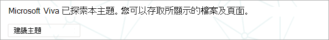
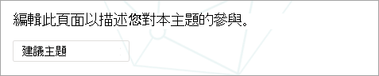

# 在 Microsoft Viva 主題中管理縮放主題

當您為 SharePoint 網站或整個組織編制 Viva 主題的索引時，可能會產生許多主題。 發生這種情況時，您會在 [ **管理主題** ] 頁面上看到數以千計的建議主題，知道從何處開始會很困難。 本文說明 Viva 主題如何協助您優化對搜尋資訊的使用者顯示哪些主題和資訊，甚至在具有大量主題的大型組織中。

首先，會提醒您 [主題的四個階段](manage-topics.md#topic-stages)：

- **建議**：AI 已識別主題，並且有足夠的支援資源、關聯和屬性。  (這些會標示為 UI 中的 **建議主題** 。 ) 

- 已 **確認**：已透過 AI 探索並已驗證的主題。 主題驗證會在下列其中一項：

   - 知識管理員會確認主題。 知識管理員會在 [**管理主題**] 頁面上 [確認主題](manage-topics.md#confirmed-topics)。

   - 多位使用者確認主題。 您必須從使用主題卡片上的意見反應機制來投票的使用者，收到兩封正投票的網路。 例如，如果一個使用者投票肯定的正負一個使用者的投票為負值，您仍需要兩個正值投票才能確認該主題。
 
- 已 **發佈**：已策劃的主題。 手動編輯是為了改善其品質，或是由使用者建立。

- **已移除**：已遭拒絕的主題，將不再對檢視器顯示。 您可以在任何狀態中移除主題 (建議、確認或發佈的) 。 移除主題時，會發生下列其中一項：

   - 知識管理員會移除一個主題。 知識管理員會移除 [ **管理主題** ] 頁面上的主題。

   - 多個使用者使用主題卡片上的意見反應機制來強制轉換負值投票。 若要移除的主題，必須從使用者收到兩個否定投票的淨值。 例如，如果一個使用者投票了負數，另一個使用者對某特定主題投票了肯定的，則您仍然需要兩個負的投票來移除該主題。

  移除已發佈的主題時，將需要透過主題中心的頁面庫手動刪除策劃詳細資料的頁面。

## 知識管理員角色 

當您設定 Viva 主題時，您將會新增一組使用者，他會授與許可權，以查看主題中心中的 [ **管理主題** ] 頁面。 它只會針對保留主題主要 curation 角色的使用者顯示。 他們將可以存取主題的資料，並可以查看他們具有「審閱」和「curate」許可權的所有主題清單。

此角色中的員工應具備廣泛的許可權，可讓您查看大量主題。 或者，如果會分割許可權，您可能會想要選取一組使用者，這些使用者代表公司的不同區域，而且可以 curate 其專屬區域。

當您第一次查看主題中心的主題時，建議的主題是純粹的 AI 定義。 知識管理員可能會在將 Viva 主題推廣至廣泛的使用者群組之前，先複習每一位。 在調整規模時，此方法很少因數以千計的主題而很實用。

建議的方法是，針對您的初始使用者集合，尋找最相關或最重要的主題，並在 Viva 主題的首展之前，curation 這些主題的重點。 開始收集使用者的意見，並允許 crowdsourcing 判斷您的使用者使用方式和貢獻模式，以通知本文中建議的策略。

請務必承認，系統會將 AI 建議和人工策劃的已發佈主題，都識別及顯示給所有使用者。 不過，這並不表示每個建議的主題都會顯示給所有的使用者。 「安全性設定就地」只會顯示每個員工根據內容本身所設定的許可權所能存取的主題。

如具備查看「 **管理主題** 」頁面許可權的知識管理員，您可能會看到所列的主題數目超過您的組織和存取層級中的角色。 您也可以存取可讓您查看單一地點所列主題的視圖，而不是使用醒目或搜尋來存取。

此外，大部分的使用者可能會看到較小的主題比例，以及更少因許可權所看到的更多主題。 因此，請先將任何 curation 的工作重點放在組織中最重要的主題上，並最有可能看到的更廣泛的任務。

本文涵蓋 curation 的幾個策略。 這些策略可能意味著知識管理員不會完全策劃較少或較少的常見主題。 不過，這些建議的主題仍然有用，可提供人員的洞察力或指標，可節省員工時尋找開始點的時間。 允許 crowdsourced 更新主題是有益的，並且提供更多內容和範圍，以提供更少的常見主題。

本文提供一些指導方針和最佳作法，以供您習慣于管理和 curation 主題的方法。

## 瞭解建議的主題

透過 AI 探索主題時，這些主題會在 [**管理主題**] 頁面上，以及呈現給使用者的主題卡片中標示為 **建議主題**。 任何尚未標示為已移除的主題都會向使用者顯示，包括已確認、已發佈和建議的主題。 使用者可以使用所有三種狀態的主題。

在主題卡片或頁面中，我們會使用各種提示來顯示 AI 產生資訊的方式。 系統會使用各種證據，以新增資源，主要是透過內容本身。

- [標籤] 顯示主題是建議的主題，並由 Viva 主題所探索。  

   

- 透過指定其來源，以瞭解定義來自哪些卡的資訊。

- 建議人員會透過使用主題證據來匯總已寫入或編輯檔的人員來衍生。 如果人員撰寫的檔具有標題中的主題名稱，而且該檔有許多視圖，可能只需要一個檔才能建立相關的人員。 不過，在許多情況下，較多的證據越好，列出的人員就能處理多份檔。  

   

- 針對所顯示的檔案及頁面，系統會識別檔中提及主題的次數，但在特定的內容中也必須提及該主題，以識別對特定類型 (例如專案或小組) 相關主題的參照。 這是 AI 的證據的計數。 系統也會考慮主題名稱出現在檔、檔案類型及其他分析功能 (例如 [視圖]) 中的標題。

   

   

   

這些屬性會示範 AI 已新增的內容，以及 AI 如何進行判斷。

### 通訊

當您與使用者 Viva 主題的相關資訊時，請務必澄清 AI 建議主題和內容及其策劃對等專案之間的差異。

做為讀者，您應該以更為重要的眼來查看建議的主題。 它們不應視為組織真實的權威來源。 相反地，他們是一種方法，用來存取透過您可以存取之內容所呈現的 tacit 知識。 AI 已發現主題，具有足夠的證據可向您顯示，但其值尚未由人員確認。

### Crowdsourced 控制項

建議的主題可以透過 curation 頁面，以及透過主題的 crowdsourced 意見來改進。

當使用者以建議的主題進行互動時，可能會在 UI 中要求他們一個簡單的問題。 例如： *此主題與頁面有關嗎？* *此人員是否與主題相關？* *這種定義是否正確？* 透過對這類問題的意見反應，主題的精確度可以增加，而不需要指定的個人 curate 頁面。

「主題中心」的首頁是另一個位置，可供您收集建議主題的回饋。 在主題中心，使用者可以查看與其相關聯的主題，並提供選擇以確認此關聯或已將其移除的選項。

   

當您允許主題的廣泛 crowdsourcing 時，應考慮下列因素：

-   使用者會在主題頁面上看到 [**編輯**] 選項，而且可以像其他現代的 SharePoint 頁面一樣，編輯頁面。

-   有些 **建議的主題** 網頁元件無法移除。 無法移除主題名稱、替代名稱、定義、建議人員和建議資源。

-   在 [**管理主題**] 頁面上已發佈為移至 [**已發佈**] 清單的建議或確認主題可能需要一些時間。

    -   主題出現在搜尋、高光、hashtags 或批註中的預估時間是2小時。

    -   在大多數情況下，在 [**受管理的主題**] 頁面的 [**已發佈**] 清單中顯示主題的預估時間不會超過24小時。 您應該會在2小時內看到它們，但由於每24小時有一次完整同步處理，因此不應超過24小時的時間。

-   使用者可能會將發佈的主題保留為已檢出或編輯狀態。 知識管理員可以在主題中心的頁面庫中查看這些內容，也可以捨棄使用者的變更以重新發佈主題，或聯繫該使用者以要求他們檢查主題。

### 主題可見度和內容是以使用者的許可權為基礎

當您將建議的主題清單當做知識管理員複查時，請記住，建議主題的內容會根據許可權進行動態。 建議的內容及向您顯示的使用者可能與向任何使用者或另一個知識管理員呈現的使用者不同。

根據查看與主題相關聯之內容的許可權，每一位使用者可能會看到一組不同的建議資源、人員、替代名稱及定義。

## 設定 curation 主題的優先順序

您可以使用下列策略來識別可能很醒目的主題，因此很適合 curation。 

### 分類法

使用現有的分類可提供使用者可能會很醒目的主題清單。 例如，這些可能是：

-   您的組織提供的產品和服務

-   組織中的 Teams

-   高設定檔專案

您也可以在部門或功能層級上使用此方法，讓主題專家瞭解組織的該區域。 目標不會讓他們審閱選取範圍或所有主題。 相反地，他們會帶來自己的網域專業知識以引導選擇性 curation。

### 搜尋

常見的搜尋字詞通常會以主題形式探索。 您可以在 [Microsoft 搜尋中使用上方查詢報告](/sharepoint/view-search-usage-reports)，識別您組織中最常使用的搜尋字詞。 如果已探索這些字詞的主題，它們就是 curation 的良好候選人。 這些主題可以在 Microsoft 搜尋中呈現為解答卡。

如果您目前使用的是 [Microsoft 搜尋書簽](/microsoftsearch/manage-bookmarks)，請考慮哪些內容可以取代為主題。 書簽答案卡包含標題、描述及 URL。 在某些情況下，使用者可以使用主題卡片，而且主題卡片也會顯示資源和人員。

在使用者的搜尋體驗中，當使用者搜尋類似 *旅行* 的字詞時，搜尋結果會以 Microsoft 搜尋中的下列優先順序順序顯示：

1.  已發佈或已確認的主題

2.  書籤

3.  建議的主題

### 印記和品質分數

「 [印記](manage-topics.md#impressions) 計數」和「 [品質分數](manage-topics.md#quality-score) 」是瞭解主題行為的重要衡量標準。 當只有知識管理員或 IT 小組能夠存取主題時，這些計量值的值將會受到限制。 向使用者示範群組公開主題將會為這些量值產生更具代表性的資料。

具有高印象計數的主題可能會更頻繁地進行互動。 這些主題的品質分數可讓您瞭解這些主題的豐富程度。 具有高印象計數和低品質分數的主題是 curation 的良好目標。

### 較大型組織網站資訊架構中的重要字詞

組織內較大的入口網站可能會在組織其資訊架構和網站流覽其業務單位、產品線、主要專案等方面的主要主題方面有投資時間。 若要查看這些條款及識別及 curating 相關主題，可以協助使用者尋找這些區域的資訊。

### 利用內部知識文庫或 wiki 網站

如果您的組織已投資掌握知識文庫或 wiki 網站，這些可提供您初始 curation 工作所使用的主題清單。 如果是特別大的，請選取最有查看或已編輯的主題做為起始點。

## 另請參閱

[在主題中心中管理主題](manage-topics.md)

[主題中心概觀](topic-center-overview.md)
