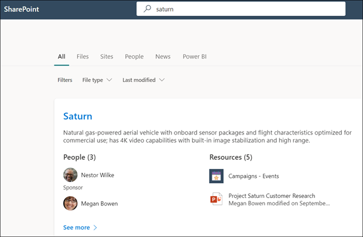

# 使用 Microsoft 搜尋來尋找 Microsoft Viva 主題中的主題Use Microsoft Search to find topics in Microsoft Viva Topics

雖然 Viva 主題，使用者可以在其 SharePoint 網站中找到主題強調主題，也可以透過 Microsoft 搜尋找到這些主題。While Viva Topics users can find topics through topic highlights in their SharePoint sites, they can also find them through Microsoft Search. 

## 主題答案Topic Answer

當您在 Microsoft 搜尋 (中搜尋特定主題時（例如，"Saturn" ) ），如果有主題存在且找到該主題，則會以答案建議格式顯示結果。When you search for a specific topic in Microsoft Search (for example, "Saturn"), if a topic exists and is found, it will display the result in the Answers suggestion format.

主題答案會顯示：The topic answer will display:
- 主題名稱Topic name
- 替代名稱：主題的替代名稱或縮寫。Alternate names: Alternate names or acronyms for the topic.
- 定義：由 AI 提供或人員手動新增的主題描述。Definition: Description of the topic provided by AI or manually added by a person.
- 建議或已鎖定的人員：透過 AI 建議或由人員固定至主題的人員Suggested or Pinned people: People suggested by AI or pinned to the topic by a person
- 建議或固定的資源：透過 AI 建議的檔案、頁面或網站，或由人員固定至主題。Suggested or Pinned resources: Files, pages, or sites either suggested by AI or pinned to the topic by a person. 

    

即使主題的答案卡未出現，也可以在搜尋結果中顯示 [主題] 頁面。The topic page can display in the search results even if the topic answer card doesn't appear.

Word、PowerPoint Outlook 和 Excel 中的搜尋結果也會在找到一個主題時顯示主題答案。The search results in Word, PowerPoint, Outlook and Excel will also show the topic answer when one is found.

## 縮略字Acronyms

在 Viva 主題中，您可以手動編輯主題，以包含其為 <b>替代名稱</b>的縮寫。In Viva Topics, you can manually edit a topic to include an acronym for it as an <b>Alternate Name</b>. 這可讓僅以該主題的首字母縮寫的使用者進行搜尋，以找出透過 Microsoft 搜尋的主題答案。This allows a user who is searching by only the topic's acronym to find the topic answer through Microsoft Search.

[縮寫的答案](/microsoftsearch/manage-acronyms) 是 Microsoft Search 所提供的功能，且與 Viva 主題分開管理。[Acronym Answers](/microsoftsearch/manage-acronyms) is a feature provided though Microsoft Search and is managed separately from Viva Topics.

## 書簽和主題Bookmarks and topics

[書簽](/microsoftsearch/manage-bookmarks)是 Microsoft 搜尋功能，可協助使用者快速尋找重要的網站及工具，只附帶搜尋 (例如，外部網站上的旅行預約工具會在其 Microsoft 365 承租人) 以外。[Bookmarks](/microsoftsearch/manage-bookmarks) are a Microsoft Search feature that help people quickly find important sites and tools with just a search (for example, a travel booking tool on an external site outside of their Microsoft 365 tenant). 它們是由「Microsoft 365 系統管理中心」的搜尋管理員所建立。They're created by search admins in the Microsoft 365 admin center. 

若要尋找可預約工作旅行之相關資訊的使用者：For users who are looking for information about booking a trip for work:

- 如果有些使用者知道旅行工具名稱 (例如 "Concur" ) ，則建立書簽直接移至外部網站會比較容易。If some users know the travel tool name (for example, "Concur"), it's easier to create a bookmark to go directly to the external site.
- 針對一般搜尋「旅行」的使用者，在「旅行」上建立一個主題，該主題具有期望看到的資訊。For users who search generally for "travel", create a topic on "Travel" that has the information they expect to see. 請考慮在主題的描述中新增 Concur 外部網站的連結。Consider adding a link to the Concur external site in the description of the topic. 如果連結改改為 Microsoft 365 租使用者所主控的內部旅行預約網站，您可以將其新增至「釘住的資源」。If the link is instead to an internal travel booking site hosted on the Microsoft 365 tenant, you can add it to the “Pinned Resources”.
 
### 搜尋結果優先順序Search results priority 
 
在使用者搜尋體驗中，當使用者搜尋類似「旅行」的字詞時，搜尋結果將會以 Microsoft 搜尋中的下列優先順序顯示。In the users search experience, when a user searches for a term like “travel”, search results will display in the following priority in Microsoft Search
1. 已發佈或已確認的主題Published or Confirmed topics 
2. 書籤Bookmarks
3. 建議的主題Suggested topics
