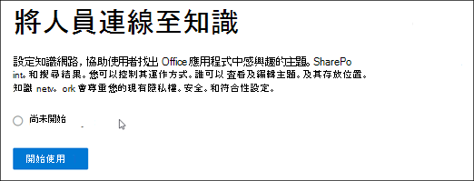
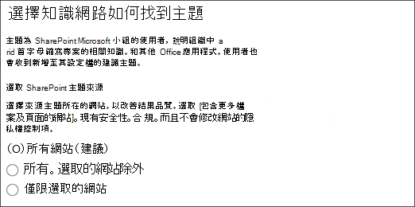
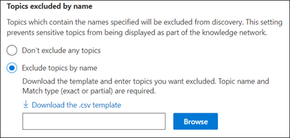
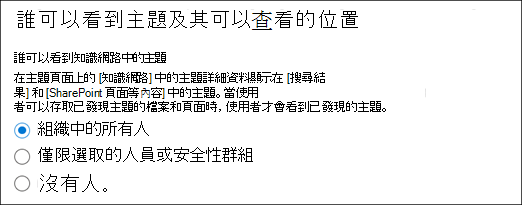
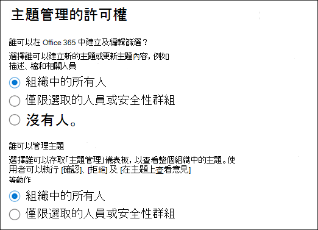
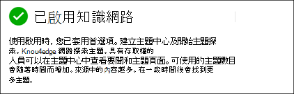
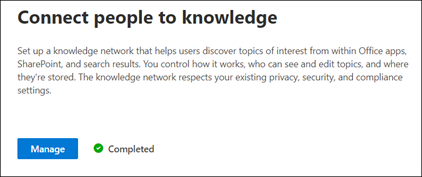

# 設定知識管理 (預覽) Set up Knowledge Management (Preview)

> [!Note] 
> 本文內容適用于 Project Cortex 私人預覽。The content in this article is for Project Cortex Private Preview. [如需詳細資訊，請參閱 Project Cortex](https://aka.ms/projectcortex)。[Find out more about Project Cortex](https://aka.ms/projectcortex).

您可以使用 Microsoft 365 系統管理中心來設定及設定 [知識管理](knowledge-management-overview.md)。You can use the Microsoft 365 admin center to set up and configure [Knowledge Management](knowledge-management-overview.md). 

> [!Important]
> 在您的環境中規劃安裝和設定知識管理的最佳方式是很重要的。It is important to plan the best way to set up and configure Knowledge Management in your environment. 例如，您將需要考慮下列事項：For example, you will need to make considerations about the following:
- 您要分析主題的 SharePoint 網站。Which SharePoint sites you want to analyze for topics.
- 您要讓主題看得見哪些使用者。Which users you want to make topics visible to.
- 您要授與主題中心主題的許可權的使用者。Which users you want to give permissions to manage topics in the topic center.
- 您想要在主題中心提供許可權以建立或編輯主題的使用者。Which users you want to give permissions to create or edit topics in the topic center.
- 您想要為主題中心提供什麼名稱。What name you want to give your topic center.

> [!Note]
> 您可能會發現建立安全性群組以將查看主題、管理主題及建立及編輯主題所需的許可權指派給使用者十分有用。You may find it useful to create security groups to assign your users the permissions needed to view topics, manage topic, and create and edit topics.

系統管理員也可以在安裝程式之後，透過 Microsoft 365 系統管理中心的知識管理設定 [變更所選取的設定](topic-experiences-discovery.md) 。An admin can also [make changes to your selected settings anytime after setup](topic-experiences-discovery.md) through the Knowledge Management settings in the Microsoft 365 admin center.

## 需求Requirements 
您必須具有全域管理員或 SharePoint 系統管理員許可權，才能存取 Microsoft 365 系統管理中心及設定組織知識工作。You must have Global Admin or SharePoint admin permissions to be able to access the Microsoft 365 admin center and set up Organizational knowledge tasks.

## 設定您的知識網路Set up your knowledge network

設定您的知識網路可引導您完成下列作業：Setting up your knowledge network walks you through the following:

- 主題探索：選取要從探索中排除的主題來源和主題。Topic discovery: Selecting topic sources and topics to  exclude from discovery.
- 主題可見度：選取可在 [搜尋] 和 [主題] 頁面中查看主題做為醒目提示的人員。Topic visibility: Selecting who can view topics as highlights, in search and topic pages.
- 主題許可權：選擇誰可以建立、編輯及管理主題。Topic permissions: Selecting who can create, edit, and manage topics.
- 主題中心：建立主題中心。Topic center: Create your topic center.
- 檢查：檢查並套用您的設定。Review: Check and apply your settings.

若要設定您的知識網路：To set up your knowledge network:

1. 在 Microsoft 365 系統管理中心 (admin.microsoft.com) 中，選取 [ **設定** ]，然後查看 [ **組織知識** ] 區段。In the Microsoft 365 admin center (admin.microsoft.com), select **Setup** , and then view the **Organizational Knowledge** section.
2. 在 [ **組織知識** ] 區段中，按一下 **[將人員連線到知識]** 。In the **Organizational Knowledge** section, click **Connect people to knowledge**. 

      

3. 在 [連線 **人員至知識]** 頁面上，按一下 [ **開始** ]，逐步引導您完成安裝程式。On the **Connect people to knowledge** page, click **Get started** to walk you through the setup process. 

      

4. 在 [ **選擇知識網路可如何尋找主題** ] 頁面上，您會設定主題探索。On the **Choose how the knowledge network can find topics** page, you will configure topic discovery. 在 [ **選取 SharePoint 主題來源** ] 區段中，選取要在探索過程中將其編目為主題來源的 SharePoint 網站。In the **Select SharePoint topic sources** section, select which SharePoint sites will be crawled as sources for your topics during discovery. 這包括：This includes: 
    a.a. **所有網站** ：您租使用者中的所有 SharePoint 網站。**All sites** : All SharePoint sites in your tenant. 這會捕獲目前和未來的網站。This captures current and future sites. 
    b.b. **全部，除了選取的網站以外** ：請輸入您要排除的網站名稱。**All, except selected sites** : Type the names of the sites you want to exclude.  您也可以上傳想要從探索中選擇的網站清單。You can also upload a list of sites that you want to opt out from discovery. 在未來建立的網站將會包含為主題探索的來源。Sites created in future will be included as sources for topic discovery.  
    c.c. **僅限選取的網站** ：輸入您要包含的網站名稱。**Only selected sites** : Type the names of the sites you want to include. 您也可以上傳網站清單。You can also upload a list of sites. 未來建立的網站不會包含為主題探索的來源。Sites created in the future will not be included as sources for topic discovery.  

      
   
5. 在 [以 **名稱排除主題** ] 區段中，您可以選擇包含您不想在已探索結果中的主題名稱。In the **Exclude topics by name** section, you can choose to includes names of topics you don't want to be in the discovered results. 使用此設定可防止敏感主題加入為知識網路的一部分。Use this setting to prevent sensitive topics from being included as part of the knowledge network. 您的選項包括：Your options include: 
    a.a. **不排除任何主題****Don't exclude any topics**  
    b.b. **依名稱排除主題** ：如果您有不想要在知識網路中顯示的主題。**Exclude topics by name** :  If you have topics you don’t want shown to users as part of the knowledge network. 

      

    #### 操作方法：依名稱排除主題How to exclude topics by name    

    如果您需要排除相關主題，請在選取 [ **依名稱排除主題** ] 之後，選取 [ **下載 .csv 範本** ]。If you need to exclude topics, after selecting **Exclude topics by name** , select **Download the .csv template**. 使用 Excel。CSV 範本，以包含您要從探索結果中排除的主題清單。Use the Excel .CSV template to include a list of topics that you want to exclude from your discovery results.

      

    在 CSV 範本中，輸入您要排除之主題的下列相關資訊：In the CSV template, enter the following information about the topics you want to exclude:

    - **名稱** ：輸入您要排除的主題名稱。**Name** : Type the name of the topic you want to exclude. 方法有兩種：There are two ways to do this: 
        - 完全相符：您可以包含確切的名稱或縮寫 (例如， *Contoso* 或 *ATL* ) 。Exact match: You can include the exact name or acronym (for example, *Contoso* or *ATL* ). 
        - 部分相符：您可以排除包含特定單字的所有主題。Partial match: You can exclude all topics that have a specific word in it.  例如， *弧線* 會排除具有文字 *弧線* 的所有主題，例如 *弧線圓形* 、 *等離子弧線焊接* 或 *訓練弧* 。請注意，它不會排除包含文字（如 *架構* ）一部分的主題。For example, *arc* will exclude all topics with the word *arc* in it, such as *Arc circle* , *Plasma arc welding* , or *Training arc*. Note that it will not exclude topics in which the text is included as part of a word, such as *Architecture*. 
    - **擴充 (選用)** ：若要排除縮寫，請輸入縮寫所代表的字。**Expansion (optional)** : If you want to exclude an acronym, type the words the acronym stands for. 
    - **MatchType-Exact/partial** ：輸入您輸入的名稱是 *完全* 或 *部分* 相符類型。**MatchType-Exact/Partial** : Type whether the name you entered was an *exact* or *partial* match type. 

    完成並儲存 CSV 範本檔之後，請選取 **[流覽]** 以找出並選取。After you've completed and saved your CSV template file, select **Browse** to locate and select it.
    
    選取 **[下一步]** 。Select **Next**. 

6. 在 [ **誰可以看到主題及其可以查看的位置** ] 頁面上，您會設定主題可見度。On the **Who can see topics and where they can see them** page, you will configure topic visibility. 在 [在 **知識網路中查看主題** ] 設定中，您可以選擇誰可以存取主題詳細資料，例如高亮主題、主題卡片、搜尋中的主題答案及主題頁面。In the **Who can see topics in the knowledge network** setting, you choose who will have access to topic details, such as highlighted topics, topic cards, topic answers in search, and topic pages. 您可以選取：You can select: 
    a.a. **組織中的所有人****Everyone in your organization** 
    b.b. **僅限選取的人員或安全性群組****Only selected people or security groups** 
    c.c. **沒人****No one** 

       

 > [!Note] 
 > 雖然此設定可讓您選取組織中的任何使用者，但只有具有指派的知識管理授權的使用者才能查看主題。While this setting allows you to select any user in your organization, only users who have knowledge management licenses assigned to them will be able to view topics. 

7. 在 [ **主題管理的許可權** ] 頁面中，您可以選擇誰將可以建立、編輯或管理主題。In the **Permissions for topic management** page, you choose who will be able to create, edit, or manage topics. 在 [ **可以建立及編輯主題的人員** ] 區段中，您可以選取：In the **Who can create and edit topics** section, you can select: 
    a.a. **組織中的所有人****Everyone in your organization** 
    b.b. **僅限選取的人員或安全性群組****Only selected people or security groups** 
8. 您可以在 [ **誰可以管理主題** ] 區段中，選取：In the **Who can manage topics** section, you can select: 
    a.a. **組織中的所有人****Everyone in your organization** 
    b.b. **選取的人員或安全性群組****Selected people or security groups** 

      

    選取 **[下一步]** 。Select **Next**. 
9. 在 [ **建立主題中心** ] 頁面上，您可以建立可以查看主題頁面和管理主題的主題中心網站。On the **Create Topic  Center** page, you can create your topic center site in which topic pages can be viewed and topics can be managed.  在 [ **主題中心名稱** ] 方塊中，輸入主題中心的名稱。In the **Topic center name** box, type a name for your Topic center. 您可以選擇性地在 [ **網站描述** ] 方塊中輸入簡短的描述。You can optionally type a short description in the **Site description** box.  

選取 **[下一步]** 。Select **Next**. 

      

10. 在 **[檢閱並完成]** 頁面上，您可以查看您選取的設定，並選擇進行變更。On the **Review and finish** page, you can look at your selected setting and choose to make changes. 如果您對您的選擇感到滿意，請選取 **[啟用]** 。If you are satisfied with your selections, select **Activate**.

       

11. 隨即會顯示 **知識網路啟用** 頁面，確認系統會立即開始分析您所選取的網站，以取得主題及建立「知識中心」網站。The **Knowledge network activated** page will display, confirming that the system will now start analyzing your selected sites for topics and creating the Knowledge Center site. 選取 **[完成]** 。Select **Done**. 

       

12. 您將會傳回 [連線 **人員到知識]** 頁面。You'll be returned to your **Connect people to knowledge** page. 在此頁面上，您可以選取 **[管理]** ，以對設定進行任何變更。From this page, you can select **Manage** to make any changes to your configuration settings. 

         

> [!Note]
> 安裝程式完成後，系統管理員可以隨時 [變更選取的知識管理設定](topic-experiences-discovery.md) ，方法是回到此頁面。After setup, an admin can [make changes to your selected knowledge management settings](topic-experiences-discovery.md) any time by returning to this page.

## 請參閱See also

  

