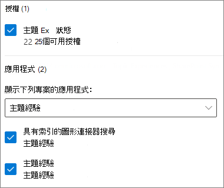
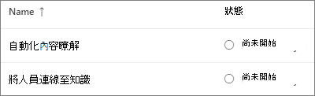
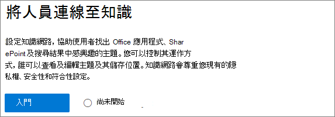
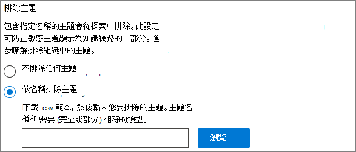
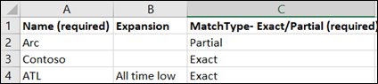
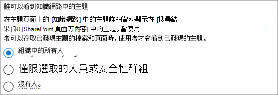
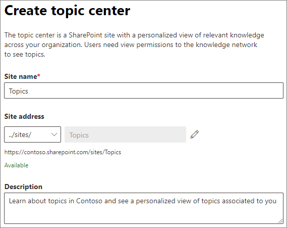

# 設定 Microsoft Viva 主題

您可以使用 Microsoft 365 系統管理中心來設定及設定[主題](topic-experiences-overview.md)。 

在您的環境中規劃設定和設定主題的最佳方式是很重要的。 在您開始本文中的程式之前，請務必閱讀 [Microsoft Viva 主題的計畫](plan-topic-experiences.md) 。

您必須[訂閱 Viva 主題](https://www.microsoft.com/microsoft-viva/topics)，以及全域管理員或 SharePoint 管理員，才能存取 Microsoft 365 系統管理中心及設定相關主題。

如果您已將 SharePoint 設定為[需要受管理裝置](/sharepoint/control-access-from-unmanaged-devices)，請務必設定受管理裝置中的主題。

## 影片示範

這段影片顯示在 Microsoft 365 中設定主題的程式。

 

> [!VIDEO https://www.microsoft.com/videoplayer/embed/RE4Li0E]  

 

## 指派授權

您必須指派授權給將要使用主題的使用者。 只有擁有授權的使用者可以看到主題的資訊，包括重點、主題卡片、主題頁面和主題中心。 

若要指派授權：

1. 在 Microsoft 365 系統管理中心中，在 **[使用者]** 底下，按一下 **[作用中使用者]**。

2. 選取您要授權的使用者，然後按一下 [ **授權和應用程式**]。

3. 在 [ **授權**] 底下，選取 [ **Viva 主題**]。

4. 在 [**應用程式**] 底下，請確定已同時選取 [**使用索引 (Viva 主題的 Graph 連接器進行搜尋])** 和 **Viva 主題**。

   > [!div class="mx-imgBorder"]
   > 

5. 按一下 **[儲存變更]**。

最多可能需要一小時，讓使用者在指派授權後取得主題存取權。

## 設定 [主題]

> [!Note]
> 第一次啟用主題探索時，可能需要長達兩周的時間，所有建議的主題都會出現在 [管理主題] 視圖中。 主題探索會隨著新內容或內容更新而繼續進行。 當 Viva Topics 評估新資訊時，貴組織中的建議主題數目通常會變動。

設定主題
1. 在 [Microsoft 365 系統管理中心](https://admin.microsoft.com)中，選取 [**安裝**]，然後查看 [檔案 **與內容**] 區段。
2. 在 [檔案 **與內容**] 區段中，按一下 [**連線人員進行知識**]。

     

3. 在 [**連線人員知識**] 頁面上，按一下 [**開始**]，逐步引導您完成安裝程式。

     

4. 在 [ **選擇 Viva 主題如何尋找主題** ] 頁面上，您會設定主題探索。 在 [**選取 SharePoint 主題來源**] 區段中，選取要在探索過程中將其編目為主題來源的 SharePoint 網站。 請選擇：
    - **所有網站**：貴組織的所有 SharePoint 網站。 這包括目前和未來的網站。
    - **全部，除了選取的網站以外**：請輸入您要排除的網站名稱。  您也可以上傳想要從探索中選擇的網站清單。 在未來建立的網站將會包含為主題探索的來源。 
    - **僅限選取的網站**：輸入您要包含的網站名稱。 您也可以上傳網站清單。 未來建立的網站將不會包含為主題探索的來源。
    - **沒有網站**：不包含任何 SharePoint 網站。

     
   
5. 在 [以 **名稱排除主題** ] 區段中，您可以新增要從主題探索中排除的主題名稱。 使用此設定可防止敏感資訊包含為主題。 選項如下：
    - **不排除任何主題** 
    - **根據名稱排除主題**

     

     (知識管理員也可以排除探索之後主題中心的主題。 ) 

    #### 操作方法：依名稱排除主題    

    如果您需要排除相關主題，請在選取 [ **依名稱排除主題**] 之後，下載 .csv 範本，並將其更新為您想要從探索結果中排除的主題清單。

     

    在 CSV 範本中，輸入下列您想要排除之主題的資訊：

    - **名稱**：輸入要排除之主題的名稱。 執行這項作業的方法有兩種：
        - 完全相符：您可以包含確切的名稱或縮寫 (例如， *Contoso* 或 *ATL*) 。
        - 部分相符：您可以排除包含特定單字的所有主題。  例如， *弧線* 會排除具有文字 *弧線* 的所有主題，例如 *弧線圓形*、 *等離子弧線焊接* 或 *訓練弧*。請注意，它不會排除包含文字（如 *架構*）一部分的主題。
    - **代表 (選用)**：若要排除縮寫，請輸入縮寫所代表的字。
    - **MatchType-Exact/partial**：輸入您輸入的名稱是 *完全* 或 *部分* 相符類型。

    完成並儲存 .csv 檔之後，請選取 **[流覽]** 以找出並選取。
    
    選取 **[下一步]**。

6. 在 [**神秘可以查看主題及其可以在何處查看** 頁面，您將會設定主題可見度。 在 [**神秘可以查看主題** 設定] 中，選擇誰可以存取主題詳細資料，例如高亮主題、主題卡片、搜尋中的主題答案和主題頁面。 您可以選取：
    - **組織中的所有人**
    - **僅限選取的人員或安全性群組**
    - **沒人**

      

    > [!Note] 
    > 雖然此設定可讓您選取組織中的任何使用者，但只有具有指派授權之使用者的使用者可以查看主題。

7. 在 [ **主題管理的許可權** ] 頁面中，您可以選擇誰將可以建立、編輯或管理主題。 您可以在 [**神秘可以建立及編輯主題**] 區段中，選取：
    - **組織中的所有人**
    - **僅限選取的人員或安全性群組**
    - **沒人**

     

8. 在 [**神秘可以管理主題**] 區段中，您可以選取：
    - **組織中的所有人**
    - **僅限選取的人員或安全性群組**

     

    選取 **[下一步]**。

9. 在 [ **建立主題中心** ] 頁面上，您可以建立可以查看主題頁面和管理主題的主題中心網站。 在 [ **網站名稱** ] 方塊中，輸入主題中心的名稱。 若要變更 URL，您可以按一下鉛筆圖示。 （選用）在 [ **描述** ] 方塊中輸入簡短的描述。 

   > [!Important]
   > 您可以稍後變更網站名稱，但是在完成該嚮導後，就無法變更 URL。

   選取 **[下一步]**。

     

10. 在 **[檢閱並完成]** 頁面上，您可以查看您選取的設定，並選擇進行變更。 如果您對您的選擇感到滿意，請選取 **[啟用]**。

11. 隨即會顯示 [ **Viva 主題** ] 頁面，確認系統會立即開始分析您所選取的網站，以取得主題及建立主題中心網站。 選取 **[完成]**。

12. 您將會傳回 [**連線人員前往知識**] 頁面。 在此頁面上，您可以選取 **[管理]**，以對設定進行任何變更。 

        

## 管理主題經驗

在您設定好主題之後，您可以在[Microsoft 365 系統管理中心](https://admin.microsoft.com/AdminPortal#/featureexplorer/csi/KnowledgeManagement)中變更您在安裝期間所選擇的設定。 請參閱下列參照：

- [在 Microsoft Viva 主題中管理主題探索](topic-experiences-discovery.md)
- [在 Microsoft Viva 主題中管理主題可見度](topic-experiences-knowledge-rules.md)
- [管理 Microsoft Viva 主題中的主題許可權](topic-experiences-user-permissions.md)
- [變更 Microsoft Viva 主題中主題中心的名稱](topic-experiences-administration.md)

## 另請參閱

[主題經驗概述](topic-experiences-overview.md)
