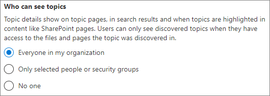

# 設定 Microsoft Viva 主題Set up Microsoft Viva Topics

您可以使用 Microsoft 365 系統管理中心來設定及設定[主題](topic-experiences-overview.md)。You can use the Microsoft 365 admin center to set up and configure [Topics](topic-experiences-overview.md). 

在您的環境中規劃設定和設定主題的最佳方式是很重要的。It is important to plan the best way to set up and configure topics in your environment. 在您開始本文中的程式之前，請務必閱讀 [Microsoft Viva 主題的計畫](plan-topic-experiences.md) 。Be sure to read [Plan for Microsoft Viva Topics](plan-topic-experiences.md) before you begin the procedures in this article.

您必須[訂閱 Viva 主題](https://www.microsoft.com/microsoft-viva/topics)，以及全域管理員或 SharePoint 管理員，才能存取 Microsoft 365 系統管理中心及設定相關主題。You must be [subscribed to Viva Topics](https://www.microsoft.com/microsoft-viva/topics) and be a global administrator or SharePoint administrator to access the Microsoft 365 admin center and set up Topics.

如果您已將 SharePoint 設定為[需要受管理裝置](/sharepoint/control-access-from-unmanaged-devices)，請務必設定受管理裝置中的主題。If you have configured SharePoint to [require managed devices](/sharepoint/control-access-from-unmanaged-devices), be sure to set up Topics from a managed device.

## 影片示範Video demonstration

這段影片顯示在 Microsoft 365 中設定主題的程式。This video shows the process for setting up Topics in Microsoft 365.

 

> [!VIDEO https://www.microsoft.com/videoplayer/embed/RE4Li0E]  

 

## 指派授權Assign licenses

您必須指派授權給將要使用主題的使用者。You must assign licenses for the users who will be using Topics. 只有擁有授權的使用者可以看到主題的資訊，包括重點、主題卡片、主題頁面和主題中心。Only users with a license can see information on topics including highlights, topic cards, topic pages and the topic center. 

若要指派授權：To assign licenses:

1. 在 Microsoft 365 系統管理中心中，在 **[使用者]** 底下，按一下 **[作用中使用者]**。In the Microsoft 365 admin center, under **Users**, click **Active users**.

2. 選取您要授權的使用者，然後按一下 [ **授權和應用程式**]。Select the users that you want to license, and click **Licenses and apps**.

3. 在 [ **授權**] 底下，選取 [ **Viva 主題**]。Under **Licenses**, select **Viva Topics**.

4. 在 [**應用程式**] 底下，請確定已同時選取 [**使用索引 (Viva 主題的 Graph 連接器進行搜尋])** 和 **Viva 主題**。Under **Apps**, make sure **Graph Connectors Search with Index (Viva Topics)** and **Viva Topics** are both selected.

   > [!div class="mx-imgBorder"]
   > 

5. 按一下 **[儲存變更]**。Click **Save changes**.

最多可能需要一小時，讓使用者在指派授權後取得主題存取權。It may take up to an hour for users to get access to Topics after the licenses are assigned.

## 設定 [主題]Set up Topics

> [!Note]
> 第一次啟用主題探索時，可能需要長達兩周的時間，所有建議的主題都會出現在 [管理主題] 視圖中。The first time topic discovery is enabled, it may take up to two weeks for all suggested topics to appear in the Manage Topics view. 主題探索會隨著新內容或內容更新而繼續進行。Topic discovery continues as new content or updates to content are made. 當 Viva Topics 評估新資訊時，貴組織中的建議主題數目通常會變動。It is normal to have fluctuations in the number of suggested topics in your organization as Viva Topics evaluates new information.

設定主題To set up Topics
1. 在 [Microsoft 365 系統管理中心](https://admin.microsoft.com)中，選取 [**安裝**]，然後查看 [檔案 **與內容**] 區段。In the [Microsoft 365 admin center](https://admin.microsoft.com), select **Setup**, and then view the **Files and content** section.
2. 在 [檔案 **與內容**] 區段中，按一下 [**連線人員進行知識**]。In the **Files and content** section, click **Connect people to knowledge**.

     

3. 在 [**連線人員知識**] 頁面上，按一下 [**開始**]，逐步引導您完成安裝程式。On the **Connect people to knowledge** page, click **Get started** to walk you through the setup process.

     

4. 在 [ **選擇 Viva 主題如何尋找主題** ] 頁面上，您會設定主題探索。On the **Choose how Viva Topics can find topics** page, you will configure topic discovery. 在 [**選取 SharePoint 主題來源**] 區段中，選取要在探索過程中將其編目為主題來源的 SharePoint 網站。In the **Select SharePoint topic sources** section, select which SharePoint sites will be crawled as sources for your topics during discovery. 請選擇：Choose from:
    - **所有網站**：貴組織的所有 SharePoint 網站。**All sites**: All SharePoint sites in your organization. 這包括目前和未來的網站。This includes current and future sites.
    - **全部，除了選取的網站以外**：請輸入您要排除的網站名稱。**All, except selected sites**: Type the names of the sites you want to exclude.  您也可以上傳想要從探索中選擇的網站清單。You can also upload a list of sites that you want to opt out from discovery. 在未來建立的網站將會包含為主題探索的來源。Sites created in future will be included as sources for topic discovery. 
    - **僅限選取的網站**：輸入您要包含的網站名稱。**Only selected sites**: Type the names of the sites you want to include. 您也可以上傳網站清單。You can also upload a list of sites. 未來建立的網站將不會包含為主題探索的來源。Sites created in the future will not be included as sources for topic discovery.
    - **沒有網站**：不包含任何 SharePoint 網站。**No sites**: Do not include any SharePoint sites.

     
   
5. 在 [以 **名稱排除主題** ] 區段中，您可以新增要從主題探索中排除的主題名稱。In the **Exclude topics by name** section, you can add names of topics you want to exclude from topic discovery. 使用此設定可防止敏感資訊包含為主題。Use this setting to prevent sensitive information from being included as topics. 選項如下：The options are:
    - **不排除任何主題****Don't exclude any topics** 
    - **根據名稱排除主題****Exclude topics by name**

     

     (知識管理員也可以排除探索之後主題中心的主題。 ) (Knowledge managers can also exclude topics in the topic center after discovery.)

    #### 操作方法：依名稱排除主題How to exclude topics by name    

    如果您需要排除相關主題，請在選取 [ **依名稱排除主題**] 之後，下載 .csv 範本，並將其更新為您想要從探索結果中排除的主題清單。If you need to exclude topics, after selecting **Exclude topics by name**, download the .csv template and update it with the list of topics that you want to exclude from your discovery results.

     

    在 CSV 範本中，輸入下列您想要排除之主題的資訊：In the CSV template, enter the following information about the topics you want to exclude:

    - **名稱**：輸入要排除之主題的名稱。**Name**: Type the name of the topic you want to exclude. 執行這項作業的方法有兩種：There are two ways to do this:
        - 完全相符：您可以包含確切的名稱或縮寫 (例如， *Contoso* 或 *ATL*) 。Exact match: You can include the exact name or acronym (for example, *Contoso* or *ATL*).
        - 部分相符：您可以排除包含特定單字的所有主題。Partial match: You can exclude all topics that have a specific word in it.  例如， *弧線* 會排除具有文字 *弧線* 的所有主題，例如 *弧線圓形*、 *等離子弧線焊接* 或 *訓練弧*。請注意，它不會排除包含文字（如 *架構*）一部分的主題。For example, *arc* will exclude all topics with the word *arc* in it, such as *Arc circle*, *Plasma arc welding*, or *Training arc*. Note that it will not exclude topics in which the text is included as part of a word, such as *Architecture*.
    - **代表 (選用)**：若要排除縮寫，請輸入縮寫所代表的字。**Stands for (optional)**: If you want to exclude an acronym, type the words the acronym stands for.
    - **MatchType-Exact/partial**：輸入您輸入的名稱是 *完全* 或 *部分* 相符類型。**MatchType-Exact/Partial**: Type whether the name you entered was an *exact* or *partial* match type.

    完成並儲存 .csv 檔之後，請選取 **[流覽]** 以找出並選取。After you've completed and saved your .csv file, select **Browse** to locate and select it.
    
    選取 **[下一步]**。Select **Next**.

6. 在 [**神秘可以查看主題及其可以在何處查看** 頁面，您將會設定主題可見度。On the **Who can see topics and where can they see them** page, you will configure topic visibility. 在 [**神秘可以查看主題** 設定] 中，選擇誰可以存取主題詳細資料，例如高亮主題、主題卡片、搜尋中的主題答案和主題頁面。In the **Who can see topics** setting, you choose who will have access to topic details, such as highlighted topics, topic cards, topic answers in search, and topic pages. 您可以選取：You can select:
    - **組織中的所有人****Everyone in my organization**
    - **僅限選取的人員或安全性群組****Only selected people or security groups**
    - **沒人****No one**

      

    > [!Note] 
    > 雖然此設定可讓您選取組織中的任何使用者，但只有具有指派授權之使用者的使用者可以查看主題。While this setting allows you to select any user in your organization, only users who have Topic Experiences licenses assigned to them will be able to view topics.

7. 在 [ **主題管理的許可權** ] 頁面中，您可以選擇誰將可以建立、編輯或管理主題。In the **Permissions for topic management** page, you choose who will be able to create, edit, or manage topics. 您可以在 [**神秘可以建立及編輯主題**] 區段中，選取：In the **Who can create and edit topics** section, you can select:
    - **組織中的所有人****Everyone in my organization**
    - **僅限選取的人員或安全性群組****Only selected people or security groups**
    - **沒人****No one**

     

8. 在 [**神秘可以管理主題**] 區段中，您可以選取：In the **Who can manage topics** section, you can select:
    - **組織中的所有人****Everyone in my organization**
    - **僅限選取的人員或安全性群組****Only selected people or security groups**

     

    選取 **[下一步]**。Select **Next**.

9. 在 [ **建立主題中心** ] 頁面上，您可以建立可以查看主題頁面和管理主題的主題中心網站。On the **Create topic center** page, you can create your topic center site in which topic pages can be viewed and topics can be managed. 在 [ **網站名稱** ] 方塊中，輸入主題中心的名稱。In the **Site name** box, type a name for your topic center. 若要變更 URL，您可以按一下鉛筆圖示。You can click the pencil icon if you want to change the URL. （選用）在 [ **描述** ] 方塊中輸入簡短的描述。Optionally, type a short description in the **Description** box. 

   > [!Important]
   > 您可以稍後變更網站名稱，但是在完成該嚮導後，就無法變更 URL。You can change the site name later, but you can't change the URL after you complete the wizard.

   選取 **[下一步]**。Select **Next**.

     

10. 在 **[檢閱並完成]** 頁面上，您可以查看您選取的設定，並選擇進行變更。On the **Review and finish** page, you can look at your selected setting and choose to make changes. 如果您對您的選擇感到滿意，請選取 **[啟用]**。If you are satisfied with your selections, select **Activate**.

11. 隨即會顯示 [ **Viva 主題** ] 頁面，確認系統會立即開始分析您所選取的網站，以取得主題及建立主題中心網站。The **Viva Topics activated** page will display, confirming that the system will now start analyzing your selected sites for topics and creating the topic center site. 選取 **[完成]**。Select **Done**.

12. 您將會傳回 [**連線人員前往知識**] 頁面。You'll be returned to your **Connect people to knowledge** page. 在此頁面上，您可以選取 **[管理]**，以對設定進行任何變更。From this page, you can select **Manage** to make any changes to your configuration settings. 

        

## 管理主題經驗Manage topic experiences

在您設定好主題之後，您可以在[Microsoft 365 系統管理中心](https://admin.microsoft.com/AdminPortal#/featureexplorer/csi/KnowledgeManagement)中變更您在安裝期間所選擇的設定。Once you have set up Topics, you can change the settings that you chose during setup in the [Microsoft 365 admin center](https://admin.microsoft.com/AdminPortal#/featureexplorer/csi/KnowledgeManagement). 請參閱下列參照：See the following references:

- [在 Microsoft Viva 主題中管理主題探索Manage topic discovery in Microsoft Viva Topics](topic-experiences-discovery.md)
- [在 Microsoft Viva 主題中管理主題可見度Manage topic visibility in Microsoft Viva Topics](topic-experiences-knowledge-rules.md)
- [管理 Microsoft Viva 主題中的主題許可權Manage topic permissions in Microsoft Viva Topics](topic-experiences-user-permissions.md)
- [變更 Microsoft Viva 主題中主題中心的名稱Change the name of the topic center in Microsoft Viva Topics](topic-experiences-administration.md)

## 另請參閱See also

[主題經驗概述Topic Experiences Overview](topic-experiences-overview.md)
