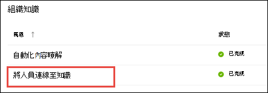

# 主題中心概述（預覽）Topic center overview (Preview)

> [!Note] 
> 本文內容適用于 Project Cortex 私人預覽。The content in this article is for Project Cortex Private Preview. [進一步瞭解專案 Cortex](https://aka.ms/projectcortex)。[Find out more about Project Cortex](https://aka.ms/projectcortex).

主題中心是現代的 SharePoint 網站，可充當組織的知識中心。The topic center is a Modern SharePoint site that serves as a center of knowledge for your organization. 在 Microsoft 365 系統管理中心的[知識管理安裝程式](set-up-knowledge-network.md)期間建立。It is created during [Knowledge Management setup](set-up-knowledge-network.md) in the Microsoft 365 admin center.

透過主題中心，具有適當許可權的使用者可以執行下列作業：Through the topic center, users with the proper permissions can do the following:

- 確認或拒絕已探索的主題Confirm or reject discovered topics
- 建立新的主題頁面Create a new topic page
- 編輯現有的主題頁面Edit an existing topic page

> [!Note] 
> 您可以在[[使用主題中心的主題](work-with-topics.md)] 中深入瞭解每個任務。You can learn more about each task in [Work with topics in the topic center](work-with-topics.md).

## 主題中心的位置Where is the topic center

您的主題中心是在知識管理安裝期間建立。Your topic center is created during Knowledge Management setup. 安裝程式完成後，系統管理員可以在「[知識中心管理」頁面](manage-knowledge-network.md)上找到該 URL。After setup completes, an admin can find the URL on the [knowledge center management page](manage-knowledge-network.md).

1. 在 Microsoft 365 系統管理中心中，選取功能窗格中的 [**安裝程式**]，然後選取 [**組織知識**] 區段中的 **[連線人員與知識]**。In the Microsoft 365 admin center, select **Setup** in the navigation pane, and in the **Organizational Knowledge** section, select **Connect people to knowledge**.

     

2. 在 [連線**人員至知識]** 頁面的 [**一覽**] 區段中，參閱網站 URL 的**主題中心位址**。On the **Connect people to knowledge** page, in the **At a glance** section, see **Topic center address** for the site URL.

## 使用主題中心的許可權Permissions to use the topic center

若要在主題中心運作，您必須具備必要的許可權。To work in the topic center, you need to have the required permissions. 您的系統管理員可以在[知識管理安裝](set-up-knowledge-network.md)期間將這些許可權指派給使用者，或使用 Microsoft 365 系統管理中心，以系統管理員[身分新增新](give-user-permissions-to-the-topic-center.md)的使用者。Your admin can assign these permissions to users during [knowledge management setup](set-up-knowledge-network.md), or new users can be [added afterwards](give-user-permissions-to-the-topic-center.md) by an admin through the Microsoft 365 admin center.

主題中心使用者可獲得兩組許可權：Topic center users can be given two sets of permissions:

- **建立及編輯主題**：建立新的主題或更新主題內容，例如描述、檔和相關人員。**Create and edit topics**: Create new topics or update topic content such as the description, documents and associated persons. 將此許可權指派給負責審閱主題頁面的主題專家。Assign this permission to subject matter experts who are tasked with reviewing topic pages.
- **管理主題**：使用主題儀表板來查看整個組織中的主題。**Manage topics**: Use the topic dashboard to review topics across the organization. 使用者可以執行諸如確認和拒絕未確認主題等動作。Users can perform actions such as confirming and rejecting unconfirmed topics.

使用者可以指定這兩組許可權，或只有一個使用者需要。A user can be given both sets of permissions, or only one if needed. 

## 審閱主題儀表板中的主題Reviewing topics in the topic dashboard

主題儀表板會顯示從您指定之來源位置中挖掘的主題。The topic dashboard shows topics that were mined from your specified source locations. 每個主題都會顯示已探索該主題的日期，以及其上是否提供任何意見反應。Each topic will show the date the topic was discovered and if any feedback has been provided on it. 已獲指派「**管理主題**」許可權的使用者可以查看未確認的主題，並選擇：A user who was assigned **Manage topics** permissions can review the unconfirmed topics and choose to:
- 確認主題：對具有存取權的使用者強調該主題，讓他們能看到相關聯的主題卡片和主題頁面。Confirm the topic: Highlights the topic to users who have access and lets them see the associated topic card and topic page.
- 拒絕主題：讓使用者無法使用主題。Reject the topic: Makes the topic not available to users. 將主題移至 [已**拒絕**] 索引標籤，並在需要時再確認。The topic is moved to the **Rejected** tab and can be confirmed later if needed.

## 建立或編輯主題Create or edit a topic

如果您有**建立及編輯主題**許可權，您可以選擇：If you have **Create and edit topics** permissions, you can choose to:

- 編輯現有主題：您可以對透過探索所建立的現有主題頁面進行變更。Edit existing topics: You can make changes to existing topic pages that were created through discovery.
- 建立新主題：您可以為未透過探索找到的專案建立新的主題，或如果 AI 工具沒有找到足夠的證據可以建立主題。Create new topics: You can create new topics for ones that were not found through discovery, or if AI tools did not find enough evidence to create a topic.

## 另請參閱See also

  

