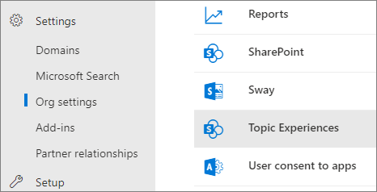

# Microsoft Viva 主題中的主題中心概述

在 Microsoft Viva 主題中，主題中心是現代的 SharePoint 網站，可充當組織的知識中心。 它是在 Microsoft 365 系統管理中心的[Viva 主題設定](set-up-topic-experiences.md)期間建立。

主題中心的預設首頁包含 [ **主題** ] 網頁元件，所有授權的使用者都可以在此網頁元件中查看其連線的主題。

雖然所有可查看主題的授權使用者都可以存取主題中心，但知識管理員也可以透過「 **管理主題** 」頁面來管理主題。 [ **管理主題** ] 索引標籤只會向具有「管理主題」許可權的使用者顯示。

## 主題中心的位置

主題中心是在 Viva 主題設定期間建立。 安裝程式完成後，系統管理員可以在 [ [主題中心管理] 頁面](./topic-experiences-administration.md#to-access-topics-management-settings)上找到該 URL。

1. 在 Microsoft 365 系統管理中心中，選取 [**設定**]，然後選取 [**組織設定**]。
2. 在 [ **服務** ] 索引標籤上，選取 [ **主題經驗**]。

    

3. 選取 [ **主題中心** ] 索引標籤。在 [ **網站位址** ] 底下是主題中心的連結。

    

## 首頁

 

> [!VIDEO https://www.microsoft.com/videoplayer/embed/RE4LAhZ]

 

在 [主題中心] 首頁上，您可以看到您的組織中有連接的主題。

- 建議的連線-您會看到下列主題 **列出的主題。我們有正確的功能嗎？** 這些主題是透過 AI 建議您連線至主題的連結。 例如，您可能是相關檔案或網站的作者。 系統會要求您確認您應該將主題保留為相關人員。

   

- 已確認的連線-這些是您在 [主題] 頁面上釘住的主題，或已確認主題的建議連接。 當您確認已建議的連線時，主題將從 [建議已確認] 區段中移出。

   

一旦使用者確認其與主題的連線，使用者就可以編輯 [主題] 頁面，以 curate 其連接。 例如，他們可以提供相關主題的詳細資訊。

## [管理主題] 頁面

若要使用主題中心的 [ **管理主題** ] 頁面，您必須具有「知識管理員」角色所需的「管理主題」許可權。 您[的系統](topic-experiences-knowledge-rules.md)管理員可以在[Viva 主題設定](set-up-topic-experiences.md)期間，將這些許可權指派給使用者，或使用 Microsoft 365 系統管理中心後，系統管理員可以新增新的使用者。

在 [ **管理主題** ] 頁面上，主題儀表板會顯示您可以從指定的來源位置識別的所有主題（您可以存取）。 每個主題都會顯示已探索該主題的日期。 已獲指派「管理主題」許可權的使用者可以查看未確認的主題，並選擇：

- 確認主題：向使用者指出 AI 建議的主題已由人體 curator 驗證。

- 發佈主題：編輯主題資訊以提升最初識別主題的品質，並將主題重點放至所有具有「查看」主題存取權的使用者。

- 移除主題：讓主題因此給使用者。 主題會移至 [ **已移除** ] 索引標籤，並在需要時可供日後確認。

如需如何在「 **管理主題** 」頁面上管理主題的詳細資訊，請參閱 [管理主題](manage-topics.md)。

## 建立或編輯主題

如果您已建立及編輯主題許可權，您可以：

- [編輯現有主題](edit-a-topic.md)：您可以對透過探索所建立的現有主題頁面進行變更。

- [建立新主題](create-a-topic.md)：您可以為未透過探索找到的專案建立新的主題，或如果 AI 工具沒有找到足夠的證據可以建立主題。

## 另請參閱

[管理主題中心的主題](manage-topics.md)
