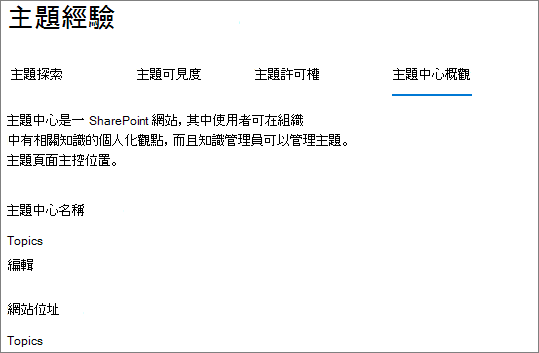

# Microsoft Viva 主題中的主題中心概述Topic center overview in Microsoft Viva Topics

在 Microsoft Viva 主題中，主題中心是現代的 SharePoint 網站，可充當組織的知識中心。In Microsoft Viva Topics, the topic center is a modern SharePoint site that serves as a center of knowledge for your organization. 它是在 Microsoft 365 系統管理中心的[Viva 主題設定](set-up-topic-experiences.md)期間建立。It's created during [Viva Topics setup](set-up-topic-experiences.md) in the Microsoft 365 admin center.

主題中心的預設首頁包含 [ **主題** ] 網頁元件，所有授權的使用者都可以在此網頁元件中查看其連線的主題。The topic center has a default home page with the **Topics** web part where all licensed users can see the topics to which they have a connection. 

雖然所有可查看主題的授權使用者都可以存取主題中心，但知識管理員也可以透過「 **管理主題** 」頁面來管理主題。While all licensed users who can view topics will have access to the topic center, knowledge managers can also manage topics through the **Manage topics** page. [ **管理主題** ] 索引標籤只會向具有「管理主題」許可權的使用者顯示。The **Manage topics** tab will only display to users who have the Manage topics permissions. 

## 主題中心的位置Where is my topic center

主題中心是在 Viva 主題設定期間建立。The topic center is created during Viva Topics setup. 安裝程式完成後，系統管理員可以在 [ [主題中心管理] 頁面](./topic-experiences-administration.md#to-access-topics-management-settings)上找到該 URL。After setup completes, an admin can find the URL on the [Topic center management page](./topic-experiences-administration.md#to-access-topics-management-settings).

1. 在 Microsoft 365 系統管理中心中，選取 [**設定**]，然後選取 [**組織設定**]。In the Microsoft 365 admin center, select **Settings**, and then select **Org settings**.
2. 在 [ **服務** ] 索引標籤上，選取 [ **主題經驗**]。On the **Services** tab, select **Topic Experiences**.

     

3. 選取 [ **主題中心** ] 索引標籤。在 [ **網站位址** ] 底下是主題中心的連結。Select the **Topic center** tab. Under **Site address** is a link to your topic center.

     

## 首頁Home page

 

> [!VIDEO https://www.microsoft.com/videoplayer/embed/RE4LAhZ]  

 

在 [主題中心] 首頁上，您可以看到您的組織中有連接的主題。On the topic center home page, you can see the topics in your organization to which you have a connection.

- 建議的連線-您會看到下列主題 **列出的主題。我們有正確的功能嗎？**Suggested connections - You will see topics listed under **We've listed you on these topics. Did we get it right?** 這些主題是透過 AI 建議您連線至主題的連結。These are topics in which your connection to the topic has been suggested through AI. 例如，您可能是相關檔案或網站的作者。For example, you might be an author of a related file or site. 系統會要求您確認您應該將主題保留為相關人員。You are asked to confirm that you should stay listed as a related person for the topic.

    
 
- 已確認的連線-這些是您在 [主題] 頁面上釘住的主題，或已確認主題的建議連接。Confirmed connections - These are topics in which you are pinned on the topic page or you've confirmed a suggested connection to the topic. 當您確認已建議的連線時，主題將從 [建議已確認] 區段中移出。Topics will move from the suggested to confirmed section when you confirm a suggested connection.
 
    

一旦使用者確認其與主題的連線，使用者就可以編輯 [主題] 頁面，以 curate 其連接。Once a user confirms their connection to a topic, the user can make edits to the topic page to curate their connection. 例如，他們可以提供相關主題的詳細資訊。For example, they can provide more information about their connection to the topic.

## [管理主題] 頁面Manage topics page

若要使用主題中心的 [ **管理主題** ] 頁面，您必須具有「知識管理員」角色所需的「管理主題」許可權。To work on the **Manage topics** page of topic center, you need to have the required Manage topics permissions needed for the knowledge manager role. 您的系統管理員可以在[知識管理安裝](set-up-topic-experiences.md)期間將這些許可權指派給使用者，或使用 Microsoft 365 系統管理中心的系統管理員[來新增新](topic-experiences-knowledge-rules.md)使用者。Your admin can assign these permissions to users during [knowledge management setup](set-up-topic-experiences.md), or new users can be [added afterwards](topic-experiences-knowledge-rules.md) by an admin through the Microsoft 365 admin center.

在 [ **管理主題** ] 頁面上，主題儀表板會顯示您可以從指定的來源位置識別的所有主題（您可以存取）。On the **Manage topics** page, the topic dashboard shows all the topics, you have access to, that were identified from your specified source locations. 每個主題都會顯示已探索該主題的日期。Each topic will show the date the topic was discovered. 已獲指派「管理主題」許可權的使用者可以查看未確認的主題，並選擇：A user who was assigned Manage topics permissions can review the unconfirmed topics and choose to:

- 確認主題：向使用者指出 AI 建議的主題已由人體 curator 驗證。Confirm the topic: Indicates to users that an AI-suggested topic has been validated by a human curator.

- 發佈主題：編輯主題資訊以提升最初識別主題的品質，並將主題重點放至所有具有「查看」主題存取權的使用者。Publish the topic: Edit the topic information to improve the quality of the topic that was initially identified, and highlights the topic to all users who have view access to topics.
 
- 移除主題：讓主題因此給使用者。Remove the topic: Makes the topic undiscoverable to end users. 主題會移至 [ **已移除** ] 索引標籤，並在需要時可供日後確認。The topic is moved to the **Removed** tab and can be confirmed later if needed. 

如需如何在「 **管理主題** 」頁面上管理主題的詳細資訊，請參閱 [管理主題](manage-topics.md)。For more information about how to manage topics on the **Manage topics** page, see [Manage topics](manage-topics.md).

## 建立或編輯主題Create or edit a topic

如果您已建立及編輯主題許可權，您可以：If you have Create and edit topics permissions, you can:

- [編輯現有主題](edit-a-topic.md)：您可以對透過探索所建立的現有主題頁面進行變更。[Edit existing topics](edit-a-topic.md): You can make changes to existing topic pages that were created through discovery.

- [建立新主題](create-a-topic.md)：您可以為未透過探索找到的專案建立新的主題，或如果 AI 工具沒有找到足夠的證據可以建立主題。[Create new topics](create-a-topic.md): You can create new topics for ones that were not found through discovery, or if AI tools did not find enough evidence to create a topic.

## 請參閱See also

[在主題中心中管理主題Manage topics in the topic center](manage-topics.md)

