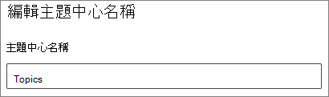

# 變更 Microsoft Viva 主題中主題中心的名稱Change the name of the topic center in Microsoft Viva Topics

您可以在 [Microsoft 365 系統管理中心](https://admin.microsoft.com)變更主題中心的名稱。You can change the name of your topic center in the [Microsoft 365 admin center](https://admin.microsoft.com). 您必須是全域系統管理員或 SharePoint 管理員，才可執行這些工作。You must be a global administrator or SharePoint administrator to perform these tasks.

## 若要存取主題管理設定：To access topics management settings:

1. 在 Microsoft 365 系統管理中心中，按一下 [ **設定**]，然後按一下 [ **組織設定**]。In the Microsoft 365 admin center, click **Settings**, then **Org settings**.
2. 在 [ **服務** ] 索引標籤上，按一下 [ **主題經驗**]。On the **Services** tab, click **Topic experiences**.

     

3. 選取 [ **主題中心** ] 索引標籤。請參閱下列各節以取得每個設定的相關資訊。Select the **Topic center** tab. See the following sections for information about each setting.

     

##  更新主題中心名稱Update your topic center name

變更主題中心的名稱To change the name of the topic center

1. 在 [ **主題中心** ] 索引標籤的 [ **主題中心名稱**] 下，選取 [ **編輯**]。On the **Topic center** tab, under **Topic center name**, select **Edit**.
2. 在 [ **編輯主題中心名稱** ] 頁面上，于 [ **主題中心名稱** ] 方塊中，輸入主題中心的新名稱。On the **Edit topic center name** page, in the **Topic center name** box, type the new name for your topic center.
3. 選取 **[儲存]**Select **Save**

      

## 另請參閱See also

[在 Microsoft Viva 主題中管理主題探索Manage topic discovery in Microsoft Viva Topics](topic-experiences-discovery.md)

[在 Microsoft Viva 主題中管理主題可見度Manage topic visibility in Microsoft Viva Topics](topic-experiences-knowledge-rules.md)

[管理 Microsoft Viva 主題中的主題許可權Manage topic permissions in Microsoft Viva Topics](topic-experiences-user-permissions.md)
