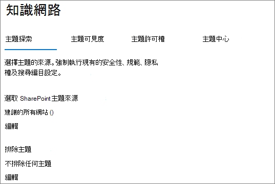
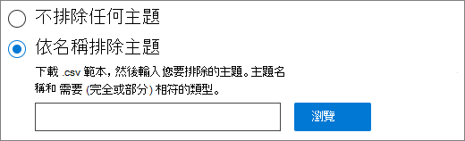

# <a name="manage-topic-discovery-in-microsoft-365"></a>在 Microsoft 365 中管理主題探索

您可以在 [Microsoft 365 系統管理中心](https://admin.microsoft.com)管理主題探索設定。 您必須是全域系統管理員或 SharePoint 管理員，才可執行這些工作。

## <a name="to-access-topics-management-settings"></a>若要存取主題管理設定：

1. 在 Microsoft 365 系統管理中心中，按一下 [ **設定**]，然後按一下 [ **組織設定**]。
2. 在 [ **服務** ] 索引標籤上，按一下 [ **知識網路**]。

     

3. 選取 [ **主題探索** ] 索引標籤。請參閱下列各節以取得每個設定的相關資訊。

     

## <a name="select-sharepoint-topic-sources"></a>選取 SharePoint 主題來源

您可以變更組織中將會編目主題的 SharePoint 網站。

如果您想要包含或排除特定的網站清單，您可以使用下列 .csv 範本：

``` csv
Site name,URL
```

如果您使用網站選擇器新增網站，則會將其新增至現有的網站清單，以包含或排除。 如果您上傳的是 .csv 檔案，它會覆寫任何現有的清單。 如果您先前已包含或排除特定網站，請將清單下載為 .csv 檔案，進行變更，並上傳新的清單。

選擇網站以供主題探索

1. 在 [ **主題探索** ] 索引標籤上，選取 [ **SharePoint 主題來源**] 底下的 [ **編輯**]。
2. 在 [ **選取 SharePoint 主題來源** ] 頁面上，選取要在探索過程中將其編目為主題來源的 SharePoint 網站。 這包括：
    - **所有網站**：您租使用者中的所有 SharePoint 網站。 這會捕獲目前和未來的網站。
    - **全部，除了選取的網站以外**：請輸入您要排除的網站名稱。  您也可以從探索中上傳想要選擇從探索中移除的網站清單。 未來建立的網站會包含為主題探索的來源。 
    - **僅限選取的網站**：輸入您要包含的網站名稱。 您也可以上傳網站清單。 未來建立的網站不會包含為主題探索的來源。
    - **無網站**：主題不會自動產生或更新 SharePoint 內容。 現有的主題會保留在主題中心。

    
   
3. 按一下 **[儲存]**。

## <a name="exclude-topics-by-name"></a>依名稱排除主題

您可以使用 .csv 檔案上傳清單，從探索中排除主題。 如果您先前已排除主題，您可以下載 .csv，進行變更，然後重新上傳。

1. 在 [ **主題探索** ] 索引標籤上，選取 [ **排除主題**] 下的 [ **編輯**]。
2. 按一下 [ **依名稱排除主題**]。
3. 如果您需要建立清單，請下載 .csv 範本並新增您要排除的主題 (請參閱下列) *使用 .csv 範本* 。 當檔案準備好時，請按一下 **[流覽]** 並上傳檔案。 如果有現有清單，您可以下載包含清單的 .csv。
4. 按一下 **[儲存]**。

    

### <a name="working-with-the-csv-template"></a>使用 .csv 範本

您可以複製下列 csv 範本：

``` csv
Name (required),Expansion,MatchType- Exact/Partial (required)
```

在 CSV 範本中，輸入您要排除之主題的下列相關資訊：

- **名稱**：輸入您要排除的主題名稱。 方法有兩種：
    - 完全相符：您可以包含確切的名稱或縮寫 (例如， *Contoso* 或 *ATL*) 。
    - 部分相符：您可以排除包含特定單字的所有主題。  例如， *弧線* 會排除具有文字 *弧線* 的所有主題，例如 *弧線圓形*、 *等離子弧線焊接* 或 *訓練弧*。請注意，它不會排除包含文字（如 *架構*）一部分的主題。
- **代表 (選用)**：若要排除縮寫，請輸入縮寫所代表的字。
- **MatchType-Exact/partial**：輸入您輸入的名稱是 *完全* 或 *部分* 相符類型。

     

## <a name="see-also"></a>也請參閱

[在 Microsoft 365 中管理主題可見度](topic-experiences-knowledge-rules.md)

[在 Microsoft 365 中管理主題許可權](topic-experiences-user-permissions.md)

[變更 Microsoft 365 主題中心的名稱](topic-experiences-administration.md)

