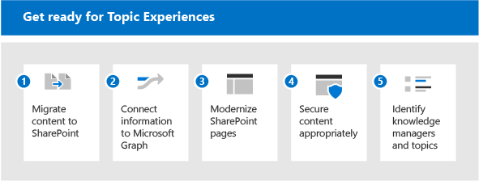

# 讓您的環境做好準備 Microsoft Viva 主題的準備

若要充分利用 Viva 主題，您想要有盡可能多的內容納入主題探索，使您可以為使用者提供一組豐富的主題。 但是應使用何種內容做為主題探索？ 如何在保持控制的情況下，最大化已編制索引的內容？ 範圍中的內容越多，人工智慧所能探索的洞察力就越好。 本文將引導您完成規劃步驟，以確保您包含適當的內容，而且您具有適當的人員和資源，讓使用者具備良好的體驗。

若要規劃 Viva 主題，您必須：

1. [將內容遷移至 SharePoint](#1-migrate-content-to-microsoft-365)
    - 主題索引僅包括 SharePoint 網站上的內容。
      - 盡可能將重要內容遷移至從外部來源 SharePoint 線上。
      - 為內容來源設定高潛力 tacit 知識的優先順序。
      - 強調知識管理的優點，以鼓勵使用者將內容從 OneDrive 移至 SharePoint 網站。

2. [將資訊連接至 Microsoft Graph](#2-connect-information-to-microsoft-graph)
    - 今後，可將外部內容放入知識圖形，並變為可用。
    - 針對無法移動的內容，請考慮使用圖形連接器增強搜尋並準備好未來包含。

3. [現代化 SharePoint 頁面](#3-modernize-sharepoint-pages)
    - 主題卡片只可在新式頁面上呈現。
    - 識別具有現代化候選人的高設定檔傳統頁面。

4. [適當保護內容](#4-secure-content-appropriately)
    - 主題資源是根據使用者的許可權來裁切安全性。
    - 識別任何可能具有錯誤的寬泛或限制性許可權的內容：
      - 鼓勵網站擁有者使用共用報告檢查許可權
      - 讓系統管理員透過搜尋來審核廣泛的共用內容
      - 鼓勵內容擁有人共用不敏感的內容，而且可能會對組織帶來更大的利益。
    - 在使用者和內容上複查您的 Microsoft Graph 設定：
      - 主題索引會考慮從搜尋或 Delve (中排除內容的設定，例如，NOINDEX) 。 請複查這些設定是否仍然相關。

5. [識別知識管理員和主題](#5-identify-knowledge-managers-and-topics)
    - 使用現有的分類法以手動方式建立主題，或協助確認 AI 建議的主題。
    - 針對預期或植入的主題，識別主題專家 (Sme) 。
    - 識別涵蓋大量重要資料的網站，可用於試驗主題挖掘。
    - 接洽知識主管和實踐社區。

## 1. 將內容遷移至 Microsoft 365

您可以使用數種工具和服務來協助您進行遷移-您可以取得如何在將 [內容遷移至 Microsoft 365](/sharepointmigration/migrate-to-sharepoint-online)時進行遷移的相關資訊。 遷移工具組括：

- [移轉管理員](/sharepointmigration/mm-get-started)
- [SharePoint 移轉工具 (SPMT)](/sharepointmigration/introducing-the-sharepoint-migration-tool)
- [Microsoft 365 FastTrack](https://www.microsoft.com/fasttrack/microsoft-365)
- [合作夥伴遷移工具和服務](https://www.microsoft.com/solution-providers)

進行最大的遷移：

- 遷移至現代網站-包括 Microsoft 團隊。 在任何 SharePoint 網站 (古典或新式) 進行索引時，只會在新式頁面上顯示使用者透過高光和卡片的主題。
- 維護使用者-大部分的遷移工具可讓您在整個遷移期間對應使用者身分識別，這樣就會在遷移之後保留以所建立的屬性或修改者等屬性。 這對主題來說很重要，因為檔案的 authorship 是用來識別新增至主題頁面或卡片的專家。 
- 將服務帳戶名稱設定為描述性-在某些情況下，不可能維護所有的使用者名。 例如，如果您要遷移的是某人不再是組織員工所建立的內容。 在此範例中，大部分的遷移工具都會移動檔案，就像它是由系統管理員帳戶或服務帳戶所建立。 如果經常發生這種情況，則該服務帳戶會以專家的身分列在主題中。 在這個情況下，該帳戶的命名會變得非常重要。 如果您使其具有描述性，您的使用者使用主題時，這些非人員帳戶的狀態將是可理解的。

## 2. 將資訊連接至 Microsoft Graph

如果您無法遷移部分內容，請使用 Microsoft Graph 進行連線：

- 請考慮實施 [圖形內容連接器](/microsoftsearch/connectors-overview)。 您可以使用連接器將外部內容編入 Microsoft Graph，讓使用者可以透過 Microsoft 搜尋探索該內容。
- 未來的發展會將外部資料引入 Viva 主題。

## 3. 現代化 SharePoint 頁面

由於主題卡片和高光只會出現在新式頁面上，因此請將您想要包含在 Viva 主題中的任何頁面更新為新式。 請參閱「 [現代化」傳統 SharePoint 網站](/sharepoint/dev/transform/modernize-classic-sites)。 您可以使用 [SharePoint 現代化掃描器](/sharepoint/dev/transform/modernize-scanner) 來準備您的傳統網站，以進行現代化。

如果您有許多傳統網站，請設定高設定檔頁面面的優先順序，以轉換為新式。

## 4. 適當保護內容

當使用者與主題卡片或主題頁面互動時，可能會看到不同的資源。 這是因為他們可以存取與主題相關聯的不同檔案。 如果您的基礎許可權過於嚴格，則透過主題 serendipitous 的資訊探索方面可能會降低。 另一方面，如果兩者過於廣泛，主題可能會向使用者呈現您不想要看到的內容。
良好的版權管理在這裡很重要。 而且適當的版權管理是以管理員和內容擁有者的現行合作關係為基礎。 雖然這可能是進行中的活動，但是在準備主題時，您可以採取一些實用步驟：

- 鼓勵網站擁有人複查共用和許可權。

  SharePoint 網站擁有者可以查看其網站的共用報告，該網站會顯示網站上所設定之擁有權限及共用連結的完整詳細資料，請參閱 [共用報告](/sharepoint/sharing-reports)。 這會列出內部和外部 (來賓) 使用者。

  網站擁有者也可以前往 [ **網站許可權** ] 和 [ **高級許可權設定** ] 頁面，查看誰擁有該網站的許可權。

  1. 在您的網站上，選擇 [**設定**  >  **網站許可權**]。 查看 [網站擁有者]、[網站成員] 及 [網站訪客] 底下所列的人員。 檢查是否有任何來賓使用者。
  2. 在 [ **許可權** ] 頁面上，選擇 [ **高級許可權設定**]。 您可以檢查獨特的許可權，並查看誰對網站中的任何專案擁有有限的存取權。

- 審核 Microsoft 365 群組和小組，確定已適當設定為公用或私人群組或小組。 根據預設，新的團隊和 Microsoft 365 群組會設為私密，但是預設會公開第一次發行時。 如果您已將這些技術的先前結合，您可能想要複習。 此外，小組的職能通常會在其整個生命週期中演變，而且可能需要更新設定，以反映目前的團隊使用方式。
- 請查看「所有人」、「外部使用者以外的所有人」或廣泛的安全性群組的使用。 內容可能無法與這些值一起正確共用。 若要查看這些群組的使用，您可以：
  - 建立沒有群組成員資格的帳戶
  - 使用此帳戶進行搜尋，以探索廣泛共用的內容。
  - 如果透過搜尋對此帳戶顯示不適當的內容，則您可以與網站擁有者合作，以更正許可權設定。

除了許可權之外，您還可以控制透過主題所發現之專案的範圍。 您永遠可以控制已編制索引的專案。

管理員可在 Microsoft 365 系統管理中心中設定索引。 當您設定 [知識管理](set-up-topic-experiences.md)時，您可以：

- 允許跨所有 SharePoint 網站探索或指定網站以包含或排除主題來源。
- 在您有機密字詞的地方，您也可以使用 [名稱] 排除主題。 例如，如果您有敏感專案的名稱，而不想要顯示醒目或卡片，不論使用者的許可權為何，您可以排除該專案名稱。

在內容層級，您也可以控制可探索的專案。 您為從搜尋排除內容所做的任何設定也會由內容探索使用。 例如，如果您已排除特定文件庫出現在搜尋結果中，則不會將此文件庫用於主題探索。

## 5. 識別知識管理員和主題

管理主題包括三個重要角色，包含兩個新的 Azure Active Directory (AAD) 角色：知識管理員和知識管理員：

- 知識管理員 (KA) 是技術角色，通常是在其中。 此角色可讓您在 M365 系統管理中心中設定 Viva 主題，以及設定主題探索和可視性。
- 知識管理員 (KM) 會與主題自行運作，並監督其品質和完整性。
- 主題參與者 (TCs) 不是以 AAD 角色為基礎，但系統管理中心的許可權。 他們是主題專家，可以 curate 主題的內容、新增資源和人員。

視您的組織而定，您可能會有幾個或多個人員擔當這些角色。 有些組織可能會有相同的人員。

| 知識管理 | 知識管理員 | 主題參與者 |
|:-------|:-------|:-------|:-------|
| AAD 角色 | AAD 角色 | 中小企業 |
| 可以存取系統管理中心 | 可以存取系統管理中心 | 無法存取系統管理中心 |
| 設定 Viva 主題 | 擁有主題的管理和品質 | 根據其專業知識為主題貢獻。 |
| 確定已強制執行安全性和符合性標準，並可瞭解授權合約。| 會執行「建立」、「編輯」、「刪除」及「拒絕」主題等主題管理工作。 支援主題參與者的任務。 | Curates 主題頁面上的資訊和內容，包括哪些人員和資源釘住在該主題。 |

在使用者的工作內容中，使用者會看到醒目和卡片，例如流覽 SharePoint 中的現代頁面。 您可以控制主題的使用者經驗。

- 誰可以查看主題？ 主題可見度是在 Microsoft 365 系統管理中心中設定。 選擇要允許查看主題的群組：
  - 組織中的每個人。 "Everyone" 不包括來賓，這是目錄中的所有內部使用者
  - 只有選取的人員或安全性群組 (此選項是好的，您仍會 Viva 主題，所以您可以使用) 的使用者子集進行測試。 若要讓客人查看主題，您必須使用 [選取的人員或安全性群組] 選項，並授與授權。
  - 沒有人。

    所有使用者（甚至來賓使用者）都必須套用授權，才可查看主題經驗。 請記住，許可權一定會控制可看到的內容。

- 哪些主題是可見的？ 您可以選擇：
  - 顯示所有候選人主題。
  - 只顯示已確認的主題。

現在，我們有管理員、專家和使用者，我們可以討論主題本身。

- 將主題植入主題清單是一種很好的作法。 主題的品質與數量是以您的內容為基礎，只要其包含在範圍中的內容，它就會建立為主題。 如果主題有足夠的資訊與證據，它就會透過 AI 建立。 植入主題是知識管理員和主題專家可協助的地方。 使用 AI 結合人類知識是最佳的品質主題途徑。 因此，如果有您預期的主題，您可以在主題中心手動建立這些主題。 這樣做會讓 AI 成為該主題相關性的強烈信號，而且會識別要與該主題產生關聯的資源和人員。
- 使用現有的分類來協助您規劃您的主題，不論是從 SharePoint 或其他地方。 現有的分類通常包含組織條款、產品、主題區域等等。 主題來源也可以來自專案的清單、現有的搜尋書簽等等。