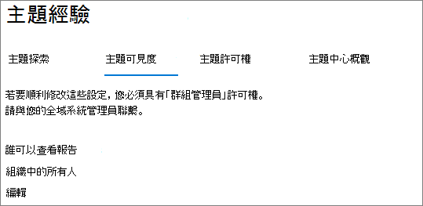

# 在 Microsoft Viva 主題中管理主題可見度

您可以管理[Microsoft 365 系統管理中心](https://admin.microsoft.com)中可以查看主題要聞、主題卡片及主題中心的使用者組。 您必須是全域系統管理員或 SharePoint 管理員，才可執行這些工作。

## 若要存取主題管理設定：

1. 在 Microsoft 365 系統管理中心，按一下 [**設定**，然後按一下 [**組織設定**]。
2. 在 [ **服務** ] 索引標籤上，按一下 [ **主題經驗**]。

     

3. 選取 [ **主題可見度** ] 索引標籤。請參閱下列各節以取得每個設定的相關資訊。

     

##  變更可以查看組織中主題的人員

您可以變更您的組織中可以查看主題的使用者。

1. 在 [**主題可見度**] 索引標籤的 [**神秘可以查看主題**，請選取 [**編輯**]。
2. 在 [**神秘可以查看主題**] 頁面上，選擇可存取主題詳細資料的人員，例如高亮主題、主題卡片、搜尋中的主題答案和主題頁面。 您可以選取：
    - **您組織中的每個人**
    - **僅限選取的人員或安全性群組**
    - **沒人**

     

3. 選取 ****[儲存]。  
 
> [!Note] 
> 雖然此設定可讓您選取組織中的任何使用者，但只有具有指派授權之使用者的使用者可以查看主題。

## 另請參閱

[在 Microsoft Viva 主題中管理主題探索](topic-experiences-discovery.md)

[管理 Microsoft Viva 主題中的主題許可權](topic-experiences-user-permissions.md)

[變更 Microsoft Viva 主題中主題中心的名稱](topic-experiences-administration.md)

