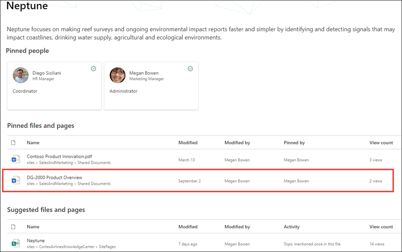

# 主題經驗 (預覽的安全性調整) 

> [!Note] 
> 本文內容適用于 Project Cortex 私人預覽。 [如需詳細資訊，請參閱 Project Cortex](https://aka.ms/projectcortex)。

主題經驗使用者將無法在主題中查看其現有的 Office 365 許可權可防止他們看到的資訊。 使用者在主題頁面上看到的所有專案 (例如，SharePoint 網站、檔、檔案) 將是已允許查看的資訊。 主題經驗不會變更任何現有的許可權。

## 為何兩位使用者可能會有不同的相同主題視圖

透過 AI 或手動 curation 建立主題時，它可以包含主題的描述、替代名稱、與主題關聯的人員，以及與主題相關的網站、頁面和檔案。 當您在主題頁面上查看這項資訊時，可能是兩位查看相同主題的使用者看不到相同的資訊。
  
例如，當使用者1查看「Neptune 主題」頁面時，這就是他們可能看到的內容。

   

不過，當使用者2查看同一個 Neptune 主題頁面時，其視圖與使用者1不同。  使用者2能夠在主題頁面的 [已固定的檔案 **及頁面**] 區段中查看 *DG-2000 產品概述* 檔案，但不會針對使用者1顯示此頁面。 

   

使用者在相同主題上看到的不同之處在于，使用者可能沒有可查看相關網站或檔案的 Office 365 許可權。  主題經驗是指標對主題中的專案設定的許可權，且無法變更其存取權。 在我們的範例中，使用者1無法在 Neptune 的 [主題] 頁面中查看 *DG-2000 產品概述* 檔案，因為使用者1沒有可用於查看檔案的 Office 365 許可權。

如果使用者無法在主題中看到足夠的資訊供其使用，則使用者將無法使用該主題。 在此範例中，使用者將不會看到反白顯示的主題。 不過，如果有其他使用者對該主題中的詳細資訊許可權，其有用的許可權，就可以查看該主題。

## 知識管理員和主題參與者的主題許可權

指派管理主題許可權的使用者-知識主管，只能夠查看其具有在主題中查看之許可權的資訊。

同樣地，具有「建立及編輯」主題許可權的使用者-主題投稿者-只能夠查看其具有在主題中查看之許可權的資訊。 

## AI 與手動策劃主題資訊

主題可以包含 AI 所產生的資訊，以及主題投稿者或知識主管新增或編輯的資訊。

 - 「AI」所新增之主題中的資訊僅對存取來源內容的使用者可見。
 - 由主題投稿人或知識管理員手動新增或編輯的資訊，可供每個可以查看主題的人看到。

下表說明哪些使用者-主題查看者、投稿人和知識管理員-根據其許可權，可在指定的主題中查看。

|主題專案|使用者可以看到的內容|
|:---------|:------------------|
|主題名稱|使用者可以查看主題中心所有主題的主題名稱。 某些主題若具有對使用者的關聯性很低，可能會看不到。|
|主題描述|只有對來源內容有許可權的使用者才可以看到 AI 產生的描述。 所有使用者皆可看到手動輸入或編輯的描述。|
|多人|所有使用者皆可看到已鎖定的人員。 建議的人員只對具有來源內容許可權的使用者可見。|
|檔案|只有具有來源內容許可權的使用者才能看到檔案。|
|頁面|只有具有來源內容許可權的使用者才能看到頁面。|
|網站|只有具有來源內容許可權的使用者才能看到網站。|

## 請參閱

