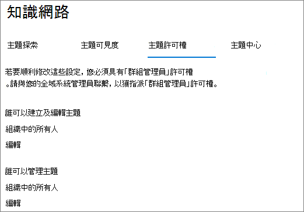
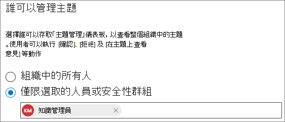

# 管理 Microsoft Viva 主題中的主題許可權Manage topic permissions in Microsoft Viva Topics

您可以在 [Microsoft 365 admin center](https://admin.microsoft.com)中管理主題許可權設定。You can manage topic permissions settings in the [Microsoft 365 admin center](https://admin.microsoft.com). 您必須是全域系統管理員或 SharePoint 管理員，才可執行這些工作。You must be a global administrator or SharePoint administrator to perform these tasks.

您可以選擇 [主題許可權] 設定：With topic permissions settings you can choose:

- 哪些使用者可以建立及編輯主題：在探索期間或編輯現有主題詳細資料時，建立未找到的新主題。Which users can create and edit topics: Create new topics that were not found during discovery or edit existing topic details.
- 哪些使用者可以管理主題：存取主題管理中心，並查看主題的反應，以及透過生命週期移動主題。Which users can manage topics: Access the topic management center and view feedback on topics as well as move topics through the lifecycle.

## 若要存取主題管理設定：To access topics management settings:

1. 在 Microsoft 365 系統管理中心中，按一下 [ **設定**]，然後按一下 [ **組織設定**]。In the Microsoft 365 admin center, click **Settings**, then **Org settings**.
2. 在 [ **服務** ] 索引標籤上，按一下 [ **主題經驗**]。On the **Services** tab, click **Topic experiences**.

     

3. 選取 [ **主題許可權** ] 索引標籤。請參閱下列各節以取得每個設定的相關資訊。Select the **Topic permissions** tab. See the following sections for information about each setting.

     

## 變更誰有權更新主題詳細資料Change who has permissions to update topic details

若要更新誰有權建立及編輯主題：To update who has permissions to create and edit topics:

1. 在 [ **主題許可權** ] 索引標籤的 [ **誰可以建立及編輯主題**] 中，選取 [ **編輯**]。On the **Topic permissions** tab, under **Who can create and edit topics**, select **Edit**.
2. 您可以在 [ **誰可以建立及編輯主題** ] 頁面上，選取：On the **Who can create and edit topics** page, you can select:
    - **組織中的所有人****Everyone in your organization**
    - **僅限選取的人員或安全性群組****Only selected people or security groups**
    - **沒人****No one**

      

3. 選取 [儲存 **]**。Select **Save**.

若要更新誰具有管理主題的許可權：To update who has permissions to manage topics:

1. 在 [ **主題許可權** ] 索引標籤的 [ **誰可以管理主題**] 下，選取 [ **編輯**]。On the **Topic permissions** tab, under **Who can manage topics**, select **Edit**.
2. 您可以在 [ **誰可以管理主題** ] 頁面上，選取：On the **Who can manage topics** page, you can select:
    - **組織中的所有人****Everyone in your organization**
    - **選取的人員或安全性群組****Selected people or security groups**

      

3. 選取 [儲存 **]**。Select **Save**.

## 另請參閱See also

[在 Microsoft Viva 主題中管理主題探索Manage topic discovery in Microsoft Viva Topics](topic-experiences-discovery.md)

[在 Microsoft Viva 主題中管理主題可見度Manage topic visibility in Microsoft Viva Topics](topic-experiences-knowledge-rules.md)

[變更 Microsoft Viva 主題中主題中心的名稱Change the name of the topic center in Microsoft Viva Topics](topic-experiences-administration.md)
