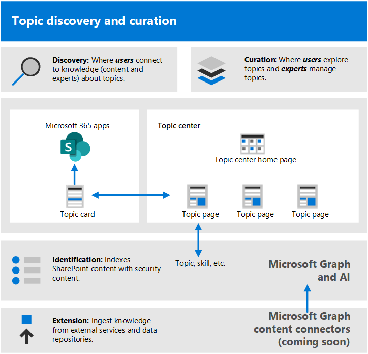
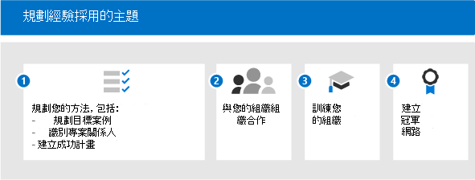
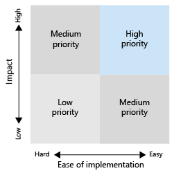

# 開始促進主題經驗 (預覽的採用) 

> [!Note]
> 本文內容適用于 Project Cortex 私人預覽。 [如需詳細資訊，請參閱 Project Cortex](https://aka.ms/projectcortex)。

開始採用之前，您必須瞭解知識管理和主題經驗中的相關概念。 下圖顯示在主題探索和 curation 期間發生的情況：

- **探索**：使用者可以透過主題卡片探索每日使用的應用程式知識，也就是在 Microsoft 搜尋中探索主題。
- **Curation**：主題專家 (sme) 透過主題頁面精煉主題，以及透過 AI 從使用者的輸入學習。 主題中心包含使用者可以探索及專家可管理的主題頁面。
- **識別**：使用 Microsoft Graph 和人工智慧 (AI) 知識和人員 (主題、技能，) 已識別並自動組織成相關主題。 SharePoint 內容會以安全性內容編制索引。
- **分機**：使用 Microsoft Graph 內容連接器 (即將) ，您可以從外部服務和資料存放庫中攝取知識。

如需詳細資訊，您可以查看簡介的 [概述](knowledge-management-overview.md) 。

請記住下列事項：

- 在有更多內容可供使用時，主題探索已改進。
- 資料的安全性、隱私權和位置都會保留，即使資訊已呈現在新的經驗中也是一樣。
- 使用者需要授權以查看主題經驗。
- 探索最初是英文語言內容。

若要協助準備，請考慮下列問題：

- 主題探索應該使用哪些內容？
- 誰會管理主題？
- 誰將看到主題卡片和要聞？
- 哪些主題是預期的？

請參閱此必要條件清單，以取得最佳主題體驗：

|產品或功能 |描述 |
|:-------|:--------|
|使用新式 SharePoint 頁面 SharePoint 線上 |主題挖掘只會包含 SharePoint 網站上的內容，而且主題卡片只能在新式頁面上呈現。|
|Microsoft Graph |您可以使用 Microsoft Graph 設定，控制是否要包含或排除搜尋中的主題或 Delve。 |

## 規劃採用

若要規劃採用主題經驗，您必須：

1. 規劃您的方法與目標案例：
    - 請考慮定義 [案例](#target-scenarios)並排定其優先順序。
    - 請考慮您需要參與的專案 [關係人](#identify-stakeholders) 和專案小組成員。  
    - 找出您想要推動哪些業務影響，以及如何 [衡量成功](#create-a-success-plan)。

2. 與您的組織合作：
    - 找出需要參與的商務群組和商務小組，並與您所規劃的案例取得關聯。
    - 開始思考如何與一些早期合作人員接洽，以取得重要、及早的意見反應，讓您能迴圈您取得最佳解決方案。
    - 開始組建社區，並考慮這些不同群組如何在組織中使用主題經驗。

3. 訓練您的組織：大多數人員會以直觀方式瞭解主題的概念，以及主題卡片如何編譯相關的資訊，以及瞭解及查看其價值。 不過，您可能會想要建立專為您自己的文化和組織量身定制的訓練，以顯示您想要如何在您的組織中使用主題。一些訓練資源：
    - [專案 Cortex 資源中心](https://aka.ms/projectcortex)。 包含概述和功能資訊、錄製的 office 小時影片及簡報，以及合作夥伴及其服務的相關資訊。
    - 即將推出，針對使用者的訓練影片及協助。

4. [建立冠軍網路](#build-a-champion-network)：
    - 您可能已具備實踐或擁護網路的社區。 以下是 socialize 和 evangelize 的極佳方式，可讓同事參與協助。 他們也可以分享成功案例，這會非常重要。 他們可以提供建議並產生興奮。

### 目標案例

原因可協助決定所需的模型，以及如何根據要套用模型的位置來組織組織。 以下是一些知識管理可協助您組織的案例：

- 角色上架 & 訓練：瞭解新組織的術語、主要專案及文化是上架中的重要步驟。 便捷的主題探索可協助新員工快速取得新工作、角色或專案的速度。
- 專業知識尋找和資訊共用：當主題受管理和共用時，您組織中的人員可以更輕鬆地找到資訊和專家，以協助他們的日常工作。
- 擴充的決策過程和縮短的面市時間：當資訊和專家很容易到達時，您可以更輕鬆地進行決策，也可以 shave 時關閉專案。

例如，以下是角色上架的案例：

- 員工 (約旦) 會加入新的角色，或已新近雇用，而且只是從角色開始。 約旦想要儘快取得與生產力。 不過，約旦也需要協助您尋找開始地點。
- 您的同事 (Kim) 誰是在約旦建立的主題頁面，可協助新員工和其他人尋找該資訊。
- Kim 是 SME，具有查看未確認主題頁面的許可權。 未確認的主題頁面是 AI 已探索及已建立的最佳起點，而 Kim 可以編輯這些頁面以新增專家資源、定義及固定其他資源。
- 當您在 SharePoint 上的新文章中，約旦會看到一個主題醒目提示，並將它放在該主題上，以快速取得字詞的定義，以及如何與其他問題聯繫。 之前，約旦可能必須為此資訊尋找此資訊，並與同事聯繫，以查看誰會詢問相關事項。
- 透過主題體驗公開這種資訊可能很強大，因為雖然這種資訊可能已經在使用中，但它可能非常孤立且難於找到。 將其帶入已使用的應用程式，並協助約旦找到這些專家也可以促進合約和社區的認識。 在處理新的角色時，它也可協助您更進一步的體驗。

在您識別案例之後，您可以設定案例的優先順序：

其優先順序的一種方式是在顯示影響的方格中繪製案例，而不是輕鬆執行。 尋找具有高影響且易於實施的案例。 讓您成為最高優先順序。 實施案例的低影響和困難是最低的優先順序。 當您具有高影響、易於實施的案例時，它會協助人們獲得興奮，並查看使用主題的可能性。

請挑選幾個重要案例，以供最初使用，以取得一些意見反應，然後分階段進行。 如此一來，您就可以迴圈查看、改進並取得意見反應，這樣您就能隨著時間成長採用。 

### 識別專案關係人

識別專案的利益關係人。 主要角色包括執行發起者、成功擁有者和冠軍。

|角色 |責任 |部門 |
|:-------|:-------|:--------|
| 執行贊助者 (s)    | 向公司傳達高層遠景和價值   |  執行領導   |
| 專案負責人 (s)  | 監督整個啟動執行和部署程式 | 專案管理 |
| 知識管理員| 設定及設定主題經驗 | IT 部門 |
| 知識管理員 | 管理主題及監管分類法 | 任何部門 |
| 分類法管理員 | 監管分類法 | 任何部門 |
| 主題專家和主題參與者 | 產生或審閱主題和描述 | 任何部門 |
| 風雲人物 | 協助 evangelize 及管理異議處理 | 任何部門 (人員)  |
| 承租人管理員 | 設定租使用者層級設定 | IT 部門 |
| Power Platform 系統管理員| 設定一般資料服務環境 | IT 部門 |
| 搜尋管理員或管理員 | 設定搜尋設定 | IT 部門 |

在較大的組織中，您可能也會有多個人員使用這些角色，您必須在兩者之間進行協調。 在小型公司中，一個人可能會執行這些角色中的數個。 不同的角色在專案的不同階段可能更多。 例如，有些人會在設定 (租使用者管理員) 中的功能時，更有説明，而其他人則不會參與，除非您開始定義主題，否則會 (主題專家和冠軍) 等相關 sustainment。
 
雖然我們建議您在整個部署中完成上述每個角色，但您可能會發現您不需要所有這些角色即可開始使用已識別的解決方案。

### 建立成功計畫

您可以使用這些指示單位來測量您的組織中主題經驗的成敗。 看：

1. 主題用法：
      - 主題印記
      - 主題數量–在您的策劃主題清單中，已確認及未確認。
      - 已發佈的主題頁面數目。
1. 來自主題卡片的使用者意見反應。
1. 進行員工滿意度調查。 主題應該會改善員工尋找資訊的能力，所以請尋找收集其輸入的方法，以及對該資訊的回饋。
1. 對搜尋分析的積極影響。 由於主題出現在搜尋體驗中，因此隨著時間的增加，您可能會看到低的放棄搜尋率，因為人們可以更輕鬆地找到搜尋中的主題。 

### 建立冠軍網路

在您的組織中建立擁護者網路。 擁護者很重要，因為它們可以：

- 在其團隊間建立影響圓形
- 磁片磁碟機主題管理 & 維護

您可以從不同的角色招聘冠軍--知識主管與主題專家。

許多冠軍網路都利用 Yammer 作為其平臺。 在 Yammer 中，使用者可以張貼問題並取得問題，並分享成功案例。 您很難只自行進行換用，所以您可以依靠公司內的人員網路為同事提供建議，並顯示其團隊在使用主題經驗的方式，讓其他小組可以思考自己的案例。

有些組織使用 hackathons (正式或非正式、虛擬或) 人員，以收集可在特定專案上運作的人員群組。 例如，您可以收集主題專家，並讓他們一起使用，以 curate 一組主題頁面。

請考慮您可以如何辨識您的冠軍。 獎勵其活動、提供一些認可，並產生可供查看的社區感覺和預訂，讓他們感覺像是對某些事項帶來的，也就是從 it 取得一些內容。

現在，您已準備好要開始實施，您想要確定您已鼓勵進行日常服務。

- 維護您的冠軍的主動 Yammer 群組。
- 共用成功案例。
- 定期主控其他參與事件，以分享案例或引進新功能。
- 設定人員和執行 competitions 的挑戰。

## 後續步驟

當您準備好要開始進行主題體驗時，您必須要有相關人員。

- 開始引進功能集，並讓他們考慮其案例。
- 收集利益關係人並建立案例。
- 推動群組的連線，並思考如何進行接洽。
- 然後完成準備步驟。 有些可能是技術準備，也可能是一些商務準備。
- 最後，socialize 並升級。
