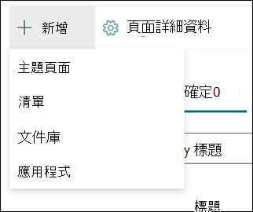
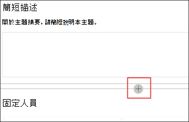

# 使用主題中央 (預覽) 中的主題Work with topics in the topic center (Preview)

> [!Note] 
> 本文內容適用于 Project Cortex 私人預覽。The content in this article is for Project Cortex Private Preview. [如需詳細資訊，請參閱 Project Cortex](https://aka.ms/projectcortex)。[Find out more about Project Cortex](https://aka.ms/projectcortex).

在主題中心，知識管理員可以查看已在您指定的 SharePoint 來源位置中挖掘及探索的主題，也可以確認或拒絕這些主題。In the topic center, a knowledge manager can review topics that have been mined and discovered in the SharePoint source locations you specified, and can either confirm or reject them. 知識管理員也可以建立及發佈新的主題頁面（如果未在主題探索中找到的話），或編輯現有的主題頁面（如果需要更新）。A knowledge manager can also create and publish new topic pages if one was not found in topic discovery, or edit existing ones if they need to be updated.

## 需求Requirements

若要在主題中心內運作，您必須具備必要的許可權。In order to work in the topic center, you need to have the required permissions. 您的系統管理員可以在您的 [知識管理安裝程式](set-up-topic-experiences.md)中新增您，也可以在 [以後新增](give-user-permissions-to-the-topic-center.md)新的使用者。Your admin can add you during [knowledge management setup](set-up-topic-experiences.md), or new users can be [added afterwards](give-user-permissions-to-the-topic-center.md).

主題中心使用者可獲得兩組許可權：Topic center users can be given two sets of permissions:

- 建立及編輯主題：建立新的主題或更新主題內容，例如描述、檔和相關人員。Create and edit topics: Create new topics or update topic content such as the description, documents and associated persons.

- 管理主題：使用主題管理儀表板來查看整個組織中的主題。Manage topics: Use the Topic management dashboard to review topics across the organization. 使用者可以執行 [確認] 及 [拒絕] 主題等動作。Users can perform actions such as confirm and reject topics.

## 查看建議的主題Review suggested topics

在 [主題中心] 首頁上，在您指定的 SharePoint 來源位置中探索的主題將會列在 [ **建議** ] 索引標籤中。具有管理主題許可權的使用者可以查看未確認的主題，並選擇確認或拒絕這些主題。On the topic center home page, topics that were discovered in your specified SharePoint source locations will be listed in the **Suggested** tab. A user with permissions to manage topics can review unconfirmed topics and choose to confirm or reject them.

若要查看建議的主題：To review a suggested topic:

1. 在 [ **建議** ] 索引標籤上，選取主題，以開啟 [主題] 頁面。On the **Suggested** tab, select the topic to open the topic page. 

2. 在 [主題] 頁面上，複查 [主題] 頁面，如果您需要對頁面進行任何變更，請選取 [ **編輯** ]。On the topic page, review the topic page, and select **Edit** if you need to make any changes to the page.

3. 在「知識中心」首頁上，針對所選主題，您可以：On the Knowledge Center home page, for the selected topic, you can:

    1. 選取 [檢查以確認您要保留主題。Select the check to confirm that you want to keep the topic.
    
    1. 如果您想要拒絕該主題，請選取 **x** 。Select the **x** if you want to reject the topic.

    已確認的主題將從未 **確認** 的清單中移除，現在會顯示在 [已 **確認** ] 索引標籤中。Confirmed topics will be removed from the **Unconfirmed** list and will now display in the **Confirmed** tab.

    拒絕的主題將從未 **確認** 的清單中移除，現在會顯示在 [已 **拒絕] 或 [排除** ] 索引標籤中。Rejected topics will be removed from the **Unconfirmed** list and will now display in the **Rejected or Excluded** tab.

## 查看已確認的主題Review confirmed topics

在 [主題中心] 首頁上，在您指定的 SharePoint 來源位置中探索的主題，並已由2個或多個透過卡片意見反應機制確認的人員確認的知識管理員或 crowdsourced，會列于 [已 **確認** ] 索引標籤中。具有管理主題許可權的使用者可以查看已確認的主題，並選擇拒絕這些主題。On the topic center home page, topics that were discovered in your specified SharePoint source locations and have been confirmed by a knowledge manager or crowdsourced confirmed by 2 or more people through the card feedback mechanism will be listed in the **Confirmed** tab. A user with permissions to manage topics can review confirmed topics and choose to reject them.

若要查看已確認的主題：To review a confirmed topic:

1. 在 [已 **確認** ] 索引標籤上，選取主題，以開啟 [主題] 頁面。On the **Confirmed** tab, select the topic to open the topic page. 

2. 在 [主題] 頁面上，複查 [主題] 頁面，如果您需要對頁面進行任何變更，請選取 [ **編輯** ]。On the topic page, review the topic page, and select **Edit** if you need to make any changes to the page.

3. 您也可以拒絕它You can reject it too

## 審閱已發佈的主題Review published topics
已發佈的主題已經過編輯，使特定資訊永遠會出現在頁面出現的任何處。Published topics have been edited so that specific information will always appear to whoever encounters the page. 手動建立的主題會顯示在這裡。Manually created topics show here.

   
## 建立新的主題Create a new topic

具有 create 或 edit 主題許可權的使用者可以視需要建立新的主題。A user with create or edit topic permissions can create a new topic if needed. 如果透過探索未發現主題，或是 AI 技術沒有找到足夠的證據來建立主題，您可能需要執行此動作。You might need to do this if the topic was not discovered through discovery or if the AI technology did not find enough evidence to establish it as a topic.

若要建立新的主題：To create a new topic:

1. 在 [主題中心] 頁面上，選取 [ **新增** ]，然後選取 [ **主題] 頁面** 。On the topic center page, select **New** , then select **Topic Page**.

    

2. 在 [新增主題] 頁面上，您可以在新的主題範本上填入資訊：On the new topic page, you can fill in the information on the new topic template:

    1. 在 [ **名稱這個主題** ] 區段中，輸入新主題的名稱。In the **Name this topic** section, type the name of the new topic.
    
    1. 在 [ **替代名稱** ] 區段中，輸入也用來參照主題的名稱或縮寫。In the **Alternate names** section, type names or acronyms that are also used to refer to the topic.
    
    1. 在 [ **簡短描述** ] 區段中，輸入主題的一或兩個句子描述。In the **Short description** section, type a one or two sentence description of the topic. 這會將此文字用於關聯的主題卡。This text will be used for the associated topic card.
    
    1. 在 [ **人員** ] 區段中，輸入主題的主題專家名稱。In the **People** section, type the names of subject matter experts for the topic.
    
    1. 在 [檔案 **與頁面** ] 區段中，選取 [ **新增** ]，然後在下一個頁面上，您可以選取相關聯的 OneDrive 檔或 SharePoint 線上頁面。In the **Files and pages** section, select **Add** and then on the next page you can select associated OneDrive files or SharePoint Online pages.
    
    1. 在 [ **網站** ] 區段中，選取 [ **新增** ]。In the **Sites** section, select **Add**. 在顯示的 [  **網站** ] 窗格中，選取與主題關聯的網站。In the  **Sites** pane that displays, select the sites that are associated to the topic.

    
    
3. 如果您需要將其他元件新增至頁面（如文字、圖像、網頁元件、連結等等），請選取頁面中間的 [畫布] 圖示，以找出並加以新增。If you need to add other components to the page, such as text, images, web parts, links, etc., select the canvas icon in the middle of the page to locate and add them.

    

4. 完成後，請選取 [ **發佈** ] 以發佈 [主題] 頁面。When you are done, select **Publish** to publish the topic page. 已發佈的主題頁面會顯示在 [ **頁面** ] 索引標籤中。Published topic pages will display in the **Pages** tab.

> [!Note] 
> [新增主題] 頁面是由 *可識別知識網路* 的網頁元件所組成。The new topic page is made up of web parts that are *knowledge network aware*. 這表示隨著 AI 收集有關主題的詳細資訊，這些網頁元件中的資訊將會更新，以使頁面更適合使用者。This means that as AI gathers more information on the topic, the information in these web parts will be updated with suggestions to make the page more useful to users.

## 編輯現有的主題頁面Edit an existing topic page

現有的主題頁面可在 [ **頁面** ] 頁面中找到。Existing topic pages can be found in the **Pages** page. 

1. 在 [主題中心] 頁面上，選取 [ **頁面** ]。On the Topic Center page, select **Pages**.

2. 在 [ **頁面** ] 頁面上，您會看到一個主題頁面清單。On the **Pages** page, you will see a list of topic pages. 使用 [搜尋] 方塊，尋找您想要更新的主題頁面。Use the Search box to find the topic page you want to update. 按一下您要編輯之主題頁面的名稱。Click on the name of the topic page that you want to edit.

3. 在 [主題] 頁面上，選取 [ **編輯** ]。On the topic page, select **Edit**.

4. 對頁面進行所需的變更。Make the changes you need to the page. 這包括下欄欄位的更新：This includes updates to the following fields:

    1. 替代名稱Alternate names
    1. 描述Description
    1. 多人People
    1. 檔案與頁面Files and pages
    1. 網站Sites
    1. 您也可以選取 [畫布] 圖示，將靜態專案新增至頁面（如文字、圖像或連結）。You can also add static items to the page—such as text, images, or link—by selecting the canvas icon.

5. 選取 [重新 **發佈** ] 以儲存變更。Select **Republish** to save your changes.

<!--## See also-->

