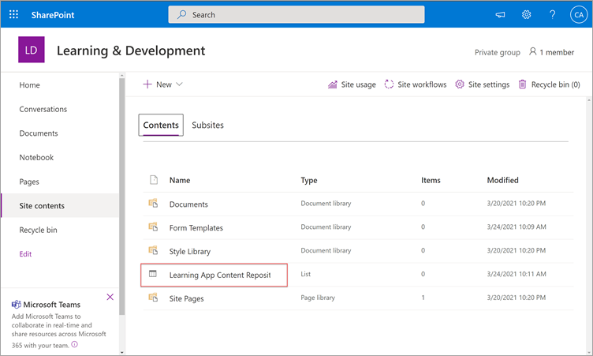
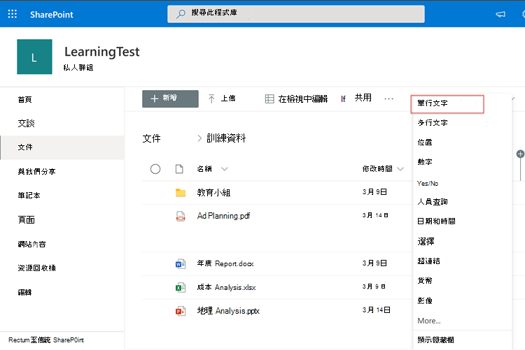

# 即將推出：設定 SharePoint 做為 Microsoft Viva 教學 (Preview 的教學內容來源) 

> [!NOTE]
> 本文中的資訊與在正式發行之前可能會充分修改的預覽產品有關。 

您可以將 SharePoint 設定為教學內容來源，讓您的組織擁有自己的內容，以供 Viva 教學 (預覽) 中使用。

## 概觀

知識 admin (或全域系統管理員) 提供網站 URL，以供教學服務以結構化的 SharePoint 清單的形式建立空白集中位置（「學習」應用程式內容存放庫）。 您的組織可使用此清單來存放包含教學內容之跨公司 SharePoint 資料夾的連結。 系統管理員負責收集和 curating 資料夾的 URLs 清單。 這些資料夾應該只包含可以在 Viva 教學 (預覽) 中提供的內容。

Viva 教學 (預覽) 支援下列檔案類型：

- Word、PowerPoint、Excel、PDF
- 音訊 ( m4a) 
- 影片 ( mov、.mp4、.avi) 

如需詳細資訊，請參閱[SharePoint 線上檔](/office365/servicedescriptions/sharepoint-online-service-description/sharepoint-online-limits?redirectSourcePath=%252farticle%252fSharePoint-Online-limits-8f34ff47-b749-408b-abc0-b605e1f6d498)。 

## 權限

您可以從組織中的任何 SharePoint 網站收集 URLs 文件庫資料夾。 Viva 教學 (預覽) 會以所有現有的內容許可權為例。 因此，只有使用者有權存取的內容可在 Viva 學習 (預覽) 中搜尋並可見。 這些資料夾內的任何內容都會可供搜尋，但只有個別員工具有許可權的內容才能使用。

目前不支援從組織存放庫刪除內容。

若要移除無意中呈現的內容，請遵循下列步驟：

1.  若要限制存取文件庫，請選取 [ **顯示動作** ] 選項，然後選取 [ **管理存取**]。
     
     ![[文件庫] 頁面中 SharePoint 會顯示 [以管理存取 highligted 顯示動作] 選項。](../media/learning/learning-sharepoint-permissions2.png)

2.  刪除文件庫中的原始檔案。

如需詳細資訊，請參閱[SharePoint 新式體驗中的共用和許可權](/sharepoint/modern-experience-sharing-permissions)。 

## 學習服務

學習服務會使用提供的資料夾 URLs，從儲存在這些資料夾中的所有內容取得中繼資料。 在集中式存放庫中提供資料夾 URL 的24小時內，員工可以在 Viva 學習 (預覽) 中搜尋並使用您組織的內容。 所有對內容所做的變更（包括更新的中繼資料和許可權），也會在24小時內套用到教學服務。

## 將 SharePoint 設定為來源

您必須是 Microsoft 365 全域系統管理員、SharePoint 系統管理員或知識系統管理員，才可執行這些工作。

若要將 SharePoint 設定為中的教學內容來源，以供 Viva 教學 (預覽) ，請遵循下列步驟：

1.  在 Microsoft 365 系統管理中心的左側導覽中，移至 **設定**  >  **組織設定**」。
 
2.  在 [ **組織設定** ] 頁面上的 [ **服務** ] 索引標籤上，選取 [ **教學應用程式 (預覽])**。

     

3.  在 [**教學應用程式 (預覽)** ] 面板的 [SharePoint] 下，提供您想要 Viva 學習以建立集中式存放庫之 SharePoint 網站的網站 URL。

     

4.  在所提供的 SharePoint 網站內，會自動建立 SharePoint 清單。

     

     在 SharePoint 網站的左側導覽中，選取 [**網站內容**]  >  **學習應用程式內容存放庫**。 

      

5. 在 [**學習應用程式內容存放庫**] 頁面上，使用 URLs 的「教學內容」資料夾填入 SharePoint 清單。

   1. 選取 [ **新增** ] 以查看 [ **新增專案** ] 面板。 

       
 
   2. 在 [ **新增專案** ] 面板的 [ **標題** ] 欄位中，新增您選擇的目錄名稱。 在 [ **資料夾 URL** ] 欄位中，新增「學習內容」資料夾的 URL。 選取 ****[儲存]。

       ![SharePoint 中的 [新增專案] 面板，顯示標題和資料夾 URL 欄位。](../media/learning/learning-sharepoint-configure6.png)

   3. **學習應用程式內容存放庫** 頁面會以新的教學內容進行更新。

       

> [!NOTE]
> 若要允許更大的學習應用程式內容存放庫存取權，Viva 教學 (預覽) 介面可提供清單連結，使用者可以要求存取權，並最終協助填入清單。 網站擁有人和全域系統管理員將會需要授與存取權給清單。 Access 只適用于清單，而不適用於儲存清單的網站。 如需詳細資訊，請參閱本文稍後的 [提供您自己的組織內容](#provide-your-own-organizations-content) 。

### 資料夾 URL 文件庫 curation

預設的中繼資料 (例如「修改日期」、「檔案名稱」、「內容類型」和「組織名稱」) 會自動提取至 Microsoft Graph API) 的 Viva 學習 (預覽。
 
建議您新增 **描述** 欄，以改善內容的整體探索與搜尋相關性。

若要在文件庫頁面中新增 **描述** 欄，請遵循下列步驟：

1.  在 [ **檔** ] 頁面上，選取 [ **新增欄**]。

2. 選取 [ **顯示動作** ] 選項，然後選取 [ **單行文字**]。

     

3. 在 [ **建立欄** ] 面板的 [ **名稱** ] 欄位中，新增欄的描述性名稱。 選取 ****[儲存]。

     ![在 SharePoint 中建立 [欄] 面板，顯示名稱及其他欄位。](../media/learning/learning-sharepoint-curation2.png)
 
4. 在 [ **檔** ] 頁面上的 [ **描述** ] 欄中，新增每個專案的自訂描述。 若未提供描述，Viva 學習 (預覽) 會提供預設郵件，將內容醒目顯示為來自您自己的 SharePoint 文件庫。 

     ![檔] 頁面中 SharePoint 顯示描述列中的描述。](../media/learning/learning-sharepoint-curation3.png)
 
### 提供您自己組織的內容

知識管理員可以在 SharePoint 中存取其組織的學習應用程式內容存放庫，以提供跨組織文件庫的參照。 這些文件庫中的內容會在 Viva 學習 (預覽) 中做為學習內容。

1. 在 Viva 學習 (預覽) 中，選取 [**更多選項** (**...**) ]，然後選取 [**設定**]。

     ![顯示 [更多選項及設定] 選項的 SharePoint 文件庫] 頁面。](../media/learning/learning-sharepoint-library-1.png)
     
2. 在 [**設定**] 底下，選取 [**許可權**]。

     ![SharePoint 顯示許可權及檢查 access 選項的 [設定選項] 頁面。](../media/learning/learning-sharepoint-library-2.png)

3. 選取 [ **檢查存取** ] 以連線到您組織的集中式文件庫。
     
