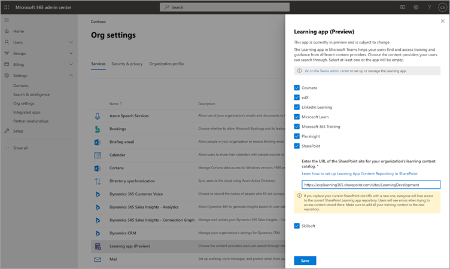

# 即將推出：設定 SharePoint 做為 Microsoft Viva 教學 (Preview 的教學內容來源) Coming soon: Configure SharePoint as a learning content source for Microsoft Viva Learning (Preview)

> [!NOTE]
> 本文中的資訊與在正式發行之前可能會充分修改的預覽產品有關。The information in this article relates to a preview product that may be substantially modified before it's commercially released. 

您可以將 SharePoint 設定為教學內容來源，讓您的組織擁有自己的內容，以供 Viva 教學 (預覽) 中使用。You can configure SharePoint as a learning content source to make your organization's own content available in Viva Learning (Preview).

## 概觀Overview

知識 admin (或全域系統管理員) 提供網站 URL，以供教學服務以結構化的 SharePoint 清單的形式建立空白集中位置（「學習」應用程式內容存放庫）。The knowledge admin (or global administrator) provides a site URL to where the Learning Service can create an empty centralized location—the Learning App Content Repository—in the form of a structured SharePoint list. 您的組織可使用此清單來存放包含教學內容之跨公司 SharePoint 資料夾的連結。This list can be used by your organization to house links to cross-company SharePoint folders that contain learning content. 系統管理員負責收集和 curating 資料夾的 URLs 清單。Admins are responsible for collecting and curating a list of URLs for folders. 這些資料夾應該只包含可以在 Viva 教學 (預覽) 中提供的內容。These folders should only include content that can be made available in Viva Learning (Preview).

Viva 教學 (預覽) 支援下列檔案類型：Viva Learning (Preview) supports the following document types:

- Word、PowerPoint、Excel、PDFWord, PowerPoint, Excel, PDF
- 音訊 ( m4a) Audio (.m4a)
- 影片 ( mov、.mp4、.avi) Video (.mov, .mp4, .avi)

如需詳細資訊，請參閱[SharePoint 限制](/office365/servicedescriptions/sharepoint-online-service-description/sharepoint-online-limits?redirectSourcePath=%252farticle%252fSharePoint-Online-limits-8f34ff47-b749-408b-abc0-b605e1f6d498)。For more information, see [SharePoint limits](/office365/servicedescriptions/sharepoint-online-service-description/sharepoint-online-limits?redirectSourcePath=%252farticle%252fSharePoint-Online-limits-8f34ff47-b749-408b-abc0-b605e1f6d498). 

## 權限Permissions

您可以從組織中的任何 SharePoint 網站收集 URLs 文件庫資料夾。Document library folder URLs can be collected from any SharePoint site in the organization. Viva 教學 (預覽) 會以所有現有的內容許可權為例。Viva Learning (Preview) follows all existing content permissions. 因此，只有使用者有權存取的內容可在 Viva 學習 (預覽) 中可供搜尋和看到。Therefore, only content for which a user has permission to access is searchable and visible within Viva Learning (Preview). 這些資料夾內的任何內容都會可供搜尋，但只有個別員工具有許可權的內容才能使用。Any content within these folders will be searchable, but only content to which the individual employee has permissions can be used.

目前不支援從組織存放庫刪除內容。Content deletion from your organization’s repository is not currently supported.

若要移除無意中呈現的內容，請遵循下列步驟：To remove unintentionally surfaced content, follow these steps:

1.  若要限制存取文件庫，請選取 [ **顯示動作** ] 選項，然後選取 [ **管理存取**]。To restrict access to the document library, select the **Show actions** option, and then select **Manage access**.
     
     ![[文件庫] 頁面中 SharePoint 會顯示 [以管理存取 highligted 顯示動作] 選項。](../media/learning/learning-sharepoint-permissions2.png)

2.  刪除文件庫中的原始檔案。Delete the original document within the document library.

如需詳細資訊，請參閱[SharePoint 新式體驗中的共用和許可權](/sharepoint/modern-experience-sharing-permissions)。For more information, see [Sharing and permissions in the SharePoint modern experience](/sharepoint/modern-experience-sharing-permissions). 

## 學習服務Learning Service

學習服務會使用提供的資料夾 URLs，從儲存在這些資料夾中的所有內容取得中繼資料。The Learning Service uses the provided folder URLs to get metadata from all content stored in those folders. 在集中式存放庫中提供資料夾 URL 的24小時內，員工可以在 Viva 學習 (預覽) 中搜尋並使用您組織的內容。Within 24 hours of supplying the folder URL in the centralized repository, employees can search for and use your organization’s content within Viva Learning (Preview). 所有對內容所做的變更（包括更新的中繼資料和許可權），也會在24小時內套用到教學服務。All changes to content, including updated metadata and permissions, will also be applied in the Learning Service within 24 hours.

## 將 SharePoint 設定為來源Configure SharePoint as a source

您必須是 Microsoft 365 全域系統管理員、SharePoint 系統管理員或知識系統管理員，才可執行這些工作。You must be a Microsoft 365 global administrator, SharePoint administrator, or knowledge admin to perform these tasks.

若要將 SharePoint 設定為中的教學內容來源，以供 Viva 教學 (預覽) ，請遵循下列步驟：To configure SharePoint as a learning content sources in for Viva Learning (Preview), follow these steps:

1.  在 Microsoft 365 系統管理中心的左側導覽中，移至 **設定**  >  **組織設定**」。In the left navigation of the Microsoft 365 admin center, go to **Settings** > **Org settings**.
 
2.  在 [ **組織設定** ] 頁面上的 [ **服務** ] 索引標籤上，選取 [ **Viva 教學 (預覽])**。On the **Org settings** page, on the **Services** tab, select **Viva Learning (Preview)**.

     

3.  在 [ **Viva 教學 (預覽)** ] 面板上，于 [SharePoint] 下，提供 SharePoint 網站的網站 URL，而您想要 Viva 學習 (預覽) 來建立集中式存放庫。On the **Viva Learning (Preview)** panel, under SharePoint, provides the site URL to the SharePoint site where you want Viva Learning (Preview) to create a centralized repository.

     

4.  在所提供的 SharePoint 網站內，會自動建立 SharePoint 清單。A SharePoint list is created automatically within the provided SharePoint site.

     

     在 SharePoint 網站的左側導覽中，選取 [**網站內容**]  >  **學習應用程式內容存放庫**。In the left navigation of the SharePoint site, select **Site contents** > **Learning App Content Repository**. 

      

5. 在 [**學習應用程式內容存放庫**] 頁面上，使用 URLs 的「教學內容」資料夾填入 SharePoint 清單。On the **Learning App Content Repository** page, populate the SharePoint list with URLs to the learning content folders.

   1. 選取 [ **新增** ] 以查看 [ **新增專案** ] 面板。Select **New** to view the **New item** panel. 

       
 
   2. 在 [ **新增專案** ] 面板的 [ **標題** ] 欄位中，新增您選擇的目錄名稱。On the **New item** panel, in the **Title** field, add a directory name of your choice. 在 [ **資料夾 URL** ] 欄位中，新增「學習內容」資料夾的 URL。In the **Folder URL** field, add the URL to the learning content folder. 選取 **[儲存]**。Select **Save**.

       ![SharePoint 中的 [新增專案] 面板，顯示標題和資料夾 URL 欄位。](../media/learning/learning-sharepoint-configure6.png)

   3. **學習應用程式內容存放庫** 頁面會以新的教學內容進行更新。The **Learning App Content Repository** page is updated with the new learning content.

       

> [!NOTE]
> 若要允許更大的學習應用程式內容存放庫存取權，Viva 教學 (預覽) 介面可提供清單連結，使用者可以要求存取權，並最終協助填入清單。To allow for broader access to the Learning App Content Repository, a link to the list soon will be available in the Viva Learning (Preview) interface where users can request access and ultimately help populate the list. 網站擁有人和全域系統管理員將會需要授與存取權給清單。Site owners and global administrators will be required to grant access to the list. Access 只適用于清單，而不適用於儲存清單的網站。Access is specific to the list only and does not apply to the site where the list is stored. 如需詳細資訊，請參閱本文稍後的 [提供您自己的組織內容](#provide-your-own-organizations-content) 。For more information, see [Provide your own organization's content](#provide-your-own-organizations-content) later in this article.

### 資料夾 URL 文件庫 curationFolder URL document library curation

預設的中繼資料 (例如「修改日期」、「檔案名稱」、「內容類型」和「組織名稱」) 會自動提取至 Microsoft Graph API) 的 Viva 學習 (預覽。Default metadata (such as modified date, created by, document name, content type, and organization name) is automatically pulled into Viva Learning (Preview) by the Microsoft Graph API.
 
建議您新增 **描述** 欄，以改善內容的整體探索與搜尋相關性。To improve overall discovery and search relevance of the content, we recommend adding a **Description** column.

若要在文件庫頁面中新增 **描述** 欄，請遵循下列步驟：To add a **Description** column to the document library page, follow these steps:

1.  在 [ **檔** ] 頁面上，選取 [ **新增欄**]。On the **Documents** page, select **Add column**.

2. 選取 [ **顯示動作** ] 選項，然後選取 [ **單行文字**]。Select the **Show actions** option, and then select **Single line of text**.

     

3. 在 [ **建立欄** ] 面板的 [ **名稱** ] 欄位中，新增欄的描述性名稱。On the **Create a column** panel, in the **Name** field, add a descriptive name for the column. 選取 **[儲存]**。Select **Save**.

     ![在 SharePoint 中建立 [欄] 面板，顯示名稱及其他欄位。](../media/learning/learning-sharepoint-curation2.png)
 
4. 在 [ **檔** ] 頁面上的 [ **描述** ] 欄中，新增每個專案的自訂描述。On the **Documents** page, in the **Description** column, add custom descriptions for each item. 若未提供描述，Viva 學習 (預覽) 會提供預設郵件，將內容醒目顯示為來自您自己的 SharePoint 文件庫。If no description is supplied, Viva Learning (Preview) will provide a default message that highlights the content as being from your own SharePoint library. 

     ![檔] 頁面中 SharePoint 顯示描述列中的描述。](../media/learning/learning-sharepoint-curation3.png)
 
### 提供您自己組織的內容Provide your own organization's content

知識管理員可以在 SharePoint 中存取其組織的學習應用程式內容存放庫，以提供跨組織文件庫的參照。Knowledge admins can access their organization’s Learning App Content Repository in SharePoint, where they can provide references to cross-organization document libraries. 這些文件庫中的內容會在 Viva 學習 (預覽) 中做為學習內容。Content within these libraries will be then surfaced as learning content in Viva Learning (Preview).

1. 在 Viva 學習 (預覽) 中，選取 [**更多選項** (**...**) ]，然後選取 [**設定**]。In Viva Learning (Preview), select **More options** (**...**), and then select **Settings**.

     ![顯示 [更多選項及設定] 選項的 SharePoint 文件庫] 頁面。](../media/learning/learning-sharepoint-library-1.png)
     
2. 在 [**設定**] 底下，選取 [**許可權**]。Under **Settings**, select **Permissions**.

     ![SharePoint 顯示許可權及檢查 access 選項的 [設定選項] 頁面。](../media/learning/learning-sharepoint-library-2.png)

3. 選取 [ **檢查存取** ] 以連線到您組織的集中式文件庫。Select **Check access** to connect to your organization’s centralized library.
     
