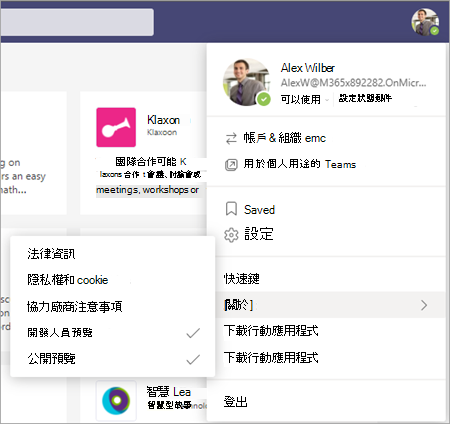

# 在 Teams 系統管理中心中設定 Microsoft Viva 教學 (預覽) Set up Microsoft Viva Learning (Preview) in the Teams admin center

> [!NOTE]
> 本文中的資訊與在正式發行之前可能會充分修改的預覽產品有關。The information in this article relates to a preview product that may be substantially modified before it's commercially released. 

Teams 管理員必須執行某些步驟，為租使用者中的使用者啟用 Viva 教學 (預覽) 。The Teams administrator needs to perform certain steps to enable Viva Learning (Preview) for their users in the tenant. 根據啟用承租人的方式，這些步驟會有所不同：  [*公開預覽*](set-up-teams-admin-center.md#public-preview-tenants) 或 [*私人預覽* (或 Beta)](set-up-teams-admin-center.md#private-preview-tenants)。These steps vary based on how the tenant is enabled:  [*Public Preview*](set-up-teams-admin-center.md#public-preview-tenants) or [*Private Preview* (or Beta)](set-up-teams-admin-center.md#private-preview-tenants).

## 公開預覽承租人Public Preview tenants

### 公開預覽承租人的管理員步驟Administrator steps for Public Preview tenants

因為 Viva 學習 (預覽) 尚未一般提供，所以必須執行某些步驟，才能啟用特定使用者或群組的功能和設定許可權。Because the Viva Learning (Preview) is not yet generally available, certain steps are required to enable the features and set permissions for specific users or groups. 

1. 為 Viva 教學 (預覽) 使用者啟用公開預覽功能。Enable Public Preview features for Viva Learning (Preview) users.

    a.a. 修改 Teams 更新原則，以啟用公用預覽功能。Modify Teams update policy to enable Public Preview features. 請參閱[Microsoft Teams 公開預覽](/microsoftteams/public-preview-doc-updates)。See [Microsoft Teams Public Preview](/microsoftteams/public-preview-doc-updates).

    b.b. 針對將執行 Viva 教學 (預覽) 測試的使用者或群組，啟用更新原則。Enable the update policy for users or groups who will perform Viva Learning (Preview) testing. 請參閱 [將原則指派給使用者和群組](/microsoftteams/assign-policies-users-and-groups)。See [Assign policies to users and groups](/microsoftteams/assign-policies-users-and-groups).

2. 修改 Viva 教學 (預覽) 使用者的應用程式許可權原則。Modify the app permission policy for Viva Learning (Preview) users.

    a.a. 除非目前是全域原則的一部分，否則請允許應用程式許可權原則中的所有 Microsoft 應用程式。Unless it's currently part of the global policy, allow all Microsoft apps in the app permission policy. 請參閱[在 Microsoft Teams 中管理應用程式許可權原則](/microsoftteams/teams-app-permission-policies)。See [Manage app permission policies in Microsoft Teams](/microsoftteams/teams-app-permission-policies). 

    b.b. 針對將執行 Viva 教學 (預覽) 測試的使用者或群組，啟用 app 許可權原則。Enable the app permission policy for users or groups who will perform Viva Learning (Preview) testing. 請參閱 [將原則指派給使用者和群組](/microsoftteams/assign-policies-users-and-groups)。See [Assign policies to users and groups](/microsoftteams/assign-policies-users-and-groups).

3.  通知使用者將測試 Viva 教學 (預覽) 將[其組建用戶端切換成 Teams 的公開預覽](set-up-teams-admin-center.md#user-steps-for-public-preview-tenants)。Notify users who will test Viva Learning (Preview) to [switch their build client to Public Preview for Teams](set-up-teams-admin-center.md#user-steps-for-public-preview-tenants).

> [!IMPORTANT]
> 針對公開預覽承租人，Viva 教學 (預覽) 會顯示在 Teams 系統管理中心的 **受管理應用程式** 中，直到最後的產品發行為止。For Public Preview tenants, Viva Learning (Preview) will not be displayed in **Managed apps** in the Teams admin center until final product release. 不過，啟用 Public Preview 使用者可在設定正確的原則和許可權之後，找到 Teams 應用程式存放區中的 Viva 學習 (預覽) 並加以使用。However, enabled Public Preview users can find Viva Learning (Preview) in the Teams app store and use it, once the correct policies and permissions have been set up.

### 公開預覽承租人的使用者步驟User steps for Public Preview tenants

已啟用公開預覽測試的使用者，若要啟用[先前所述的原則](set-up-teams-admin-center.md#administrator-steps-for-public-preview-tenants)，則需要在其 Teams 用戶端[切換至公開預覽](/microsoftteams/public-preview-doc-updates#enable-public-preview)。Users who have been enabled for Public Preview testing — by enabling the [policies previously described](set-up-teams-admin-center.md#administrator-steps-for-public-preview-tenants) — need to [switch to Public Preview](/microsoftteams/public-preview-doc-updates#enable-public-preview) in their Teams client.

1. 使用者必須選取其設定檔影像 >**關於**  >  **公開預覽**。Users must select their profile image > **About** > **Public Preview**.
   
    
    
2. 使用者必須接受公開預覽條款及條件。Users must accept the Public Preview terms and conditions.

    
 
3. 使用者現在可以在 Teams 應用程式存放區找到 Viva 教學 (預覽) ，並開始使用它。Users can now find Viva Learning (Preview) in the Teams app store and start using it.

## 私人預覽承租人Private Preview tenants

### 私人預覽 (或 Beta) 承租人的管理員步驟Administrator steps for Private Preview (or Beta) tenants

針對私人預覽承租人，不需要啟用其他原則。For Private Preview tenants, there are no additional policies that need to be enabled. 不過，Viva 教學 (預覽) 必須供組織中的使用者使用。However, Viva Learning (Preview) must be made available for users in your organization.

1. 在 Teams 系統管理中心的左側導覽中，移至 **Teams 應用** 程式  >  **管理應用程式**。In the left navigation of the Teams admin center, go to **Teams apps** > **Manage apps**.

   ![Teams 系統管理中心中的左側導覽，顯示 [Teams 應用程式和管理應用程式] 區段。](../media/learning/learning-app-teams-manage-apps-nav.png)

2. 在 [ **管理應用程式** ] 頁面上的搜尋方塊中，輸入 *Viva 教學*，然後選取 [ **Viva 教學 (預覽])**。On the **Manage apps** page, in the search box, type *Viva Learning*, and then select **Viva Learning (Preview)**.

   ![[管理應用程式] 頁面中顯示搜尋方塊的 Teams 系統管理中心。](../media/learning/learning-app-teams-manage-apps-page.png)

3. 在 [ **Viva 教學 (預覽)** ] 頁面的 [ **狀態**] 下，選取 [ **允許** ]，以開啟 Viva 教學 (預覽) 。On the **Viva Learning (Preview)** page, under **Status**, select **Allowed** to turn on Viva Learning (Preview).

   ![Teams 系統管理中心中的學習頁面，顯示 [狀態與應用程式設定] 區段。](../media/learning/learning-app-teams-learning-page.png)

<!---
The Teams admin installs Viva Learning (Preview) and applies permission policies through the Teams admin center.

1. For Viva Learning (Preview), you must first set the Update policy in Teams. For more information, see [Microsoft Teams Public Preview](/MicrosoftTeams/public-preview-doc-updates).

    1. Sign in to the Teams admin center.

    2. Select **Teams** > **Update policies**.

    3. Select **Add**. 

    4. Name the update policy, add a policy, and turn on **Show preview features**.

2. The admin must notify users of the policy update so that they move their build into the Public Preview for Teams. 

    1. Users must select their profile image > **About** > **Public Preview**.
   
        
    
    2. Users must accept the **Public preview** terms and conditions.

        
 
3. For organizations that have restrictive policies and need to enable Viva Learning (Preview), follow the process in the next section.

## Manage settings for Viva Learning (Preview)

You must be an administrator in the Teams admin center to perform these tasks.

To make Viva Learning (Preview) available for users in your organization, follow these steps:

1. In the left navigation of the Teams admin center, go to **Teams apps** > **Manage apps**.

   

2. On the **Manage apps** page, in the search box, type *Viva learning*, and then select **Viva Learning (Preview)**.

   

3. On the **Viva Learning (Preview)** page:

   1. Under **Status**, select **Allowed** to turn on Viva Learning (Preview).

   2. On the **Settings** tab, under **App settings**, go to the Microsoft 365 admin center to [configure learning content sources](content-sources-365-admin-center.md).

   

4. After **Manage app** settings, go to **Permission policies** and **Setup policies** to grant permission to employees who should have access to Viva Learning (Preview) as part of your organization's participation in the preview.

> [!NOTE]
>  If your organization is in Ring 4.0 as part of Teams TAP100 program, you might need to enable approved users in Ring 3.0 to access Viva Learning (Preview).   As part of the preview, Viva Learning (Preview) is released in Ring 3.0. If your organization is in Ring 4.0, you won’t see Viva Learning (Preview) on the **Manage apps** page. To test the app, you need to create a custom apps permission policy, set it to **Allow all apps**, and assign it to Ring 3.0 approved users.      

--->

## 下一步Next step

[設定教學內容來源以取得 Viva 教學 (預覽) Microsoft 365 系統管理中心Configure learning content sources for Viva Learning (Preview) in the Microsoft 365 admin center](content-sources-365-admin-center.md)
