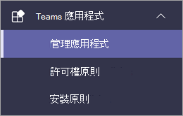

# 在團隊系統管理中心設定 Microsoft Viva 教學 (預覽) Set up Microsoft Viva Learning (Preview) in the Teams admin center

> [!NOTE]
> 本文中的資訊與在正式發行之前可能會充分修改的預覽產品有關。The information in this article relates to a preview product that may be substantially modified before it's commercially released. 

小組管理員會安裝 Viva 教學 (預覽) 並透過團隊系統管理中心套用許可權原則。The Teams admin installs Viva Learning (Preview) and applies permission policies through the Teams admin center.

## 管理 Viva 學習 (預覽的設定) Manage settings for Viva Learning (Preview)

您必須是小組系統管理員的管理員，才可執行這些工作。You must be an administrator in the Teams admin center to perform these tasks.

若要讓 Viva 學習 (預覽) 供組織中的使用者使用，請遵循下列步驟：To make Viva Learning (Preview) available for users in your organization, follow these steps:

1. 在團隊系統管理中心的左側導覽中，移至 [**小組應用** 程式  >  **管理應用程式**]。In the left navigation of the Teams admin center, go to **Teams apps** > **Manage apps**.

   

2. 在 [ **管理應用程式** ] 頁面上的搜尋方塊中，輸入 *Viva 教學*，然後選取 [ **Viva 教學 (預覽])**。On the **Manage apps** page, in the search box, type *Viva learning*, and then select **Viva Learning (Preview)**.

   ![[管理應用程式] 頁面中顯示搜尋方塊的小組系統管理中心。](../media/learning/learning-app-teams-manage-apps-page.png)

3. 在「 **Viva 教學 (預覽)** 」頁面上：On the **Viva Learning (Preview)** page:

   1. 在 [ **狀態**] 下，選取 [ **允許** ]，以開啟 Viva 教學 (預覽) 。Under **Status**, select **Allowed** to turn on Viva Learning (Preview).

   2. 在 [ **設定** ] 索引標籤的 [ **應用程式設定**] 底下，移至 Microsoft 365 系統管理中心以 [設定教學內容來源](content-sources-365-admin-center.md)。On the **Settings** tab, under **App settings**, go to the Microsoft 365 admin center to [configure learning content sources](content-sources-365-admin-center.md).

   ![小組系統管理中心的學習頁面，顯示 [狀態與應用程式設定] 區段。](../media/learning/learning-app-teams-learning-page.png)

4. 在 [ **管理應用程式** 設定] 之後，移至 [ **許可權原則** 及 **設定原則** ]，將許可權授與可存取 Viva 教學 (預覽) 做為組織參與預覽的一部分的員工。After **Manage app** settings, go to **Permission policies** and **Setup policies** to grant permission to employees who should have access to Viva Learning (Preview) as part of your organization's participation in the preview.

> [!NOTE]
>  如果您的組織是4.0 在「小組 TAP100 計畫」的一部分，您可能需要在環3.0 中啟用核准的使用者，才能存取 Viva 教學 (預覽) 。If your organization is in Ring 4.0 as part of Teams TAP100 program, you might need to enable approved users in Ring 3.0 to access Viva Learning (Preview).   做為預覽的一部分，Viva 教學 (預覽) 會在環3.0 中發行。As part of the preview, Viva Learning (Preview) is released in Ring 3.0. 如果您的組織是在環4.0，您將不會在 [ **管理應用程式** ] 頁面上看到 Viva 學習 (預覽) 。If your organization is in Ring 4.0, you won’t see Viva Learning (Preview) on the **Manage apps** page. 若要測試應用程式，您需要建立自訂應用程式許可權原則，將其設定為 **允許所有的應用程式**，並將其指派給環3.0 核准的使用者。To test the app, you need to create a custom apps permission policy, set it to **Allow all apps**, and assign it to Ring 3.0 approved users.      ![AppsPermission-Plcy] 頁面顯示 [允許所有已選取的應用程式]。](../media/learning/learning-app-tap-appspermission-plcy.png)

## 下一步Next step

[在 Microsoft 365 系統管理中心中設定 Viva 學習 (預覽) 的教學內容來源Configure learning content sources for Viva Learning (Preview) in the Microsoft 365 admin center](content-sources-365-admin-center.md)