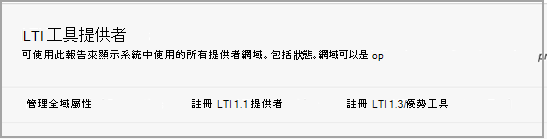

# 使用具有 Blackboard 的 Microsoft Teams 類別

> [!IMPORTANT]
> 部分資訊與發行前版本產品有關，在正式發行之前可能會實質上進行修改。 Microsoft 對此處提供的資訊，不提供任何明確或隱含的瑕疵擔保。

Microsoft Teams 類別是 (LTI) 應用程式的學習工具互通性，可協助教育者和學生輕鬆流覽其教學管理系統 (LMS) 和 Teams。 使用者可以直接從 LMS 中存取與其課程相關聯的類別小組。

## 核准 Microsoft Azure 租使用者中的應用程式

下列工作由 Microsoft Office 365 系統管理員所完成，Blackboard 會透過超級系統管理員的身分瞭解。

在管理 Blackboard 中的整合之前，Microsoft Office 365 管理員必須核准 Blackboard **MSFT Teams，以瞭解** 機構 Microsoft Azure 承租人的 Ultra Azure 應用程式。

1. 尋找您的 Microsoft 租使用者識別碼。 請參閱 [如何尋找租](/azure/active-directory/fundamentals/active-directory-how-to-find-tenant)使用者。

2. 請根據下列範例重新導向 Microsoft Identity 平臺系統管理員同意端點：

   `https://login.microsoftonline.com/{tenant}/adminconsent?client\_id=2d94989f-457a-47c1-a637-e75acdb11568`

   > [!NOTE]
   > 以您組織的 Microsoft 租使用者識別碼取代 {承租人}。

## 註冊整合應用程式

隨著 Blackboard 的瞭解，您必須在測試環境中註冊2個 LTI 1.3 整合應用程式：

- Blackboard 課程類別 Teams 整合，以支援名單同步處理

- Microsoft Teams 類別小組 LTI 應用程式

1. 請記下這兩個應用程式的 LTI 用戶端 IDs：

    - Blackboard-f1561daa-1b21-4693-ba90-6c55f1a0eb41

    - Microsoft-027328b7-c2e3-4c9e-aaa1-07802dae6c89

2. 存取系統管理員 **面板，然後在 [** 整合] 下，找到 LTI 工具提供者。

   

3. 選取 [ **註冊 lti 1.3/優點工具**]。

4. 輸入 (Blackboard 或 Microsoft) 所提供的第一個用戶端 IDs，然後選取 [ **提交**]。

   

5. 請複查預先填入的設定，並確定工具狀態標示為 [已核准]。

6. 向下移動至下方，然後選取 [ **提交**]。

7. 重複上述步驟，在您的環境內註冊第二個 LTI 應用程式。

## 設定 REST 應用程式和跨原始資源分享

Blackboard 會以超級管理員的身分瞭解，也需要設定 REST 應用程式和跨原始資源分享設定。

完成下列設定 REST 應用程式

1. 存取「學習管理」工具，然後 **從 [整合**] 區段中選取 [ **REST API** 整合]。

2. 選取 [**建立** 整合]，然後輸入您為 Blackboard 瞭解類別 Teams 整合 LTI 工具輸入的相同應用程式/用戶端識別碼。

3. 輸入「瞭解使用者 (這可能是您自己的學習管理使用者名稱) ，或選取 **[流覽]** 以尋找。

4. 針對 **使用者存取** 選取 **[是]** 。

5. 選取 **[是]** 以取得 **使用者的授權**

6. 選取 [完成後 **提交** ]。

## 設定跨原始資源分享

1. 存取「學習管理」工具，然後 **選取 [整合**] 區段中的 [**跨原始資源分享**]。

2. 選取 [ **建立** 設定]。

3. 輸入 `https://bb-ms-teams-ultra-ext.api.blackboard.com` 來源。

4. 在 **允許的標頭** 中新增 word **授權**。

5. 設定 **為** **[是]**。

6. 選取 [完成後 **提交** ]。

## 在 Blackboard 瞭解中啟用類別 Teams

一旦您啟用 LTI 工具，下一個步驟就是設定 Microsoft 類別 Teams 與您自己 Microsoft Office 365 租使用者的整合。 若要執行此動作，請遵循下列步驟，將「Blackboard」瞭解為「超級管理員」。

1. 在 [**瞭解系統管理**  >  **工具和公用程式**] 中，選取 [ **Microsoft Teams Integration Admin**]。

   ![包含可用工具清單的 [工具及實用程式] 對話方塊](../media/lti-media/tools-utilities.png)

2. 選取 [**啟用 Microsoft Teams**] 核取方塊。

3. 依照 Microsoft O365 系統管理員底下的區段中所述，輸入您的租使用者識別碼。

 > [!NOTE]
 > 您將無法儲存設定，直到 O365 系統管理員核准應用程式為止。請參閱[核准 Microsoft Azure 租使用者中的應用程式](#approve-the-app-in-the-microsoft-azure-tenant)。

4. 當全域 O365 系統管理員已核准您的 Microsoft 租使用者中的 Blackboard Teams 應用程式時，請選取 [**提交**]。
