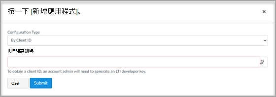

# 使用具有畫布的 Microsoft Teams 類別Use Microsoft Teams classes with Canvas

> [!IMPORTANT]
> 部分資訊與發行前版本產品有關，在正式發行之前可能會實質上進行修改。Some information relates to prereleased product which may be substantially modified before it's commercially released. Microsoft 對此處提供的資訊，不提供任何明確或隱含的瑕疵擔保。Microsoft makes no warranties, express or implied, with respect to the information provided here.

Microsoft Teams 類別是 (LTI) 應用程式的學習工具互通性，可協助教育者和學生輕鬆流覽其教學管理系統 (LMS) 和 Teams。Microsoft Teams classes is a Learning Tools Interoperability (LTI) app that helps educators and students easily navigate between their Learning Management System (LMS) and Teams. 使用者可以直接從 LMS 中存取與其課程相關聯的類別小組。Users can access their class teams associated with their course directly from within their LMS.

## Microsoft Office 365管理Microsoft Office 365 Admin

在管理 Instructure 畫布內的 Microsoft Teams 整合之前，請務必在完成 canvas 管理員設定之前，讓您的組織中組織 Microsoft Office 365 系統管理員核准的畫布 Azure 應用程式的 **Microsoft Teams 同步處理畫布** Microsoft Azure。Before managing the Microsoft Teams integration within Instructure Canvas, it is important to have Canvas’s **Microsoft-Teams-Sync-for-Canvas** Azure app approved by your institution’s Microsoft Office 365 admin in your Microsoft Azure tenant before completing the Canvas admin setup.

1. 登入畫布。Sign in to Canvas.
 
2. 選取全域導覽中的 [ **管理** ] 連結，然後選取您的帳戶。Select the **Admin** link in the global navigation, and then select your account.

3. 在 [系統 **管理] 導覽** 中，選取 [**設定**] 連結，然後選取 [整合] 索引標籤。In the admin navigation, select the **Settings** link, and then the **Integrations** tab. 

4. 輸入您的 Microsoft 租使用者名稱和登入屬性。Enter your Microsoft tenant name and login attribute. 

   login 屬性將用於將 Canvas 使用者與 Azure Active Directory 使用者關聯。The login attribute will be used for associating the Canvas user with an Azure Active Directory user. 

5. 選取 [**更新設定** 完畢之後。Select **Update Settings** once done.

6. 若要核准對畫布的 **Microsoft Teams-Sync-canvas** Azure app 的存取權，請選取 [**授與承租人存取** 連結]。To approve access for Canvas’s **Microsoft-Teams-Sync-for-Canvas** Azure app, select the **Grant tenant access** link. 您將會重新導向至 Microsoft Identity Platform 系統管理員同意端點。You'll be redirected to the Microsoft Identity Platform Admin Consent Endpoint.

   

7. 選取 [ **接受**]。Select **Accept**.
 
8. 開啟開啟開啟的開啟以啟用 Microsoft Teams 同步處理。Enable the Microsoft Teams sync by turning the toggle on.

   

## 畫布管理員Canvas Admin

設定 Microsoft Teams LTI 1.3 整合。Set up the Microsoft Teams LTI 1.3 Integration.

做為畫布管理員時，您需要在環境內新增 Microsoft Teams 類別 LTI 應用程式。As a Canvas Admin, you'll need to add the Microsoft Teams classes LTI app within your environment. 請記下應用程式的 LTI 用戶端識別碼。Make a note of the LTI Client ID for the app.

 - Microsoft Teams 類別-170000000000570Microsoft Teams classes - 170000000000570

1. 存取 **管理員設定**  >  **應用程式**。Access **Admin settings** > **Apps**.

2. 選取 [ **+ App** ]，以新增 Teams LTI 應用程式。Select **+ App** to add the Teams LTI apps. 
 
   

3. 選取 [ **依用戶端識別碼** ] 設定類型。Select **By Client ID** for configuration type.

   

4. 輸入提供的用戶端識別碼，然後選取 [ **提交**]。Enter the Client ID provided, and then select **Submit**.
   
   您會注意到用戶端識別碼的 Microsoft Teams 類別 LTI 應用程式名稱，以確認。You'll notice the Microsoft Teams classes LTI app name for the Client ID for confirmation. 

5. 選取 [安裝]。Select **Install**.

   Microsoft Teams 類別 LTI 應用程式將會新增至外部應用程式的清單。The Microsoft Teams classes LTI app will be added to the list of external apps.
