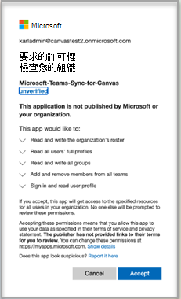
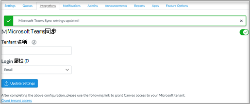
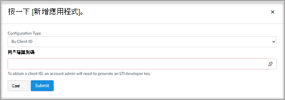

# 使用畫布的 Microsoft Teams 會議

> [!IMPORTANT]
> 部分資訊與發行前版本產品有關，在正式發行之前可能會實質上進行修改。 Microsoft 對此處提供的資訊，不提供任何明確或隱含的瑕疵擔保。

Microsoft Teams 會議是 Learning 工具互通性 (LTI) 應用程式，可協助教育者和學生輕鬆流覽其 Learning 管理系統 (LMS) 和 Teams。 使用者可以直接從 LMS 中存取與其課程相關聯的類別小組。

## Microsoft Office 365管理

在管理 Instructure 畫布內的 Microsoft Teams 整合之前，請務必在完成 canvas 管理員設定之前，讓您的組織中組織 Microsoft Office 365 系統管理員核准的畫布 Azure 應用程式的 **Microsoft Teams 同步處理畫布** Microsoft Azure。

1. 登入畫布。

2. 選取全域導覽中的 [ **管理** ] 連結，然後選取您的帳戶。

3. 在 [系統 **管理] 導覽** 中，選取 [**設定**] 連結，然後選取 [整合] 索引標籤。

4. 輸入您的 Microsoft 租使用者名稱和登入屬性。

   login 屬性將用於將 Canvas 使用者與 Azure Active Directory 使用者關聯。

5. 選取 [**更新設定** 完畢之後。

6. 若要核准對畫布的 **Microsoft Teams-Sync-canvas** Azure app 的存取權，請選取 [**授與承租人存取** 連結]。 您將會重新導向至 Microsoft Identity Platform 系統管理員同意端點。

   

7. 選取 [ **接受**]。

8. 開啟開啟開啟的開啟以啟用 Microsoft Teams 同步處理。

   

## 畫布管理員

設定 Microsoft Teams LTI 1.3 整合。

做為畫布管理員時，您需要在環境內新增 Microsoft Teams 會議 LTI 應用程式。 請記下應用程式的 LTI 用戶端識別碼。

 - Microsoft Teams 會議-170000000000703

1. 存取 **管理員設定**  >  **應用程式**。

2. 選取 [ **+ App** ]，以新增 Teams LTI 應用程式。

   

3. 選取 [ **依用戶端識別碼** ] 設定類型。

   

4. 輸入提供的用戶端識別碼，然後選取 [ **提交**]。

   您會注意到 Microsoft Teams 會議用於用戶端識別碼的 LTI 應用程式名稱，以確認。

5. 選取 [安裝]。

   Microsoft Teams 會議 LTI 應用程式將會新增至外部應用程式的清單。
