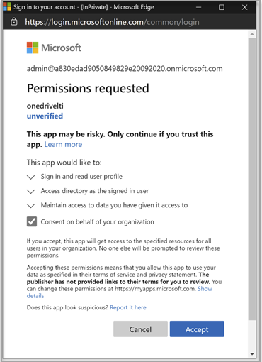

# 搭配您的教學管理系統使用 Microsoft OneDriveUse Microsoft OneDrive with your Learning Management System

> [!IMPORTANT]
> 部分資訊與發行前版本產品有關，在正式發行之前可能會實質上進行修改。Some information relates to prereleased product which may be substantially modified before it's commercially released. Microsoft 對此處提供的資訊，不提供任何明確或隱含的瑕疵擔保。Microsoft makes no warranties, express or implied, with respect to the information provided here.

瞭解使用 Microsoft OneDrive 與您的教學管理系統 (LMS) 的優點。Learn the benefits of using Microsoft OneDrive with your Learning Management System (LMS).

**將 Microsoft Office 365 直接帶入您的工作流程中****Brings Microsoft Office 365 directly into your workflows**

Microsoft OneDrive 的學習工具互通性 (LTI) 應用程式會與您的 LMS 整合，以將 Microsoft OneDrive 及 Microsoft Office 365 直接加入您最重要的工作流程中，其中包括：The Microsoft OneDrive Learning Tools Interoperability (LTI) App integrates with your LMS to bring Microsoft OneDrive and Microsoft Office 365 directly into your most important workflows that include:

- 附加資源及組織內容。Attaching resources and organizing content.
- 啟動共同作業檔。Starting collaborative documents.
- 建立及評分工作分派。Creating and grading assignments.

**安全且完全符合最新的 LTI 標準****Secure and fully compliant with latest LTI standards**

Microsoft OneDrive lti 應用程式與 lti 1.3 和 lti 優勢相容。The Microsoft OneDrive LTI App is compatible with LTI 1.3 and LTI Advantage. 這種優點可提供高安全性和緊密整合的使用者體驗。This advantage allows for a highly secure and tightly integrated user experience.

**新式和豐富的使用者體驗****Modern and Rich User Experience**

Microsoft OneDrive LTI 應用程式會將 Microsoft 的最佳許可權帶入您的 LMS 體驗。The Microsoft OneDrive LTI App brings the best of Microsoft right into your LMS experience. 在您的 LMS 中，我們會透過提供更現代的使用者體驗，以改善您的 LMS 中現有的 Office 365 整合，並以全新且展開的 Microsoft OneDrive 檔案選擇器和更豐富的編輯體驗來改善 Office 檔案。We're improving upon the existing Office 365 integration in your LMS by delivering a more modern user experience, complete with a new and expanded Microsoft OneDrive file picker and richer editing experiences for Office files. microsoft 也會完全擁有即將進行的 Microsoft OneDrive LTI 應用程式，這表示您將永遠能夠自動從 Microsoft 取得最新和最大的。Microsoft will also fully own the Microsoft OneDrive LTI App going forward, which means you’ll always get the latest and greatest from Microsoft automatically.

Microsoft OneDrive LTI 應用程式可讓您：The Microsoft OneDrive LTI App allows you to:

- 附加 Office 365 檔案（包括 Word 檔、PowerPoint 簡報及從富內容編輯器中 Excel）。Attach Office 365 files including Word documents, PowerPoint presentations, and Excel from the Rich Content Editor.

- 散佈 Office 365 雲端指派。Distribute Office 365 cloud assignments.

- 查看和組織您的個人和課程 Microsoft OneDrive 檔案。View and organize your personal and course Microsoft OneDrive files.

- 建立共同作業：課程成員可以即時在共用檔上共同作業。Create collaborations where course members can work together on shared documents in real time.

- 存取多個 Microsoft OneDrive 帳戶，包括個人和學校帳戶。Access multiple Microsoft OneDrive accounts, including personal and school accounts.

- 將 Office 365 檔案與您的課程模組整合。Integrate Office 365 files with your course modules.

- 使用您的 Microsoft 帳戶進行單一登入與您的 LMS。Use your Microsoft account for single sign-on with your LMS.

## 與畫布整合Integrate with Canvas

執行這項整合的人員應該是畫布的系統管理員，以及 Microsoft 365 租使用者的系統管理員。The person who performs this integration should be an admin of Canvas and an admin of the Microsoft 365 tenant.

1. 使用租使用者系統管理員帳戶登入 Microsoft Azure 入口網站。Sign in to the Microsoft Azure portal with the tenant admin account. Azure 租使用者管理員也應具有「群組管理員」角色。The Azure tenant administrator should also have the Group administrator role.

    

2. 登入 Microsoft [OneDrive LTI 入口網站](https://odltiappnl.azurewebsites.net/admin)。Sign in to the Microsoft [OneDrive LTI portal](https://odltiappnl.azurewebsites.net/admin).

3. 接受完成登入的許可權。Accept the permissions to complete the sign-in.

    

4. 選取 [ **新增 LTI 租** 使用者]。Select **Add LTI Tenant**.

     

5. 從下拉式清單中選取 [ **LTI 消費者平臺** ] 做為 **畫布** 。Select **LTI Consumer Platform** as **Canvas** from the dropdown.

6. 選取 [ **畫布基本 URL** ]，然後選取 **[下一步]**。Select **Canvas Base URL** and then select **Next**.

    ![選取 [畫布] 和 [新增基礎 URL]](../media/lti-media/lti-canvas-base-url.png)

   下一個畫面會顯示您的機密欄位。The next screen shows fields that are confidential to you.

7. 從 **[開始] 中選取 [下一步]**Select **Next** from ?? 網頁。page. 檢閱者是否可以在這裡填入空白？CAN REVIEWERS FILL IN THE BLANK HERE?

8. 在畫面中選取 **[下一步]** ，顯示您的機密資訊。Select **Next** in the screen that shows information that's confidential to you.

   Azure 入口網站的最後一個畫面會顯示新增畫布實例的後續步驟。The final screen of the Azure portal shows the next steps for adding your Canvas instance.

9. 從此畫面複製開發人員機碼。Copy the Developer Keys from this screen. 當您建立畫布實例時，您將會使用。You'll use when you create the Canvas instance.

## 新增畫布實例Add the Canvas instance

1. 在您的畫布實例中，取消選取 [**管理**  >  **開發人員金鑰**]。In your Canvas instance, deselect **Admin** > **Developer Keys**.

2. 在 [**開發人員**] 機碼的下拉式清單中選擇 **LTI 機碼**。Choose **LTI Key** in the dropdown on **Developer Key**.

   

3. 在這裡貼上開發人員機碼。Paste the developer keys here.

     

   索引鍵是以 **關閉** 模式建立The key gets created in **OFF** mode

   

4. 複製反白顯示的文字。Copy the highlighted text.
    這在 Microsoft OneDrive LTI 入口網站中充當用戶端識別碼。This serves as Client ID in Microsoft OneDrive LTI portal.

5. 將文字貼 Microsoft OneDrive LTI 入口網站的 [**用戶端識別碼**] 欄位中，然後選取 **[下一步]**。Paste the text into the **Client ID** field in Microsoft OneDrive LTI portal, and then select **Next**.

6. 選取 \*\*\*\*[儲存]。Select **Save**.

7. 選取 [ **VIEW LTI 承租人**] 以查看設定。View the settings by selecting **View LTI Tenants**.
