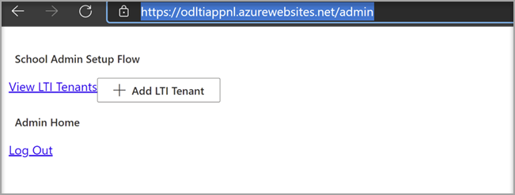

# 搭配您的教學管理系統使用 Microsoft OneDrive

> [!IMPORTANT]
> 部分資訊與發行前版本產品有關，在正式發行之前可能會實質上進行修改。 Microsoft 對此處提供的資訊，不提供任何明確或隱含的瑕疵擔保。

瞭解使用 Microsoft OneDrive 與您的教學管理系統 (LMS) 的優點。

**將 Microsoft Office 365 直接帶入您的工作流程中**

Microsoft OneDrive 的學習工具互通性 (LTI) 應用程式會與您的 LMS 整合，以將 Microsoft OneDrive 及 Microsoft Office 365 直接加入您最重要的工作流程中，其中包括：

- 附加資源及組織內容。
- 啟動共同作業檔。
- 建立及評分工作分派。

**安全且完全符合最新的 LTI 標準**

Microsoft OneDrive lti 應用程式與 lti 1.3 和 lti 優勢相容。 這種優點可提供高安全性和緊密整合的使用者體驗。

**新式和豐富的使用者體驗**

Microsoft OneDrive LTI 應用程式會將 Microsoft 的最佳許可權帶入您的 LMS 體驗。 在您的 LMS 中，我們會透過提供更現代的使用者體驗，以改善您的 LMS 中現有的 Office 365 整合，並以全新且展開的 Microsoft OneDrive 檔案選擇器和更豐富的編輯體驗來改善 Office 檔案。 microsoft 也會完全擁有即將進行的 Microsoft OneDrive LTI 應用程式，這表示您將永遠能夠自動從 Microsoft 取得最新和最大的。

Microsoft OneDrive LTI 應用程式可讓您：

- 附加 Office 365 檔案（包括 Word 檔、PowerPoint 簡報及從富內容編輯器中 Excel）。

- 散佈 Office 365 雲端指派。

- 查看和組織您的個人和課程 Microsoft OneDrive 檔案。

- 建立共同作業：課程成員可以即時在共用檔上共同作業。

- 存取多個 Microsoft OneDrive 帳戶，包括個人和學校帳戶。

- 將 Office 365 檔案與您的課程模組整合。

- 使用您的 Microsoft 帳戶進行單一登入與您的 LMS。

## 與畫布整合

執行這項整合的人員應該是畫布的系統管理員，以及 Microsoft 365 租使用者的系統管理員。

1. 使用租使用者系統管理員帳戶登入 Microsoft Azure 入口網站。 Azure 租使用者管理員也應具有「群組管理員」角色。

    

2. 登入 Microsoft [OneDrive LTI 入口網站](https://odltiappnl.azurewebsites.net/admin)。

3. 接受完成登入的許可權。

    

4. 選取 [ **新增 LTI 租** 使用者]。

     

5. 從下拉式清單中選取 [ **LTI 消費者平臺** ] 做為 **畫布** 。

6. 選取 [ **畫布基本 URL** ]，然後選取 **[下一步]**。

    ![選取 [畫布] 和 [新增基礎 URL]](../media/lti-media/lti-canvas-base-url.png)

   下一個畫面會顯示您的機密欄位。

7. 從 **[開始] 中選取 [下一步]** 網頁。 檢閱者是否可以在這裡填入空白？

8. 在畫面中選取 **[下一步]** ，顯示您的機密資訊。

   Azure 入口網站的最後一個畫面會顯示新增畫布實例的後續步驟。

9. 從此畫面複製開發人員機碼。 當您建立畫布實例時，您將會使用。

## 新增畫布實例

1. 在您的畫布實例中，取消選取 [**管理**  >  **開發人員金鑰**]。

2. 在 [**開發人員**] 機碼的下拉式清單中選擇 **LTI 機碼**。

   

3. 在這裡貼上開發人員機碼。

     

   索引鍵是以 **關閉** 模式建立

   

4. 複製反白顯示的文字。
    這在 Microsoft OneDrive LTI 入口網站中充當用戶端識別碼。

5. 將文字貼 Microsoft OneDrive LTI 入口網站的 [**用戶端識別碼**] 欄位中，然後選取 **[下一步]**。

6. 選取 **[儲存]**。

7. 選取 [ **VIEW LTI 承租人**] 以查看設定。
