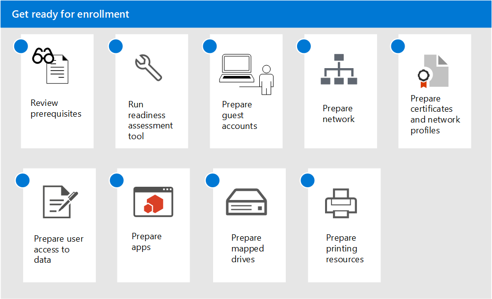

# 準備註冊 Microsoft 受管理的電腦

這些主題描述了在組織中為註冊做準備所必須採取的步驟，包含確定您的環境是否滿足關鍵的必備條件、設定網路、設定憑證，以及準備要納入服務的應用程式。 一旦執行整備評估工具，就可以以任何順序或並行方式完成其他步驟。 取決於您的環境，部分步驟可能與您無關。

1. 檢閱 [Microsoft 受管理的電腦的先決條件](prerequisites.md)。
2. 使用[整備評估工具](readiness-assessment-tool.md)。
3. [來賓帳戶的先決條件](guest-accounts.md)
4. [Microsoft 受管理的電腦的網路設定](network.md)
5. [為 Microsoft 受管理的電腦準備認證和網路設定檔](certs-wifi-lan.md)
6. [為 Microsoft 受管理的電腦準備內部部署資源存取](authentication.md)
7. [Microsoft 受管理的電腦中的應用程式](apps.md)
8. [為 Microsoft 受管理的電腦準備對應磁碟機](mapped-drives.md)
9. [為 Microsoft 受管理的電腦準備列印資源](printing.md)
