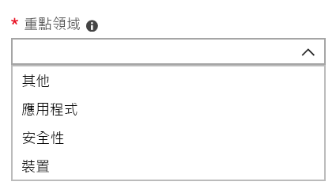

# 新增 Microsoft 受管理的桌上型電腦管理入口網站中管理連絡人

有數種方式與客戶的 Microsoft 受管理的桌上型電腦服務通訊。若要簡化通訊並確定我們要檢查與最佳的連絡人，您需要提供一組管理連絡人。Microsoft 受管理的桌上型電腦 IT 作業將會連絡這些人員協助您的租用戶疑難排解問題。 

## Azure Active Directory 存取 Microsoft 受管理的桌上型電腦管理入口網站

Microsoft 受管理的桌上型電腦管理入口網站需要存取入口網站的人員可以其中一種 Azure Active Directory (AD) 角色：
- 全域管理員
- Intune 服務管理員
- 計費管理員
- 服務支援管理員

全域管理員必須是一個以註冊 Microsoft 受管理的桌上型電腦的客戶。 所有五個角色具有相同的存取權來初始化和檢視工作管理入口網站內。 如需有關如何將這些角色指派的 Azure AD 的詳細資訊，請參閱[在 Azure Active Directory 中的系統管理員角色權限](https://docs.microsoft.com/azure/active-directory/users-groups-roles/directory-assign-admin-roles)。 

## 管理連絡人焦點區域

管理連絡人應最佳的人員或群組可回答的問題和進行不同的焦點區域的決策。 Microsoft 受管理的桌上型電腦作業將會連絡這些管理連絡人涉及歸檔由客戶支援要求的問題。 這些管理連絡人將會收到通知的支援要求更新和新的訊息。 這些區域包括：

焦點區域 | 如需問題
--- | ---
應用程式 | 疑難排解應用程式封裝
[裝置] | 裝置健康情況、 疑難排解與 Microsoft 受管理的桌上型電腦裝置
安全性 | 疑難排解 Microsoft 受管理的桌上型電腦裝置的安全性問題
其他 | 不涵蓋其他方面的問題

凡是您選擇的這些連絡人必須擁有的知識和授權來決定 Microsoft 受管理的桌上型電腦環境。當您開始您的 Microsoft 受管理的桌上型電腦環境中，系統將提示您將連絡人新增本機服務台及安全性。 

管理連絡人所需何時您[提交支援要求](../working-with-managed-desktop/support.md)。您需要有焦點區的支援要求管理員連絡。 

**若要新增管理連絡人**

1.  登入[Microsoft 受管理的桌上型電腦管理入口網站](http://aka.ms/mwaasportal)。 

2.  **支援**] 底下選取 [**系統管理連絡人**。 

    ![支援] 功能表中管理連絡人](images/admincontacts.png)

3. 選取 [**新增**]。

    ![Admin 入口網站新增] 按鈕](images/adminadd.png)

4.  選取**的焦點] 區域中**，輸入連絡人的資訊。 

    

5. 重複針對每個區域的焦點。 

